2024 网鼎杯 半决赛 安全运营挑战赛 威胁分析

官方 writeup 未公布，无标准答案

<!-- truncate -->

按照题目描述进行检材分析

## First of all - 在此之前

对题目提供的附件进行分析，题目提供了以下附件

- dump.mem
- disk.ad1
- disk.ad1.txt

其中，文件 `disk.ad1.txt` 的内容为

```plaintext
Created By AccessData® FTK® Imager 4.7.1.2

Case Information:
Acquired using: ADI4.7.1.2
Case Number:
Evidence Number:
Unique Description:
Examiner:
Notes:

--------------------------------------------------------------

Information for C:\Users\skills\Desktop\disk.ad1:
[Custom Content Sources]
 F:\:NONAME [NTFS]|[root]|Windows|*(Wildcard,Consider Case,Include Subdirectories)
 F:\:NONAME [NTFS]|[root]|ProgramData|*(Wildcard,Consider Case,Include Subdirectories)
 F:\:NONAME [NTFS]|[root]|Program Files (x86)|*(Wildcard,Consider Case,Include Subdirectories)
 F:\:NONAME [NTFS]|[root]|Program Files|*(Wildcard,Consider Case,Include Subdirectories)
 F:\:NONAME [NTFS]|[root]|Documents and Settings|*(Wildcard,Consider Case,Include Subdirectories)
 F:\:NONAME [NTFS]|[root]|PerfLogs|*(Wildcard,Consider Case,Include Subdirectories)
 F:\:NONAME [NTFS]|[root]|System Volume Information|*(Wildcard,Consider Case,Include Subdirectories)
[Computed Hashes]
 MD5 checksum:    a576646c40769abb7dd36904417b6a4f
 SHA1 checksum:   9cee1fe36957674626661e1197b19b5f0b047026

Image information:
 Acquisition started:   Tue Nov  5 11:04:42 2024
 Acquisition finished:  Tue Nov  5 11:49:00 2024
 Segment list:
  C:\Users\skills\Desktop\disk.ad1

Image Verification Results:
 Verification started:  Tue Nov  5 11:52:50 2024
 Verification finished: Tue Nov  5 12:07:07 2024
 MD5 checksum:    a576646c40769abb7dd36904417b6a4f : verified
 SHA1 checksum:   9cee1fe36957674626661e1197b19b5f0b047026 : verified
```

由此可以得知，文件 `disk.ad1` 是由 `FTK Imager` 所制作的磁盘镜像，文件 `dump.mem` 是目标计算机上捕获的内存镜像

对于 `disk.ad1` 文件，可以使用 `FTK Imager` 进行加载并挂载到虚拟盘符；而对于 `dump.mem` 文件，可以使用 `Volatility` 进行取证分析（需要内存镜像中系统版本对应的符号表）或者使用 `R-Studio` 对内存中的 `NTFS` 结构表进行读取分析，或者直接使用 `Strings` 进行暴力检索分析

## 威胁分析 - 01

> 在调查网络性能或安全问题时，了解特定应用程序在一段时间内的数据传输情况对于检测异常流量和潜在威胁至关重要。通过分析网络活动日志，我们可以确定是否存在数据泄露或异常通信。
>
> 请问，firefox 进程自有记录以来一共发送了多少字节的数据？（请将答案编辑并存入 `/opt/wxfx/answer/1.txt` 文件中，参考 `/opt/wxfx/example` 目录）

基于题目描述，可以定位到 Windows 的服务报告使用数据库文件 `SRUDB.dat`

参考资料 [See all Windows 11 network data usage – addshore](https://addshore.com/2023/10/see-all-windows-11-network-data-usage/)

在 `FTK Imager` 定位到 `SRUDB.dat` 文件的路径 `F:\Windows\System32\sru\SRUDB.dat`

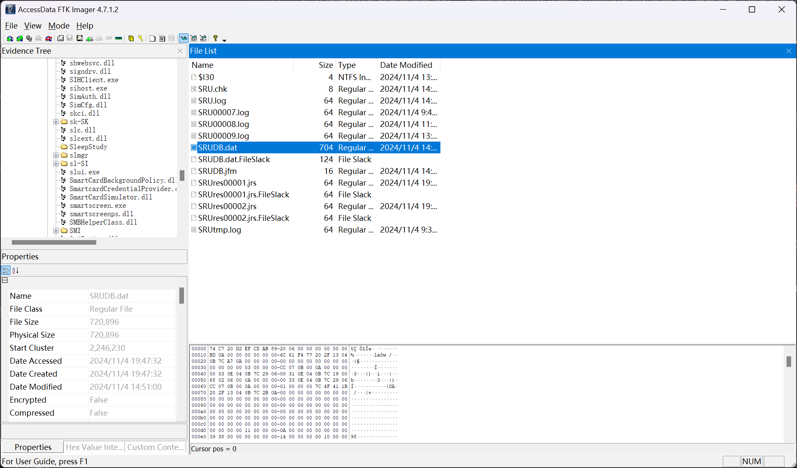

使用 [NetworkUsageView - NirSoft](https://www.nirsoft.net/utils/network_usage_view.html) 进行查看

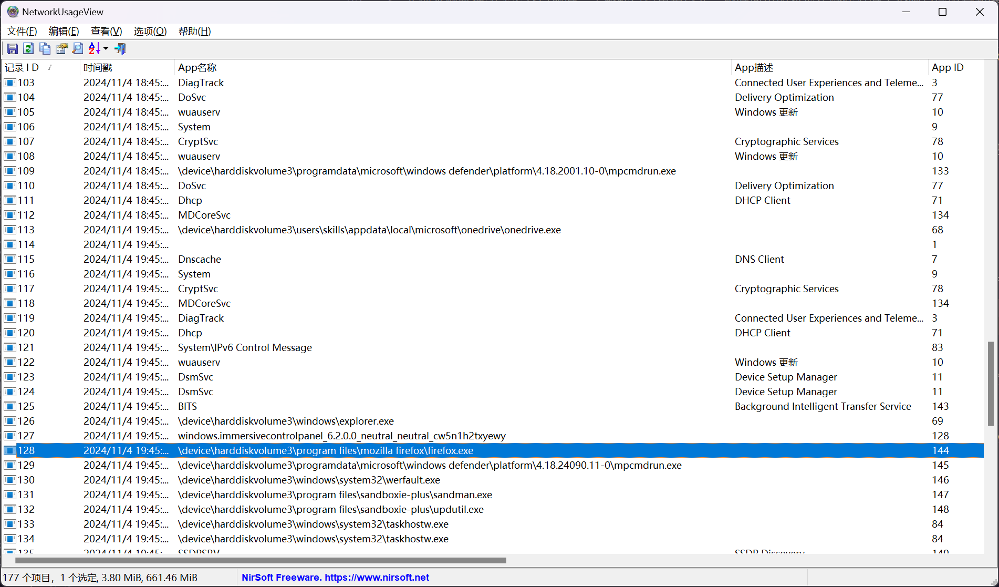

定位到 `firefox.exe` 进程的记录

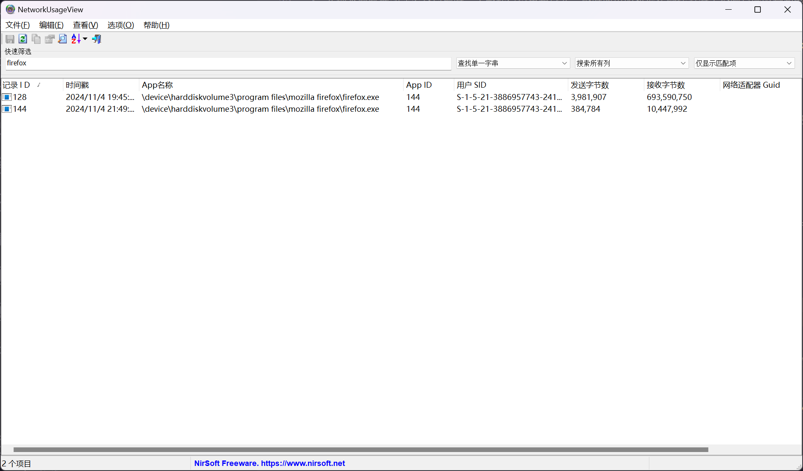

```plaintext
3981907 + 384784 = 4366691
```

即可确定答案

```flag
4366691
```

## 威胁分析 - 02

> 识别安全防护软件的查杀记录，对于评估系统受感染的程度和了解攻击者所使用的工具至关重要。通过检查安全日志，可以获取被检测到的威胁信息。
>
> 请问，Windows Defender 检测到的第一个恶意软件的威胁 ID 是什么？（请将答案编辑并存入 `/opt/wxfx/answer/2.txt` 文件中，参考 `/opt/wxfx/example` 目录）

在 `disk.ad1` 文件的磁盘数据中，定位到 `F:\Windows\System32\winevt\Logs\` 文件夹

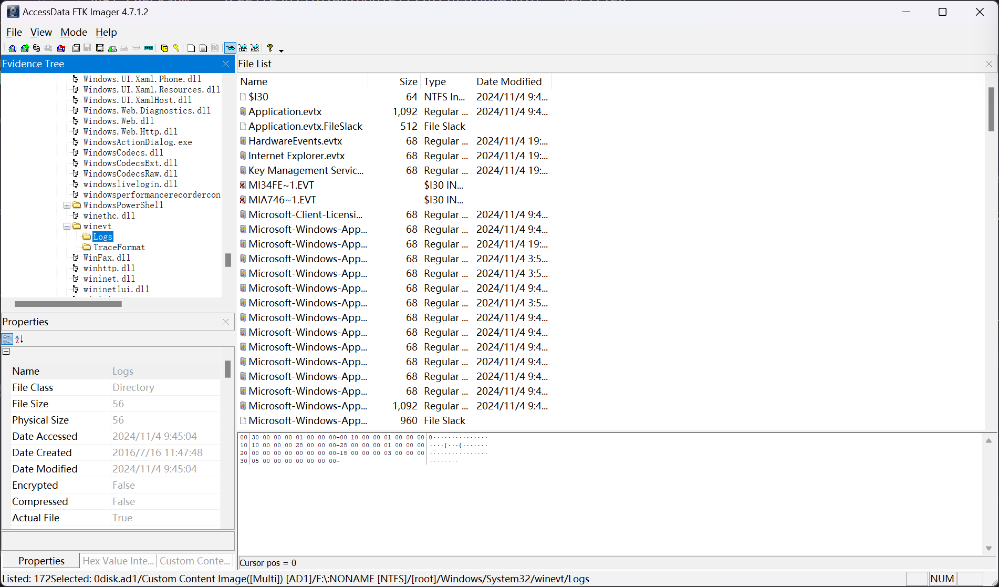

将整个文件夹进行提取

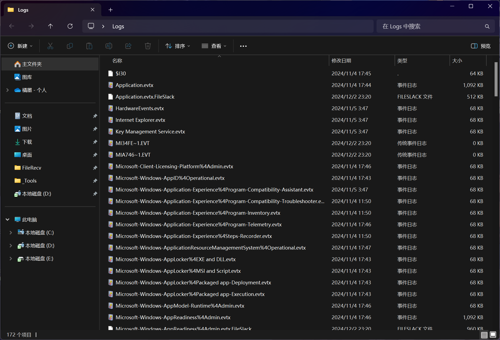

根据 Windows Defender 的日志 ID 表 [Microsoft Defender Antivirus event IDs and error codes - Microsoft Defender for Endpoint | Microsoft Learn](https://learn.microsoft.com/en-us/defender-endpoint/troubleshoot-microsoft-defender-antivirus) 可以知道，当 Windows Defender 检测到威胁时所记录的日志，其日志 ID 为 `1116`

使用 [FullEventLogView - NirSoft](https://www.nirsoft.net/utils/full_event_log_view.html) 进行分析

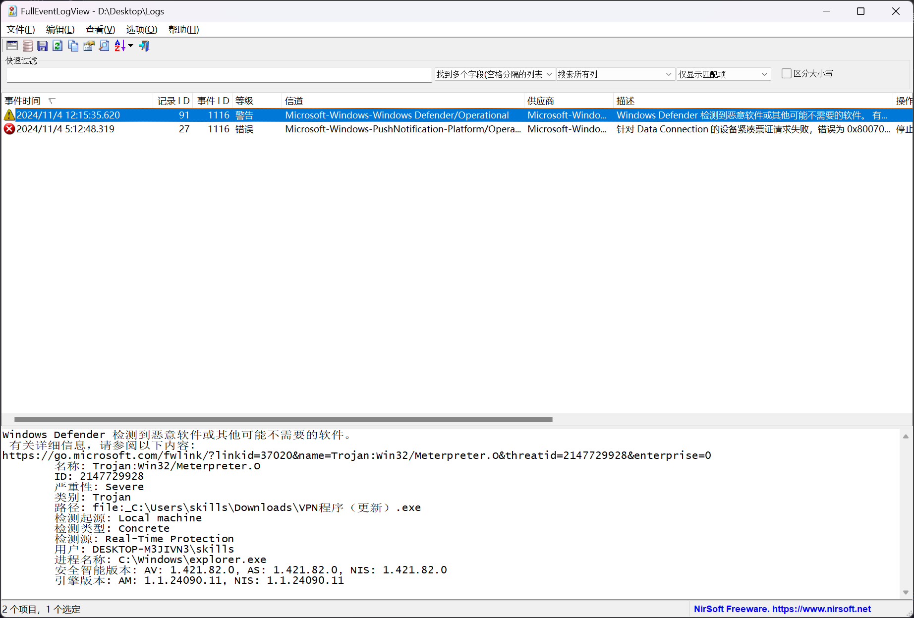

或者直接定位到 Windows Defender 的操作日志文件 `Microsoft-Windows-Windows Defender%4Operational.evtx`

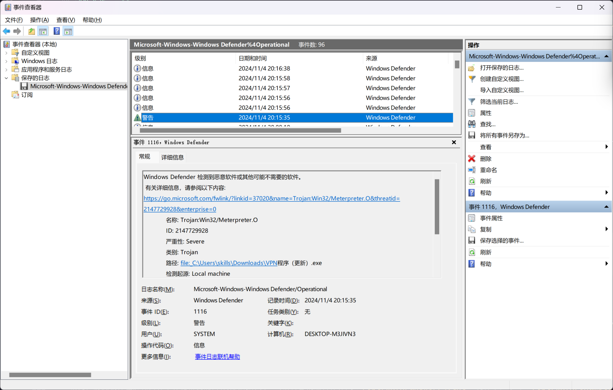

```plaintext
Windows Defender 已从隔离区删除一个项目。
 有关详细信息，请参阅以下内容:
https://go.microsoft.com/fwlink/?linkid=37020&name=Trojan:Win32/Meterpreter.O&threatid=2147729928&enterprise=0
  名称: Trojan:Win32/Meterpreter.O
  ID: 2147729928
  严重性: Severe
  类别: Trojan
  用户: DESKTOP-M3JIVN3\skills
  安全智能版本: AV: 1.421.82.0, AS: 1.421.82.0
  引擎版本: 1.1.24090.11
```

即可确定答案

```flag
2147729928
```

## 威胁分析 - 03

> 了解恶意软件的内部名称（如开发者给它的命名）有助于识别其家族、版本和特定功能，进而制定有效的防御策略。
>
> 请问，系统中正在运行的恶意软件的内部名称是什么？（请将答案编辑并存入 `/opt/wxfx/answer/3.txt` 文件中，参考 `/opt/wxfx/example` 目录）

### 思路一 基于常见关键词进行定位

对内存镜像的 Strings 进行分析，经过常见恶意程序的关键词匹配，可以定位到内存中的以下部分

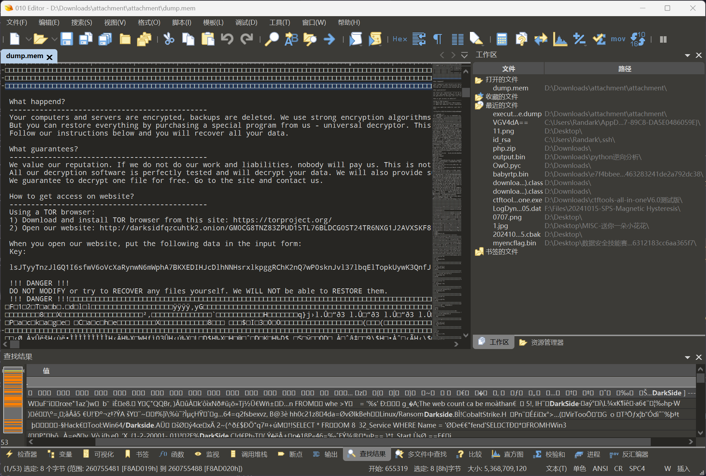

```plaintext
<------------- [ Welcome to DarkSide] ------------->

 What happend?
 ----------------------------------------------
 Your computers and servers are encrypted, backups are deleted. We use strong encryption algorithms, so you cannot decrypt your data.
 But you can restore everything by purchasing a special program from us - universal decryptor. This program will restore all your network.
 Follow our instructions below and you will recover all your data.

 What guarantees?
 ----------------------------------------------
 We value our reputation. If we do not do our work and liabilities, nobody will pay us. This is not in our interests.
 All our decryption software is perfectly tested and will decrypt your data. We will also provide support in case of problems.
 We guarantee to decrypt one file for free. Go to the site and contact us.

 How to get access on website?
 ----------------------------------------------
 Using a TOR browser:
 1) Download and install TOR browser from this site: https://torproject.org/
 2) Open our website: http://darksidfqzcuhtk2.onion/GM0CG8TNZ83ZPUD15TL76BLDCG0ST24TR6NXG1J2AVXSKF8KS4KFIIN2ON5GRWD4

 When you open our website, put the following data in the input form:
 Key:

 lsJTyyTnzJlGQ1I6sfwV6oVcXaRynwN6mWphA7BKXEDIHJcDlhNNHsrxlkpggRChK2nQ7wP0sknJvl37lbqElTopkUywK3QnfJFmqDBSCmFISeWSudjgwxB4kKSp7h4VySHeu4LmDiZXTAh1dbZHWxTtZ0bA6PhCoDrbGkctY4rucITW4IdYUZJC8d2B7SFnr5EA7EoRkajrZW54brM5Kgwqsz67qzH6Hk0Vr3EDcnGzNjGQBapJczIWkgPtMCJdTkeemQ34XH7wawXu3eOGV3uJlBZNoSuaxtDHMGApS8EWsUXhafMW8WxFLAPLCo6pdm7MLcLsVDp9iBXU1sLv2KkGyUJbO0KOmom9f1JREuidviHRfsndEgMFBAjyq5v4VEIraiioAbtWM7eecYaXPVt3rolsBi8mtjxLOpFj73NPPitoIDxBNfHGzXxvRTXi06Pjx9pRnAtjIqoq5wovnHa8uBel8nq8yDJTk7NWdGdsv3yVwV2TmBin7OvFqHN9lweFNJyuziKCVGEtSaglUNudMmpFnNObGlhfh58jQsrQiQZ2d3AOFsi

 !!! DANGER !!!
 DO NOT MODIFY or try to RECOVER any files yourself. We WILL NOT be able to RESTORE them.
 !!! DANGER !!!
```

基于已知明文，可以定位到相关进程

```plaintext
PS D:\Downloads\attachment\attachment> .\volatility_2.6_win64_standalone.exe -f .\dump.mem --profile=Win10x64_14393 yarascan -Y "Your computers and servers are encrypted"
Volatility Foundation Volatility Framework 2.6
Rule: r1
Owner: Process SearchProtocol Pid 4036
0x2079976dcc5  59 6f 75 72 20 63 6f 6d 70 75 74 65 72 73 20 61   Your.computers.a
0x2079976dcd5  6e 64 20 73 65 72 76 65 72 73 20 61 72 65 20 65   nd.servers.are.e
0x2079976dce5  6e 63 72 79 70 74 65 64 2c 20 62 61 63 6b 75 70   ncrypted,.backup
0x2079976dcf5  73 20 61 72 65 20 64 65 6c 65 74 65 64 2e 20 57   s.are.deleted..W
0x2079976dd05  65 20 75 73 65 20 73 74 72 6f 6e 67 20 65 6e 63   e.use.strong.enc
0x2079976dd15  72 79 70 74 69 6f 6e 20 61 6c 67 6f 72 69 74 68   ryption.algorith
0x2079976dd25  6d 73 2c 20 73 6f 20 79 6f 75 20 63 61 6e 6e 6f   ms,.so.you.canno
0x2079976dd35  74 20 64 65 63 72 79 70 74 20 79 6f 75 72 20 64   t.decrypt.your.d
0x2079976dd45  61 74 61 2e 20 0d 0a 20 42 75 74 20 79 6f 75 20   ata.....But.you.
0x2079976dd55  63 61 6e 20 72 65 73 74 6f 72 65 20 65 76 65 72   can.restore.ever
0x2079976dd65  79 74 68 69 6e 67 20 62 79 20 70 75 72 63 68 61   ything.by.purcha
0x2079976dd75  73 69 6e 67 20 61 20 73 70 65 63 69 61 6c 20 70   sing.a.special.p
0x2079976dd85  72 6f 67 72 61 6d 20 66 72 6f 6d 20 75 73 20 2d   rogram.from.us.-
0x2079976dd95  20 75 6e 69 76 65 72 73 61 6c 20 64 65 63 72 79   .universal.decry
0x2079976dda5  70 74 6f 72 2e 20 54 68 69 73 20 70 72 6f 67 72   ptor..This.progr
0x2079976ddb5  61 6d 20 77 69 6c 6c 20 72 65 73 74 6f 72 65 20   am.will.restore.
Rule: r1
Owner: Process SearchProtocol Pid 4036
0x2079977314d  59 6f 75 72 20 63 6f 6d 70 75 74 65 72 73 20 61   Your.computers.a
0x2079977315d  6e 64 20 73 65 72 76 65 72 73 20 61 72 65 20 65   nd.servers.are.e
0x2079977316d  6e 63 72 79 70 74 65 64 2c 20 62 61 63 6b 75 70   ncrypted,.backup
0x2079977317d  73 20 61 72 65 20 64 65 6c 65 74 65 64 2e 20 57   s.are.deleted..W
0x2079977318d  65 20 75 73 65 20 73 74 72 6f 6e 67 20 65 6e 63   e.use.strong.enc
0x2079977319d  72 79 70 74 69 6f 6e 20 61 6c 67 6f 72 69 74 68   ryption.algorith
0x207997731ad  6d 73 2c 20 73 6f 20 79 6f 75 20 63 61 6e 6e 6f   ms,.so.you.canno
0x207997731bd  74 20 64 65 63 72 79 70 74 20 79 6f 75 72 20 64   t.decrypt.your.d
0x207997731cd  61 74 61 2e 20 0d 0a 20 42 75 74 20 79 6f 75 20   ata.....But.you.
0x207997731dd  63 61 6e 20 72 65 73 74 6f 72 65 20 65 76 65 72   can.restore.ever
0x207997731ed  79 74 68 69 6e 67 20 62 79 20 70 75 72 63 68 61   ything.by.purcha
0x207997731fd  73 69 6e 67 20 61 20 73 70 65 63 69 61 6c 20 70   sing.a.special.p
0x2079977320d  72 6f 67 72 61 6d 20 66 72 6f 6d 20 75 73 20 2d   rogram.from.us.-
0x2079977321d  20 75 6e 69 76 65 72 73 61 6c 20 64 65 63 72 79   .universal.decry
0x2079977322d  70 74 6f 72 2e 20 54 68 69 73 20 70 72 6f 67 72   ptor..This.progr
0x2079977323d  61 6d 20 77 69 6c 6c 20 72 65 73 74 6f 72 65 20   am.will.restore.
Rule: r1
Owner: Process svchost.exe Pid 5784
0x00d1a10d  59 6f 75 72 20 63 6f 6d 70 75 74 65 72 73 20 61   Your.computers.a
0x00d1a11d  6e 64 20 73 65 72 76 65 72 73 20 61 72 65 20 65   nd.servers.are.e
0x00d1a12d  6e 63 72 79 70 74 65 64 2c 20 62 61 63 6b 75 70   ncrypted,.backup
0x00d1a13d  73 20 61 72 65 20 64 65 6c 65 74 65 64 2e 20 57   s.are.deleted..W
0x00d1a14d  65 20 75 73 65 20 73 74 72 6f 6e 67 20 65 6e 63   e.use.strong.enc
0x00d1a15d  72 79 70 74 69 6f 6e 20 61 6c 67 6f 72 69 74 68   ryption.algorith
0x00d1a16d  6d 73 2c 20 73 6f 20 79 6f 75 20 63 61 6e 6e 6f   ms,.so.you.canno
0x00d1a17d  74 20 64 65 63 72 79 70 74 20 79 6f 75 72 20 64   t.decrypt.your.d
0x00d1a18d  61 74 61 2e 20 0d 0a 20 42 75 74 20 79 6f 75 20   ata.....But.you.
0x00d1a19d  63 61 6e 20 72 65 73 74 6f 72 65 20 65 76 65 72   can.restore.ever
0x00d1a1ad  79 74 68 69 6e 67 20 62 79 20 70 75 72 63 68 61   ything.by.purcha
0x00d1a1bd  73 69 6e 67 20 61 20 73 70 65 63 69 61 6c 20 70   sing.a.special.p
0x00d1a1cd  72 6f 67 72 61 6d 20 66 72 6f 6d 20 75 73 20 2d   rogram.from.us.-
0x00d1a1dd  20 75 6e 69 76 65 72 73 61 6c 20 64 65 63 72 79   .universal.decry
0x00d1a1ed  70 74 6f 72 2e 20 54 68 69 73 20 70 72 6f 67 72   ptor..This.progr
0x00d1a1fd  61 6d 20 77 69 6c 6c 20 72 65 73 74 6f 72 65 20   am.will.restore.
```

排除掉正常系统服务，即可确定到 `Process svchost.exe Pid 5784` 为恶意进程

### 思路二 对磁盘非常规文件进行排查

使用 `R-Studio` 对内存中的 NTFS 结构数据库进行分析，找到 `F:\Users\skills\svchost.exe`

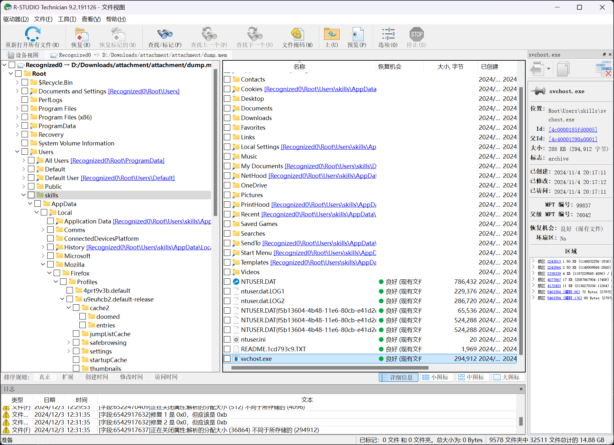

常规情况下，文件 `svchost.exe` 不会存在于用户目录中，可以确定为可疑文件

### 思路三 使用 Yara 进行匹配分析

[MemProcFS](https://github.com/ufrisk/MemProcFS) 自带了一份 Malware Yara 匹配规则表，可以直接使用

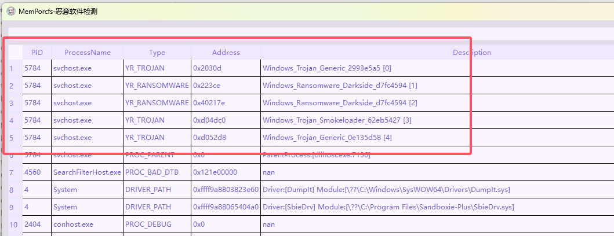

Volatility 的话，可以使用 [Simple python script for merging malware yara rules from https://github.com/Yara-Rules/rules](https://gist.github.com/andreafortuna/29c6ea48adf3d45a979a78763cdc7ce9) 将 Yara 官方规则库，以及一些增强型 Yara 规则库，进行合并之后进行加载，也可以定位到恶意进程

综上，都可以定位到恶意软件的信息，其文件路径为 `F:\Users\skills\svchost.exe` 进程信息为 `Process svchost.exe Pid 5784`

将可执行文件进行提取

```bash
PS D:\Downloads\attachment\attachment> .\volatility_2.6_win64_standalone.exe -f .\dump.mem --profile=Win10x64_14393 dumpfiles --regex "skills\\svchost\.exe" -D .
Volatility Foundation Volatility Framework 2.6
ImageSectionObject 0xffff9a88056a9ef0   5784   \Device\HarddiskVolume3\Users\skills\svchost.exe
DataSectionObject 0xffff9a88056a9ef0   5784   \Device\HarddiskVolume3\Users\skills\svchost.exe
```

可以得到文件 `file.5784.0xffff9a8805ed2010.dat`

对 `file.5784.0xffff9a8805ed2010.dat` 查看其 PE 文件信息

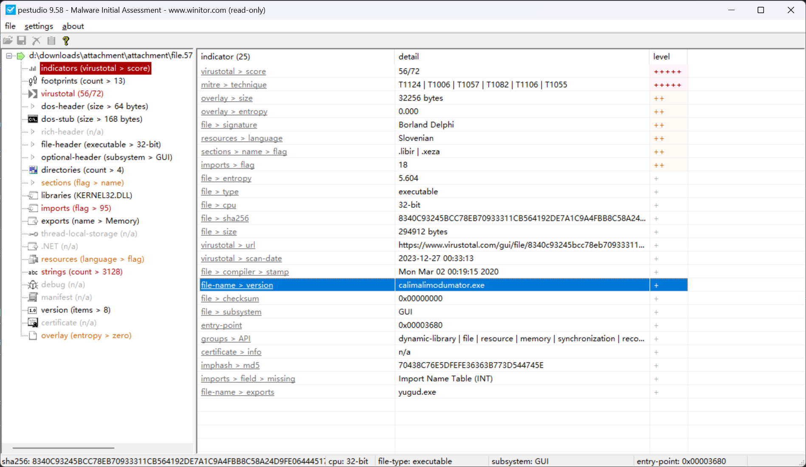

即可确定答案

```flag
calimalimodumator.exe
```

## 威胁分析 - 04

> 逆向分析恶意软件时，确定其在进程内存中存储关键数据的位置，对于理解其工作机制和防范进一步的攻击非常重要。
>
> 请问，恶意软件在进程内存中存储密钥的内存地址是什么？（请将答案编辑并存入 `/opt/wxfx/answer/4.txt` 文件中，参考 `/opt/wxfx/example` 目录）

在上文中，已经在内存中找到了恶意软件的勒索信息

```plaintext
When you open our website, put the following data in the input form:
Key:

lsJTyyTnzJlGQ1I6sfwV6oVcXaRynwN6mWphA7BKXEDIHJcDlhNNHsrxlkpggRChK2nQ7wP0sknJvl37lbqElTopkUywK3QnfJFmqDBSCmFISeWSudjgwxB4kKSp7h4VySHeu4LmDiZXTAh1dbZHWxTtZ0bA6PhCoDrbGkctY4rucITW4IdYUZJC8d2B7SFnr5EA7EoRkajrZW54brM5Kgwqsz67qzH6Hk0Vr3EDcnGzNjGQBapJczIWkgPtMCJdTkeemQ34XH7wawXu3eOGV3uJlBZNoSuaxtDHMGApS8EWsUXhafMW8WxFLAPLCo6pdm7MLcLsVDp9iBXU1sLv2KkGyUJbO0KOmom9f1JREuidviHRfsndEgMFBAjyq5v4VEIraiioAbtWM7eecYaXPVt3rolsBi8mtjxLOpFj73NPPitoIDxBNfHGzXxvRTXi06Pjx9pRnAtjIqoq5wovnHa8uBel8nq8yDJTk7NWdGdsv3yVwV2TmBin7OvFqHN9lweFNJyuziKCVGEtSaglUNudMmpFnNObGlhfh58jQsrQiQZ2d3AOFsi
```

使用 `yarascan` 进行检索

```bash
PS D:\Downloads\attachment\attachment> .\volatility_2.6_win64_standalone.exe -f .\dump.mem --profile=Win10x64_14393 yarascan -Y "lsJTyyTnzJlGQ"
Volatility Foundation Volatility Framework 2.6

......
Rule: r1
Owner: Process svchost.exe Pid 5784
0x00d1a585  6c 73 4a 54 79 79 54 6e 7a 4a 6c 47 51 31 49 36   lsJTyyTnzJlGQ1I6
0x00d1a595  73 66 77 56 36 6f 56 63 58 61 52 79 6e 77 4e 36   sfwV6oVcXaRynwN6
0x00d1a5a5  6d 57 70 68 41 37 42 4b 58 45 44 49 48 4a 63 44   mWphA7BKXEDIHJcD
0x00d1a5b5  6c 68 4e 4e 48 73 72 78 6c 6b 70 67 67 52 43 68   lhNNHsrxlkpggRCh
0x00d1a5c5  4b 32 6e 51 37 77 50 30 73 6b 6e 4a 76 6c 33 37   K2nQ7wP0sknJvl37
0x00d1a5d5  6c 62 71 45 6c 54 6f 70 6b 55 79 77 4b 33 51 6e   lbqElTopkUywK3Qn
0x00d1a5e5  66 4a 46 6d 71 44 42 53 43 6d 46 49 53 65 57 53   fJFmqDBSCmFISeWS
0x00d1a5f5  75 64 6a 67 77 78 42 34 6b 4b 53 70 37 68 34 56   udjgwxB4kKSp7h4V
0x00d1a605  79 53 48 65 75 34 4c 6d 44 69 5a 58 54 41 68 31   ySHeu4LmDiZXTAh1
0x00d1a615  64 62 5a 48 57 78 54 74 5a 30 62 41 36 50 68 43   dbZHWxTtZ0bA6PhC
0x00d1a625  6f 44 72 62 47 6b 63 74 59 34 72 75 63 49 54 57   oDrbGkctY4rucITW
0x00d1a635  34 49 64 59 55 5a 4a 43 38 64 32 42 37 53 46 6e   4IdYUZJC8d2B7SFn
0x00d1a645  72 35 45 41 37 45 6f 52 6b 61 6a 72 5a 57 35 34   r5EA7EoRkajrZW54
0x00d1a655  62 72 4d 35 4b 67 77 71 73 7a 36 37 71 7a 48 36   brM5Kgwqsz67qzH6
0x00d1a665  48 6b 30 56 72 33 45 44 63 6e 47 7a 4e 6a 47 51   Hk0Vr3EDcnGzNjGQ
0x00d1a675  42 61 70 4a 63 7a 49 57 6b 67 50 74 4d 43 4a 64   BapJczIWkgPtMCJd
```

即可确定答案

```flag
0x00d1a585
```

## 威胁分析 - 05

> 分析恶意软件的行为包括了解其在系统中启用了哪些权限，这有助于评估其潜在的危害和攻击范围。通过检查进程的权限列表，可以发现其可能执行的敏感操作。
>
> 请问，恶意软件在其进程中启用了多少个权限？（请将答案编辑并存入 `/opt/wxfx/answer/5.txt` 文件中，参考 `/opt/wxfx/example` 目录）

已知恶意程序的进程信息为 `Process svchost.exe Pid 5784` 的情况下，查看进程权限信息

```bash
PS D:\Downloads\attachment\attachment> .\volatility_2.6_win64_standalone.exe -f .\dump.mem --profile=Win10x64_14393 privs -p 5784
Volatility Foundation Volatility Framework 2.6
Pid      Process          Value  Privilege                            Attributes               Description
-------- ---------------- ------ ------------------------------------ ------------------------ -----------
    5784 svchost.exe           2 SeCreateTokenPrivilege                                        Create a token object
    5784 svchost.exe           3 SeAssignPrimaryTokenPrivilege                                 Replace a process-level token
    5784 svchost.exe           4 SeLockMemoryPrivilege                                         Lock pages in memory
    5784 svchost.exe           5 SeIncreaseQuotaPrivilege             Present,Enabled          Increase quotas
    5784 svchost.exe           6 SeMachineAccountPrivilege                                     Add workstations to the domain
    5784 svchost.exe           7 SeTcbPrivilege                                                Act as part of the operating system
    5784 svchost.exe           8 SeSecurityPrivilege                  Present,Enabled          Manage auditing and security log
    5784 svchost.exe           9 SeTakeOwnershipPrivilege             Present,Enabled          Take ownership of files/objects
    5784 svchost.exe          10 SeLoadDriverPrivilege                Present,Enabled          Load and unload device drivers
    5784 svchost.exe          11 SeSystemProfilePrivilege             Present,Enabled          Profile system performance
    5784 svchost.exe          12 SeSystemtimePrivilege                Present,Enabled          Change the system time
    5784 svchost.exe          13 SeProfileSingleProcessPrivilege      Present,Enabled          Profile a single process
    5784 svchost.exe          14 SeIncreaseBasePriorityPrivilege      Present,Enabled          Increase scheduling priority
    5784 svchost.exe          15 SeCreatePagefilePrivilege            Present,Enabled          Create a pagefile
    5784 svchost.exe          16 SeCreatePermanentPrivilege                                    Create permanent shared objects
    5784 svchost.exe          17 SeBackupPrivilege                    Present,Enabled          Backup files and directories
    5784 svchost.exe          18 SeRestorePrivilege                   Present,Enabled          Restore files and directories
    5784 svchost.exe          19 SeShutdownPrivilege                  Present,Enabled          Shut down the system
    5784 svchost.exe          20 SeDebugPrivilege                     Present,Enabled          Debug programs
    5784 svchost.exe          21 SeAuditPrivilege                                              Generate security audits
    5784 svchost.exe          22 SeSystemEnvironmentPrivilege         Present,Enabled          Edit firmware environment values
    5784 svchost.exe          23 SeChangeNotifyPrivilege              Present,Enabled,Default  Receive notifications of changes to files or directories
    5784 svchost.exe          24 SeRemoteShutdownPrivilege            Present,Enabled          Force shutdown from a remote system
    5784 svchost.exe          25 SeUndockPrivilege                    Present,Enabled          Remove computer from docking station
    5784 svchost.exe          26 SeSyncAgentPrivilege                                          Synch directory service data
    5784 svchost.exe          27 SeEnableDelegationPrivilege                                   Enable user accounts to be trusted for delegation
    5784 svchost.exe          28 SeManageVolumePrivilege              Present,Enabled          Manage the files on a volume
    5784 svchost.exe          29 SeImpersonatePrivilege               Present,Enabled,Default  Impersonate a client after authentication
    5784 svchost.exe          30 SeCreateGlobalPrivilege              Present,Enabled,Default  Create global objects
    5784 svchost.exe          31 SeTrustedCredManAccessPrivilege                               Access Credential Manager as a trusted caller
    5784 svchost.exe          32 SeRelabelPrivilege                                            Modify the mandatory integrity level of an object
    5784 svchost.exe          33 SeIncreaseWorkingSetPrivilege        Present,Enabled          Allocate more memory for user applications
    5784 svchost.exe          34 SeTimeZonePrivilege                  Present,Enabled          Adjust the time zone of the computer's internal clock
    5784 svchost.exe          35 SeCreateSymbolicLinkPrivilege        Present,Enabled          Required to create a symbolic link
```

对 `Attributes` 为 `Enabled` 的权限进行筛选统计，即可确定答案

```flag
23
```

## 威胁分析 - 06

> 在分析勒索软件的行为时，确定其在内存中加载的位置对于深入理解其运行机制和发现潜在的漏洞非常重要。通过内存取证，可以找到打开勒索软件文件的设备的虚拟地址。
>
> 请问，打开勒索软件文件的设备的虚拟地址是什么（16 进制）？（请将答案编辑并存入 `/opt/wxfx/answer/6.txt` 文件中，参考 `/opt/wxfx/example` 目录）

在上文中，已经确认了恶意程序的可执行文件在内存中的偏移地址 `0xffff9a88056a9ef0`

```bash
PS D:\Downloads\attachment\attachment> .\volatility_2.6_win64_standalone.exe -f .\dump.mem --profile=Win10x64_14393 dumpfiles --regex "skills\\svchost\.exe" -D .
Volatility Foundation Volatility Framework 2.6
ImageSectionObject 0xffff9a88056a9ef0   5784   \Device\HarddiskVolume3\Users\skills\svchost.exe
DataSectionObject 0xffff9a88056a9ef0   5784   \Device\HarddiskVolume3\Users\skills\svchost.exe
```

进入 `volshell` 进行分析

```bash
PS D:\Downloads\attachment\attachment> .\volatility_2.6_win64_standalone.exe -f .\dump.mem --profile=Win10x64_14393 volshell -p 5784
Volatility Foundation Volatility Framework 2.6
Current context: svchost.exe @ 0xffff9a8805cfb4c0, pid=5784, ppid=7136 DTB=0x30400000
Welcome to volshell! Current memory image is:
file:///D:/Downloads/attachment/attachment/dump.mem
To get help, type 'hh()'
>>> dt('_FILE_OBJECT',0xffff9a88056a9ef0)
[_FILE_OBJECT _FILE_OBJECT] @ 0xFFFF9A88056A9EF0
0x0   : Type                           5
0x2   : Size                           216
0x8   : DeviceObject                   18446632507711949952
0x10  : Vpb                            18446632507711953536
0x18  : FsContext                      18446651757703889232
0x20  : FsContext2                     18446651757801468480
0x28  : SectionObjectPointer           18446632507741760728
0x30  : PrivateCacheMap                0
0x38  : FinalStatus                    0
0x40  : RelatedFileObject              0
0x48  : LockOperation                  0
0x49  : DeletePending                  0
0x4a  : ReadAccess                     1
0x4b  : WriteAccess                    0
0x4c  : DeleteAccess                   0
0x4d  : SharedRead                     1
0x4e  : SharedWrite                    0
0x4f  : SharedDelete                   1
0x50  : Flags                          278594
0x58  : FileName                       \Users\skills\svchost.exe
0x68  : CurrentByteOffset              18446632507729944408
0x70  : Waiters                        0
0x74  : Busy                           0
0x78  : LastLock                       0
0x80  : Lock                           18446632507729944432
0x98  : Event                          18446632507729944456
0xb0  : CompletionContext              0
0xb8  : IrpListLock                    0
0xc0  : IrpList                        18446632507729944496
0xd0  : FileObjectExtension            0
>>> hex(18446632507711949952)
'0xffff9a8804580c80L'
```

即可确定答案

```flag
0xffff9a8804580c80
```
