2024 长城杯 & 国赛 初赛 威胁检测与网络流量分析 WinFT

官方 writeup 未公布，无标准答案

<!-- truncate -->

:::info

某单位网管日常巡检中发现某员工电脑（IP：192.168.116.123）存在异常外连及数据传输行为，随后立即对该电脑进行断网处理，并启动网络安全应急预案进行排查。

:::

## 1

> 受控机木马的回连域名及 ip 及端口是（示例：`flag{xxx.com:127.0.0.1:2333}`）

加载虚拟机之后，在虚拟机内发现已有以下工具

```plaintext
CurrPorts
WinHex v17.5
SearchMyFiles
Everything
ProcessExplorer
PCHunter_free
CyberChef_v10.19.4
```

使用 `CurrPorts` 工具进行排查

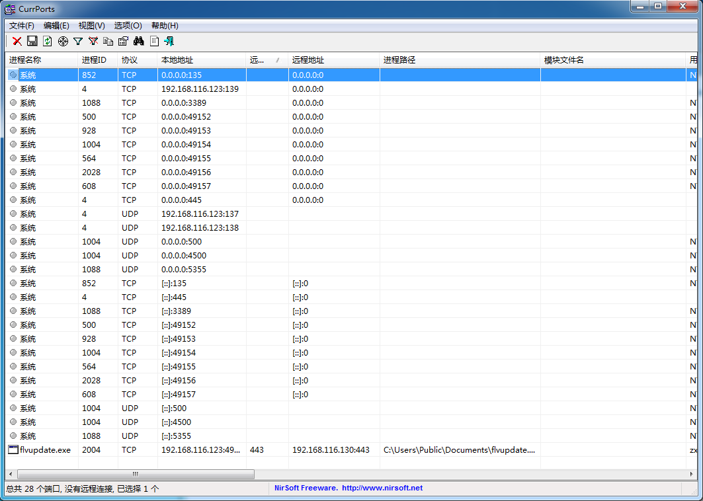

可以发现，进程 `flvupdate.exe` 显得非常可疑，查看其网络行为

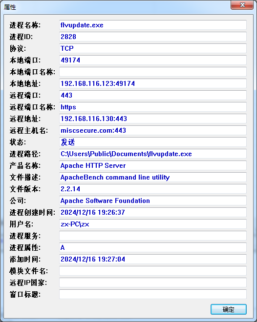

同时使用云沙箱对样本进行评估

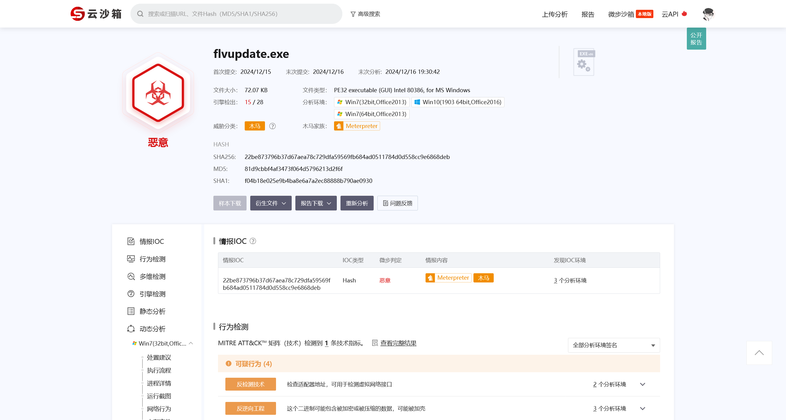

即可确定这个进程为木马进程

```flag
flag{miscsecure.com:192.168.116.130:443}
```

## 2

> 受控机启动项中隐藏 flag 是

对靶机的任务计划进行排查，快捷键 `Win`+`R` 输入 `taskschd.msc` 启动任务计划程序

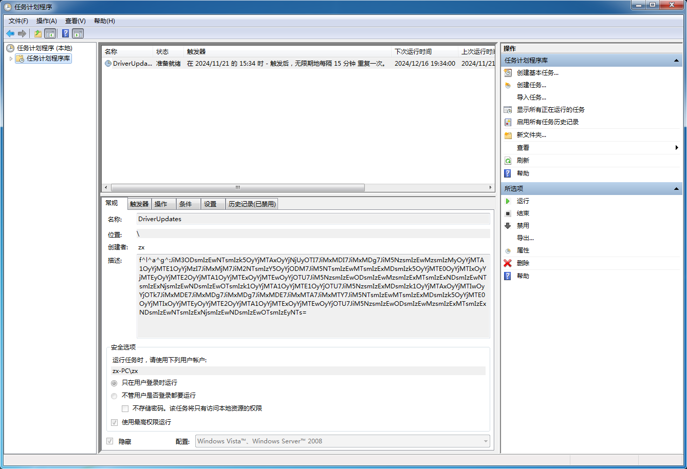

```plaintext
f^l^a^g^:JiM3ODsmIzEwNTsmIzk5OyYjMTAxOyYjNjUyOTI7JiMxMDI7JiMxMDg7JiM5NzsmIzEwMzsmIzMyOyYjMTA1OyYjMTE1OyYjMzI7JiMxMjM7JiM2NTsmIzY5OyYjODM7JiM5NTsmIzEwMTsmIzExMDsmIzk5OyYjMTE0OyYjMTIxOyYjMTEyOyYjMTE2OyYjMTA1OyYjMTExOyYjMTEwOyYjOTU7JiM5NzsmIzEwODsmIzEwMzsmIzExMTsmIzExNDsmIzEwNTsmIzExNjsmIzEwNDsmIzEwOTsmIzk1OyYjMTA1OyYjMTE1OyYjOTU7JiM5NzsmIzExMDsmIzk1OyYjMTAxOyYjMTIwOyYjOTk7JiMxMDE7JiMxMDg7JiMxMDg7JiMxMDE7JiMxMTA7JiMxMTY7JiM5NTsmIzEwMTsmIzExMDsmIzk5OyYjMTE0OyYjMTIxOyYjMTEyOyYjMTE2OyYjMTA1OyYjMTExOyYjMTEwOyYjOTU7JiM5NzsmIzEwODsmIzEwMzsmIzExMTsmIzExNDsmIzEwNTsmIzExNjsmIzEwNDsmIzEwOTsmIzEyNTs=
```

对此任务计划的描述进行解码

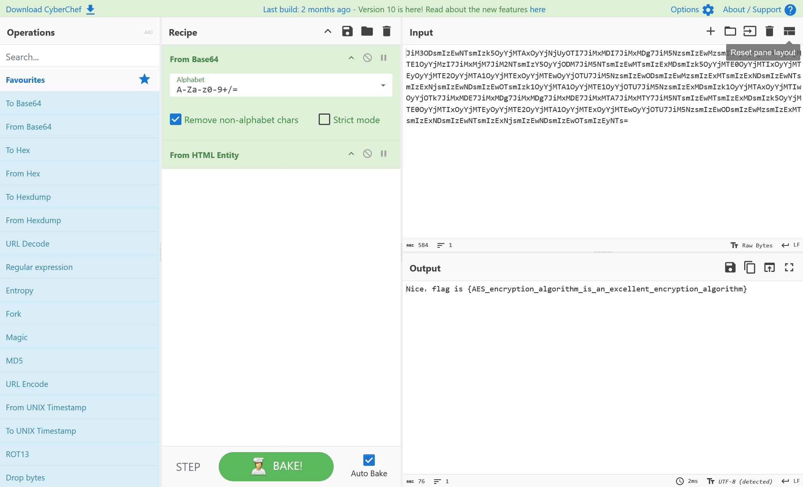

```plaintext
Nice，flag is {AES_encryption_algorithm_is_an_excellent_encryption_algorithm}
```

即可得到答案

```flag
flag{{AES_encryption_algorithm_is_an_excellent_encryption_algorithm}}
```

## 3

> 受控机中驻留的 flag 是

对靶机的环境进行排查，在用户的临时目录下发现特殊文件

```plaintext
C:/Users/zx/AppData/Local/Temp/F^L^A^G^
```

本文件的特征符合 7z 压缩文件，但是其有密码保护

经过多次尝试，确认密码为恶意进程的进程名，也就是 `flvupdate`

解压之后，得到文件 `info.txt` 之后，即可得到答案

```flag
flag{Timeline_correlation_is_a_very_important_part_of_the_digital_forensics_process}
```

## 4

> 受控源头隐藏的 flag 是

在靶机的环境中，`Thunderbird` 的快捷方式很突出，对邮件列表进行排查，重点观察带附件的邮件，发现

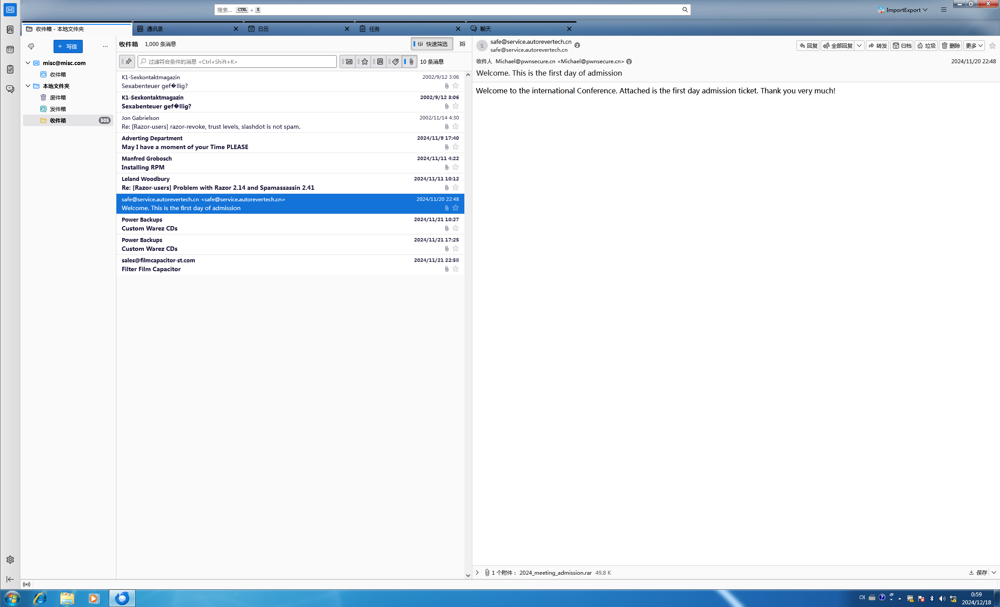

查看此发件人的来往邮件

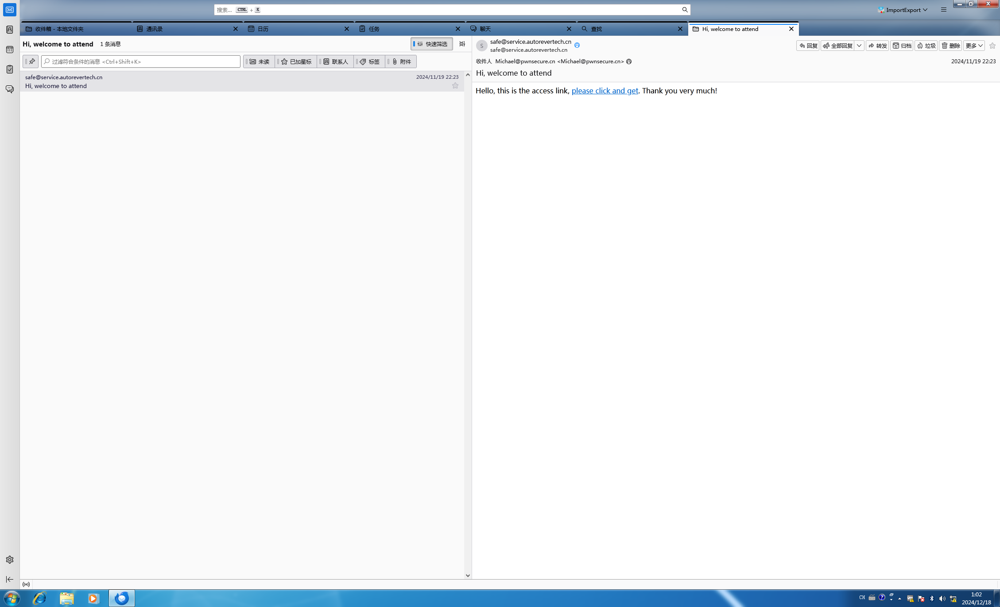

对邮件源码进行分析

```eml
From - Thu Nov 21 14:03:18 2024
X-Mozilla-Status: 0001
X-Mozilla-Status2: 00000000
From: "safe@service.autorevertech.cn" <safe@service.autorevertech.cn>
To: "Michael@pwnsecure.cn" <Michael@pwnsecure.cn>
Subject: Hi, welcome to attend
Mime-Version: 1.0
Content-Type: multipart/alternative;
    boundary="----=_NextPart_673DC3E1_153C7D50_33CF5209"
Content-Transfer-Encoding: 8Bit
Date: Wed, 19 Nov 2024 22:23:45
X-Priority: 3


This is a multi-part message in MIME format.

------=_NextPart_673DC3E1_153C7D50_33CF5209
Content-Type: text/plain;
    charset="gb18030"
Content-Transfer-Encoding: base64

SGVsbG8sIHRoaXMgaXMgdGhlIGFjY2VzcyBsaW5rLCBwbGVhc2UgY2xpY2sgYW5kIGdldC4g
VGhhbmsgeW91IHZlcnkgbXVjaCE=

------=_NextPart_673DC3E1_153C7D50_33CF5209
Content-Type: text/html;
    charset="gb18030"
Content-Transfer-Encoding: base64

SGVsbG8sIHRoaXMgaXMgdGhlIGFjY2VzcyBsaW5rLCA8YSBocmVmPSJodHRwczovL2F1dG9y
ZXZlcnRlY2guY29tP2tleT0lNjElNDclNkUlNzYlNzYlNDklNzglNkQlNjIlNDclNDYlNkUl
NDklNDclNkMlN0ElNDklNDglNzQlNTUlNjElNDclNTUlNjclNTMlNkQlMzklMzElNjMlNkQl
MzUlNkMlNjUlNTMlNDIlMzAlNjIlNzklNDIlMzAlNjElNDclNTUlNjclNTYlMzIlNTYlN0El
NjQlNDglMzAlM0QiPnBsZWFzZSBjbGljayBhbmQgZ2V0PC9hPi4gVGhhbmsgeW91IHZlcnkg
bXVjaCE=

------=_NextPart_673DC3E1_153C7D50_33CF5209--
```

对其中的链接进行分析

```plaintext
SGVsbG8sIHRoaXMgaXMgdGhlIGFjY2VzcyBsaW5rLCA8YSBocmVmPSJodHRwczovL2F1dG9y
ZXZlcnRlY2guY29tP2tleT0lNjElNDclNkUlNzYlNzYlNDklNzglNkQlNjIlNDclNDYlNkUl
NDklNDclNkMlN0ElNDklNDglNzQlNTUlNjElNDclNTUlNjclNTMlNkQlMzklMzElNjMlNkQl
MzUlNkMlNjUlNTMlNDIlMzAlNjIlNzklNDIlMzAlNjElNDclNTUlNjclNTYlMzIlNTYlN0El
NjQlNDglMzAlM0QiPnBsZWFzZSBjbGljayBhbmQgZ2V0PC9hPi4gVGhhbmsgeW91IHZlcnkg
bXVjaCE=

Hello, this is the access link, <a href="https://autorevertech.com?key=%61%47%6E%76%76%49%78%6D%62%47%46%6E%49%47%6C%7A%49%48%74%55%61%47%55%67%53%6D%39%31%63%6D%35%6C%65%53%42%30%62%79%42%30%61%47%55%67%56%32%56%7A%64%48%30%3D">please click and get</a>. Thank you very much!

key=%61%47%6E%76%76%49%78%6D%62%47%46%6E%49%47%6C%7A%49%48%74%55%61%47%55%67%53%6D%39%31%63%6D%35%6C%65%53%42%30%62%79%42%30%61%47%55%67%56%32%56%7A%64%48%30%3D
```

继续解码

```plaintext
%61%47%6E%76%76%49%78%6D%62%47%46%6E%49%47%6C%7A%49%48%74%55%61%47%55%67%53%6D%39%31%63%6D%35%6C%65%53%42%30%62%79%42%30%61%47%55%67%56%32%56%7A%64%48%30%3D

aGnvvIxmbGFnIGlzIHtUaGUgSm91cm5leSB0byB0aGUgV2VzdH0=

hi，flag is {The Journey to the West}
```

即可得到答案

```flag
flag{The Journey to the West}
```

## 5

> 分析流量，获得压缩包中得到答案

对流量包筛选 HTTP 传输的文件流量，可以发现两个文件

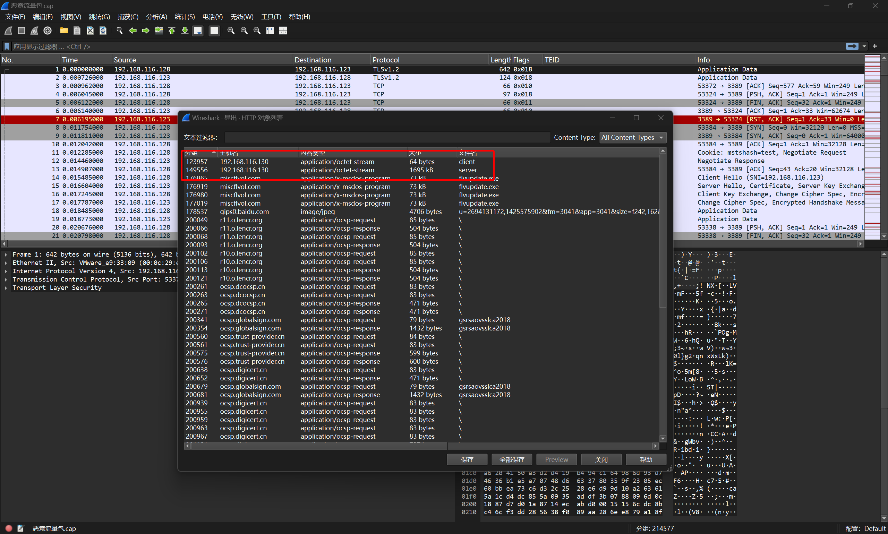

将文件导出进行分析

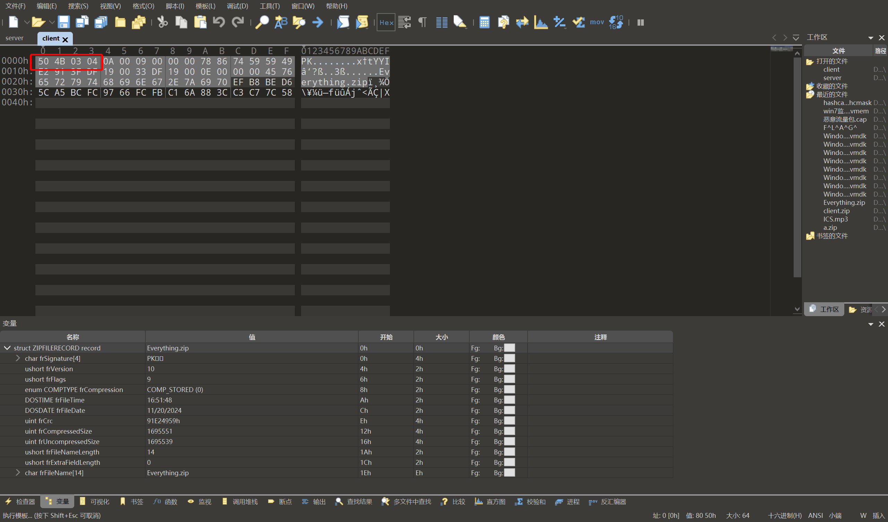

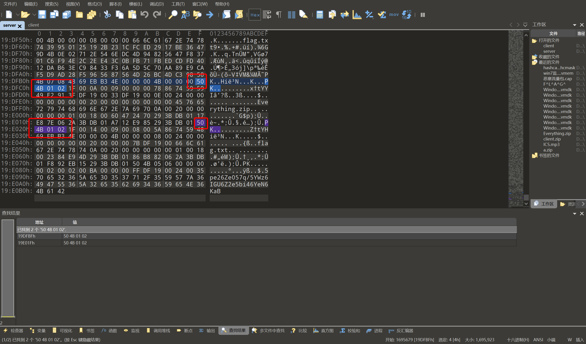

怀疑原本的 zip 文件被拆分为 `cilent`+`server` 两个文件，将其拼接起来即可得到正常的 zip 文件

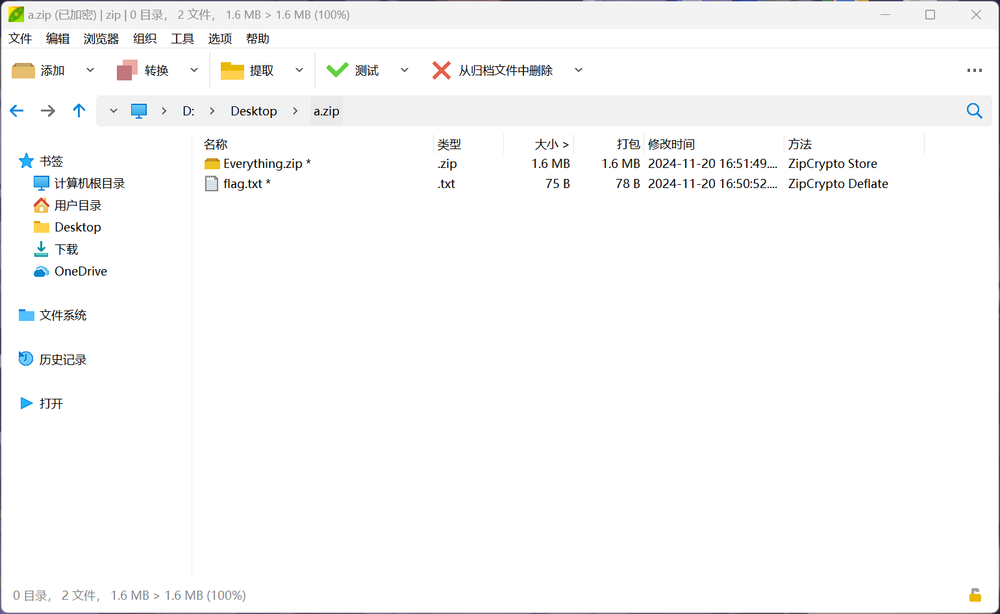

对压缩包文件进行检查，发现存在有压缩包注释

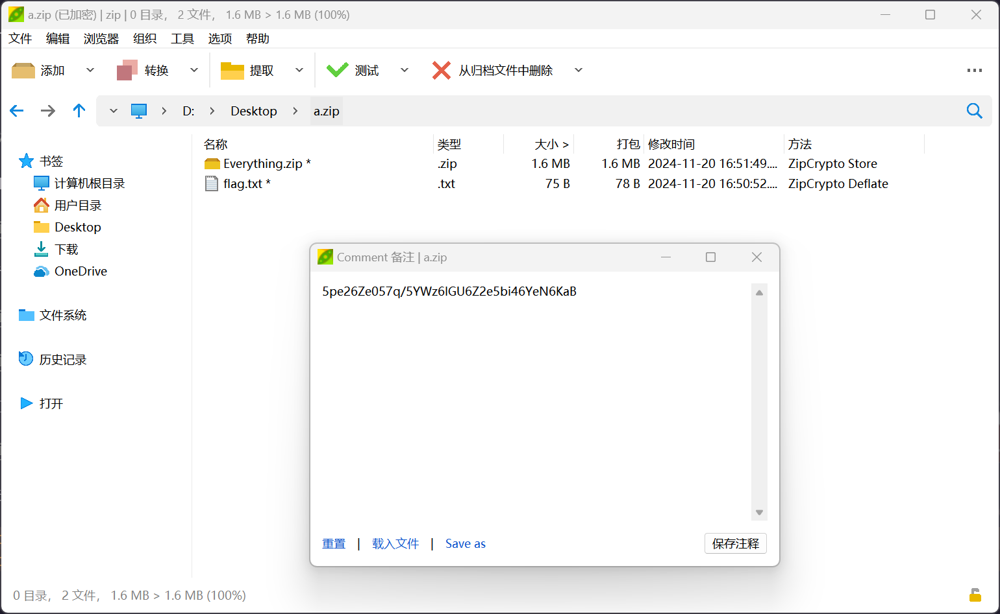

```plaintext
5pe26Ze057q/5YWz6IGU6Z2e5bi46YeN6KaB
```

解码后得到

```plaintext
时间线关联非常重要
```

将其作为密码解压压缩包，即可得到答案

```plaintext
flag{a1b2c3d4e5f67890abcdef1234567890-2f4d90a1b7c8e2349d3f56e0a9b01b8a-CBC}
```

## 6

> 通过 aes 解密得到的 flag

对于上一题的答案进行分析，可以确定 AES 的参数

```plaintext
Mode: CBC
Key: a1b2c3d4e5f67890abcdef1234567890
iv: 2f4d90a1b7c8e2349d3f56e0a9b01b8a
```

对攻击者的 ip 地址 `192.168.116.130` 进行筛选

```plaintext
ip.addr == 192.168.116.130
```

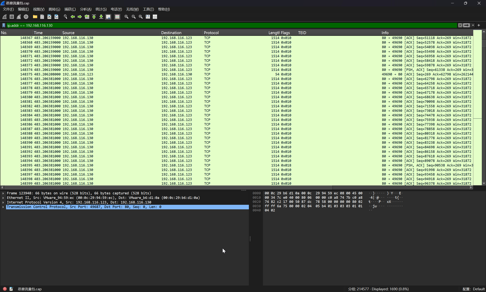

经过排查，发现可能存在的 AES 密文

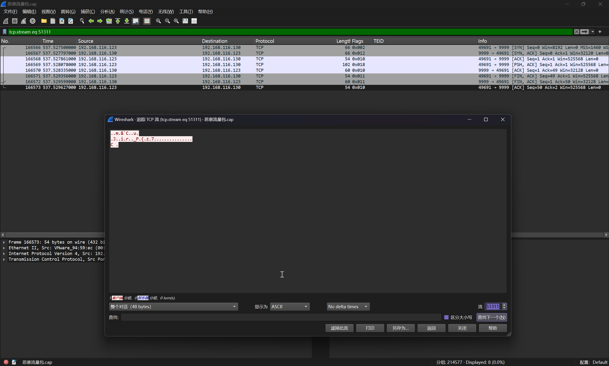

尝试进行解码

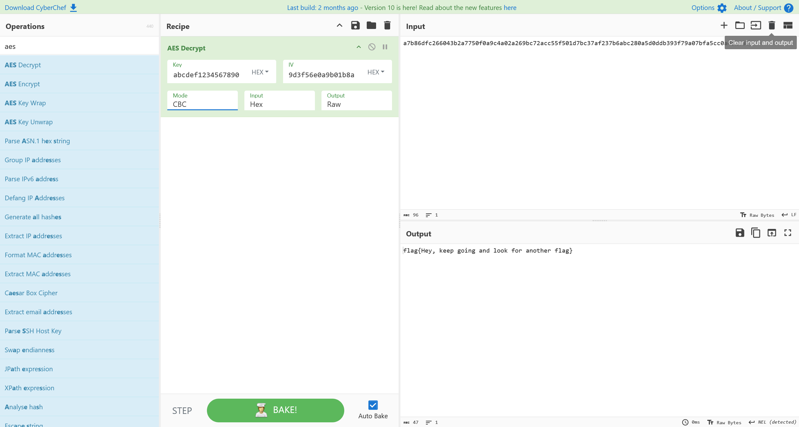

即可得到答案

```flag
flag{Hey, keep going and look for another flag}
```
