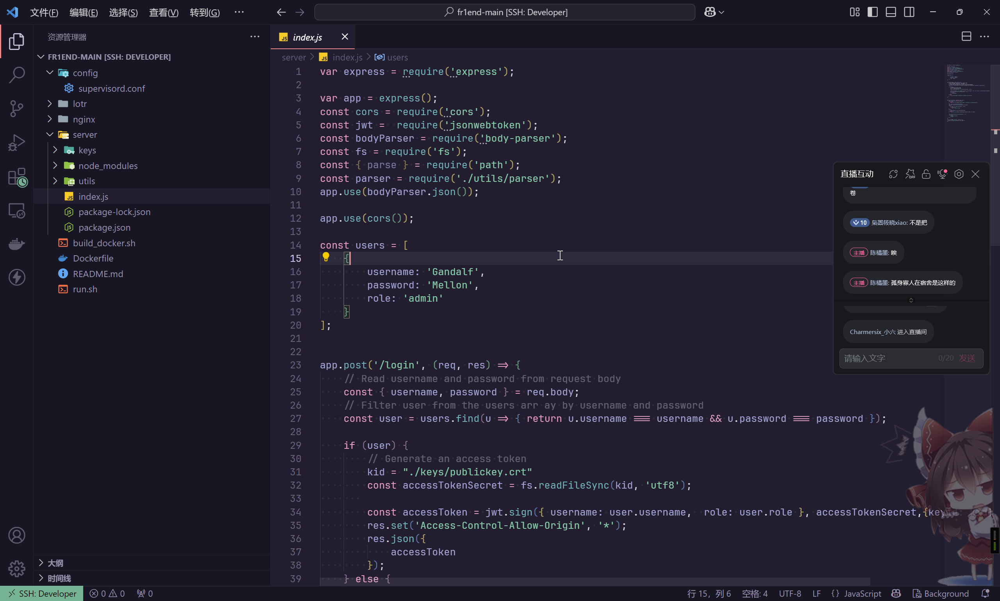
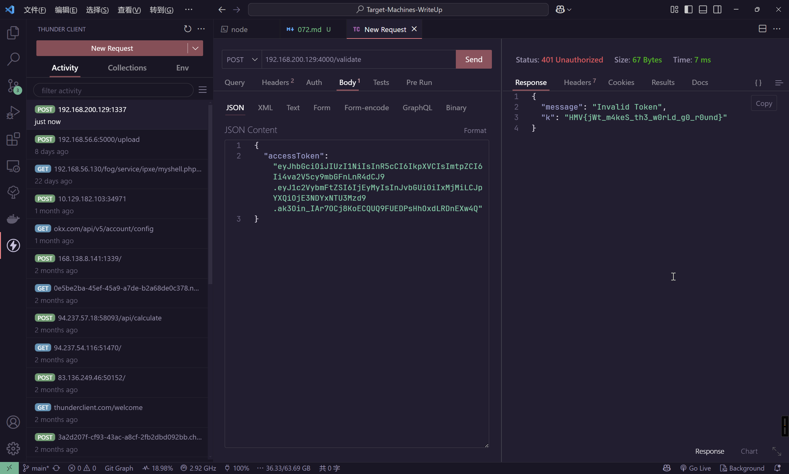

# Docker - 072

:::note

created by || rick

⏲️ Release Date // 2024-04-07

💀 Solvers // 27

🧩 Type // docker

:::

## 题目信息

```plaintext
Instructions in README.md inside the file.
```

## 解题

首先部署环境

```bash
randark@developer:~$ unzip 072.zip
......
randark@developer:~$ cd fr1end/
randark@developer:~/fr1end$ cd fr1end-main/
randark@developer:~/fr1end/fr1end-main$ docker build -t fr1end .
[+] Building 32.9s (14/14) FINISHED                                                                                                                                                              docker:default
 => [internal] load build definition from Dockerfile                                                                                                                                                       0.0s
 => => transferring dockerfile: 413B                                                                                                                                                                       0.0s
 => [internal] load metadata for docker.io/library/node:18                                                                                                                                                 2.2s
 => [internal] load .dockerignore                                                                                                                                                                          0.0s
 => => transferring context: 2B                                                                                                                                                                            0.0s
 => CACHED [1/9] FROM docker.io/library/node:18@sha256:867be01f97d45cb7d89a8ef0b328d23e8207412ebec4564441ed8cabc8cc4ecd                                                                                    0.0s
 => [internal] load build context                                                                                                                                                                          1.7s
 => => transferring context: 3.48MB                                                                                                                                                                        1.7s
 => [2/9] RUN apt update && apt install -y supervisor && apt install -y nginx                                                                                                                             13.5s
 => [3/9] COPY . /app                                                                                                                                                                                      6.3s 
 => [4/9] COPY ./lotr/build/ /var/www/html                                                                                                                                                                 0.1s 
 => [5/9] RUN rm /etc/nginx/sites-available/default                                                                                                                                                        0.3s 
 => [6/9] COPY /nginx/default /etc/nginx/sites-available/                                                                                                                                                  0.0s 
 => [7/9] WORKDIR /app/server/                                                                                                                                                                             0.0s 
 => [8/9] RUN npm i                                                                                                                                                                                        2.4s 
 => [9/9] COPY config/supervisord.conf /etc/supervisord.conf                                                                                                                                               0.0s
 => exporting to image                                                                                                                                                                                     8.1s
 => => exporting layers                                                                                                                                                                                    8.1s
 => => writing image sha256:ca9175e115be6aaacbd4b2a05cfef2cb0203d6ce63bea33413ad1284768e4b2f                                                                                                               0.0s
 => => naming to docker.io/library/fr1end  

randark@developer:~/fr1end/fr1end-main$ docker run --name=fr1end -p1337:80 -p4000:4000 fr1end
```

然后访问环境 `http://192.168.200.129:1337/`


由于容器 web 服务固定访问 vhost 为 `localhost` 的原因，不继续进行分析 (懒)

直接分析源码



分析其中定义的路由，可以发现 `/validate` 路由存在有问题

```javascript
app.post('/validate', function (req, res) {
    const token = req.body.accessToken;
    if (!token) {
        return res.status(403).send("A token is required for authentication");
    }
    kid = parser.parseJwt(token)['kid']
    username = parser.parseJwtname(token)['username']
    try {
        var key = fs.readFileSync(kid, 'utf8');
        } catch(err) {
            key = 'key not found'
    }
    try {
        const decoded = jwt.verify(token,key);
    } catch(e) {
        return res.status(401).send({message:"Invalid Token","k":key});
    }
    
    res.set('Access-Control-Allow-Origin', '*');
    res.json({
        "message":username,
        "k":key
    });
});
```

客户端可以篡改 `kid` 变量的值，进而通过报错信息读取到文件内容

尝试进行利用，先构造 JWT


然后使用 json 发包即可



即可得到答案

```flag
HMV{jWt_m4keS_th3_w0rLd_g0_r0und}
```
