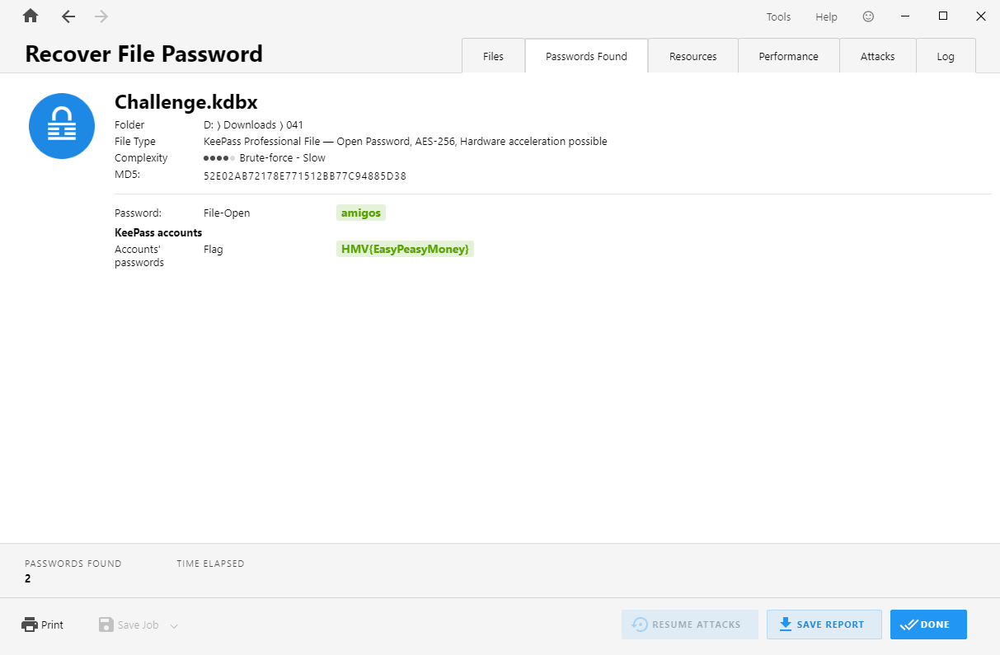

# Misc - 041

:::note

created by || eMVee

⏲️ Release Date // 2023-09-27

💀 Solvers // 21

🧩 Type // misc

`Download the file and find the flag.`

:::

下载下来的附件的文件名为：`Challenge.kdbx`

提取文件哈希

```shell
┌─[randark@parrot]─[~/tmp]
└──╼ $keepass2john Challenge.kdbx 
Challenge:$keepass$*2*2542373*0*8f393350c590f14ea052b8a2a4a3592d9fb92582cbb8f20e2267770dda41e44a*6c3d17c6b9929ee1ee89b2963263f46bace4f1c4ed4ee2cb3c7795f316dfbc5e*cb7b607e3dabb68151a49b0042982a6f*7e0ac4fd1443d3d3b969688c075120e29ca5f6e1dbf0657108442d5ba375fc5e*6ce9b61d09b5f92163b06dbfb802fdb32910603f22e31c08d5db5921d56a2dea
```

可以确定哈希类型为

| Hash-Mode |            Hash-Name            |
| :-------: | :-----------------------------: |
|   13400   | KeePass 2 AES / without keyfile |

使用 Passware 进行爆破



password：

```plaintext
amigos
```

## flag

```plaintext
HMV{EasyPeasyMoney}
```
