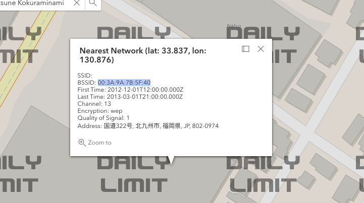

# OSINT - 036

:::note

created by || sh4dowExe

⏲️ Release Date // 2023-08-24

💀 Solvers // 6

🧩 Type // osint

:::

题目给出了这张图片


根据图片上的信息，可以定位到这个地点 [Map:sanribu\[Tabelogp\]](<https://tabelog.com/en/fukuoka/A4004/A400502/40048956/dtlmap/>)

使用 [WiGLE: Wireless Network Mapping](https://wigle.net/) 进行信息查找，即可定位到




## flag

```plaintext
HMV{00:3A:9A:7B:5F:40}
```
