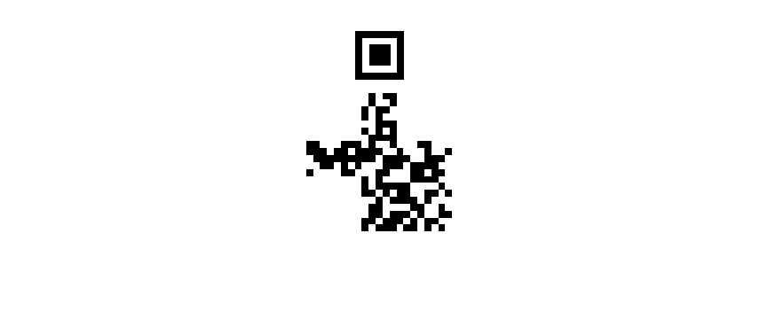
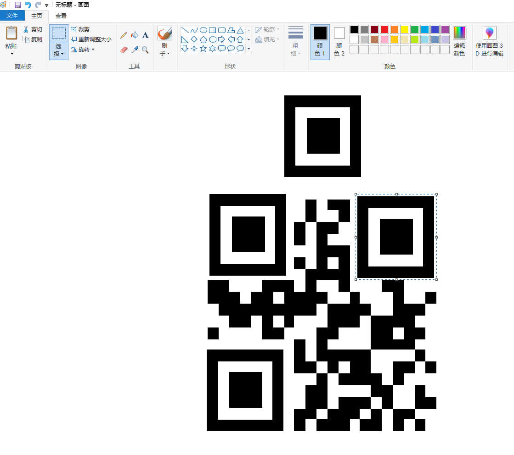

# Setgo - 030

:::note

created by || sml

⏲️ Release Date // 2022-10-09

💀 Solvers // 19

🧩 Type // stego

`The image contains the flag.`

:::

原图



大概看出了二维码的结构，手动将三个定位符补全就可以



## flag

```plaintext
HMV{qrsospecial}
```
