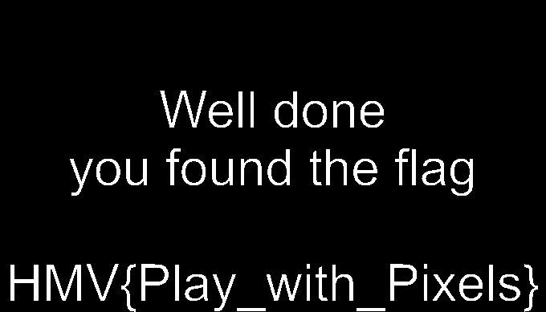

# Stego - 064

:::note

created by || rpj7

⏲️ Release Date // 2024-01-24

💀 Solvers // 3

🧩 Type // stego

`Flag inside the file.`

:::

得到的原图为：


给出的代码为：

```python
from PIL import Image

im = Image.open('challenge.png')
pixelMap = im.load()
img = Image.new( im.mode, im.size)
pixelsNew = img.load()

for i in range(img.size[0]):
    for j in range(img.size[1]):
        RGB = im.getpixel((i,j))
        R,G,B = RGB
        #

        #
        pixelsNew[i,j] = (R,G,B)
im.close()

img.show()
img.save("flag.png") 
img.close()

# Can you find the flag hidden in the image?
# may need to 'pip3 install pillow' if not installed
```

根据图片的信息，以及代码，可以改写出

```python
from PIL import Image

def isEven(num):
    if num % 2 == 0:
        return True
    else:
        return False

im = Image.open("challenge.png")
pixelMap = im.load()
img = Image.new(im.mode, im.size)
pixelsNew = img.load()

for i in range(img.size[0]):
    for j in range(img.size[1]):
        RGB = im.getpixel((i, j))
        R, G, B = RGB
        if isEven(R + G + B):
            pixelsNew[i, j] = (R, G, B)

im.close()
img.show()
```

可以得到以下图像


为了数据更明显一点，可以进行一定的优化

```python

from PIL import Image

def isEven(num):
    if num % 2 == 0:
        return True
    else:
        return False

im = Image.open("challenge.png")
pixelMap = im.load()
img = Image.new(im.mode, im.size)
pixelsNew = img.load()

for i in range(img.size[0]):
    for j in range(img.size[1]):
        RGB = im.getpixel((i, j))
        R, G, B = RGB
        if isEven(R + G + B):
            pixelsNew[i, j] = (0, 0, 0)
        else:
            pixelsNew[i, j] = (255, 255, 255)

im.close()
img.show()
```

得到的图像，可读性变得更好



## flag

```plaintext
HMV{Play_with_Pixels}
```
