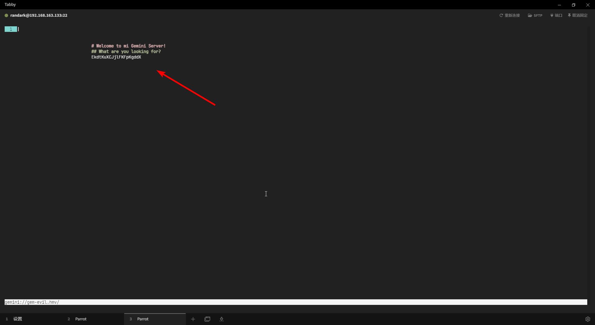

# Hades 21-30

## User - clio

### flag - 21

```plaintext
^XUJbvPwAZYgoUgkpeSv^
```

### 任务目标

```plaintext title="mission.txt"
The user cybele uses her lastname as a password.
```

### 行动

```plaintext title="ls -lah"
drwxr-x--- 2 root clio 4.0K Jul 26  2023 .
drwxr-xr-x 1 root root 4.0K Jul 26  2023 ..
-rw-r--r-- 1 clio clio  220 Apr 23  2023 .bash_logout
-rw-r--r-- 1 clio clio 3.5K Apr 23  2023 .bashrc
-rw-r--r-- 1 clio clio  807 Apr 23  2023 .profile
-rw-r----- 1 root clio   22 Jul 26  2023 flagz.txt
-rw-r----- 1 root clio  169 Jul 26  2023 mission.txt
```

```shell title="Exploit it"
asteria@hades:~$ cat /etc/passwd
......
cybele:x:2014:2014:UICacOPmJMWbKyPwNZod:/pwned/cybele:/bin/bash
......
```

## User - cybele

### flag - 22

```plaintext
^bTsTIOmJELcaxEiIaCA^
```

### 任务目标

```plaintext title="mission.txt"
User cynthia sees things that others dont.
```

### 行动

```plaintext title="ls -lah"
drwxr-x--- 2 root   cybele 4.0K Jul 26  2023 .
drwxr-xr-x 1 root   root   4.0K Jul 26  2023 ..
-rw-r--r-- 1 cybele cybele  220 Apr 23  2023 .bash_logout
-rw-r--r-- 1 cybele cybele 3.5K Apr 23  2023 .bashrc
-rw-r--r-- 1 cybele cybele  807 Apr 23  2023 .profile
-rw-r----- 1 root   cybele   22 Jul 26  2023 flagz.txt
-rw-r----- 1 root   cybele 3.2M Dec 30  2021 fun.png
-rw-r----- 1 root   cybele  163 Jul 26  2023 mission.txt
```

```shell title="Exploit it"
┌─[✗]─[randark@parrot]─[~/tmp]
└──╼ $scp -P 6666 cybele@hades.hackmyvm.eu:/pwned/cybele/fun.png .
......
# 图像存在 LSB 可见隐写 Red - 0
# QHLjXdGSiRShtWpMwFjj
```

## User - cynthia

### flag - 23

```plaintext
^ZRSCKeYYlHkCEiHsEOI^
```

### 任务目标

```plaintext title="mission.txt"
User daphne once told us: Gemini? gem-evil.hmv? WTF?
```

### 行动

```plaintext title="ls -lah"
drwxr-x--- 2 root    cynthia 4.0K Jul 26  2023 .
drwxr-xr-x 1 root    root    4.0K Jul 26  2023 ..
-rw-r--r-- 1 cynthia cynthia  220 Apr 23  2023 .bash_logout
-rw-r--r-- 1 cynthia cynthia 3.5K Apr 23  2023 .bashrc
-rw-r--r-- 1 cynthia cynthia  807 Apr 23  2023 .profile
-rw-r----- 1 root    cynthia   22 Jul 26  2023 flagz.txt
-rw-r----- 1 root    cynthia  187 Jul 26  2023 mission.txt
```

```shell title="Exploit it"
# 首先，编辑 /etc/hosts 文件，将 gem-evil.hmv 加入本地解析
# 127.0.0.1 gem-evil.hmv
# 然后将靶机的1965端口映射到本地
ssh -p 6666 acantha@hades.hackmyvm.eu -L 1965:127.0.0.1:1965
# 在保持 SSH 会话不断开的的情况下，新建终端启动 amfora 与 gemini 协议进行交互
```


成功取得信息



```plaintext
# Welcome to mi Gemini Server!
## What are you looking for?
EkdtKuXCJjlFKFpKgddX 
```

## User - daphne

### flag - 24

```plaintext
^ieOhnUKZlYZSSrIPgaJ^
```

### 任务目标

```plaintext title="mission.txt"
The user delia has a good memory, she only has to see her password for a few seconds to remember it.
```

### 行动

```plaintext title="ls -lah"
drwxr-x--- 2 root   daphne 4.0K Jul 26  2023 .
drwxr-xr-x 1 root   root   4.0K Jul 26  2023 ..
-rw-r--r-- 1 daphne daphne  220 Apr 23  2023 .bash_logout
-rw-r--r-- 1 daphne daphne 3.5K Apr 23  2023 .bashrc
-rw-r--r-- 1 daphne daphne  807 Apr 23  2023 .profile
-rw-r----- 1 root   daphne   22 Jul 26  2023 flagz.txt
-rw-r----- 1 root   daphne  272 Jul 26  2023 mission.txt
-rw-r----- 1 root   daphne  174 Jul 26  2023 old.sh
```

```shell title="Exploit it"
TODO 未实现预期解
# bNCvocyOpoMVeCtxrhTt
# ssh delia@hades.hackmyvm.eu -p 6666 bash
```

## User - delia

### flag - 25

```plaintext
^QfaHPyEqMepsOdMxQCQ^
```

### 任务目标

```plaintext title="mission.txt"
User demeter reads in another language.
```

### 行动

```plaintext title="ls -lah"
drwxr-x--- 1 root  delia 4.0K Jul 26  2023 .
drwxr-xr-x 1 root  root  4.0K Jul 26  2023 ..
-rw-r--r-- 1 delia delia  220 Apr 23  2023 .bash_logout
-r--r----- 1 delia delia 3.5K Jul 26  2023 .bashrc
-rw-r--r-- 1 delia delia  807 Apr 23  2023 .profile
-rw-r----- 1 root  delia   22 Jul 26  2023 flagz.txt
-rw-r----- 1 root  delia  150 Jul 26  2023 mission.txt
---x--x--- 1 delia delia  16K Jul 26  2023 showpass
```

```shell title="Exploit it"
./showpass

FkyuXkkJNONDChoaKzOI
```

## User - demeter

### flag - 26

```plaintext
^JiviWHRVRZLSfjBuwAi^
```

### 任务目标

```plaintext title="mission.txt"
The user echo permute.
```

### 行动

```plaintext title="ls -lah"
drwxr-x--- 2 root    demeter 4.0K Jul 26  2023 .
drwxr-xr-x 1 root    root    4.0K Jul 26  2023 ..
-rw-r--r-- 1 demeter demeter  220 Apr 23  2023 .bash_logout
-rw-r--r-- 1 demeter demeter 3.5K Apr 23  2023 .bashrc
-rw-r--r-- 1 demeter demeter  807 Apr 23  2023 .profile
-rw-r----- 1 root    demeter   22 Jul 26  2023 flagz.txt
-rw-r----- 1 root    demeter  119 Jul 26  2023 mission.txt
```

```shell title="Exploit it"

```

## User -

### flag - 27

```plaintext

```

### 任务目标

```plaintext title="mission.txt"

```

### 行动

```plaintext title="ls -lah"

```

```shell title="Exploit it"

```

## User -

### flag - 28

```plaintext

```

### 任务目标

```plaintext title="mission.txt"

```

### 行动

```plaintext title="ls -lah"

```

```shell title="Exploit it"

```

## User -

### flag - 29

```plaintext

```

### 任务目标

```plaintext title="mission.txt"

```

### 行动

```plaintext title="ls -lah"

```

```shell title="Exploit it"

```

## User -

### flag - 30

```plaintext

```

### 任务目标

```plaintext title="mission.txt"

```

### 行动

```plaintext title="ls -lah"

```

```shell title="Exploit it"

```
