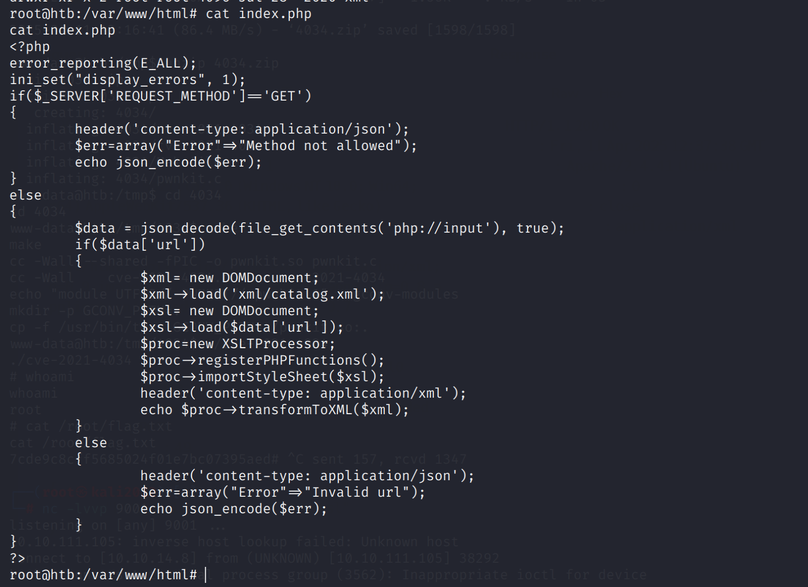
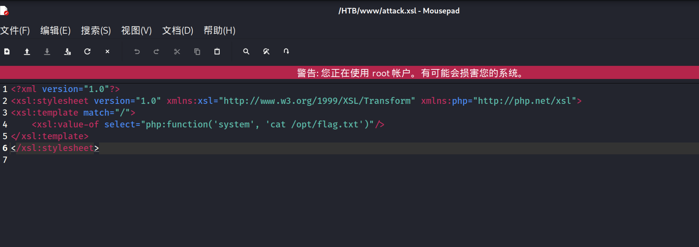

# Amelia

## 信息搜集

```bash
Nmap scan report for bogon (10.10.110.104)
Host is up (0.21s latency).
Not shown: 65529 closed tcp ports (reset)
PORT     STATE SERVICE     VERSION
22/tcp   open  ssh         OpenSSH 8.2p1 Ubuntu 4ubuntu0.1 (Ubuntu Linux; protocol 2.0)
| ssh-hostkey: 
|   3072 ff:05:ac:91:6c:44:f2:f6:9e:03:f4:b8:60:5e:bc:04 (RSA)
|   256 72:9f:1b:66:80:a1:11:e6:0b:9c:38:6c:f8:7f:99:24 (ECDSA)
|_  256 93:30:e7:45:8b:97:9c:af:82:16:9d:06:7a:6a:14:84 (ED25519)
139/tcp  open  netbios-ssn Samba smbd 4
445/tcp  open  netbios-ssn Samba smbd 4
1234/tcp open  hotline?
| fingerprint-strings: 
|   FourOhFourRequest, GetRequest, HTTPOptions, Help, Kerberos, LPDString, RTSPRequest, SSLSessionReq, TerminalServerCookie: 
|     ERROR: unknown command, type "help" to get a list of commands.
|   LDAPSearchReq, TLSSessionReq: 
|     ERROR: unknown command, type "help" to get a list of commands.
|     ERROR: unknown command, type "help" to get a list of commands.
|   SIPOptions: 
|     ERROR: unknown command, type "help" to get a list of commands.
|     ERROR: unknown command, type "help" to get a list of commands.
|     ERROR: unknown command, type "help" to get a list of commands.
|     ERROR: unknown command, type "help" to get a list of commands.
|     ERROR: unknown command, type "help" to get a list of commands.
|     ERROR: unknown command, type "help" to get a list of commands.
|     ERROR: unknown command, type "help" to get a list of commands.
|     ERROR: unknown command, type "help" to get a list of commands.
|     ERROR: unknown command, type "help" to get a list of commands.
|_    ERROR: unknown command, type "help" to get a list of commands.
8000/tcp open  http        Icecast streaming media server 2.4.4
| http-methods: 
|_  Supported Methods: GET HEAD POST
|_http-title: Icecast Streaming Media Server
|_http-server-header: Icecast 2.4.4
8080/tcp open  http        Apache Tomcat (language: en)
|_http-title: Site doesn't have a title (application/json).
```

## icescat config

```bash
(remote) root@htb:/root# cat /proc/996/cmdline 
/home/soapuser/.opam/default/bin/liquidsoap/home/soapuser/liquidsoap-daemon/script/main-run.liq(remote) root@htb:/root# cat /home/soapuser/liquidsoap-daemon/script/main-run.liq
#!/home/soapuser/.opam/default/bin/liquidsoap

set("log.file",true)
set("log.file.path","/var/log/liquidsoap/main-run.log")
set("init.daemon",true)
set("init.daemon.change_user",true)
set("init.daemon.change_user.group","soapuser")
set("init.daemon.change_user.user","soapuser")
set("init.daemon.pidfile",true)
set("init.daemon.pidfile.path","/home/soapuser/liquidsoap-daemon/pid/main-run.pid")
%include "/home/soapuser/liquidsoap-daemon/script/main.liq"
(remote) root@htb:/root# cat /home/soapuser/liquidsoap-daemon/script/main.liq
#!/usr/bin/env liquidsoap

########################
# Custom beet protocol #
########################
# Play random song with optional query argument
add_protocol("beet", fun(~rlog,~maxtime,arg) ->
  get_process_lines(
    "/usr/bin/beet random -p #{arg}"
  )
)

#################
# Telnet server #
#################
set("server.telnet",true)
set("server.telnet.bind_addr", "0.0.0.0")


#########################
# Interactive variables #
#########################
# Set "button" to false to run beet query (with optional argument "query")
b = interactive.bool("button", true)
q = interactive.string("query", "")


###################
# The two sources #
###################
s1 = playlist("~/music/playlist.m3u")
s2 = mksafe(request.dynamic.list({ [request.create("beet:" ^ q())] }))

# Switch between the tracks depending on the boolean
s = switch(track_sensitive=false,[(b,s1), ({true},s2)])


##################
# Icecast output #
##################
output.icecast(%vorbis,
  host="localhost",
  port=8000,
  password="heiX.uy1",
  mount="radio.ogg",
  s
);
```

## XSLTProcesso RCE

漏洞文件



poc


