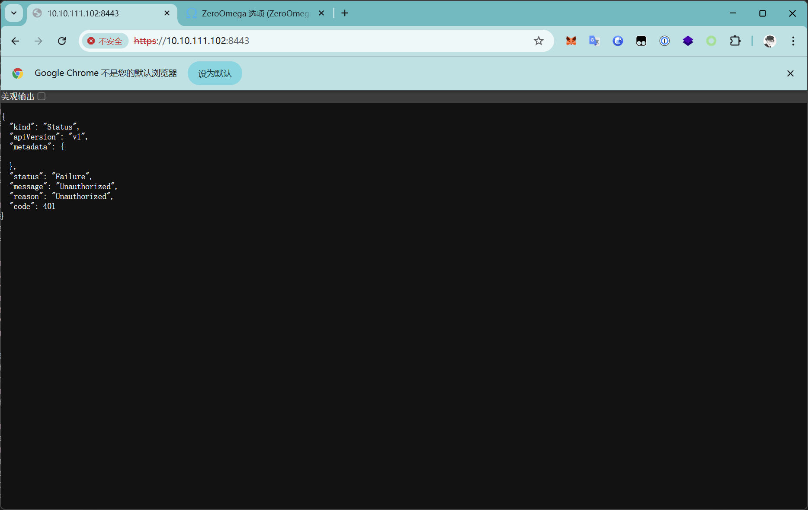

# Kierkegaard

## 信息搜集

```bash
┌──(randark㉿kali)-[~]
└─$ sudo nmap -v --min-rate=2000 -p- 10.10.111.102
PORT     STATE SERVICE
21/tcp   open  ftp
22/tcp   open  ssh
80/tcp   open  http
8443/tcp open  https-alt

(remote) root@htb:/var/www/html# netstat -anopt | grep ":::"
tcp6       0      0 :::80                   :::*                    LISTEN      1038/apache2         off (0.00/0/0)
tcp6       0      0 :::22                   :::*                    LISTEN      973/sshd: /usr/sbin  off (0.00/0/0)
tcp6       0      0 :::8443                 :::*                    LISTEN      979/k3s server       off (0.00/0/0)
```

web servie 为空

```bash
(remote) root@htb:/var/www/html# ls -lah
total 20K
drwxrwxrwx 2 admin admin 4.0K Feb 14  2022 .
drwxr-xr-x 3 root  root  4.0K Feb 14  2022 ..
-rw-r--r-- 1 root  root   11K Feb 14  2022 index.html
```

那就是打 k3s server 了

## k3s server

```bash
(remote) root@htb:/var/www/html# /usr/local/bin/k3s --version
k3s version v1.22.6+k3s1 (3228d9cb)
go version go1.16.10
```



那就是云原生场景了，准备好 kubectl 与靶机服务进行交互

估计是从云原生入手，可能是 k3s 未授权
