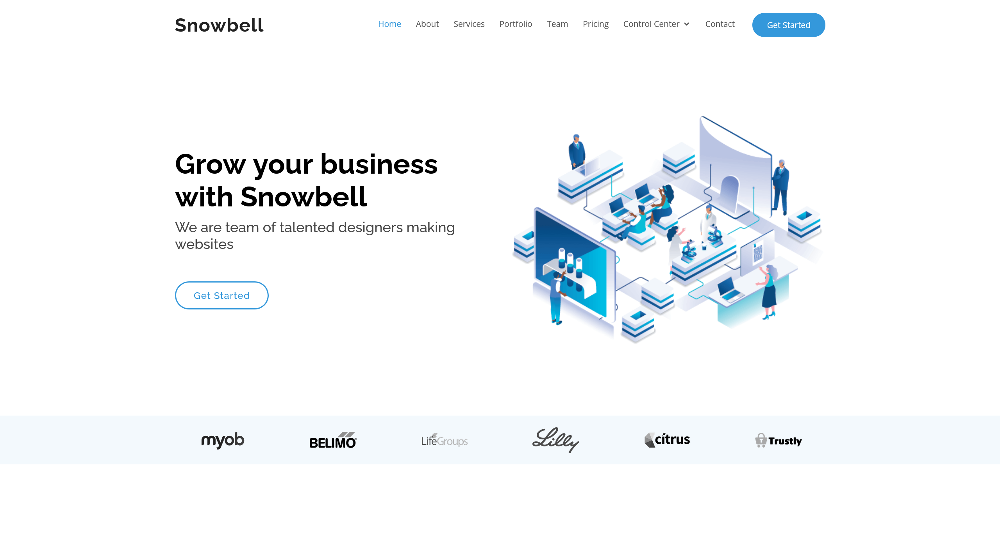

# Snowbell

## 信息搜集

```shell
(remote) root@snowbell:/root# ss -tuln | grep LISTEN | grep "0.0.0.0" | while read -r line; do port=$(echo "$line" | awk '{print $5}' | rev | cut -d':' -f1 | rev); pid=$(lsof -i :$port | grep LISTEN | awk '{print $2}' | head -n 1); [ -n "$pid" ] && cmdline=$(cat /proc/$pid/cmdline | tr '\0' ' ') && echo -e "Port: $port, PID: $pid\n—> Command: $(echo "$cmdline" | sed -E 's/(apache2?|nginx|java|python|node|ftp)/\x1b[31m&\x1b[0m/g')" || echo -e "Port: $port, PID: Not found\n—> Command: Not available"; done
Port: 33060, PID: 999
—> Command: /usr/sbin/mysqld 
Port: 3306, PID: 999
—> Command: /usr/sbin/mysqld 
Port: 80, PID: 945
—> Command: nginx: master process /usr/sbin/nginx -g daemon on; master_process on; 
^C
(remote) root@snowbell:/root# sed -n '/server_name/p; /root/p' /etc/nginx/sites-enabled/*
  root  /var/www/html/main;
  server_name snowbell.htb;
   if ($host != $server_name) {
        return 301 $scheme://$server_name$request_uri;
    root /usr/share/nginx/www;
    fastcgi_param SCRIPT_FILENAME $document_root$fastcgi_script_name;
  root  /var/www/html/legacy;
  server_name legacy.snowbell.htb;
    root /usr/share/nginx/www;
    fastcgi_param SCRIPT_FILENAME $document_root$fastcgi_script_name;
  root  /var/www/html/management;
  server_name management.snowbell.htb;
    root /usr/share/nginx/www;
    fastcgi_param SCRIPT_FILENAME $document_root$fastcgi_script_name;
```

## Web Service

```shell
(remote) root@snowbell:/root# ls -lh /var/www/html/
total 12K
drwxr-xr-x 12 www-data www-data 4.0K Aug 17  2021 legacy
drwxr-xr-x  4 www-data www-data 4.0K Apr 12 15:14 main
drwxr-xr-x 12 www-data www-data 4.0K Aug 17  2021 management
(remote) root@snowbell:/root# ls -lh /var/www/html/legacy
total 9.7M
drwxr-xr-x  2 www-data www-data 4.0K Sep 15  2014 backups
drwxr-xr-x  2 www-data www-data 4.0K Jun  7  2014 batch
-rw-r--r--  1 www-data www-data 1.8K Sep 15  2014 check.php
drwxr-xr-x 10 www-data www-data 4.0K Feb 17  2015 core
drwxr-xr-x  4 www-data www-data 4.0K Jan 19  2016 css
-rw-r--r--  1 www-data www-data  894 Aug 24  2010 favicon.ico
-rw-r--r--  1 www-data www-data 2.2K Jun 28  2012 favicon.png
drwxr-xr-x  5 www-data www-data 4.0K Sep  1  2014 images
-rw-r--r--  1 www-data www-data 1.2K Sep 16  2014 index.php
drwxr-xr-x  8 www-data www-data 4.0K Jun  7  2014 install
drwxr-xr-x  6 www-data www-data 4.0K Jan 26  2016 js
-rw-r--r--  1 www-data www-data 9.6M Aug 13  2021 qdpm_9.1.zip
-rw-r--r--  1 www-data www-data  470 Feb  7  2016 readme.txt
-rw-r--r--  1 www-data www-data   26 Dec 13  2011 robots.txt
drwxr-xr-x  4 www-data www-data 4.0K Jun  7  2014 sf
drwxr-xr-x  7 www-data www-data 4.0K Sep 15  2014 template
drwxr-xr-x  4 www-data www-data 4.0K Aug 17  2021 uploads
```



```shell
(remote) root@snowbell:/root# ls -lh /var/www/html/main/
total 76K
drwxrwxrwx 6 www-data www-data 4.0K Jan 25  2021 assets
-rw-rw-rw- 1 www-data www-data 1.3K Jan 25  2021 changelog.txt
drwxrwxrwx 2 www-data www-data 4.0K Jan 25  2021 forms
-rw-rw-rw- 1 www-data www-data  43K Sep 17  2021 index.html
-rw-rw-rw- 1 www-data www-data 6.2K Jan 25  2021 inner-page.html
-rw-rw-rw- 1 www-data www-data 7.6K Jan 25  2021 portfolio-details.html
-rw-rw-rw- 1 www-data www-data  211 Jan 25  2021 Readme.txt
(remote) root@snowbell:/root# ls -lh /var/www/html/management/
total 16M
drwxr-xr-x  2 www-data www-data 4.0K Jun 30  2021 backups
drwxr-xr-x  2 www-data www-data 4.0K Jun 25  2021 batch
-rw-r--r--  1 www-data www-data 1.8K Sep 15  2014 check.php
drwxr-xr-x 10 www-data www-data 4.0K Jun 25  2021 core
drwxr-xr-x  4 www-data www-data 4.0K Jun 25  2021 css
-rw-r--r--  1 www-data www-data  894 Aug 24  2010 favicon.ico
-rw-r--r--  1 www-data www-data 2.2K Jun 28  2012 favicon.png
drwxr-xr-x  5 www-data www-data 4.0K Jun 25  2021 images
-rw-r--r--  1 www-data www-data 1.3K Jan 14  2021 index.php
drwxr-xr-x  8 www-data www-data 4.0K Jun 25  2021 install
drwxr-xr-x  6 www-data www-data 4.0K Jun 25  2021 js
-rw-r--r--  1 www-data www-data  16M Aug 13  2021 qdpm_9.2.zip
-rw-r--r--  1 www-data www-data  470 Feb  7  2016 readme.txt
-rw-r--r--  1 www-data www-data   26 Dec 13  2011 robots.txt
drwxr-xr-x  4 www-data www-data 4.0K Jun 25  2021 sf
drwxr-xr-x  7 www-data www-data 4.0K Jun 25  2021 template
drwxr-xr-x  4 www-data www-data 4.0K Jun 30  2021 uploads
```

```plaintext
qdPM 9.2
```
