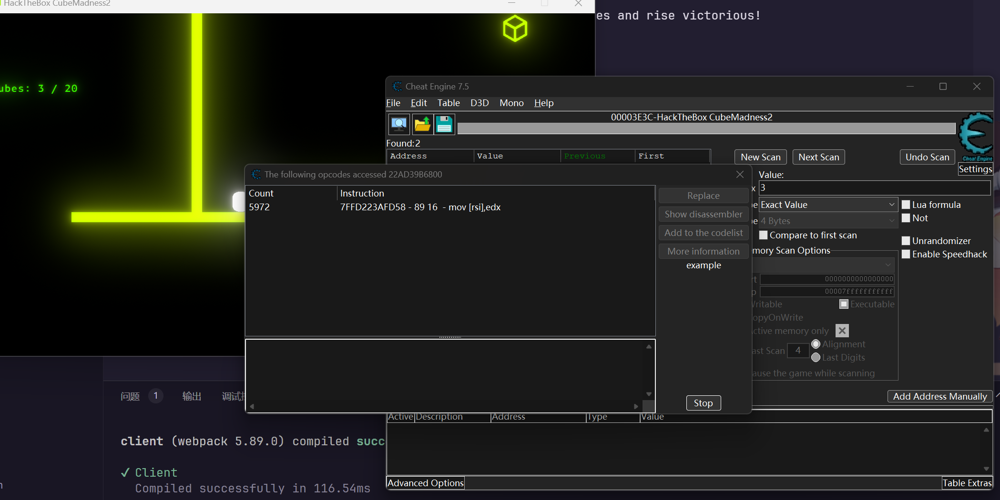
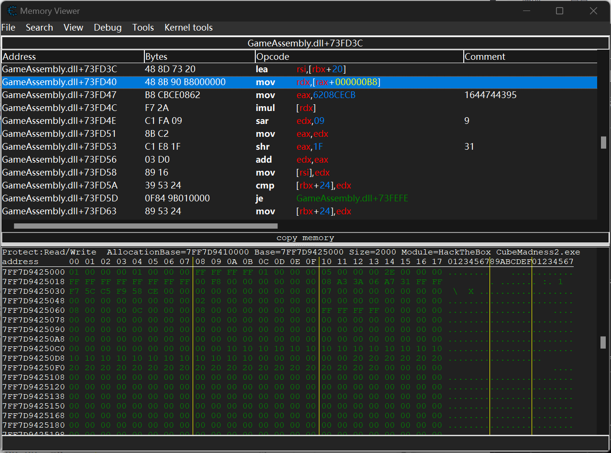
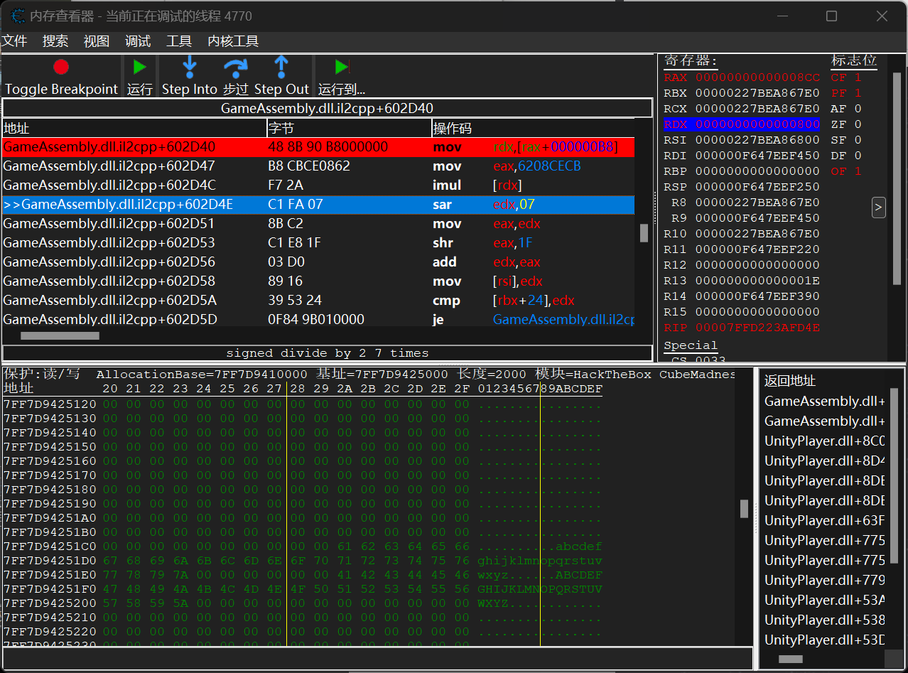
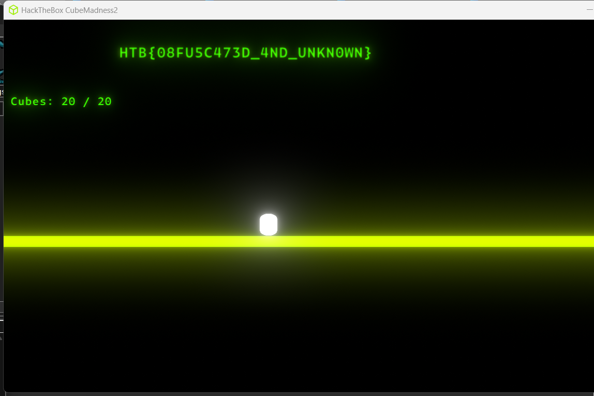

# CubeMadness2

:::note CHALLENGE DESCRIPTION

EASY

Alea iacta est or the die is cast. Whatever, collect the cubes and rise victorious!

:::

还是熟悉的界面


同样尝试采用 `Cheat Engine` 寻找分数并进行修改，但是失败了，尝试进行追踪相关计算部分



发现有一部分逻辑在不断 access 这段内存，怀疑实际的成绩是由一个算法实时计算得来的，直接修改是没有办法实现的

进入反汇编看一眼


在其中注意到 rdx 部分





:::info

以下工作感谢 yixinBC 大哥，大哥真牛，大哥对我真好呜呜呜

:::

使用 [Github - SamboyCoding/Cpp2IL](https://github.com/SamboyCoding/Cpp2IL) 进行恢复之后，进入 IDA 查看反编译后的结果


于是在 Cheat Engine 中关注 score*1337 值的变量，再进行修改即可




```plaintext title="Flag"
HTB{08FU5C473D_4ND_UNKN0WN}
```
