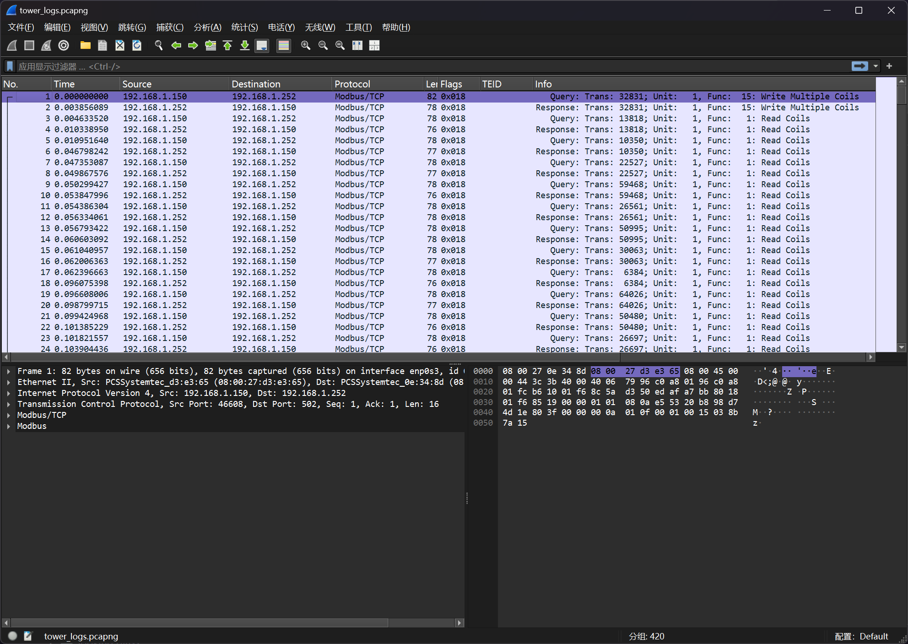
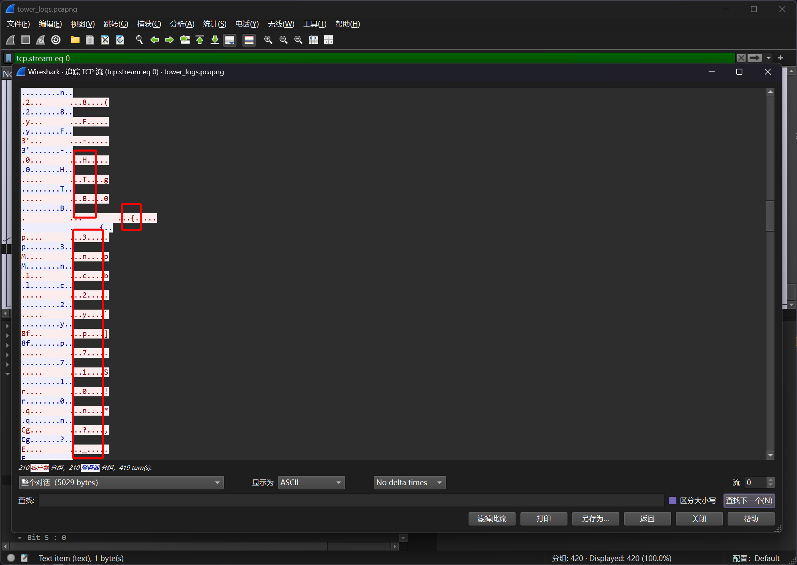

# Watch Tower

:::note CHALLENGE DESCRIPTION

Difficulty: VERY EASY

Our infrastructure monitoring system detected some abnormal behavior and initiated a network capture. We need to identify information the intruders collected and altered in the network.

我们的基础设施监控系统检测到一些异常行为，并启动了网络捕获。我们需要识别入侵者在网络中收集和篡改的信息。

:::

题目提供了流量包文件 `tower_logs.pcapng`



流量核心是 `Modbus` 协议的流量

直接暴力看Modbus的TCP Session的流信息，可以发现特征头



提取出来即可

```bash
┌──(randark㉿kali)-[~/tmp]
└─$ tshark -r tower_logs.pcapng -T fields -Y "(ip.src == 192.168.1.150) && (modbus.func_code == 16)" -e modbus.reference_num | awk '{for(i=1;i<=NF;i++) printf("%c", $i); print ""}' | tr -d "\n"
4LR0P3Un8F-HTB{3nc2yp710n?_n3v32_h342d_0f_7h47!@^}-r6ZJa0
```

即可得到答案

```flag
HTB{3nc2yp710n?_n3v32_h342d_0f_7h47!@^}
```
