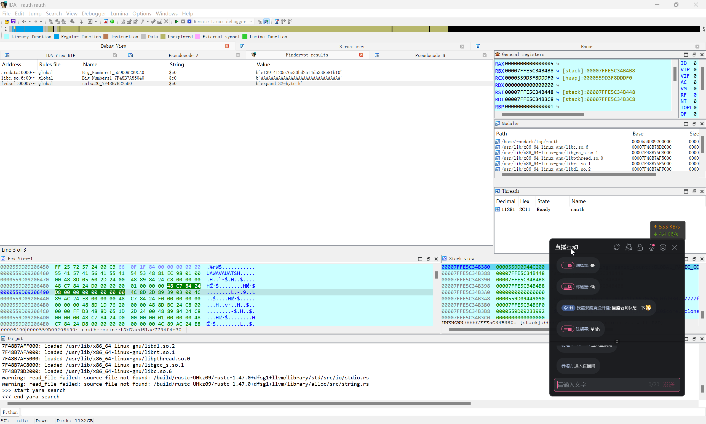

# RAuth

:::note CHALLENGE DESCRIPTION

Difficulty: EASY

My implementation of authentication mechanisms in C turned out to be failures. But my implementation in Rust is unbreakable. Can you retrieve my password?

我在 C 语言中实现的认证机制最终失败了。但我在 Rust 中实现的版本坚不可摧。你能找回我的密码吗？

:::

尝试使用 IDA 进行反编译，借助 `Findcrypt` 插件，可以看到这个记录



```plaintext
[vdso]:00007F48B7B22560 global    salsa20_7F48B7B22560    $c0    b'expand 32-byte k'
```

接下来的部分，请参考 [HTB — RAuth (Reversing) Write-up. A few days ago, I’ve finally given the… | by Filipe de Luna | Medium](https://filipedeluna.medium.com/htb-rauth-reversing-write-up-5f7b7393a1a7)

最终可以进行交互

```bash
┌──(randark㉿kali)-[~/tmp]
└─$ nc 83.136.248.16 47521
Welcome to secure login portal!
Enter the password to access the system: 
TheCrucialRustEngineering@2021;)
Successfully Authenticated
Flag: "HTB{I_Kn0w_h0w_t0_5al54}"
```

得到最终的答案

```flag
HTB{I_Kn0w_h0w_t0_5al54}
```
