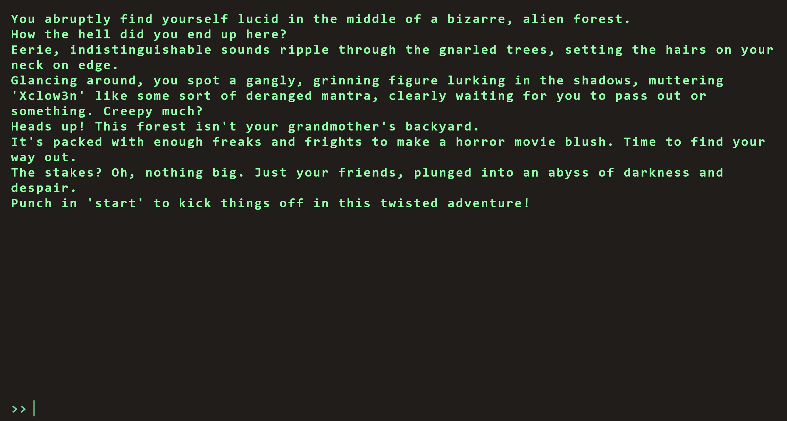
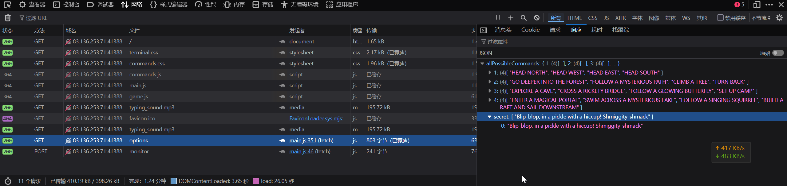
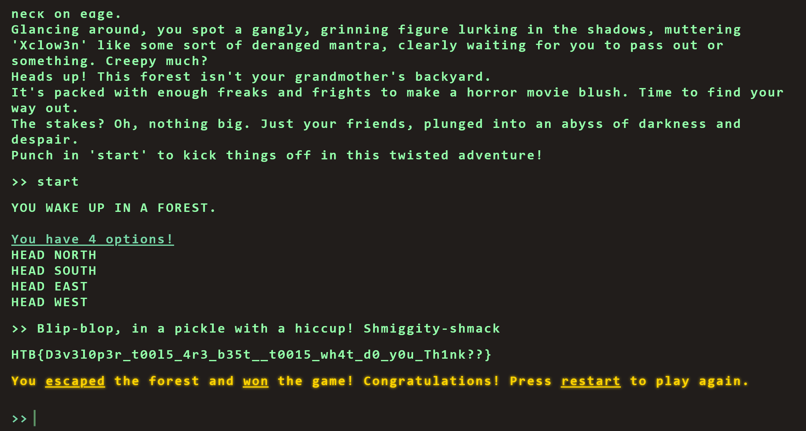

# Flag Command

:::note CHALLENGE DESCRIPTION

Difficulty: VERY EASY

Embark on the "Dimensional Escape Quest" where you wake up in a mysterious forest maze that's not quite of this world. Navigate singing squirrels, mischievous nymphs, and grumpy wizards in a whimsical labyrinth that may lead to otherworldly surprises. Will you conquer the enchanted maze or find yourself lost in a different dimension of magical challenges? The journey unfolds in this mystical escape!

开启“维度逃脱之旅”，你在一座不属于这个世界的神秘森林迷宫中醒来。在这个充满奇思妙想的迷宫中，你将与会唱歌的松鼠、淘气的精灵和脾气暴躁的巫师周旋，每一步都可能带来超乎想象的惊喜。你能否征服这座魔法迷宫，还是会在不同维度的奇幻挑战中迷失自我？这场神秘的逃脱之旅正待你揭开序幕！

:::

访问靶机，得到



尝试与其进行预期交互，未发现有用信息

在抓包中，发现



启动游戏之后，输入这份secret即可得到flag



```flag
HTB{D3v3l0p3r_t00l5_4r3_b35t__t0015_wh4t_d0_y0u_Th1nk??}
```
