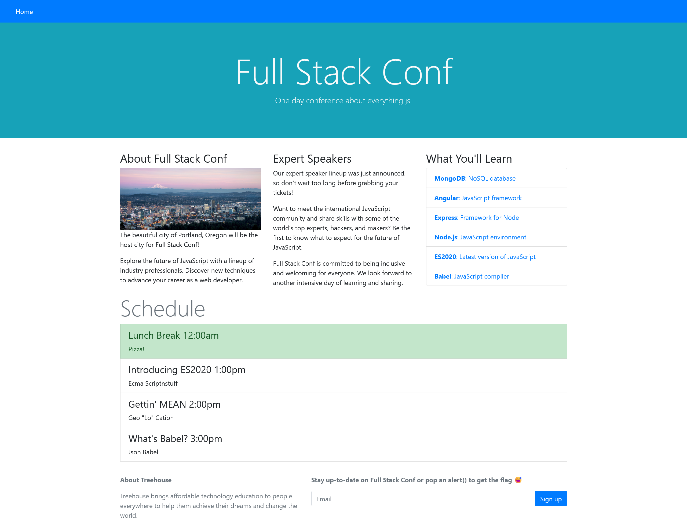
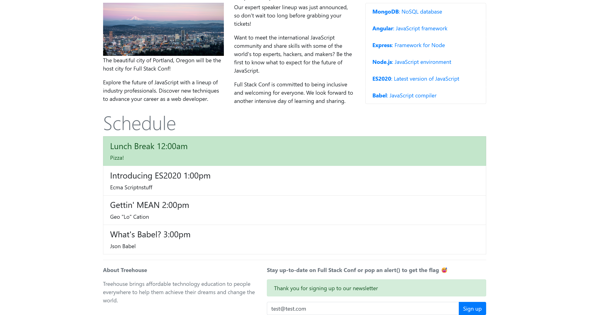
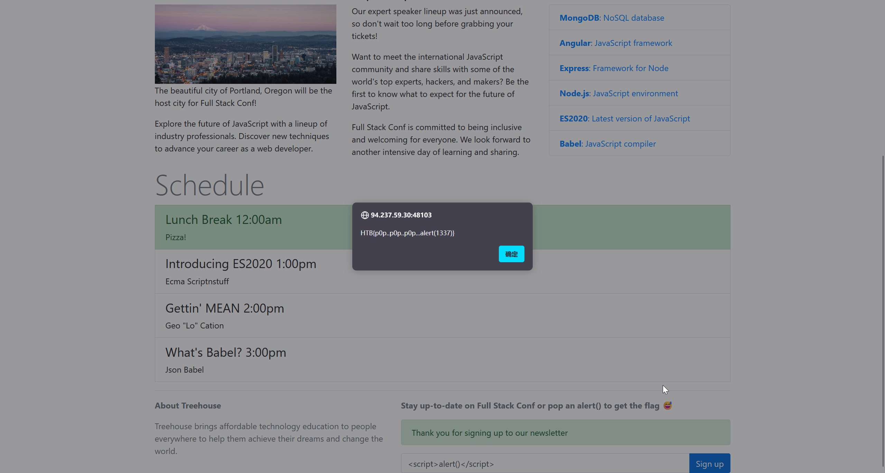

# Full Stack Conf

:::note CHALLENGE DESCRIPTION

Difficulty: EASY

Welcome to Full Stack Conf, explore the future of JavaScript with a lineup of industry professionals and discover new techniques to advance your career as a web developer. But be very careful with the stay up to date form, we don't sanitize anything and the admin logs in and checks the emails regularly, don't try anything funny!! 😅

欢迎来到全栈开发者大会，与行业专家阵容一起探索JavaScript的未来，并发现提升你作为Web开发者职业生涯的新技巧。但要特别注意"及时更新"表单——我们没有做任何数据清理，管理员会定期登录并检查邮件，千万别尝试任何花招！！

:::

直接访问网站



在页面底部可以发现

```plaintext
Stay up-to-date on Full Stack Conf or pop an alert() to get the flag 😅
```

那么就很简单了，就是一个XSS攻击

先尝试提交一个`test@test.com`



尝试最基本的XSS payload

```javascript
<script>alert()</script>
```

成功得到flag



```flag
HTB{p0p..p0p..p0p...alert(1337)}
```
