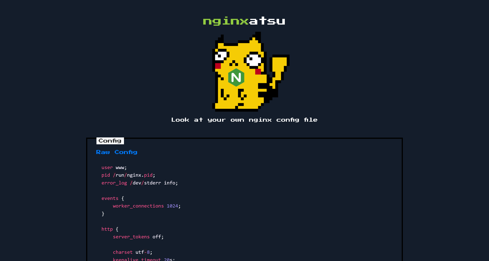
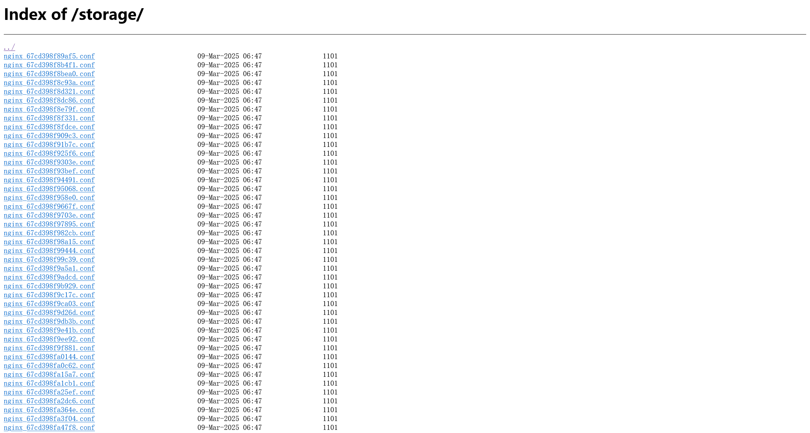

# baby nginxatsu

:::note CHALLENGE DESCRIPTION

Difficulty: EASY

Can you find a way to login as the administrator of the website and free nginxatsu?

你能找到一种方法以网站管理员的身份登录并释放 nginxatsu 吗？

:::

尝试直接访问


尝试自行注册一个 `12@12.12:12` 的凭据进行登录


看起来就是一个 Nginx 的配置文件生成器

尝试生成一份 config 看看内容



```config
user www;
pid /run/nginx.pid;
error_log /dev/stderr info;

events {
    worker_connections 1024;
}

http {
    server_tokens off;

    charset utf-8;
    keepalive_timeout 20s;
    sendfile on;
    tcp_nopush on;
    client_max_body_size 2M;

    include  /etc/nginx/mime.types;

    server {
        listen 80;
        server_name _;

        index index.php;
        root /www/public;

        # We sure hope so that we don't spill any secrets
        # within the open directory on /storage

        location /storage {
            autoindex on;
        }

        location / {
            try_files $uri $uri/ /index.php?$query_string;
            location ~ \.php$ {
                try_files $uri =404;
                fastcgi_pass unix:/run/php-fpm.sock;
                fastcgi_index index.php;
                fastcgi_param SCRIPT_FILENAME $document_root$fastcgi_script_name;
                include fastcgi_params;
            }
        }
    }
}
```

在 Nginx config 文件中，看到 `within the open directory on /storage` 注释，尝试进行访问



在文件夹内，发现压缩文件`v1_db_backup_1604123342.tar.gz`

将其下载下来进行分析，在其中发现了数据库文件`database.sqlite`


| id  |   name   |              email              |             password             |                              api_token                               | remember_token |     created_at      |     updated_at      |
| :-: | :------: | :-----------------------------: | :------------------------------: | :------------------------------------------------------------------: | :------------: | :-----------------: | :-----------------: |
|  1  |    jr    | `nginxatsu-adm-01@makelarid.es` | e7816e9a10590b1e33b87ec2fa65e6cd | AqRH3xAmoPYSnbm7YmB0Asu8nl6894SsJDo2486jwHRn4E5w9C8wEj52z8Y7FqfNoyJw |                | 2025-03-09 06:47:43 | 2025-03-09 06:47:43 |
|  2  | Giovann1 |  `nginxatsu-giv@makelarid.es`   | 019214e5e7b583b0eca010a3ebcc6126 | IU8egzZZpf8QImvz92Kp1upj2ZS4N7sU4Ic3gmMqBUqeDrG5tNSgMMhoh8PALcIDNyWa |                | 2025-03-09 06:47:43 | 2025-03-09 06:47:43 |
|  3  |  me0wth  | `nginxatsu-me0wth@makelarid.es` | 44923951ab26b6f1e688f349b5239e3d | RX2ENXmhP7eEVKigx3crR01St1fTVbpjwvXI4U67dcDx3d6kRyW0FTq9Ts4otrH3hF0w |                | 2025-03-09 06:47:43 | 2025-03-09 06:47:43 |

得到的`user`表中，有用户的密码哈希，使用[CrackStation](https://crackstation.net/)进行破解

|   name   |              email              |  password   |
| :------: | :-----------------------------: | :---------: |
|    jr    | `nginxatsu-adm-01@makelarid.es` | adminadmin1 |
| Giovann1 |  `nginxatsu-giv@makelarid.es`   |    None     |
|  me0wth  | `nginxatsu-me0wth@makelarid.es` |    None     |

得到用户凭据之后，就可以清空本地Cookie重新登录


成功得到flag


```flag
HTB{ng1ngx_r34lly_b3_sp1ll1ng_my_w3ll_h1dd3n_s3cr3ts??}
```
