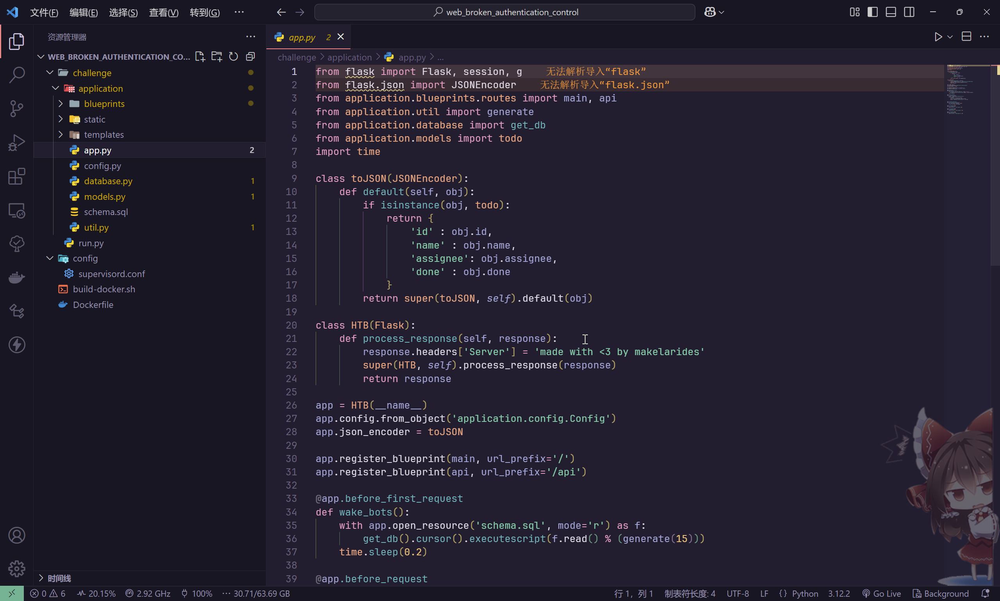
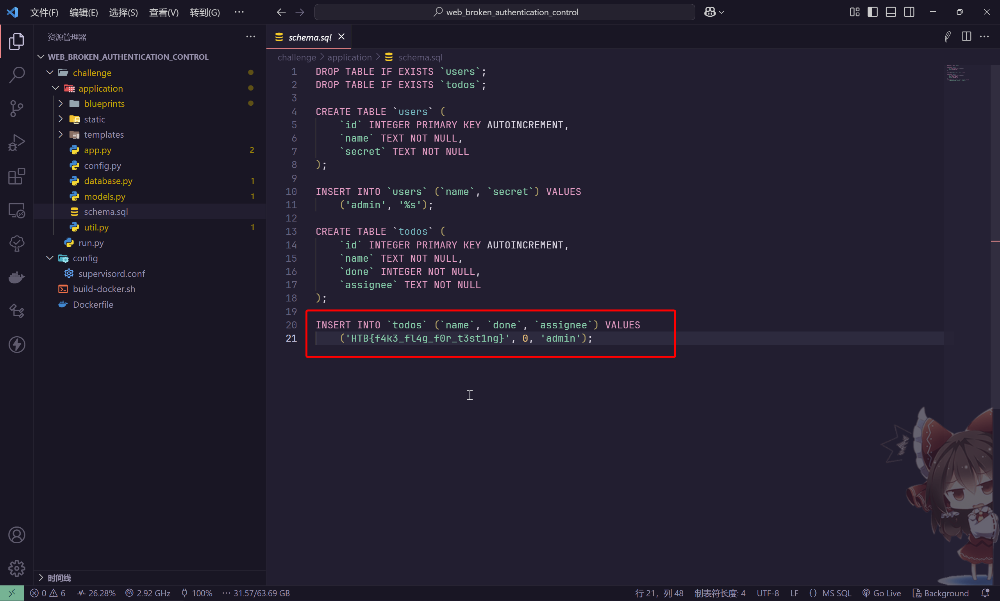
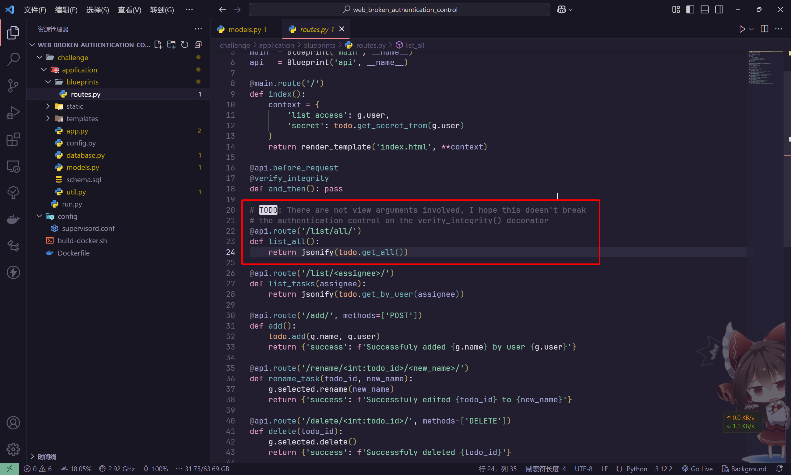
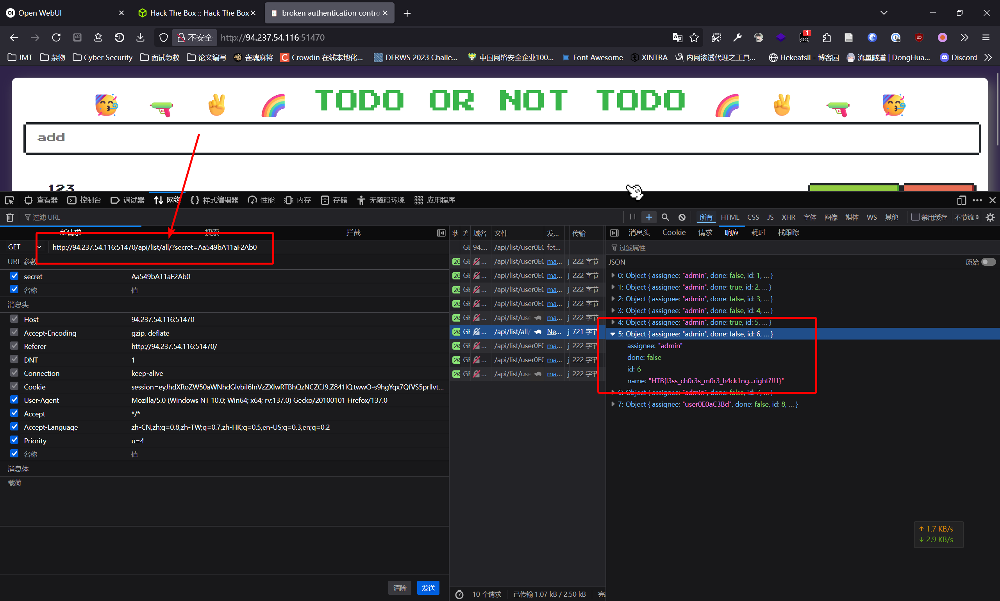

# baby todo or not todo

:::note CHALLENGE DESCRIPTION

Difficulty: EASY

I'm so done with these bloody HR solutions coming from those bloody HR specialists, I don't need anyone monitoring my thoughts, or do I... ?

我真是受够了这些该死的HR解决方案，全是那些该死的HR专家搞出来的，我不需要任何人来监控我的想法，还是说……我真的需要吗？

:::

题目提供了环境的源码



很明显，需要读取数据库中的数据，才能得到flag



在源码中，发现脆弱点



那么就简单了，根据题目说明，向`/list/all/`路由发起请求就可以了



即可得到答案

```flag
HTB{l3ss_ch0r3s_m0r3_h4ck1ng...right?!!1}
```
