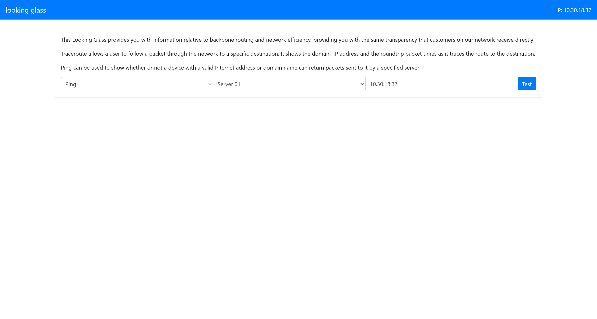
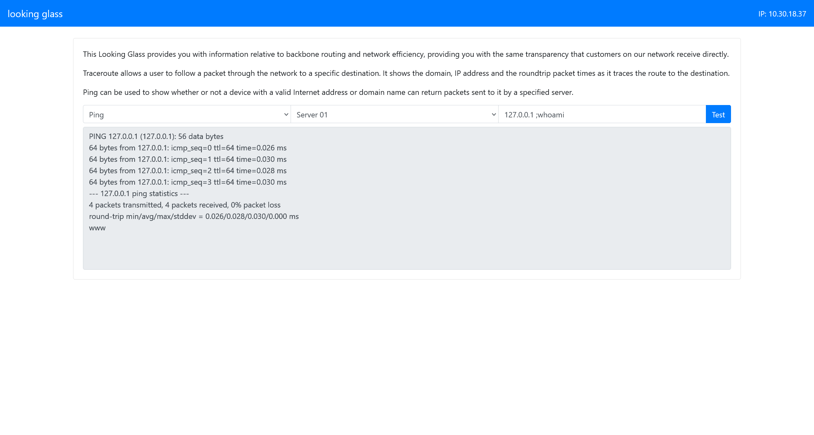
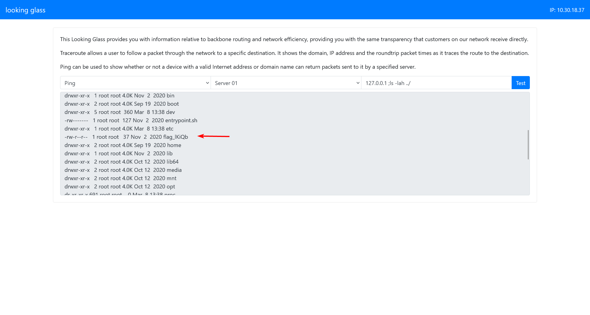
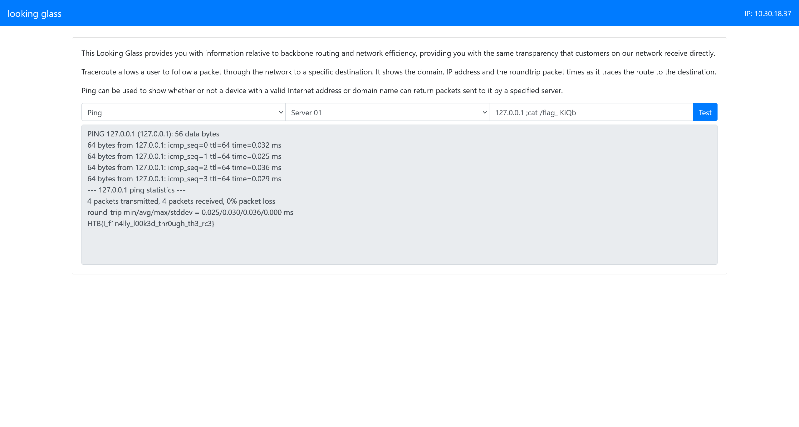

# looking glass

:::note CHALLENGE DESCRIPTION

Difficulty: EASY

We've built the most secure networking tool in the market, come and check it out!

我们已经打造了市场上最安全的网络工具，快来体验一下吧！

:::

尝试直接访问，得到



根据经验，执行`ping`的功能点，有可能是直接执行命令拼接来实现的，尝试进行命令注入



然后尝试直接探测主机情况



即可得到flag



```flag
HTB{I_f1n4lly_l00k3d_thr0ugh_th3_rc3}
```
